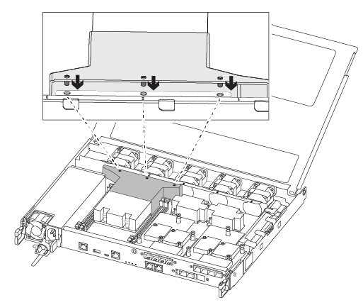

= DIMM-FAS500f を交換します
:allow-uri-read: 
:icons: font
:imagesdir: ../media/

[role="lead"]
ストレージシステムでヘルスモニタアラートに基づく大量のCECC（修正可能なエラー訂正コード）エラーや修正不可能なECCエラーなどのエラーが発生した場合は、コントローラのDIMMを交換する必要があります。これらのエラーは通常、DIMMの1つの障害が原因でストレージシステムがONTAPをブートできないことが原因です。

システムのその他のコンポーネントがすべて正常に動作している必要があります。問題がある場合は、必ずテクニカルサポートにお問い合わせください。

障害が発生したコンポーネントは、プロバイダから受け取った交換用 FRU コンポーネントと交換する必要があります。

== 手順 1 ：障害のあるコントローラをシャットダウンします

障害のあるコントローラをシャットダウンするには、コントローラのステータスを確認し、必要に応じて正常なコントローラが障害のあるコントローラストレージからデータを引き続き提供できるようにコントローラをテイクオーバーする必要があります。

.このタスクについて
* SANシステムを使用している場合は、障害コントローラのSCSIブレードのイベントメッセージを確認しておく必要があり  `cluster kernel-service show`ます）。コマンド（priv advancedモードから）を実行すると、 `cluster kernel-service show`そのノードのノード名、そのノードの可用性ステータス、およびそのノードの動作ステータスが表示されlink:https://docs.netapp.com/us-en/ontap/system-admin/display-nodes-cluster-task.html["クォーラムステータス"]ます。
+
各 SCSI ブレードプロセスは、クラスタ内の他のノードとクォーラムを構成している必要があります。交換を進める前に、すべての問題を解決しておく必要があります。

* ノードが 3 つ以上あるクラスタは、クォーラムを構成している必要があります。クラスタがクォーラムを構成していない場合、または正常なコントローラで適格性と正常性についてfalseと表示される場合は、障害のあるコントローラをシャットダウンする前に問題 を修正する必要があります。を参照してください link:https://docs.netapp.com/us-en/ontap/system-admin/synchronize-node-cluster-task.html?q=Quorum["ノードをクラスタと同期します"^]。

.手順
. AutoSupportが有効になっている場合は、AutoSupportメッセージを呼び出してケースの自動作成を停止します。 `system node autosupport invoke -node * -type all -message MAINT=<# of hours>h`
+
次のAutoSupport メッセージは、ケースの自動作成を2時間停止します。 `cluster1:> system node autosupport invoke -node * -type all -message MAINT=2h`

. 正常なコントローラのコンソールから自動ギブバックを無効にします。 `storage failover modify -node local -auto-giveback false`
+

NOTE: 自動ギブバックを無効にしますか?_と表示されたら'y'を入力します

. 障害のあるコントローラに LOADER プロンプトを表示します。
+
[cols="1,2"]
|===
| 障害のあるコントローラの表示 | 作業 

 a| 
LOADER プロンプト
 a| 
次の手順に進みます。

 a| 
ギブバックを待っています
 a| 
Ctrl キーを押しながら C キーを押し ' プロンプトが表示されたら y と入力します

 a| 
システムプロンプトまたはパスワードプロンプト
 a| 
正常なコントローラから障害のあるコントローラをテイクオーバーまたは停止します。「 storage failover takeover -ofnode impaired_node_name _

障害のあるコントローラに「 Waiting for giveback... 」と表示されたら、 Ctrl+C キーを押し、「 y 」と入力します。

|===

== 手順 2 ：コントローラモジュールを取り外す

コントローラモジュール内部のコンポーネントを交換する場合は、コントローラモジュールをシャーシから取り外す必要があります。

元の場所がわかるように、ケーブルにラベルを付けておいてください。

. 接地対策がまだの場合は、自身で適切に実施します。
. コントローラモジュールの電源装置のコードをソースから抜きます。
. 電源ケーブル固定クリップを外し、電源装置からケーブルを抜きます。
. コントローラモジュールの両側にあるラッチ機構に人差し指をかけ、親指でレバーを押し、コントローラをシャーシからゆっくりと引き出します。
+

NOTE: コントローラモジュールを取り外しにくい場合は、（腕を交差させて）内側から穴に人さし指を入れます。

+
image::../media/drw_a250_pcm_remove_install.png[ラッチを開く]

+
|===

 a| 
image:../media/icon_round_1.png["番号1"]
| レバー 

 a| 
image:../media/icon_round_2.png["番号2"]
 a| 
ラッチ機構

|===
. コントローラモジュールの両側を両手で持ってシャーシからゆっくりと引き出し、平らで安定した場所に置きます。
. コントローラモジュールの前面にある取り付けネジを反時計回りに回して、コントローラモジュールのカバーを開きます。
+
image::../media/drw_a250_open_controller_module_cover.png[コントローラモジュールのカバーを開く]

+
|===

 a| 
image:../media/icon_round_1.png["番号1"]
| 取り付けネジ 

 a| 
image:../media/icon_round_2.png["番号2"]
 a| 
コントローラモジュールカバー

|===
. エアダクトカバーを持ち上げて外します。
+
image::../media/drw_a250_remove_airduct_cover.png[エアダクトカバーの持ち上げ]

== 手順 3 ： DIMM を交換する

DIMMを交換するには、エアダクトの上のDIMMマップラベルを使用してコントローラモジュール内でDIMMの場所を確認してから、特定の手順に従って交換する必要があります。

DIMM を交換するには、次のビデオまたは表に示す手順を使用します。

.アニメーション- DIMMを交換します
video::fa6b8107-86fb-4332-aa57-ac5b01605e52[panopto]
. コントローラモジュールの障害のある DIMM を交換します。
+
DIMM はマザーボードのスロット 3 または 1 にあります。スロット 2 と 4 は空のままです。DIMM をこれらのスロットに取り付けないでください。

+
image::../media/drw_a250_dimm_replace.png[DIMMの交換]

. 交換用 DIMM を正しい向きで挿入できるように、ソケット内の DIMM の向きをメモします。
. DIMM の両側にあるツメをゆっくり押し開いて、 DIMM をスロットから引き出します。
. コネクタにある DIMM のツメは開いたままにします。
. 交換用 DIMM を静電気防止用の梱包バッグから取り出し、 DIMM の端を持ってスロットに合わせます。
+

NOTE: DIMM 回路基板のコンポーネントに力が加わらないように、 DIMM の両端を持ちます。

. 交換用 DIMM をスロットに対して垂直に挿入します。
+
DIMM のソケットへの挿入にある程度の力が必要です。簡単に挿入できない場合は、 DIMM を再度挿入してソケットに正しく合わせ直してください。

. DIMM がソケットにまっすぐ差し込まれていることを目で確認してください。

== 手順 4 ：コントローラモジュールを取り付ける

コントローラモジュールのコンポーネントを交換したら、コントローラモジュールをシャーシに再度取り付ける必要があります。

次の図または記載された手順を使用して、交換用コントローラモジュールをシャーシに設置できます。

. エアダクトをまだ取り付けていない場合は、取り付けます。
+

. コントローラモジュールのカバーを閉じ、取り付けネジを締めます。
+
image::../media/drw_a250_close_controller_module_cover.png[コントローラモジュールのカバーの閉じ方]

+
|===

 a| 
image:../media/icon_round_1.png["番号1"]
| コントローラモジュールカバー 

 a| 
image:../media/icon_round_2.png["番号2"]
 a| 
取り付けネジ

|===
. コントローラモジュールをシャーシに挿入します。
+
.. ラッチのアームがすべて引き出された位置で固定されていることを確認します。
.. コントローラモジュールを両手で位置に合わせ、ラッチのアームにゆっくりとスライドさせて停止させます。
.. ラッチの内側から穴に人さし指を入れます。
.. ラッチ上部のオレンジ色のタブで親指を押し下げ、コントローラモジュールをゆっくりと停止位置に押し込みます。
.. ラッチの上部から親指を離し、ラッチが完全に固定されるまで押し続けます。
+
コントローラモジュールは、シャーシに完全に装着されるとすぐにブートを開始します。

+
コントローラモジュールを完全に挿入し、シャーシの端と同一平面になるようにします。

. システムにアクセスして以降のセクションのタスクを実行できるように、管理ポートとコンソールポートのみをケーブル接続します。
+

NOTE: 残りのケーブルは、この手順の後半でコントローラモジュールに接続します。

== 手順 5 ：障害が発生したパーツをネットアップに返却する

障害が発生したパーツは、キットに付属のRMA指示書に従ってNetAppに返却してください。 https://mysupport.netapp.com/site/info/rma["パーツの返品と交換"]詳細については、ページを参照してください。
