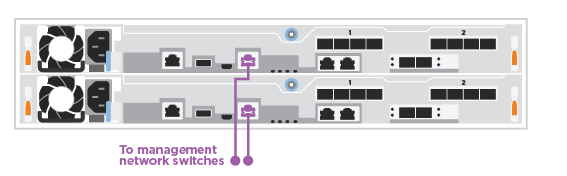
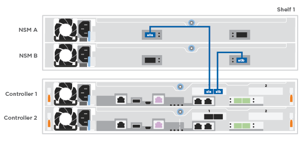

= 詳細な手順 - FAS500f
:icons: font
:imagesdir: ../media/

[role="lead"]
このセクションでは、 FAS500f システムのインストール手順について詳しく説明します。

== 手順 1 ：設置の準備

FAS500f システムをインストールするには、アカウントを作成してシステムを登録する必要があります。また、システムに応じた適切な数とタイプのケーブルを準備し、特定のネットワーク情報を収集する必要があります。

にアクセスできる必要があります link:https://hwu.netapp.com["NetApp Hardware Universe の略"^] （ HWU ）を参照してください。サイト要件および構成済みシステム上の追加情報に関する情報が含まれます。へのアクセスも必要になる場合があります link:http://mysupport.netapp.com/documentation/productlibrary/index.html?productID=62286["使用している ONTAP のバージョンに対応したリリースノート"^] このシステムの詳細については、を参照してください。

お客様のサイトで次のものを準備する必要があります。

* ストレージシステム用のラックスペース
* No.2 プラスドライバ
* Web ブラウザを使用してシステムをネットワークスイッチおよびラップトップまたはコンソールに接続するための追加のネットワークケーブル

.手順
. すべての箱を開封して内容物を取り出します。
. コントローラのシステムシリアル番号をメモします。
+
image::../media/drw_ssn_label.png[DRW SSN ラベル]

. アカウントを設定します。
+
.. 既存のアカウントにログインするか、アカウントを作成します。
.. 登録（link:https://mysupport.netapp.com/eservice/registerSNoAction.do?moduleName=RegisterMyProduct["ネットアップ製品登録"^]）をクリックします。

. ダウンロードしてインストールします link:https://mysupport.netapp.com/site/tools/tool-eula/activeiq-configadvisor["ネットアップのダウンロード： Config Advisor"^] ノートブック PC で。
. 同梱されていたケーブルの数と種類を確認し、書き留めておきます。
+
次の表に、同梱されているケーブルの種類を示します。表に記載されていないケーブルがある場合は、を参照してください link:https://hwu.netapp.com["NetApp Hardware Universe の略"^] ケーブルの場所を確認し、用途を特定します。

|===

| ケーブルのタイプ | パーツ番号と長さ | コネクタのタイプ | 用途 

 a| 
25GbE ケーブル
 a| 
X66240A-05 (112-00595) 、 0.5m ；

X66240 2 （ 112-00573 ）、 2m
 a| 
image:../media/oie_cable100_gbe_qsfp28.png[""]
 a| 
クラスタインターコネクトネットワーク

 a| 
X66240A-2 （ 112-00598 ）、 2m ；

X66240A-5 （ 112-00600 ）、 5m
 a| 
データ

 a| 
100GbE ケーブル
 a| 
X66211-2 （ 112-00574 ）、 2m ；

X66211-5 （ 112-00576 ）、 5m
 a| 
ストレージ

 a| 
RJ-45 （注文内容による）
 a| 
該当なし
 a| 
image:../media/oie_cable_rj45.png[""]
 a| 
管理ネットワーク（ BMC およびレンチポート）とイーサネットデータ（ e0a および e0b ）

 a| 
ファイバチャネル
 a| 
X66250-2 （ 112-00342 ） 2m ；

X66250-5 （ 112-00344 ） 5m ；

X66250-15 （ 112-00346 ） 15m ；

X66250-30 （ 112-00347 ） 30m
 a| 
image:../media/oie_cable_fc_optical.png[""]
 a| 

 a| 
Micro-USB コンソールケーブル
 a| 
該当なし
 a| 
image:../media/oie_cable_micro_usb.png[""]
 a| 
ソフトウェアのセットアップ中のコンソール接続

 a| 
電源ケーブル
 a| 
該当なし
 a| 
image:../media/oie_cable_power.png[""]
 a| 
システムの電源をオンにします

|===
. を確認します link:https://library.netapp.com/ecm/ecm_download_file/ECMLP2862613["『 ONTAP 構成ガイド』"^] およびそのガイドに記載されている必要な情報を収集します。

== 手順 2 ：ハードウェアを設置する

システムは、 4 ポストラックまたはネットアップシステムキャビネットのいずれかに設置する必要があります。

.手順
. 必要に応じてレールキットを取り付けます。
. レールキットに付属の手順書に従って、システムを設置して固定します。
+

NOTE: システムの重量に関連する安全上の注意事項を確認しておく必要があります。

+
image::../media/drw_affa250_weight_caution.png[DRW affa250 重量注意]

. このシステムにはケーブル管理デバイスがないため、ケーブルを特定して管理します。
. システムの前面にベゼルを配置します。

== 手順 3 ：コントローラをケーブル接続する

2 ノードスイッチレスクラスタメソッドまたはクラスタインターコネクトネットワークメソッドを使用して、プラットフォームのクラスタにケーブル接続が必要です。ファイバチャネル、 iSCSI ホストネットワーク、または直接接続型ストレージへのケーブル接続はオプションです。このケーブル接続は排他的ではなく、ホストネットワークとストレージにケーブルを接続できます。

=== 必要なケーブル接続：コントローラをクラスタにケーブル接続します

2 ノードスイッチレスクラスタメソッドまたはクラスタインターコネクトネットワークを使用して、コントローラをクラスタにケーブル接続します。

==== オプション 1 ： 2 ノードスイッチレスクラスタをケーブル接続

コントローラモジュールの管理ポート、ファイバチャネルポート、データポートまたはホストネットワークポートは、スイッチに接続されます。クラスタインターコネクトポートは、両方のコントローラモジュールでケーブル接続されます。

システムとスイッチの接続については、ネットワーク管理者にお問い合わせください。

図の矢印を見て、ケーブルコネクタのプルタブの正しい向きを確認してください。

image::../media/oie_cable_pull_tab_down.png[OIE ケーブルのプルタブを下に引きます]

NOTE: コネクタを挿入すると、カチッという音がしてコネクタが所定の位置に収まるはずです。音がしない場合は、コネクタを取り外し、回転させてからもう一度試してください。

.手順
. アニメーションを使用します (https://netapp.hosted.panopto.com/Panopto/Pages/embed.aspx?id=beec3966-0a01-473c-a5de-ac68017fbf29["2 ノードスイッチレスクラスタをケーブル接続"^]）またはステップバイステップの手順に従って、コントローラとスイッチをケーブルで接続します。
+
[cols="10,90"]
|===
| ステップ | 各コントローラでを実行します 

 a| 
image:../media/oie_legend_icon_1_lg.png[""]
 a| 
25GbE クラスタインターコネクトケーブルを使用して、クラスタインターコネクトポートを相互に接続します

image:../media/oie_cable_sfp_gbe_copper.png[""]：

** e0c から e0c へ
** e0d から e0dimage:../media/drw_affa250_tnsc_cabling.png[""]

 a| 

 a| 
RJ45 ケーブルを使用して、レンチマークのポートを管理ネットワークスイッチに接続します。

 a| 
image:../media/oie_legend_icon_attn_symbol.png[""]
 a| 
この時点ではまだ電源コードをプラグに接続しないでください。

|===
. システムのセットアップを完了するには、を参照してください link:install-detailed-guide.html#step-4-complete-system-setup-and-configuration["手順 4 ：システムのセットアップと設定を完了する"]。

==== オプション 2 ：スイッチクラスタをケーブル接続する

コントローラのすべてのポートがスイッチに接続されます。スイッチには、クラスタインターコネクト、管理、ファイバチャネル、データネットワークスイッチまたはホストネットワークスイッチがあります。

システムとスイッチの接続については、ネットワーク管理者にお問い合わせください。

図の矢印を見て、ケーブルコネクタのプルタブの正しい向きを確認してください。

image::../media/oie_cable_pull_tab_down.png[OIE ケーブルのプルタブを下に引きます]

NOTE: コネクタを挿入すると、カチッという音がしてコネクタが所定の位置に収まるはずです。音がしない場合は、コネクタを取り外し、回転させてからもう一度試してください。

.手順
. アニメーションを使用します (https://netapp.hosted.panopto.com/Panopto/Pages/embed.aspx?id=bf6759dc-4cbf-488e-982e-ac68017fbef8["スイッチクラスタのケーブル接続"^]）またはステップバイステップの手順に従って、コントローラとスイッチをケーブルで接続します。
+
[cols="10,90"]
|===
| ステップ | 各コントローラでを実行します 

 a| 
image:../media/oie_legend_icon_1_lg.png[""]
 a| 
クラスタインターコネクトポートを 25GbE クラスタインターコネクトスイッチにケーブル接続します。

** e0c
** e0dimage:../media/drw_affa250_switched_clust_cabling.png[""]

 a| 

 a| 
RJ45 ケーブルを使用して、レンチマークのポートを管理ネットワークスイッチに接続します。

 a| 
image::../media/oie_legend_icon_attn_symbol.png[OIE の凡例アイコン ( 属性シンボル]
 a| 
この時点ではまだ電源コードをプラグに接続しないでください。

|===
. システムのセットアップを完了するには、を参照してください link:install-detailed-guide.html#step-4-complete-system-setup-and-configuration["手順 4 ：システムのセットアップと設定を完了する"]。

=== オプションのケーブル接続：ケーブル構成に依存するオプション

オプションで、 Fibre Channel または iSCSI ホストネットワークまたは直接接続型ストレージに、構成に依存するケーブルを接続します。このケーブル接続は排他的ではなく、ホストネットワークおよびストレージにケーブル接続できます。

==== オプション 1 ： Fibre Channel ホストネットワークにケーブルを接続する

コントローラの Fibre Channel ポートは、 Fibre Channel ホストネットワークスイッチに接続されます。

システムとスイッチの接続については、ネットワーク管理者にお問い合わせください。

図の矢印を見て、ケーブルコネクタのプルタブの正しい向きを確認してください。

image::../media/oie_cable_pull_tab_up.png[OIE ケーブルのプルタブを上にします]

NOTE: コネクタを挿入すると、カチッという音がしてコネクタが所定の位置に収まるはずです。音がしない場合は、コネクタを取り外し、回転させてからもう一度試してください。

[+]

[cols="10,90"]
|===
| ステップ | 各コントローラモジュールでを実行します 

 a| 
1.
 a| 
ポート 2a~2d を FC ホストスイッチにケーブル接続します。

image::../media/drw_affa250_fc_host_cabling.png[DRW affa250 fc ホストケーブル接続]

 a| 
2.
 a| 
その他のオプションのケーブル接続を行うには、次のいずれかを選択します

* <<Option 2: Cable to a 25GbE data or host network>>
* <<Option 3: Cable the controllers to a single drive shelf>>

 a| 
3.
 a| 
システムのセットアップを完了するには、を参照してください link:install-detailed-guide.html#step-4-complete-system-setup-and-configuration["手順 4 ：システムのセットアップと設定を完了する"]。

|===

==== オプション 2 ： 25GbE データまたはホストネットワークにケーブルを接続する

コントローラ上の 25GbE ポートは、 25GbE データスイッチまたはホストネットワークスイッチに接続されます。

システムとスイッチの接続については、ネットワーク管理者にお問い合わせください。

図の矢印を見て、ケーブルコネクタのプルタブの正しい向きを確認してください。

image::../media/oie_cable_pull_tab_up.png[OIE ケーブルのプルタブを上にします]

NOTE: コネクタを挿入すると、カチッという音がしてコネクタが所定の位置に収まるはずです。音がしない場合は、コネクタを取り外し、回転させてからもう一度試してください。

[cols="10,90"]
|===
| ステップ | 各コントローラモジュールでを実行します 

 a| 
1.
 a| 
ポート e4A から e4d を 10GbE ホストネットワークスイッチにケーブル接続します。

image::../media/drw_affa250_25gbe_host_cabling.png[DRW affa250 25GbE ホストのケーブル接続]

 a| 
2.
 a| 
その他のオプションのケーブル接続を行うには、次のいずれかを選択します

* <<Option 1: Cable to a Fibre Channel host network>>
* <<Option 3: Cable the controllers to a single drive shelf>>

 a| 
3.
 a| 
システムのセットアップを完了するには、を参照してください link:install-detailed-guide.html#step-4-complete-system-setup-and-configuration["手順 4 ：システムのセットアップと設定を完了する"]。

|===

==== オプション 3 ：コントローラを 1 台のドライブシェルフにケーブル接続する

各コントローラを、 NS224 ドライブシェルフの NSM モジュールにケーブル接続する必要があります。

図の矢印を見て、ケーブルコネクタのプルタブの正しい向きを確認してください。

image::../media/oie_cable_pull_tab_up.png[OIE ケーブルのプルタブを上にします]

NOTE: コネクタを挿入すると、カチッという音がしてコネクタが所定の位置に収まるはずです。音がしない場合は、コネクタを取り外し、回転させてからもう一度試してください。

.手順
. アニメーションを使用します (https://netapp.hosted.panopto.com/Panopto/Pages/embed.aspx?id=3f92e625-a19c-4d10-9028-ac68017fbf57["コントローラを 1 台の NS224 にケーブル接続する"^]）またはステップバイステップの手順に従って、コントローラモジュールを 1 台のシェルフにケーブル接続します。
+
[cols="10,90"]
|===
| ステップ | 各コントローラモジュールでを実行します 

 a| 

 a| 
コントローラ A をシェルフにケーブル接続します。 image:../media/drw_affa250_1shelf_cabling_a.png[""]

 a| 
image:../media/oie_legend_icon_2_lo.png[""]
 a| 
コントローラ B をシェルフにケーブル接続します。 

|===
. システムのセットアップを完了するには、を参照してください link:install-detailed-guide.html#step-4-complete-system-setup-and-configuration["手順 4 ：システムのセットアップと設定を完了する"]。

== 手順 4 ：システムのセットアップと設定を完了する

スイッチとラップトップのみを接続したクラスタ検出を使用するか、システムのコントローラに直接接続してから管理スイッチに接続して、システムのセットアップと設定を実行します。

=== オプション 1 ：ネットワーク検出が有効になっている場合は、システムのセットアップと設定を実行する

ラップトップでネットワーク検出が有効になっている場合は、クラスタの自動検出を使用してシステムのセットアップと設定を実行できます。

.手順
. 電源コードをコントローラの電源装置に接続し、さらに別の回路の電源に接続します。
. ラップトップでネットワーク検出が有効になっていることを確認します。
+
詳細については、ラップトップのオンラインヘルプを参照してください。

. アニメーションを使用します (https://netapp.hosted.panopto.com/Panopto/Pages/embed.aspx?id=d61f983e-f911-4b76-8b3a-ab1b0066909b["ラップトップを管理スイッチに接続します"^]）をクリックして、ラップトップを管理スイッチに接続します。
. 検出する ONTAP アイコンを選択します。
+
image::../media/drw_autodiscovery_controler_select.png[DRW 自動検出コントローラ選択]

+
.. エクスプローラを開きます。
.. 左側のペインで、 *Network* をクリックします。
.. 右クリックし、 * 更新 * を選択します。
.. いずれかの ONTAP アイコンをダブルクリックし、画面に表示された証明書を受け入れます。
+

NOTE: 「 XXXXX 」は、ターゲットノードのシステムシリアル番号です。

+
System Manager が開きます。

. System Manager のセットアップガイドを使用して、で収集したデータを基にシステムを設定します link:https://library.netapp.com/ecm/ecm_download_file/ECMLP2862613["『 ONTAP 構成ガイド』"^]。
. Config Advisor を実行してシステムの健全性を確認します。
. 初期設定が完了したら、に進みます link:https://www.netapp.com/data-management/oncommand-system-documentation/["ONTAP & ONTAP システムマネージャのマニュアルリソース"^] ONTAP での追加機能の設定については、ページを参照してください。

=== オプション 2 ：ネットワーク検出が有効になっていない場合は、システムのセットアップと設定を実行する

ラップトップでネットワーク検出が有効になっていない場合は、このタスクを使用して設定とセットアップを実行する必要があります。

.手順
. ラップトップまたはコンソールをケーブル接続して設定します。
+
.. ラップトップまたはコンソールのコンソールポートを、 115 、 200 ボー、 N-8-1 に設定します。
+

NOTE: コンソールポートの設定方法については、ラップトップまたはコンソールのオンラインヘルプを参照してください。

.. ラップトップまたはコンソールを管理サブネット上のスイッチに接続します。
+
image::../media/drw_console_client_mgmt_subnet_affa250.png[DRW コンソールクライアント管理サブネット affa250]

.. 管理サブネット上の TCP / IP アドレスをラップトップまたはコンソールに割り当てます。

. 電源コードをコントローラの電源装置に接続し、さらに別の回路の電源に接続します。
. いずれかのノードに初期ノード管理 IP アドレスを割り当てます。
+
[cols="1,2"]
|===
| 管理ネットワークでの DHCP の状況 | 作業 

 a| 
を設定します
 a| 
新しいコントローラに割り当てられた IP アドレスを記録します。

 a| 
未設定
 a| 
.. PuTTY 、ターミナルサーバ、または環境に対応した同等の機能を使用して、コンソールセッションを開きます。
+

NOTE: PuTTY の設定方法がわからない場合は、ラップトップまたはコンソールのオンラインヘルプを確認してください。

.. スクリプトからプロンプトが表示されたら、管理 IP アドレスを入力します。

|===
. ラップトップまたはコンソールで、 System Manager を使用してクラスタを設定します。
+
.. ブラウザでノード管理 IP アドレスを指定します。
+

NOTE: アドレスの形式は、 +https://x.x.x.x+ です。

.. で収集したデータを使用してシステムを設定します link:https://library.netapp.com/ecm/ecm_download_file/ECMLP2862613["『 ONTAP 構成ガイド』"^]。

. Config Advisor を実行してシステムの健全性を確認します。
. 初期設定が完了したら、に進みます link:https://www.netapp.com/data-management/oncommand-system-documentation/["ONTAP & ONTAP システムマネージャのマニュアルリソース"^] ONTAP での追加機能の設定については、ページを参照してください。

