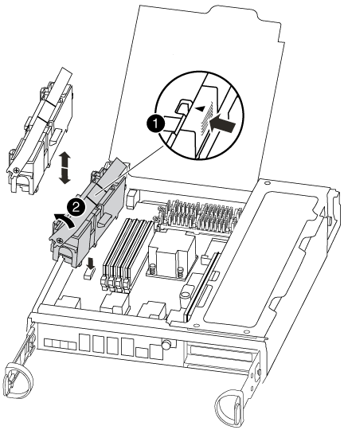

= NVMEM バッテリを交換します - FAS8200
:icons: font
:imagesdir: ../media/

[role="lead"]
システムの NVMEM バッテリを交換するには、コントローラモジュールをシステムから取り出して開き、バッテリを交換し、コントローラモジュールを閉じて交換する必要があります。

システムのその他のコンポーネントがすべて正常に動作している必要があります。問題がある場合は、必ずテクニカルサポートにお問い合わせください。

== 手順 1 ：障害のあるコントローラをシャットダウンします

ストレージシステムのハードウェア構成に応じた手順を使用して、障害のあるコントローラをシャットダウンまたはテイクオーバーできます。

=== オプション 1 ：ほとんどの構成

障害ノードをシャットダウンするには、ノードのステータスを確認し、必要に応じて正常なノードが障害ノードのストレージからデータを引き続き提供できるようにノードをテイクオーバーする必要があります。

ノードが 3 つ以上あるクラスタは、クォーラムを構成している必要があります。クラスタがクォーラムを構成していない場合や、正常なノードの資格と健全性に false と表示される場合は、障害ノードをシャットダウンする前に問題を修正する必要があります。を参照してください link:https://docs.netapp.com/us-en/ontap/system-admin/index.html["CLI での管理の概要"^]。

.手順
. AutoSupport が有効になっている場合は、 AutoSupport メッセージを呼び出してケースの自動作成を抑制します。「 system node AutoSupport invoke -node * -type all -message MAINT=number_OF_hours_downh
+
次の AutoSupport メッセージは、ケースの自動作成を 2 時間停止します。 cluster1 ： * > system node AutoSupport invoke -node * -type all -message MAINT=2h`

. 正常なノードのコンソールから自動ギブバックを無効にします。「 storage failover modify – node local-auto-giveback false
. 障害ノードに LOADER プロンプトを表示します。
+
[cols="1,2"]
|===
| 障害ノードの表示 | 作業 

 a| 
LOADER プロンプト
 a| 
コントローラモジュールの取り外しに進みます。

 a| 
ギブバックを待っています
 a| 
Ctrl キーを押しながら C キーを押し ' プロンプトが表示されたら y と入力します

 a| 
システムプロンプトまたはパスワードプロンプト（システムパスワードの入力）
 a| 
正常なノードから障害ノードをテイクオーバーまたは停止します。 storage failover takeover -ofnode impaired_node_name _

+ 障害ノードに「 Waiting for giveback... 」と表示されたら、 Ctrl+C キーを押し、「 y 」と入力します。

[+]

|===

=== オプション 2 ：コントローラが MetroCluster に搭載されている

NOTE: 2 ノード MetroCluster 構成のシステムでは、この手順を使用しないでください。

障害ノードをシャットダウンするには、ノードのステータスを確認し、必要に応じて正常なノードが障害ノードのストレージからデータを引き続き提供できるようにノードをテイクオーバーする必要があります。

* ノードが 3 つ以上あるクラスタは、クォーラムを構成している必要があります。クラスタがクォーラムを構成していない場合や、正常なノードの資格と健全性に false と表示される場合は、障害ノードをシャットダウンする前に問題を修正する必要があります。を参照してください link:https://docs.netapp.com/us-en/ontap/system-admin/index.html["CLI での管理の概要"^]。
* MetroCluster 構成を使用している場合は、 MetroCluster 構成状態が構成済みで、ノードが有効かつ正常な状態であることを確認しておく必要があります（「 MetroCluster node show 」）。

.手順
. AutoSupport が有効になっている場合は、 AutoSupport メッセージを呼び出してケースの自動作成を抑制します。「 system node AutoSupport invoke -node * -type all -message MAINT=number_OF_hours_downh
+
次の AutoSupport メッセージは、ケースの自動作成を 2 時間停止します。 cluster1 ： * > system node AutoSupport invoke -node * -type all -message MAINT=2h`

. 正常なノードのコンソールから自動ギブバックを無効にします。「 storage failover modify – node local-auto-giveback false
. 障害ノードに LOADER プロンプトを表示します。
+
[cols="1,2"]
|===
| 障害ノードの表示 | 作業 

 a| 
LOADER プロンプト
 a| 
コントローラモジュールの取り外しに進みます。

 a| 
ギブバックを待っています
 a| 
Ctrl キーを押しながら C キーを押し ' プロンプトが表示されたら y と入力します

 a| 
システムプロンプトまたはパスワードプロンプト（システムパスワードの入力）
 a| 
正常なノードから障害ノードをテイクオーバーまたは停止します。 storage failover takeover -ofnode impaired_node_name _

+ 障害ノードに「 Waiting for giveback... 」と表示されたら、 Ctrl+C キーを押し、「 y 」と入力します。

[+]

|===

=== オプション 3 ：コントローラは 2 ノード MetroCluster に搭載されています

障害ノードをシャットダウンするには、ノードのステータスを確認し、必要に応じて正常なノードが障害ノードのストレージからデータを引き続き提供できるようにノードをスイッチオーバーする必要があります。

.このタスクについて
* NetApp Storage Encryption を使用している場合は、の「 FIPS ドライブまたは SED を非保護モードに戻す」セクションの手順に従って MSID をリセットしておく必要があります link:https://docs.netapp.com/us-en/ontap/encryption-at-rest/return-seds-unprotected-mode-task.html["CLI での NetApp Encryption の概要"^]。
* 正常なノードに電力を供給するために、この手順の最後で電源装置をオンのままにしておく必要があります。

.手順
. MetroCluster ステータスをチェックして、障害ノードが正常なノードに自動的にスイッチオーバーしたかどうかを確認します。「 MetroCluster show 」
. 自動スイッチオーバーが発生したかどうかに応じて、次の表に従って処理を進めます。
+
[cols="1,2"]
|===
| 障害ノードの状況 | 作業 

 a| 
自動的にスイッチオーバーした
 a| 
次の手順に進みます。

 a| 
自動的にスイッチオーバーしていない
 a| 
正常なノードから計画的スイッチオーバー処理を実行します： MetroCluster switchover

 a| 
スイッチオーバーは自動的には行われておらず、 MetroCluster switchover コマンドを使用してスイッチオーバーを試みたが、スイッチオーバーは拒否された
 a| 
拒否メッセージを確認し、可能であれば問題を解決してやり直します。問題を解決できない場合は、テクニカルサポートにお問い合わせください。

|===
. サバイバークラスタから MetroCluster heal-phase aggregates コマンドを実行して、データアグリゲートを再同期します。
+
[listing]
----
controller_A_1::> metrocluster heal -phase aggregates
[Job 130] Job succeeded: Heal Aggregates is successful.
----
+
修復が拒否された場合は '-override-vetoes パラメータを指定して MetroCluster heal コマンドを再実行できますこのオプションパラメータを使用すると、修復処理を妨げるソフトな拒否はすべて無視されます。

. MetroCluster operation show コマンドを使用して、処理が完了したことを確認します。
+
[listing]
----
controller_A_1::> metrocluster operation show
    Operation: heal-aggregates
      State: successful
Start Time: 7/25/2016 18:45:55
   End Time: 7/25/2016 18:45:56
     Errors: -
----
. 「 storage aggregate show 」コマンドを使用して、アグリゲートの状態を確認します。
+
[listing]
----
controller_A_1::> storage aggregate show
Aggregate     Size Available Used% State   #Vols  Nodes            RAID Status
--------- -------- --------- ----- ------- ------ ---------------- ------------
...
aggr_b2    227.1GB   227.1GB    0% online       0 mcc1-a2          raid_dp, mirrored, normal...
----
. 「 MetroCluster heal-phase root-aggregates 」コマンドを使用して、ルートアグリゲートを修復します。
+
[listing]
----
mcc1A::> metrocluster heal -phase root-aggregates
[Job 137] Job succeeded: Heal Root Aggregates is successful
----
+
修復が拒否された場合は '-override-vetoes パラメータを指定して MetroCluster heal' コマンドを再実行できますこのオプションパラメータを使用すると、修復処理を妨げるソフトな拒否はすべて無視されます。

. デスティネーションクラスタで「 MetroCluster operation show 」コマンドを使用して、修復処理が完了したことを確認します。
+
[listing]
----

mcc1A::> metrocluster operation show
  Operation: heal-root-aggregates
      State: successful
 Start Time: 7/29/2016 20:54:41
   End Time: 7/29/2016 20:54:42
     Errors: -
----
. 障害のあるコントローラモジュールで、電源装置の接続を解除します。

== 手順 2 ：コントローラモジュールを開く

コントローラ内部のコンポーネントにアクセスするには、まずコントローラモジュールをシステムから取り外し、続いてコントローラモジュールのカバーを外す必要があります。

. 接地対策がまだの場合は、自身で適切に実施します。
. ケーブルマネジメントデバイスに接続しているケーブルをまとめているフックとループストラップを緩め、システムケーブルと SFP をコントローラモジュールから外し（必要な場合）、どのケーブルが何に接続されていたかを記録します。
+
ケーブルはケーブルマネジメントデバイスに収めたままにします。これにより、ケーブルマネジメントデバイスを取り付け直すときに、ケーブルを整理する必要がありません。

. ケーブルマネジメントデバイスをコントローラモジュールの右側と左側から取り外し、脇に置きます。
+
image::../media/drw_32xx_cbl_mgmt_arm.png[DRW 32xx CBL mgmt arm （ DRW 32xx CBL 管理アーム]

. コントローラモジュールのカムハンドルの取り付けネジを緩めます。
+
image::../media/drw_8020_cam_handle_thumbscrew.png[DRW 8020 カムハンドルの取り付けネジ]

+
|===

 a| 
image:../media/legend_icon_01.png[""]
| 取り付けネジ 

 a| 
image:../media/legend_icon_02.png[""]
 a| 
カムハンドル

|===
. カムハンドルを下に引き、コントローラモジュールをシャーシから引き出します。
+
このとき、空いている手でコントローラモジュールの底面を支えてください。

== 手順 3 ： NVMEM バッテリを交換します

システムの NVMEM バッテリを交換するには、障害が発生した NVMEM バッテリをシステムから取り外して、新しい NVMEM バッテリと交換する必要があります。

. NVMEM の LED を確認します。
+
** HA 構成のシステムの場合は、次の手順に進みます。
** システムがスタンドアロン構成の場合は、コントローラモジュールをクリーンシャットダウンし、 NV アイコンのある NVRAM の LED を確認します。
+
image::../media/drw_hw_nvram_icon.png[DRW hw NVRAM アイコン]

+

NOTE: システムを停止すると、内容がフラッシュメモリにデステージされている間、 NVRAM の LED が点滅します。デステージが完了すると LED は消灯します。

+
*** クリーンシャットダウンせずに電源が失われた場合は、 NVMEM の LED が点滅し、デステージが完了すると消灯します。
*** LED が点灯し、電源もオンになっている場合、書き込み前のデータは NVMEM に格納されます。
+
一般にこの状況は、 ONTAP が正常にブートしたあとの異常シャットダウン中に発生します。

. CPU エアダクトを開き、 NVMEM バッテリの場所を確認します。
+

+
|===

 a| 
image:../media/legend_icon_01.png[""]
| バッテリロックタブ 

 a| 
image:../media/legend_icon_02.png[""]
 a| 
NVMEM バッテリパック

|===
. バッテリをつかんで「 PUSH 」と書かれた青色の固定ツメを押し、バッテリを持ち上げてホルダーとコントローラモジュールから取り出します。
. 交換用バッテリをパッケージから取り出します。
. バッテリホルダーのタブをコントローラモジュール側のノッチに合わせ、カチッと音がして所定の位置に収まるまでバッテリケースをそっと押し下げます。
. CPU のエアダクトを閉じます。
+
プラグがソケットに固定されていることを確認します。

== 手順 4 ：コントローラを再度取り付けます

コントローラモジュール内のコンポーネントを交換したら、システムシャーシにコントローラモジュールを再設置してブートし、交換したコンポーネントの診断テストを実行できる状態にする必要があります。

. コントローラモジュールの端をシャーシの開口部に合わせ、コントローラモジュールをシステムに半分までそっと押し込みます。
+

NOTE: 指示があるまでコントローラモジュールをシャーシに完全に挿入しないでください。

. 必要に応じてシステムにケーブルを再接続します。
+
光ファイバケーブルを使用する場合は、メディアコンバータ（ QSFP または SFP ）を取り付け直してください（取り外した場合）。

. コントローラモジュールの再取り付けを完了します。
+
コントローラモジュールは、シャーシに完全に装着されるとすぐにブートを開始します。ブートプロセスを中断できるように準備しておきます。

+
.. カムハンドルを開き、コントローラモジュールをミッドプレーンまでしっかりと押し込んで完全に装着し、カムハンドルをロック位置まで閉じます。
+

NOTE: コネクタの破損を防ぐため、コントローラモジュールをスライドしてシャーシに挿入する際に力を入れすぎないでください。

.. コントローラモジュール背面のカムハンドルの取り付けネジを締めます。
.. ケーブルマネジメントデバイスをまだ取り付けていない場合は、取り付け直します。
.. ケーブルマネジメントデバイスに接続されているケーブルをフックとループストラップでまとめます。
.. 各ノードがブートを開始したら 'Press Ctrl-C for Boot Menu' というメッセージが表示されたら 'Ctrl+C キーを押してブートプロセスを中断します
.. 表示されたメニューからメンテナンスモードでブートするオプションを選択します。

== 手順 5 ：システムレベルの診断を実行します

新しい NVMEM バッテリを取り付けたら、診断を実行する必要があります。

システムレベルの診断を開始するには、システムに LOADER プロンプトが表示されている必要があります。

診断手順のコマンドは、すべてコンポーネントを交換するノードから実行します。

. 作業をするノードに LOADER プロンプトが表示されていない場合は、次の手順を実行します。
+
.. 表示されたメニューからメンテナンスモードオプションを選択します。
.. ノードが保守モードでブートしたら ' ノードを停止します
+
コマンドを問題したら、システムが LOADER プロンプトで停止するまで待ちます。

+

NOTE: 起動プロセス中に 'y' をプロンプトに安全に応答できます

+
*** HA 構成でメンテナンスモードに切り替えたときに表示される、正常なノードが停止したままであることの確認を求めるプロンプト。

. LOADER プロンプトで、システムレベルの診断用に特別に設計されたドライバ「 boot_diags 」にアクセスします
+
ブート・プロセス中に 'Maintenance] モードのプロンプト（ *> ）が表示されるまで 'y とプロンプトを入力しても安全です

. NVMEM メモリの診断を実行します： 'lddiag device run -dev nvmem
. NVMEM バッテリの交換が原因でハードウェアの問題が発生していないことを確認します。 `diag device status -dev nvme-long-state failed
+
テストに失敗した場合は、プロンプトに戻ります。失敗した場合は、そのステータスがすべて表示されます。

. 前述の手順の結果に応じて、次に進みます。
+
[cols="1,2"]
|===
| システムレベルの診断のテスト結果 | 作業 

 a| 
は失敗なしで完了しました
 a| 
.. ステータスログ「 `diag device clearstatus` 」を消去します
.. ログがクリアされたことを確認します。「 diag device status 」
+
次のデフォルトの応答が表示されます。

+
SLDIAG ：ログメッセージが存在しません。

.. 保守モードを終了します :halt
+
ノードに LOADER プロンプトが表示されます。

.. LOADER プロンプトからノードをブートします。 bye
.. ノードを通常動作に戻します。

|===
+
[cols="1,2"]
|===
| ノードの構成 | 作業 

 a| 
HA ペア
 a| 
ギブバックを実行します。「 storage failover giveback -ofnode replacement_node_name _

NOTE: 自動ギブバックを無効にした場合は、 storage failover modify コマンドを使用して再度有効にします。

 a| 
2 ノード MetroCluster 構成
 a| 
次の手順に進みます。MetroCluster スイッチバック手順は、交換プロセスの次のタスクで実行します。

 a| 
スタンドアロン構成です
 a| 
次の手順に進みます。対処は不要です。これで、システムレベルの診断が完了しました。

 a| 
テストが失敗しました
 a| 
問題の原因を特定します。

.. 保守モードを終了します :halt
+
コマンドを問題したら、システムが LOADER プロンプトで停止するまで待ちます。

.. シャーシ内のコントローラモジュールの数に応じて、電源装置をオフにするか、オンのままにします。
+
*** シャーシ内にコントローラモジュールが 2 つある場合は、他のコントローラモジュールに電力を供給するために、電源装置をオンのままにします。
*** シャーシ内にコントローラモジュールが 1 つしかない場合は、電源装置をオフにして電源から取り外します。

.. システムレベルの診断を実行するための考慮事項をすべて確認するとともに、ケーブルがしっかりと接続されているか、ハードウェアコンポーネントがストレージシステムに適切に取り付けられているかを確認します。
.. 対象となるコントローラモジュールをブートし、ブートメニューを表示するよう求められたら Ctrl+C キーを押してブートを中断します。
+
*** シャーシ内にコントローラモジュールが 2 つある場合は、対象となるコントローラモジュールをシャーシに完全に取り付けます。
+
コントローラモジュールを完全に取り付けると、モジュールがブートします。

*** シャーシ内にコントローラモジュールが 1 つしかない場合は、電源装置を接続して電源をオンにします。

.. メニューから、メンテナンスモードでのブートを選択します。
.. 次のコマンドを入力して保守モードを終了します :halt
+
コマンドを問題したら、システムが LOADER プロンプトで停止するまで待ちます。

.. システムレベルの診断テストを再実行します。

|===

== 手順 6 ： 2 ノード MetroCluster 構成のアグリゲートをスイッチバックする

2 ノード MetroCluster 構成で FRU の交換が完了したら、 MetroCluster スイッチバック処理を実行できます。これにより構成が通常の動作状態に戻ります。また、障害が発生していたサイトの同期元 Storage Virtual Machine （ SVM ）がアクティブになり、ローカルディスクプールからデータを提供します。

このタスクでは、環境の 2 ノード MetroCluster 構成のみを実行します。

.手順
. すべてのノードの状態が「 enabled 」であることを確認します。 MetroCluster node show
+
[listing]
----
cluster_B::>  metrocluster node show

DR                           Configuration  DR
Group Cluster Node           State          Mirroring Mode
----- ------- -------------- -------------- --------- --------------------
1     cluster_A
              controller_A_1 configured     enabled   heal roots completed
      cluster_B
              controller_B_1 configured     enabled   waiting for switchback recovery
2 entries were displayed.
----
. すべての SVM で再同期が完了したことを確認します。「 MetroCluster vserver show 」
. 修復処理によって実行される LIF の自動移行が正常に完了したことを確認します。 MetroCluster check lif show
. サバイバークラスタ内の任意のノードから MetroCluster switchback コマンドを使用して、スイッチバックを実行します。
. スイッチバック処理が完了したことを確認します MetroCluster show
+
クラスタの状態が waiting-for-switchback の場合は、スイッチバック処理がまだ実行中です。

+
[listing]
----
cluster_B::> metrocluster show
Cluster              Configuration State    Mode
--------------------	------------------- 	---------
 Local: cluster_B configured       	switchover
Remote: cluster_A configured       	waiting-for-switchback
----
+
クラスタが「 normal 」状態のとき、スイッチバック処理は完了しています。

+
[listing]
----
cluster_B::> metrocluster show
Cluster              Configuration State    Mode
--------------------	------------------- 	---------
 Local: cluster_B configured      		normal
Remote: cluster_A configured      		normal
----
+
スイッチバックが完了するまでに時間がかかる場合は、「 MetroCluster config-replication resync-status show 」コマンドを使用することで、進行中のベースラインのステータスを確認できます。

. SnapMirror 構成または SnapVault 構成があれば、再確立します。

== 手順 7 ：障害が発生したパーツをネットアップに返却する

部品を交換したあと、障害のある部品をネットアップに返却することができます。詳細については、キットに付属する RMA 指示書を参照してください。テクニカルサポートにお問い合わせください https://mysupport.netapp.com/site/global/dashboard["ネットアップサポート"]RMA 番号を確認する場合や、交換用手順にサポートが必要な場合は、日本国内サポート用電話番号：国内フリーダイヤル 0066-33-123-265 または 0066-33-821-274 （国際フリーフォン 800-800-80-800 も使用可能）までご連絡ください。
