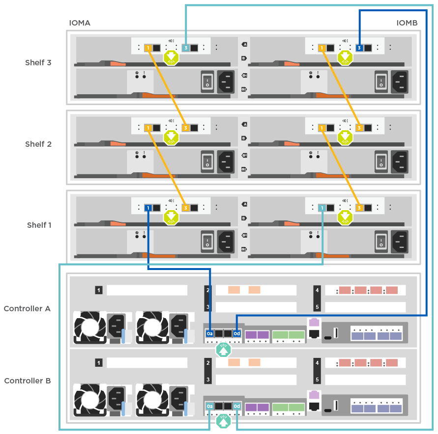

= 詳細ガイド - FAS8300 および FAS8700
:allow-uri-read: 
:icons: font
:imagesdir: ../media/

[role="lead"]
このガイドでは、一般的なネットアップシステムのインストール手順について詳しく説明します。インストール手順の詳細については、このガイドを参照してください。

== 手順 1 ：設置の準備

システムを設置するには、アカウントを作成し、システムを登録し、ライセンスキーを取得する必要があります。また、システムに応じた適切な数とタイプのケーブルを準備し、特定のネットワーク情報を収集する必要があります。

サイト要件および構成済みシステムの追加情報の情報については、 Hardware Universe にアクセスできる必要があります。また、ご使用の ONTAP バージョンのリリースノートにアクセスして、このシステムの詳細を確認しておくことを推奨します。

https://hwu.netapp.com["NetApp Hardware Universe の略"^]

http://mysupport.netapp.com/documentation/productlibrary/index.html?productID=62286["使用しているバージョンの ONTAP 9 に対するリリースノートを検索してください"^]

お客様のサイトで次のものを準備する必要があります。

* ストレージシステム用のラックスペース
* No.2 プラスドライバ
* Web ブラウザを使用してシステムをネットワークスイッチおよびラップトップまたはコンソールに接続するための追加のネットワークケーブル

.手順
. すべての箱を開封して内容物を取り出します。
. コントローラのシステムシリアル番号をメモします。
+
image::../media/drw_ssn_label.png[システムシリアル番号の例]

. 同梱されていたケーブルの数と種類を確認し、書き留めておきます。
+
次の表に、同梱されているケーブルの種類を示します。表に記載されていないケーブルがある場合は、を参照してください https://hwu.netapp.com["NetApp Hardware Universe の略"^] ケーブルの場所を確認し、用途を特定します。

+
[cols="1,2,1,2"]
|===
| ケーブルのタイプ | パーツ番号と長さ | コネクタのタイプ | 用途 

 a| 
100GbE ケーブル（ QSF （ 28 ）
 a| 
X666211A-05 (112-00595) 、 0.5m

X666211A-1 （ 112-00573 ）、 1m

X666211A-2 （ 112-00574 ）、 2m

X666211A-5 （ 112-00574 ）、 5m
 a| 
image:../media/oie_cable100_gbe_qsfp28.png["100GbE QSFP28コネクタ"]
 a| 
ストレージ、クラスタインターコネクト / HA 、イーサネットデータ（注文内容による）

 a| 
25GbE ケーブル（ SFP28s ）
 a| 
X66240 2 （ 112-00598 ）、 2m

X66240 - 5 （ 112-00639 ）、 5m
 a| 
image:../media/oie_cable_sfp_gbe_copper.png["GbE SFP銅線コネクタ"]
 a| 
GbE ネットワーク接続（注文内容による）

 a| 
32Gb FC （ SFP+ 光）
 a| 
X66250-2 （ 112-00342 ）、 2m

X66250-5 （ 112-00344 ）、 5m

X66250-15 （ 112-00346 ）、 15m
 a| 
image:../media/oie_cable_sfp_gbe_copper.png["GbE SFP銅線コネクタ"]
 a| 
FC ネットワーク接続

 a| 
ストレージケーブル
 a| 
X66030A （ 112-00435 ）、 0.5m

X66031A （ 112-00436 ）、 1m

X66032A （ 112-00437 ）、 2m

X66033A (112-00438) 、 3m
 a| 
image:../media/oie_cable_mini_sas_hd_to_mini_sas_hd.png["Mini-SAS - Mini-SASコネクタ"]
 a| 
mini-SAS HD 間ケーブル（注文内容による）

 a| 
光ケーブル
 a| 
X66250-2-N-C （ 112-00342 ）
 a| 
image:../media/oie_cable_fiber_lc_connector.png["LCファイバコネクタ"]
 a| 
メザニンカード用の 16Gb FC ケーブルまたは 25GbE ケーブル（注文内容による）

 a| 
RJ-45 （注文内容による）
 a| 
X6585-R6 （ 112-00291 ）、 3m

X6562-R6 （ 112-00196 ）、 5m
 a| 
image:../media/oie_cable_rj45.png["RJ-45ケーブルコネクタ"]
 a| 
管理ネットワーク

 a| 
Micro-USB コンソールケーブル
 a| 
該当なし
 a| 
image:../media/oie_cable_micro_usb.png["マイクロUSBコネクタ"]
 a| 
ネットワーク検出をサポートしていないラップトップまたはコンソールでソフトウェアをセットアップする際に使用するコンソール接続

 a| 
電源ケーブル
 a| 
該当なし
 a| 
image:../media/oie_cable_power.png["電源ケーブル"]
 a| 
システムの電源をオンにします

|===
. NetApp ONTAP 構成ガイドを確認して、必要な情報を収集します。
+
https://library.netapp.com/ecm/ecm_download_file/ECMLP2862613["『 ONTAP 構成ガイド』"]

== 手順 2 ：ハードウェアを設置する

システムは、 4 ポストラックまたはネットアップシステムキャビネットのいずれかに設置する必要があります。

.手順
. 必要に応じてレールキットを取り付けます。
. レールキットに付属の手順書に従って、システムを設置して固定します。
+

NOTE: システムの重量に関連する安全上の注意事項を確認しておく必要があります。

+
image::../media/drw_katana_lifting_restriction_icon.png[2人で持ち上げる場合の注意]

. ケーブルマネジメントデバイスを取り付けます（図を参照）。
+
image::../media/drw_a320_cable_management_arms.png[ケーブルマネジメントアームの取り外しと取り付け]

. システムの前面にベゼルを配置します。

== 手順 3 ：コントローラをネットワークに接続する

2 ノードスイッチレスクラスタメソッドまたはクラスタインターコネクトネットワークを使用して、コントローラをネットワークにケーブル接続できます。

NOTE: カードのポートラベルが表示されない場合は、カードの取り付け方向を確認し（PCIeコネクタソケットがA400およびFAS8300 / 8700のカードスロットの左側にある）、カードを探してから、のパーツ番号でカードを探します https://hwu.netapp.com["NetApp Hardware Universe の略"^] ポートラベルを示すベゼルの図については、を参照してください。カードのパーツ番号は、を使用して確認できます `sysconfig -a` コマンドまたはをシステムパッキングリストに追加します。

=== オプション 1 ： 2 ノードスイッチレスクラスタをケーブル接続

コントローラモジュールのオプションのデータポート、オプションの NIC カード、および管理ポートは、スイッチに接続されます。クラスタインターコネクトポートと HA ポートは、両方のコントローラモジュールでケーブル接続されます。

システムとスイッチの接続に関する情報を、ネットワーク管理者に確認しておく必要があります。

ケーブルをポートに差し込む際は、ケーブルのプルタブの向きを確認してください。ケーブルのプルタブは、すべてのオンボードポートでは上向き、拡張（ NIC ）カードでは下向きになります。

image::../media/oie_cable_pull_tab_up.png[プルタブ付きケーブルコネクタ（上部）]

image::../media/oie_cable_pull_tab_down.png[下部にプルタブ付きケーブルコネクタ]

NOTE: コネクタを挿入すると、カチッという音がしてコネクタが所定の位置に収まるはずです。音がしない場合は、コネクタを取り外し、回転させてからもう一度試してください。

.手順
. アニメーションや図を使用して、コントローラとスイッチをケーブルで接続します。
+
.アニメーション- 2ノードスイッチレスクラスタのケーブル配線
video::80c4701e-8e4a-408e-96e6-ab1b00666d3f[panopto]
+
image::../media/drw_fas8300_TNSC_network_cabling.png[2ノードスイッチレスクラスタのケーブル配線図]

. に進みます <<手順 4 ：コントローラをドライブシェルフにケーブル接続する>> ドライブシェルフのケーブル接続手順については、を参照して

=== オプション 2 ：スイッチクラスタをケーブル接続する

コントローラモジュールのオプションのデータポート、オプションの NIC カード、メザニンカード、および管理ポートは、スイッチに接続されます。クラスタインターコネクト / HA ポートは、クラスタ / HA スイッチにケーブル接続されます。

システムとスイッチの接続に関する情報を、ネットワーク管理者に確認しておく必要があります。

ケーブルをポートに差し込む際は、ケーブルのプルタブの向きを確認してください。ケーブルのプルタブは、すべてのオンボードポートでは上向き、拡張（ NIC ）カードでは下向きになります。

image::../media/oie_cable_pull_tab_up.png[プルタブ付きケーブルコネクタ（上部）]

image::../media/oie_cable_pull_tab_down.png[下部にプルタブ付きケーブルコネクタ]

NOTE: コネクタを挿入すると、カチッという音がしてコネクタが所定の位置に収まるはずです。音がしない場合は、コネクタを取り外し、回転させてからもう一度試してください。

.手順
. アニメーションや図を使用して、コントローラとスイッチをケーブルで接続します。
+
.アニメーションスイッチを使用したクラスタのケーブル接続
video::5893b7d4-6f67-4a64-ad89-ab1b006658d1[panopto]
+
image::../media/drw_fas8300_switched_network_cabling.png[スイッチクラスタネットワークのケーブル配線図]

. に進みます <<手順 4 ：コントローラをドライブシェルフにケーブル接続する>> ドライブシェルフのケーブル接続手順については、を参照して

== 手順 4 ：コントローラをドライブシェルフにケーブル接続する

=== オプション 1 ：コントローラを SAS ドライブシェルフにケーブル接続します

各コントローラを両方の SAS ドライブシェルフの IOM モジュールにケーブル接続する必要があります。

図の矢印を見て、ケーブルコネクタのプルタブの正しい向きを確認してください。DS224-C のケーブルプルタブは下です。

image::../media/oie_cable_pull_tab_down.png[下部にプルタブ付きケーブルコネクタ]

NOTE: コネクタを挿入すると、カチッという音がしてコネクタが所定の位置に収まるはずです。音がしない場合は、コネクタを取り外し、回転させてからもう一度試してください。

.手順
. 次のアニメーションや図を使用して、 2 台のドライブシェルフにコントローラをケーブル接続します。
+
.アニメーション-コントローラをSASドライブシェルフにケーブル接続します
video::46c0da0b-6842-449f-b28c-ab1b0066584b[panopto]
+

. に進みます <<手順 5 ：システムのセットアップと設定を完了する>> をクリックして、システムのセットアップと設定を完了します。

== 手順 5 ：システムのセットアップと設定を完了する

システムのセットアップと設定を実行するには、スイッチとラップトップのみを接続してクラスタ検出を使用するか、システムのコントローラに直接接続してから管理スイッチに接続します。

=== オプション 1 ：ネットワーク検出が有効になっている場合は、システムのセットアップと設定を実行する

ラップトップでネットワーク検出が有効になっている場合は、クラスタの自動検出を使用してシステムのセットアップと設定を実行できます。

.手順
. 次のアニメーションに従って、 1 つ以上のドライブシェルフ ID を設定します。
+
.アニメーション-ドライブシェルフIDを設定します
video::c600f366-4d30-481a-89d9-ab1b0066589b[panopto]
. 電源コードをコントローラの電源装置に接続し、さらに別の回路の電源に接続します。
. ラップトップでネットワーク検出が有効になっていることを確認します。
+
詳細については、ラップトップのオンラインヘルプを参照してください。

. 次のアニメーションに従って、ラップトップを管理スイッチに接続します。
+
.アニメーション-ラップトップを管理スイッチに接続します
video::d61f983e-f911-4b76-8b3a-ab1b0066909b[panopto]
. 検出する ONTAP アイコンを選択します。
+
image::../media/drw_autodiscovery_controler_select_ieops-1849.svg[ONTAPアイコンの選択]

+
.. エクスプローラを開きます。
.. 左側のペインで*[ネットワーク]*をクリックし、右クリックして*[更新]*を選択します。
.. いずれかの ONTAP アイコンをダブルクリックし、画面に表示された証明書を受け入れます。
+

NOTE: 「 XXXXX 」は、ターゲットノードのシステムシリアル番号です。

+
System Manager が開きます。

. System Manager のセットアップガイドを使用して、 _NetApp ONTAP 構成ガイド _ で収集したデータを基にシステムを設定します。
+
https://library.netapp.com/ecm/ecm_download_file/ECMLP2862613["『 ONTAP 構成ガイド』"]

. アカウントを設定して Active IQ Config Advisor をダウンロードします。
+
.. 既存のアカウントにログインするか、アカウントを作成します。
+
https://mysupport.netapp.com/eservice/public/now.do["ネットアップサポート登録"]

.. システムを登録します。
+
https://mysupport.netapp.com/eservice/registerSNoAction.do?moduleName=RegisterMyProduct["ネットアップ製品登録"]

.. Active IQ Config Advisor をダウンロードします。
+
https://mysupport.netapp.com/site/tools/tool-eula/activeiq-configadvisor["ネットアップのダウンロード： Config Advisor"]

. Config Advisor を実行してシステムの健全性を確認します。
. 初期設定が完了したら、ONTAPのその他の機能の設定についてに進みます https://docs.netapp.com/us-en/ontap/index.html["ONTAP 9 のドキュメント"^]。

=== オプション 2 ：ネットワーク検出が有効になっていない場合のシステムのセットアップと設定の実行

ラップトップでネットワーク検出が有効になっていない場合は、このタスクを使用して設定とセットアップを実行する必要があります。

.手順
. ラップトップまたはコンソールをケーブル接続して設定します。
+
.. ラップトップまたはコンソールのコンソールポートを、 115 、 200 ボー、 N-8-1 に設定します。
+

NOTE: コンソールポートの設定方法については、ラップトップまたはコンソールのオンラインヘルプを参照してください。

.. システム付属のコンソールケーブルを使用してラップトップまたはコンソールにコンソールケーブルを接続し、ラップトップを管理サブネット上の管理スイッチに接続します。
.. 管理サブネット上の TCP / IP アドレスをラップトップまたはコンソールに割り当てます。

. 次のアニメーションに従って、 1 つ以上のドライブシェルフ ID を設定します。
+
.アニメーション-ドライブシェルフIDを設定します
video::c600f366-4d30-481a-89d9-ab1b0066589b[panopto]
. 電源コードをコントローラの電源装置に接続し、さらに別の回路の電源に接続します。
+
FAS8300 と FAS8700 の例を示します。

+
.アニメーション-コントローラの電源をオンにします
video::50cdf200-ede1-45a9-b4b5-ab1b006698d7[panopto]
+

NOTE: 初回のブートには最大 8 分かかる場合があります。

. いずれかのノードに初期ノード管理 IP アドレスを割り当てます。
+
[cols="1,3"]
|===
| 管理ネットワークでの DHCP の状況 | 作業 

 a| 
を設定します
 a| 
新しいコントローラに割り当てられた IP アドレスを記録します。

 a| 
未設定
 a| 
.. PuTTY 、ターミナルサーバ、または環境に対応した同等の機能を使用して、コンソールセッションを開きます。
+

NOTE: PuTTY の設定方法がわからない場合は、ラップトップまたはコンソールのオンラインヘルプを確認してください。

.. スクリプトからプロンプトが表示されたら、管理 IP アドレスを入力します。

|===
. ラップトップまたはコンソールで、 System Manager を使用してクラスタを設定します。
+
.. ブラウザでノード管理 IP アドレスを指定します。
+

NOTE: アドレスの形式は、 +https://x.x.x.x.+ です

.. NetApp ONTAP 構成ガイドで収集したデータを基にシステムを設定します。
+
https://library.netapp.com/ecm/ecm_download_file/ECMLP2862613["『 ONTAP 構成ガイド』"]

. アカウントを設定して Active IQ Config Advisor をダウンロードします。
+
.. 既存のアカウントにログインするか、アカウントを作成します。
+
https://mysupport.netapp.com/eservice/public/now.do["ネットアップサポート登録"]

.. システムを登録します。
+
https://mysupport.netapp.com/eservice/registerSNoAction.do?moduleName=RegisterMyProduct["ネットアップ製品登録"]

.. Active IQ Config Advisor をダウンロードします。
+
https://mysupport.netapp.com/site/tools/tool-eula/activeiq-configadvisor["ネットアップのダウンロード： Config Advisor"]

. Config Advisor を実行してシステムの健全性を確認します。
. 初期設定が完了したら、ONTAPのその他の機能の設定についてに進みます https://docs.netapp.com/us-en/ontap/index.html["ONTAP 9 のドキュメント"^]。

