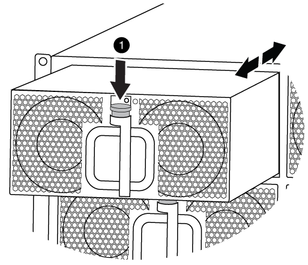

= ハードウェアの移動と交換- FAS9000
:allow-uri-read: 
:icons: font
:imagesdir: ../media/

[role="lead"]
ファン、ハードドライブ、およびコントローラモジュールを障害のあるシャーシから新しいシャーシに移動し、装置ラックまたはシステムキャビネットの障害のあるシャーシを、障害のあるシャーシと同じモデルの新しいシャーシと交換します。

== 手順 1 ：電源装置を取り外す

.手順
シャーシを交換するときに電源装置を取り外すには、電源装置の電源を切って接続を解除し、古いシャーシから電源装置を取り出します。

. 接地対策がまだの場合は、自身で適切に実施します。
. 電源装置をオフにし、電源ケーブルを外します。
+
.. 電源装置の電源スイッチをオフにします。
.. 電源ケーブルの固定クリップを開き、電源装置から電源ケーブルを抜きます。
.. 電源から電源ケーブルを抜きます。

. 電源装置のハンドルにあるオレンジ色のボタンを押したまま、電源装置をシャーシから引き出します。
+

CAUTION: 電源装置を取り外すときは、重量があるので必ず両手で支えながら作業してください。

+
image::../media/drw_9000_remove_install_psu_module.gif[電源装置ユニット（PSU）の取り外し]

+
[cols="1,3"]
|===

 a| 
image:../media/icon_round_1.png["番号1"]
 a| 
ロックボタン

|===
. 残りの電源装置に対して上記の手順を繰り返します。

== 手順 2 ：ファンを取り外す

シャーシを交換するときにファンモジュールを取り外すには、特定の順序でタスクを実行する必要があります。

.手順
. （必要な場合）両手でベゼルの両側の開口部を持ち、手前に引いてシャーシフレームのボールスタッドからベゼルを外します。
. ファンモジュールのオレンジ色のボタンを押し、空いている手で支えながらファンモジュールをシャーシから引き出します。
+

CAUTION: ファンモジュールは奥行きがないので、シャーシから突然落下してけがをすることがないように、必ず空いている手でファンモジュールの底面を支えてください。

+

+
[cols="1,3"]
|===

 a| 
image:../media/icon_round_1.png["番号1"]
 a| 
オレンジ色のリリースボタン

|===
. ファンモジュールを脇へ置きます。
. 残りのファンモジュールに対して上記の手順を繰り返します。

== 手順 3 ：コントローラモジュールを取り外す

シャーシを交換するには、古いシャーシからコントローラモジュールを取り外す必要があります。

.手順
. 障害のあるコントローラモジュールからケーブルを外し、どのケーブルが何に接続されていたかを記録します。
. カムハンドルのオレンジ色のボタンを下にスライドさせてロックを解除します。
+
image::../media/drw_9000_remove_pcm.png[コントローラモジュールを取り外します]

+
[cols="1,3"]
|===

 a| 
image:../media/icon_round_1.png["番号1"]
 a| 
カムハンドルのリリースボタン

 a| 
image:../media/icon_round_2.png["番号2"]
 a| 
カムハンドル

|===
. カムハンドルを回転させて、コントローラモジュールをシャーシから完全に外し、コントローラモジュールをシャーシから引き出します。
+
このとき、空いている手でコントローラモジュールの底面を支えてください。

. コントローラモジュールを安全な場所に置いておきます。シャーシに別のコントローラモジュールがある場合は、上記の手順を繰り返します。

== 手順 4 ： I/O モジュールを取り外します

.手順
NVRAM モジュールを含む古いシャーシから I/O モジュールを取り外すには、特定の手順を実行します。NVRAMモジュールを新しいシャーシに移動するときに、そのモジュールからFlash Cacheモジュールを取り外す必要はありません。

. ターゲットの I/O モジュールに接続されているケーブルをすべて取り外します。
+
元の場所がわかるように、ケーブルにラベルを付けておいてください。

. ターゲットの I/O モジュールをシャーシから取り外します。
+
.. 文字と数字が記載されたカムボタンを押し下げます。
+
カムボタンがシャーシから離れます。

.. カムラッチを下に回転させて水平にします。
+
I/O モジュールがシャーシから外れ、 I/O スロットから約 1/2 インチアウトします。

.. I/O モジュール前面の両側にあるプルタブを引いて、 I/O モジュールをシャーシから取り外します。
+
I/O モジュールが取り付けられていたスロットを記録しておいてください。

+
image::../media/drw_9000_remove_pcie_module.png[PCIeモジュールの取り外し]

+
[cols="1,3"]
|===

 a| 
image:../media/icon_round_1.png["番号1"]
 a| 
文字と数字が記載された I/O カムラッチ

 a| 
image:../media/icon_round_2.png["番号2"]
 a| 
ロックが完全に解除された I/O カムラッチ

|===

. I/O モジュールを脇へ置きます。
. 古いシャーシの残りの I/O モジュールに対して前述の手順を繰り返します。

== 手順 5 ：デステージコントローラ電源モジュールを取り外す

.手順
交換用シャーシを設置する準備として、古いシャーシからデステージコントローラ電源モジュールを取り外す必要があります。

. モジュールハンドルのオレンジ色のロックボタンを押し、 DCPM モジュールをシャーシから取り出します。
+
image::../media/drw_9000_remove_nv_battery.png[NVバッテリーを取り外します。]

+
[cols="1,3"]
|===

 a| 
image:../media/icon_round_1.png["番号1"]
 a| 
DCPM モジュールのオレンジ色のロックボタン

|===
. DCPM モジュールを安全な場所に置き、残りの DCPM モジュールに対してこの手順を繰り返します。

== 手順 6 ：装置ラックまたはシステムキャビネット内のシャーシを交換します

.手順
交換用シャーシを設置するには、装置ラックまたはシステムキャビネットから既存のシャーシを取り外す必要があります。

. シャーシ取り付けポイントからネジを外します。
+

NOTE: システムがシステムキャビネットに設置されている場合は、背面のタイダウンブラケットの取り外しが必要になることがあります。

. 古いシャーシをシステムキャビネットのラックレールまたは装置ラックの _L_Brackets からスライドさせて取り出し、脇に置きます。この作業は 3~4 人で行ってください。
. 接地対策がまだの場合は、自身で適切に実施します。
. 交換用シャーシを、システムキャビネットのラックレールまたは装置ラックの _L_Brackets に沿って挿入して、装置ラックまたはシステムキャビネットに設置します。この作業は 2~3 人で行ってください。
. シャーシをスライドさせて装置ラックまたはシステムキャビネットに完全に挿入します。
. 古いシャーシから取り外したネジを使用して、シャーシの前面を装置ラックまたはシステムキャビネットに固定します。
. シャーシの背面を装置ラックまたはシステムキャビネットに固定します。
. ケーブル管理ブラケットを使用している場合は、それらを古いシャーシから取り外し、交換用シャーシに取り付けます。
. まだベゼルを取り付けていない場合は、取り付けます。

== 手順 7 ： USB LED モジュールを新しいシャーシに移動します

.手順
新しいシャーシをラックまたはキャビネットに設置したら、 USB LED モジュールを古いシャーシから新しいシャーシに移動する必要があります。

. 古いシャーシの前面、電源装置ベイのすぐ下に USB LED モジュールがあることを確認します。
. モジュールの右側にある黒いロックボタンを押してモジュールをシャーシから外し、古いシャーシから引き出します。
. 交換用シャーシの前面下部にある USB LED ベイにモジュールの端を合わせ、カチッと音がして所定の位置に収まるまでそっとシャーシに押し込みます。

== 手順 8 ：シャーシを交換する場合は、デステージコントローラ電源モジュールを取り付けます

.手順
交換用シャーシをラックまたはシステムキャビネットに設置したら、デステージコントローラ電源モジュールを再度取り付ける必要があります。

. DCPM モジュールの端をシャーシの開口部に合わせ、カチッと音がして所定の位置に収まるまでシャーシにそっと挿入します。
+

NOTE: モジュールとスロットにはキーが付いています。モジュールを無理に開口部に押し込まないでください。モジュールを簡単に挿入できない場合は、モジュールの位置を調整してからシャーシに挿入します。

. 残りの DCPM モジュールに対して同じ手順を繰り返します。

== 手順 9 ：シャーシにファンを取り付けます

.手順
シャーシを交換するときにファンモジュールを取り付けるには、特定の順序でタスクを実行する必要があります。

. 交換用ファンモジュールの端をシャーシの開口部に合わせ、完全に固定されるまでシャーシに挿入します。
+
稼働中のシステムの場合、ファンモジュールがシャーシに正常に挿入されると、黄色の警告 LED が 4 回点滅します。

. 残りのファンモジュールに対して上記の手順を繰り返します。
. ベゼルをボールスタッドに合わせ、ボールスタッドにそっと押し込みます。

== 手順 10 ： I/O モジュールを取り付ける

.手順
I/Oモジュール（NVRAM / Flash Cacheモジュールを含む）を古いシャーシから取り付けるには、特定の手順を実行します。

I/O モジュールを新しいシャーシの対応するスロットに取り付けることができるように、シャーシを設置しておく必要があります。

. 交換用シャーシをラックまたはキャビネットに設置したら、交換用シャーシの対応するスロットに I/O モジュールをそっと挿入し、文字と数字が記載された I/O カムラッチをはめ込みます。 I/O カムラッチを上に押してモジュールを所定の位置にロックします。
. 必要に応じて、 I/O モジュールにケーブルを再接続します。
. 脇に置いた残りの I/O モジュールに対して前述の手順を繰り返します。
+

NOTE: 古いシャーシにブランク I/O パネルがある場合は、この時点で交換用シャーシに移します。

== 手順 11 ：電源装置を取り付ける

.手順
シャーシを交換するときに電源装置を取り付けるには、電源装置を交換用シャーシに取り付け、電源に接続します。

. 電源装置の端を両手で支えながらシステムシャーシの開口部に合わせ、電源装置を所定の位置に固定されるまでシャーシにそっと押し込みます。
+
電源装置にはキーが付いており、一方向のみ取り付けることができます。

+

NOTE: 電源装置をスライドさせてシステムに挿入する際に力を入れすぎないようにしてください。コネクタが破損する可能性があります。

. 電源ケーブルを再接続し、電源ケーブル固定用ツメを使用して電源装置に固定します。
+

NOTE: 電源ケーブルは電源装置にのみ接続してください。この時点では、電源ケーブルを電源に接続しないでください。

. 残りの電源装置に対して上記の手順を繰り返します。

== 手順 12 ：コントローラを取り付ける

.手順
コントローラモジュールとその他のコンポーネントを新しいシャーシに取り付けたら、ブートします。

. コントローラモジュールの端をシャーシの開口部に合わせ、コントローラモジュールをシステムに半分までそっと押し込みます。
+

NOTE: 指示があるまでコントローラモジュールをシャーシに完全に挿入しないでください。

. コンソールとコントローラモジュールを再度ケーブル接続し、管理ポートを再接続します。
. 電源装置を別の電源に接続し、電源をオンにします。
. カムハンドルを開き、コントローラモジュールをシャーシに挿入し、ミッドプレーンまでしっかりと押し込んで完全に装着し、カムハンドルをカチッと音がしてロックされるまで閉じます。
+

NOTE: コントローラモジュールをスライドさせてシャーシに挿入する際に力を入れすぎないように注意してください。コネクタが破損することがあります。

+
コントローラモジュールは、シャーシに完全に装着されるとすぐにブートを開始します。

. 同じ手順を繰り返して、 2 台目のコントローラを新しいシャーシに取り付けます。
. 各ノードをメンテナンスモードでブートします。
+
.. 各ノードがブートを開始したら 'Press Ctrl-C for Boot Menu' というメッセージが表示されたら 'Ctrl+C キーを押してブートプロセスを中断します
+

NOTE: プロンプトを見逃してコントローラモジュールが ONTAP で起動する場合は、「 halt 」と入力し、 LOADER プロンプトで「 boot_ontap 」と入力して、プロンプトが表示されたら「 Ctrl+C 」を押して、この手順を繰り返します。

.. ブートメニューからメンテナンスモードのオプションを選択します。

