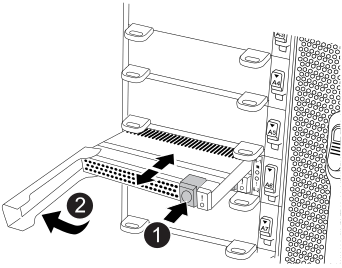

= キャッシングモジュール FAS9500 をホットスワップします
:allow-uri-read: 
:icons: font
:imagesdir: ../media/

[role="lead"]
NVMe SSD FlashCacheモジュール（FlashCacheまたはキャッシングモジュール）は、FAS9500システムのスロット6にあるNVRAM11モジュールの前面にあります。サポートされているベンダーと同じ容量のキャッシングモジュールをホットスワップすることができます。

NOTE: FlashCacheモジュールをコールドスワップする場合は、I/Oモジュールの交換手順に従います。

状況に応じて、ストレージシステムが次に示す特定の条件を満たしている必要があります。

* 取り付けるキャッシングモジュールに適したオペレーティングシステムが必要です。
* キャッシングモジュールが機能していて、システムで認識できる十分な数の状態である必要があります。前回のブート以降にキャッシングモジュールが機能していない場合は、この手順 を使用できないため、コールドスワップの手順 を使用する必要があります。
* キャッシュ容量をサポートする必要があります。
* 交換用キャッシングモジュールの容量は、障害が発生したキャッシングモジュールと同じでなければなりませんが、サポートされている別のベンダーのキャッシングモジュールを使用することもできます。
* ストレージシステムのその他のコンポーネントがすべて正常に動作している必要があります。問題がある場合は、必ずテクニカルサポートにお問い合わせください。

.手順
. 接地対策がまだの場合は、自身で適切に実施します。
. スロット 6 で、キャッシングモジュールの前面にある黄色の警告 LED が点灯している、障害が発生したキャッシングモジュールの場所を確認します。
. 交換用のキャッシングモジュールスロットを次のように準備します。
+
.. ターゲットノードのキャッシングモジュールの容量、パーツ番号、およびシリアル番号を記録します：「 system node run local sysconfig -av 6 」
.. admin特権レベルで、削除するターゲットNVMeスロットを準備し、続行するかどうかを確認するプロンプトが表示されたら「y」と入力します。system controller slot module remove -node node_name -slot slot_number次のコマンドは、node1のスロット6-1を取り外し用に準備し、安全であることを示すメッセージを表示します。
+
[listing]
----
::> system controller slot module remove -node node1 -slot 6-1

Warning: SSD module in slot 6-1 of the node node1 will be powered off for removal.
Do you want to continue? (y|n): `y`

The module has been successfully removed from service and powered off. It can now be safely removed.
----
.. 「 system controller slot module show 」コマンドを使用して、スロットのステータスを表示します。
+
NVMe スロットのステータスは、交換が必要なキャッシングモジュールの画面出力に「 powered-off 」と表示されます。

+

NOTE: を参照してください https://docs.netapp.com/ontap-9/topic/com.netapp.nav.cr/home.html["コマンドマニュアルページ"^] 詳細については、お使いのバージョンの ONTAP を参照してください。

. キャッシングモジュールを取り外します。
+

+
[cols="20%,80%"]
|===

 a| 
image::../media/legend_icon_01.svg[凡例アイコン 01]
 a| 
Terra cottaリリースボタン。

 a| 
image::../media/legend_icon_02.svg[凡例アイコン 02]
 a| 
キャッシングモジュールのカムハンドル

|===
+
.. キャッシングモジュールの前面にあるテラコッタリリースボタンを押します。
+

NOTE: 数字とアルファベットが印字された I/O カムラッチを使用してキャッシングモジュールをイジェクトしないでください。数字とアルファベットが印字されたI/Oカムラッチを使用すると、キャッシングモジュールではなくNVRAM11モジュール全体がイジェクトされます。

.. キャッシングモジュールがNVRAM11モジュールから少し引き出されるまでカムハンドルを回転させます。
.. カムハンドルを手前にゆっくりと引いて、NVRAM11モジュールからキャッシングモジュールを取り外します。
+
キャッシングモジュールをNVRAM11モジュールから取り外す際は、必ずキャッシングモジュールをサポートしてください。

. キャッシングモジュールを取り付けます。
+
.. キャッシングモジュールの端をNVRAM11モジュールの開口部に合わせます。
.. キャッシングモジュールをゆっくりとベイに押し込んで、カムハンドルをはめ込みます。
.. 所定の位置に固定されるまでカムハンドルを回転させます。

. 次のように「 system controller slot module insert 」コマンドを使用して、交換用キャッシングモジュールをオンラインにします。
+
次のコマンドでは、node1のスロット6-1の電源投入の準備を行い、電源がオンになったことを示すメッセージを表示します。

+
[listing]
----
::> system controller slot module insert -node node1 -slot 6-1

Warning: NVMe module in slot 6-1 of the node localhost will be powered on and initialized.
Do you want to continue? (y|n): `y`

The module has been successfully powered on, initialized and placed into service.
----
. 「 system controller slot module show 」コマンドを使用して、スロットのステータスを確認します。
+
コマンド出力で、のステータスが「電源オン」と表示され、操作可能であることを確認します。

. 交換用キャッシングモジュールがオンラインで認識されていることを確認し、黄色の警告 LED が点灯していないことを目視で確認します。「 sysconfig -av slot_number 」
+

NOTE: キャッシングモジュールを別のベンダーのキャッシングモジュールに交換すると、コマンド出力に新しいベンダー名が表示されます。

. 障害のある部品は、キットに付属する RMA 指示書に従ってネットアップに返却してください。を参照してください https://mysupport.netapp.com/site/info/rma["パーツの返品と交換"^] 詳細については、を参照してください。

