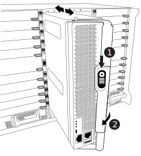

= コントローラモジュールハードウェアFAS9500を交換してください
:allow-uri-read: 
:icons: font
:imagesdir: ../media/

[role="lead"]
コントローラモジュールハードウェアを交換するには、障害ノードを取り外し、 FRU コンポーネントを交換用コントローラモジュールに移動し、交換用コントローラモジュールをシャーシに取り付けてから、システムをメンテナンスモードでブートする必要があります。

次のアニメーションは、障害のあるコンポーネントを交換用コントローラに移動するプロセスを示しています。

.アニメーション-コントローラモジュールを交換し、プロセスを完了します
video::dc8d4acb-e061-45dd-8a0e-ae78004b6974[panopto]

== 手順 1 ：コントローラモジュールを取り外す

コントローラ内部のコンポーネントにアクセスするには、まずコントローラモジュールをシステムから取り外し、続いてコントローラモジュールのカバーを外す必要があります。

.手順
. 接地対策がまだの場合は、自身で適切に実施します。
. 障害のあるコントローラモジュールからケーブルを外し、どのケーブルが何に接続されていたかを記録します。
. カムハンドルのテラコッタボタンを下にスライドさせてロックを解除します。
+
.アニメーション-コントローラモジュールの取り外し
video::5e029a19-8acc-4fa1-be5d-ae78004b365a[panopto]
+

+
[cols="20%,80%"]
|===

 a| 
image::../media/icon_round_1.png[番号1]
 a| 
カムハンドルのリリースボタン

 a| 
image::../media/icon_round_2.png[番号2]
 a| 
カムハンドル

|===
. カムハンドルを回転させて、コントローラモジュールをシャーシから完全に外し、コントローラモジュールをシャーシから引き出します。
+
このとき、空いている手でコントローラモジュールの底面を支えてください。

. コントローラモジュールのふた側を上にして、平らで安定した場所に置きます。カバーの青いボタンを押し、コントローラモジュールの背面にカバーをスライドさせてから、カバーを上に動かしてコントローラモジュールから外します。
+
image::../media/drw_9500_PCM_open.svg[コントローラを開く]

[cols="20%,80%"]
|===

 a| 
image::../media/icon_round_1.png[番号1]
 a| 
コントローラモジュールのカバーの固定ボタン

|===

== 手順 2 ：ブートメディアを移動します

ブートメディアの場所を確認し、手順に従って古いコントローラからブートメディアを取り外して、新しいコントローラに挿入する必要があります。

.手順
. 次の図またはコントローラモジュールの FRU マップを使用して、ブートメディアの場所を確認します。
+
image::../media/drw_9500_remove_boot_dev.svg[ブートデバイスを取り外します。]

+
[cols="20%,80%"]
|===

 a| 
image::../media/icon_round_1.png[番号1]
 a| 
リリースタブを押します

 a| 
image::../media/icon_round_2.png[番号2]
 a| 
ブートメディア

|===
. ブートメディアケースの青いボタンを押してブートメディアをケースからリリースし、ブートメディアソケットからゆっくりと引き出します。
+

NOTE: ソケットやブートメディアが損傷する可能性があるため、ブートメディアをねじったり、真上に引き出したりしないでください。

. 新しいコントローラモジュールにブートメディアを移し、ブートメディアの端をソケットケースに合わせ、ソケットにゆっくりと押し込みます。
. ブートメディアが正しい向きでソケットに完全に装着されたことを確認します。
+
必要に応じて、ブートメディアを取り外してソケットへの装着をやり直します。

. ブートメディアを押し下げて、ブートメディアケースの固定ボタンをはめ込みます。

== 手順 3 ：システム DIMM を移動します

DIMM を移動するには、古いコントローラの DIMM の場所を確認し、 DIMM を交換用コントローラに移動して、特定の手順を実行します。

NOTE: Ver2コントローラに搭載されているDIMMソケットの数が少なくなっています。サポートされるDIMMの数が減少したり、DIMMソケットの番号が変更されたりすることはありません。DIMMを新しいコントローラモジュールに移動するときは、障害のあるコントローラモジュールと同じソケット番号/場所にDIMMを取り付けます。  DIMMソケットの位置については、Ver2コントローラモジュールのFRUマップ図を参照してください。

.手順
. 接地対策がまだの場合は、自身で適切に実施します。
. コントローラモジュールで DIMM の場所を確認します。
. DIMM を交換用コントローラモジュールに正しい向きで挿入できるように、ソケット内の DIMM の向きをメモします。
. DIMM の両側にある 2 つのツメをゆっくり押し開いて DIMM をスロットから外し、そのままスライドさせてスロットから取り出します。
+

IMPORTANT: DIMM 回路基板のコンポーネントに力が加わらないように、 DIMM の両端を慎重に持ちます。

+
image::../media/drw_9500_replace_PCM_dimms.svg[DIMMの移動]

+
[cols="20%,80%"]
|===

 a| 
image::../media/icon_round_1.png[番号1]
 a| 
DIMM のツメ

 a| 
image::../media/icon_round_2.png[番号2]
 a| 
DIMM

|===
. DIMM を取り付けるスロットの位置を確認します。
. コネクタにある DIMM のツメが開いた状態になっていることを確認し、 DIMM をスロットに対して垂直に挿入します。
+
DIMM のスロットへの挿入にはある程度の力が必要です。簡単に挿入できない場合は、 DIMM をスロットに正しく合わせてから再度挿入してください。

+

IMPORTANT: DIMM がスロットにまっすぐ差し込まれていることを目で確認してください。

. DIMM をスロットに対して垂直に挿入します。
+
DIMM のスロットへの挿入にはある程度の力が必要です。簡単に挿入できない場合は、 DIMM をスロットに正しく合わせてから再度挿入してください。

+

IMPORTANT: DIMM がスロットにまっすぐ差し込まれていることを目で確認してください。

. DIMM の両端のノッチにツメがかかるまで、 DIMM の上部を慎重にしっかり押し込みます。
. 残りの DIMM についても、上記の手順を繰り返します。

== 手順 4 ：コントローラを取り付ける

コンポーネントを交換用コントローラモジュールに取り付けたら、交換用コントローラモジュールをシステムシャーシに取り付け、オペレーティングシステムをブートする必要があります。

2 台のコントローラモジュールを同じシャーシに搭載する HA ペアでは、シャーシへの設置が完了すると同時にリブートが試行されるため、コントローラモジュールの取り付け順序が特に重要です。

NOTE: システムのブート時にシステムファームウェアが更新されることがあります。このプロセスは中止しないでください。手順ではブートプロセスを中断する必要があります。通常はプロンプトが表示されたあとにいつでも中断できます。ただし、システムがブート時にシステムファームウェアの更新を開始した場合は、更新が完了してからブートプロセスを中断する必要があります。

.手順
. 接地対策がまだの場合は、自身で適切に実施します。
. コントローラモジュールのカバーをまだ取り付けていない場合は取り付けます。
. コントローラモジュールの端をシャーシの開口部に合わせ、コントローラモジュールをシステムに半分までそっと押し込みます。
+
.アニメーション-コントローラモジュールを設置
video::f2aa14b4-0d95-4109-b410-ae78004b35c9[panopto]
+

+
[cols="20%,80%"]
|===

 a| 
image::../media/icon_round_1.png[番号1]
 a| 
カムハンドルのリリースボタン

 a| 
image::../media/icon_round_2.png[番号2]
 a| 
カムハンドル

|===
+

NOTE: 指示があるまでコントローラモジュールをシャーシに完全に挿入しないでください。

. システムにアクセスして以降のセクションのタスクを実行できるように、管理ポートとコンソールポートのみをケーブル接続します。
+

NOTE: 残りのケーブルは、この手順の後半でコントローラモジュールに接続します。

. コントローラモジュールの再取り付けを完了します。
+
.. ケーブルマネジメントデバイスをまだ取り付けていない場合は、取り付け直します。
.. コントローラモジュールをシャーシに挿入し、ミッドプレーンまでしっかりと押し込んで完全に装着します。
+

IMPORTANT: コネクタの破損を防ぐため、コントローラモジュールをスライドしてシャーシに挿入する際に力を入れすぎないでください。

+
コントローラモジュールは、シャーシに完全に装着されるとすぐにブートを開始します。ブートプロセスを中断できるように準備しておきます。

.. コントローラモジュールのカムハンドルをロック位置まで回転させます。
.. 起動メニューに Ctrl+C キーを押して ' 起動プロセスを中断します
.. LOADER でブートするオプションを選択します。

