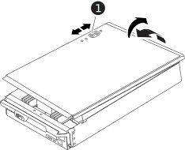

= DIMM-FAS9500を交換します
:allow-uri-read: 
:icons: font
:imagesdir: ../media/

[role="lead"]
システムで登録される修正可能なエラー修正コード（ ECC ）の数が増え続けている場合は、コントローラモジュールの DIMM を交換する必要があります。そのままにしているとシステムがパニック状態になります。

.作業を開始する前に
システムのその他のコンポーネントがすべて正常に動作している必要があります。問題がある場合は、必ずテクニカルサポートにお問い合わせください。

障害が発生したコンポーネントは、プロバイダから受け取った交換用 FRU コンポーネントと交換する必要があります。

== 手順 1 ：障害ノードをシャットダウンします

障害のあるコントローラをシャットダウンするには、コントローラのステータスを確認し、必要に応じて正常なコントローラが障害のあるコントローラストレージからデータを引き続き提供できるようにコントローラをテイクオーバーする必要があります。

.このタスクについて
* SANシステムを使用している場合は、障害コントローラのSCSIブレードのイベントメッセージを確認しておく必要があり  `cluster kernel-service show`ます）。コマンド（priv advancedモードから）を実行すると、 `cluster kernel-service show` ノード名、そのノードのクォーラムステータス、そのノードの可用性ステータス、およびそのノードの動作ステータスが表示されます。
+
各 SCSI ブレードプロセスは、クラスタ内の他のノードとクォーラムを構成している必要があります。交換を進める前に、すべての問題を解決しておく必要があります。

* ノードが 3 つ以上あるクラスタは、クォーラムを構成している必要があります。クラスタがクォーラムを構成していない場合、または正常なコントローラで適格性と正常性についてfalseと表示される場合は、障害のあるコントローラをシャットダウンする前に問題 を修正する必要があります。を参照してください link:https://docs.netapp.com/us-en/ontap/system-admin/synchronize-node-cluster-task.html?q=Quorum["ノードをクラスタと同期します"^]。

.手順
. AutoSupportが有効になっている場合は、AutoSupportメッセージを呼び出してケースの自動作成を停止します。 `system node autosupport invoke -node * -type all -message MAINT=<# of hours>h`
+
次のAutoSupport メッセージは、ケースの自動作成を2時間停止します。 `cluster1:> system node autosupport invoke -node * -type all -message MAINT=2h`

. 正常なコントローラのコンソールから自動ギブバックを無効にします。 storage failover modify – node local-auto-giveback false
+

NOTE: 自動ギブバックを無効にしますか?_と表示されたら'y'を入力します

. 障害のあるコントローラに LOADER プロンプトを表示します。
+
[cols="1,2"]
|===
| 障害のあるコントローラの表示 | 作業 

 a| 
LOADER プロンプト
 a| 
次の手順に進みます。

 a| 
ギブバックを待っています
 a| 
Ctrl キーを押しながら C キーを押し ' プロンプトが表示されたら y と入力します

 a| 
システムプロンプトまたはパスワードプロンプト
 a| 
正常なコントローラから障害のあるコントローラをテイクオーバーまたは停止します。「 storage failover takeover -ofnode impaired_node_name _

障害のあるコントローラに「 Waiting for giveback... 」と表示されたら、 Ctrl+C キーを押し、「 y 」と入力します。

|===

== 手順 2 ：コントローラモジュールを取り外す

コントローラ内部のコンポーネントにアクセスするには、まずコントローラモジュールをシステムから取り外し、続いてコントローラモジュールのカバーを外す必要があります。

. 接地対策がまだの場合は、自身で適切に実施します。
. 障害のあるコントローラモジュールからケーブルを外し、どのケーブルが何に接続されていたかを記録します。
. カムハンドルのテラコッタボタンを下にスライドさせてロックを解除します。
+
.アニメーション-コントローラを取り外します
video::5e029a19-8acc-4fa1-be5d-ae78004b365a[panopto]
+
image::../media/drw_9500_remove_PCM.svg[DRW 9500がPCMを削除しました]

+
[cols="20%,80%"]
|===

 a| 
image::../media/legend_icon_01.svg[凡例アイコン 01]
 a| 
カムハンドルのリリースボタン

 a| 
image::../media/legend_icon_02.svg[凡例アイコン 02]
 a| 
カムハンドル

|===
. カムハンドルを回転させて、コントローラモジュールをシャーシから完全に外し、コントローラモジュールをシャーシから引き出します。
+
このとき、空いている手でコントローラモジュールの底面を支えてください。

. コントローラモジュールのふた側を上にして、平らで安定した場所に置きます。カバーの青いボタンを押し、コントローラモジュールの背面にカバーをスライドさせてから、カバーを上に動かしてコントローラモジュールから外します。
+

+
[cols="20%,80%"]
|===

 a| 
image::../media/legend_icon_01.svg[凡例アイコン 01]
 a| 
コントローラモジュールのカバーの固定ボタン

|===

== 手順 3 ： DIMM を交換します

DIMM を交換するには、コントローラ内で DIMM の場所を確認し、特定の手順を実行します。

NOTE: Ver2コントローラに搭載されているDIMMソケットの数が少なくなっています。サポートされるDIMMの数が減少したり、DIMMソケットの番号が変更されたりすることはありません。DIMMを新しいコントローラモジュールに移動するときは、障害のあるコントローラモジュールと同じソケット番号/場所にDIMMを取り付けます。  DIMMソケットの位置については、Ver2コントローラモジュールのFRUマップ図を参照してください。

. 接地対策がまだの場合は、自身で適切に実施します。
. コントローラモジュールで DIMM の場所を確認します。
+
image::../media/drw_9500_DIMM_map.svg[DRW 9500 DIMMマップ]

. DIMM の両側にある 2 つのツメをゆっくり押し開いて DIMM をスロットから外し、そのままスライドさせてスロットから取り出します。
+

IMPORTANT: DIMM 回路基板のコンポーネントに力が加わらないように、 DIMM の両端を慎重に持ちます。

+
.アニメーション- DIMMを交換します
video::d62a4c7c-8296-4d60-9981-ae78004b36f7[panopto]
+

+
[cols="20%,80%"]
|===

 a| 
image::../media/legend_icon_01.svg[凡例アイコン 01]
 a| 
DIMM のツメ

 a| 
image::../media/legend_icon_02.svg[凡例アイコン 02]
 a| 
DIMM

|===
. 交換用 DIMM を静電気防止用の梱包バッグから取り出し、 DIMM の端を持ってスロットに合わせます。
+
DIMM のピンの間にある切り欠きを、ソケットの突起と揃える必要があります。

. コネクタにある DIMM のツメが開いた状態になっていることを確認し、 DIMM をスロットに対して垂直に挿入します。
+
DIMM のスロットへの挿入にはある程度の力が必要です。簡単に挿入できない場合は、 DIMM をスロットに正しく合わせてから再度挿入してください。

+

IMPORTANT: DIMM がスロットにまっすぐ差し込まれていることを目で確認してください。

. DIMM の両端のノッチにツメがかかるまで、 DIMM の上部を慎重にしっかり押し込みます。
. コントローラモジュールのカバーを閉じます。

== 手順 4 ：コントローラを取り付ける

コンポーネントをコントローラモジュールに取り付けたら、コントローラモジュールをシステムシャーシに取り付け直してオペレーティングシステムをブートする必要があります。

2 台のコントローラモジュールを同じシャーシに搭載する HA ペアでは、シャーシへの設置が完了すると同時にリブートが試行されるため、コントローラモジュールの取り付け順序が特に重要です。

. 接地対策がまだの場合は、自身で適切に実施します。
. コントローラモジュールのカバーをまだ取り付けていない場合は取り付けます。
+

+
[cols="20%,80%"]
|===

 a| 
image::../media/legend_icon_01.svg[凡例アイコン 01]
 a| 
コントローラモジュールのカバーの固定ボタン

|===
. コントローラモジュールの端をシャーシの開口部に合わせ、コントローラモジュールをシステムに半分までそっと押し込みます。
+
.アニメーション-コントローラを取り付けます
video::f2aa14b4-0d95-4109-b410-ae78004b35c9[panopto]
+
image::../media/drw_9500_remove_PCM.svg[DRW 9500がPCMを削除しました]

+
[cols="20%,80%"]
|===

 a| 
image::../media/legend_icon_01.svg[凡例アイコン 01]
 a| 
カムハンドルのリリースボタン

 a| 
image::../media/legend_icon_02.svg[凡例アイコン 02]
 a| 
カムハンドル

|===
+

NOTE: 指示があるまでコントローラモジュールをシャーシに完全に挿入しないでください。

. システムにアクセスして以降のセクションのタスクを実行できるように、管理ポートとコンソールポートのみをケーブル接続します。
+

NOTE: 残りのケーブルは、この手順の後半でコントローラモジュールに接続します。

. コントローラモジュールの再取り付けを完了します。
+
.. ケーブルマネジメントデバイスをまだ取り付けていない場合は、取り付け直します。
.. コントローラモジュールをシャーシに挿入し、ミッドプレーンまでしっかりと押し込んで完全に装着します。
+
コントローラモジュールが完全に装着されると、ロックラッチが上がります。

+

IMPORTANT: コネクタの破損を防ぐため、コントローラモジュールをスライドしてシャーシに挿入する際に力を入れすぎないでください。

+
コントローラモジュールは、シャーシに完全に装着されるとすぐにブートを開始します。

.. ロックラッチを上に回転させてロックピンが外れるように傾け、ロックされるまで下げます。

== 手順 5 ：障害が発生したパーツをネットアップに返却する

障害のある部品は、キットに付属する RMA 指示書に従ってネットアップに返却してください。を参照してください https://mysupport.netapp.com/site/info/rma["パーツの返品と交換"] 詳細については、を参照してください。
