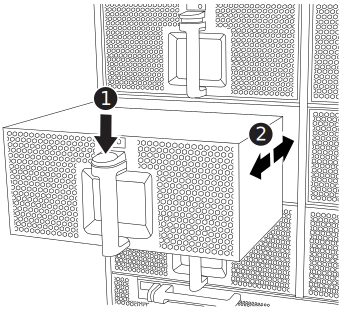

= ファンとFAS9500を交換します
:allow-uri-read: 
:icons: font
:imagesdir: ../media/

[role="lead"]
サービスを中断せずにファンモジュールを交換するには、特定の順序でタスクを実行する必要があります。

IMPORTANT: シャーシから電源装置を取り外してから 2 分以内に電源装置を交換することを推奨します。システムは引き続き動作しますが、電源装置が交換されるまでは、デグレード状態の電源装置に関するメッセージが ONTAP からコンソールに送信されます。

.手順
. 接地対策がまだの場合は、自身で適切に実施します。
. （必要な場合）両手でベゼルの両側の開口部を持ち、手前に引いてシャーシフレームのボールスタッドからベゼルを外します。
. 交換が必要なファンモジュールを特定するために、コンソールのエラーメッセージを確認し、ファンモジュールの警告 LED を確認します。
. ファンモジュールのテラコッタボタンを押し、空いている手でファンモジュールを支えながら、ファンモジュールをシャーシからまっすぐ引き出します。
+

IMPORTANT: ファンモジュールは奥行きがないので、シャーシから突然落下してけがをすることがないように、必ず空いている手でファンモジュールの底面を支えてください。

+
.アニメーション-ファンの取り外し/取り付け
video::86b0ed39-1083-4b3a-9e9c-ae78004c2ffc[panopto]
+

+
[cols="20%,80%"]
|===

 a| 
image::../media/icon_round_1.png[番号1]
 a| 
Terra cotta リリースボタン

 a| 
image::../media/icon_round_2.png[番号2]
 a| 
ファンをスライドさせてシャーシから取り外します

|===
. ファンモジュールを脇へ置きます。
. 交換用ファンモジュールの端をシャーシの開口部に合わせ、完全に固定されるまでシャーシに挿入します。
+
稼働中のシステムの場合、ファンモジュールがシャーシに正常に挿入されると、黄色の警告 LED が 4 回点滅します。

. ベゼルをボールスタッドに合わせ、ボールスタッドにそっと押し込みます。
. 障害が発生したパーツは、キットに付属のRMA指示書に従ってNetAppに返却してください。 https://mysupport.netapp.com/site/info/rma["パーツの返品と交換"^]詳細については、ページを参照してください。

