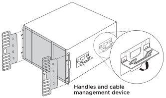

= 詳細な手順- FAS9500
:allow-uri-read: 
:icons: font
:imagesdir: ../media/

[role="lead"]
この記事では、一般的なネットアップシステムのインストール手順について詳しく説明します。インストール手順の詳細については、この資料を参照してください。

== 手順 1 ：設置の準備

システムを設置するには、ネットアップサポートサイトでアカウントを作成し、システムを登録し、ライセンスキーを取得する必要があります。また、システムに応じた適切な数とタイプのケーブルを準備し、特定のネットワーク情報を収集する必要があります。

にアクセスできる必要があります https://hwu.netapp.com["NetApp Hardware Universe の略"^] サイト要件および構成済みシステム上の追加情報の詳細については、を参照してください。

へのアクセスも必要になる場合があります http://mysupport.netapp.com/documentation/productlibrary/index.html?productID=62286["ONTAP 9 リリースノート"^] ONTAP のバージョンに応じて、このシステムの詳細情報を確認してください。

お客様のサイトで次のものを準備する必要があります。

* ストレージシステム用のラックスペース
* No.2 プラスドライバ
* Web ブラウザを使用してシステムをネットワークスイッチおよびラップトップまたはコンソールに接続するための追加のネットワークケーブル

.手順
. すべての箱を開封して内容物を取り出します。
. コントローラのシステムシリアル番号をメモします。
+
image::../media/drw_ssn_label.svg[DRW SSN ラベル]

. 同梱されていたケーブルの数と種類を確認し、書き留めておきます。
+
次の表に、同梱されているケーブルの種類を示します。この表にないケーブルが含まれていた場合は、 Hardware Universe を参照してケーブルを特定し、用途を確認してください。

+
https://hwu.netapp.com["NetApp Hardware Universe の略"^]

+
[cols="1,2,1,2"]
|===
| ケーブルのタイプ | パーツ番号と長さ | コネクタのタイプ | 用途 

 a| 
25GbE データケーブル
 a| 
X66240A-05 （ 112-00639 ）、 0.5m

X66240A-2 （ 112-00598 ）、 2m

X66240A-5 （ 112-00600 ）、 5m
| image:../media/oie_cable_sfp_gbe_copper.svg["幅= 85px"]  a| 
ネットワークケーブル

 a| 
32Gb FC （ SFP+ 光）
 a| 
X66250-2 （ 112-00342 ）、 2m

X66250-5 （ 112-00344 ）、 5m

X66250-15 （ 112-00346 ）、 15m
 a| 
image::../media/oie_cable_sfp_gbe_copper.svg[OIE ケーブル SFP GbE 銅線]
 a| 
FC 光ネットワークケーブル

 a| 
40GbE ネットワークケーブル
 a| 
X66100-1 （ 112-00542 ）、 1m

X66100-3 (112-00543) 、 3m

X66100-5 （ 112-00544 ）、 5m
 a| 
image::../media/oie_cable100_gbe_qsfp28.svg[OIEケーブル100 GbE qsfp28]
 a| 
イーサネットデータ、クラスタネットワーク

 a| 
100GbE ケーブル
 a| 
X66211B-1 （ 112-00573 ）、 1m

X66211B-2 （ 112-00574 ）、 2m

X66211B-5 （ 112-00576 ）、 5m
 a| 
image::../media/oie_cable100_gbe_qsfp28.svg[OIEケーブル100 GbE qsfp28]
 a| 
ネットワーク、

イーサネットデータ

クラスタネットワーク

 a| 
光ケーブル
 a| 
X66031A （ 112-00436 ）、 1m

X66032A （ 112-00437 ）、 2m

X66033A (112-00438) 、 3m
 a| 
image::../media/oie_cable_fiber_lc_connector.svg[OIE ケーブルファイバ LC コネクタ]
 a| 
FC 光ネットワーク

 a| 
Cat 6 、 RJ-45 （注文内容による）
 a| 
パーツ番号 X6585-R6 （ 112-00291 ）、 3m

X6562-R6 （ 112-00196 ）、 5m
 a| 
image::../media/oie_cable_rj45.svg[OIE ケーブル RJ45]
 a| 
管理ネットワークとイーサネットデータ

 a| 
ストレージ
 a| 
X66031A （ 112-00436 ）、 1m

X66032A （ 112-00437 ）、 2m

X66033A (112-00438) 、 3m
 a| 
image::../media/oie_cable_mini_sas_hd_to_mini_sas_hd.svg[OIEケーブルミニSAS HDからミニSAS HD]
 a| 
ストレージ

 a| 
Micro-USB コンソールケーブル
 a| 
該当なし
 a| 
image::../media/oie_cable_micro_usb.svg[OIEケーブルマイクロUSB]
 a| 
Windows または Mac 以外のラップトップ / コンソールでソフトウェアをセットアップする際のコンソール接続

 a| 
電源ケーブル
 a| 
該当なし
 a| 
image::../media/oie_cable_power.svg[OIEケーブル電源]
 a| 
システムの電源をオンにします

|===
. を確認します https://library.netapp.com/ecm/ecm_download_file/ECMLP2862613["『 ONTAP 構成ガイド』"^] およびそのガイドに記載されている必要な情報を収集します。

== 手順 2 ：ハードウェアを設置する

システムは、 4 ポストラックまたはネットアップシステムキャビネットのいずれかに設置する必要があります。

. 必要に応じてレールキットを取り付けます。
. レールキットに付属の手順書に従って、システムを設置して固定します。
+

NOTE: システムの重量に関連する安全上の注意事項を確認しておく必要があります。

+
左側のラベルは空のシャーシを、右側のラベルはフル装備のシステムを示しています。

+
image::../media/drw_9500_lifting_icon.svg[DRW 9500リフティングアイコン]

. ケーブルマネジメントデバイスを取り付けます（図を参照）。
+

. システムの前面にベゼルを配置します。

== 手順 3 ：コントローラをネットワークに接続する

2 ノードスイッチレスクラスタメソッドまたはクラスタインターコネクトネットワークを使用して、コントローラをネットワークにケーブル接続できます。

[role="tabbed-block"]
====
.オプション 1 ： 2 ノードスイッチレスクラスタ
--
コントローラの管理ネットワークポート、データネットワークポート、および管理ポートは、スイッチに接続されます。クラスタインターコネクトポートは、両方のコントローラでケーブル接続されます。

システムとスイッチの接続に関する情報を、ネットワーク管理者に確認しておく必要があります。

ケーブルをポートに差し込む際は、ケーブルのプルタブの向きを確認してください。ケーブルのプルタブは、すべてのネットワーキングモジュールポートで上向きになっています。

image::../media/oie_cable_pull_tab_up.svg[OIE ケーブルのプルタブを上にします]

NOTE: コネクタを挿入すると、カチッという音がしてコネクタが所定の位置に収まるはずです。カチッと音がしない場合は、コネクタを取り外し、裏返してもう一度試してください。

. アニメーションや図を使用して、コントローラとスイッチをケーブルで接続します。
+

endif::[]

endif::[]

endif::[]

endif::[]

endif::[]

endif::[]

endif::[]

endif::[]

--
====