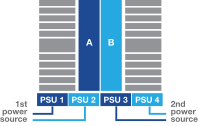

= 詳細な手順- FAS9500
:allow-uri-read: 
:icons: font
:imagesdir: ../media/

[role="lead"]
この記事では、一般的なネットアップシステムのインストール手順について詳しく説明します。インストール手順の詳細については、この資料を参照してください。

== 手順 1 ：設置の準備

システムを設置するには、ネットアップサポートサイトでアカウントを作成し、システムを登録し、ライセンスキーを取得する必要があります。また、システムに応じた適切な数とタイプのケーブルを準備し、特定のネットワーク情報を収集する必要があります。

にアクセスできる必要があります https://hwu.netapp.com["NetApp Hardware Universe の略"^] サイト要件および構成済みシステム上の追加情報の詳細については、を参照してください。

.必要なもの
へのアクセスも必要になる場合があります http://mysupport.netapp.com/documentation/productlibrary/index.html?productID=62286["ONTAP 9 リリースノート"^] ONTAP のバージョンに応じて、このシステムの詳細情報を確認してください。

お客様のサイトで次のものを準備する必要があります。

* ストレージシステム用のラックスペース
* No.2 プラスドライバ
* Web ブラウザを使用してシステムをネットワークスイッチおよびラップトップまたはコンソールに接続するための追加のネットワークケーブル

.手順
. すべての箱を開封して内容物を取り出します。
. コントローラのシステムシリアル番号をメモします。
+
image::../media/drw_ssn_label.svg[システムシリアル番号の例]

. 同梱されていたケーブルの数と種類を確認し、書き留めておきます。
+
次の表に、同梱されているケーブルの種類を示します。この表にないケーブルが含まれていた場合は、 Hardware Universe を参照してケーブルを特定し、用途を確認してください。

+
https://hwu.netapp.com["NetApp Hardware Universe の略"^]

+
[cols="1,2,1,2"]
|===
| ケーブルのタイプ | パーツ番号と長さ | コネクタのタイプ | 用途 

 a| 
25GbE データケーブル
 a| 
X66240A-05 （ 112-00639 ）、 0.5m

X66240A-2 （ 112-00598 ）、 2m

X66240A-5 （ 112-00600 ）、 5m
 a| 
image：../media/oie_cable_SFP_Gbe_copper.svg
 a| 
ネットワークケーブル

 a| 
32Gb FC （ SFP+ 光）
 a| 
X66250-2 （ 112-00342 ）、 2m

X66250-5 （ 112-00344 ）、 5m

X66250-15 （ 112-00346 ）、 15m
 a| 
image：../media/oie_cable_SFP_Gbe_copper.svg
 a| 
FC 光ネットワークケーブル

 a| 
40GbE ネットワークケーブル
 a| 
X66100-1 （ 112-00542 ）、 1m

X66100-3 (112-00543) 、 3m

X66100-5 （ 112-00544 ）、 5m
 a| 
image：../media/oie_cable100_Gbe_qsfp28.svg
 a| 
イーサネットデータ、クラスタネットワーク

 a| 
100GbE ケーブル
 a| 
X66211B-1 （ 112-00573 ）、 1m

X66211B-2 （ 112-00574 ）、 2m

X66211B-5 （ 112-00576 ）、 5m
 a| 
image：../media/oie_cable100_Gbe_qsfp28.svg
 a| 
ネットワーク、

イーサネットデータ

クラスタネットワーク

 a| 
光ケーブル
 a| 
X66031A （ 112-00436 ）、 1m

X66032A （ 112-00437 ）、 2m

X66033A (112-00438) 、 3m
 a| 
image::../media/oie_cable_fiber_lc_connector.svg[OIE ケーブルファイバ LC コネクタ]
 a| 
FC 光ネットワーク

 a| 
Cat 6 、 RJ-45 （注文内容による）
 a| 
パーツ番号 X6585-R6 （ 112-00291 ）、 3m

X6562-R6 （ 112-00196 ）、 5m
 a| 
image：../media/oie_cable_RJ45.svg
 a| 
管理ネットワークとイーサネットデータ

 a| 
ストレージ
 a| 
X66031A （ 112-00436 ）、 1m

X66032A （ 112-00437 ）、 2m

X66033A (112-00438) 、 3m
 a| 
image::../media/oie_cable_mini_sas_hd_to_mini_sas_hd.svg[OIEケーブルミニSAS HDからミニSAS HD]
 a| 
ストレージ

 a| 
Micro-USB コンソールケーブル
 a| 
該当なし
 a| 
image::../media/oie_cable_micro_usb.svg[OIEケーブルマイクロUSB]
 a| 
Windows または Mac 以外のラップトップ / コンソールでソフトウェアをセットアップする際のコンソール接続

 a| 
電源ケーブル
 a| 
該当なし
 a| 
image::../media/oie_cable_power.svg[OIEケーブル電源]
 a| 
システムの電源をオンにします

|===
. を確認します https://library.netapp.com/ecm/ecm_download_file/ECMLP2862613["『 ONTAP 構成ガイド』"^] およびそのガイドに記載されている必要な情報を収集します。

== 手順 2 ：ハードウェアを設置する

システムは、 4 ポストラックまたはネットアップシステムキャビネットのいずれかに設置する必要があります。

. 必要に応じてレールキットを取り付けます。
. レールキットに付属の手順書に従って、システムを設置して固定します。
+

NOTE: システムの重量に関連する安全上の注意事項を確認しておく必要があります。

+
左側のラベルは空のシャーシを、右側のラベルはフル装備のシステムを示しています。

+
image::../media/drw_9500_lifting_icon.svg[重量挙げ警告ラベル]

. ケーブルマネジメントデバイスを取り付けます（図を参照）。
+
image::../media/drw_9500_cable_management_arms.svg[リフティングハンドルとケーブルマネジメントデバイス]

. システムの前面にベゼルを配置します。

== 手順 3 ：コントローラをネットワークに接続する

2 ノードスイッチレスクラスタメソッドまたはクラスタインターコネクトネットワークを使用して、コントローラをネットワークにケーブル接続できます。

[role="tabbed-block"]
====
.オプション 1 ： 2 ノードスイッチレスクラスタ
--
コントローラの管理ネットワークポート、データネットワークポート、および管理ポートは、スイッチに接続されます。クラスタインターコネクトポートは、両方のコントローラでケーブル接続されます。

.作業を開始する前に
システムとスイッチの接続に関する情報を、ネットワーク管理者に確認しておく必要があります。

ケーブルをポートに差し込む際は、ケーブルのプルタブの向きを確認してください。ケーブルのプルタブは、すべてのネットワーキングモジュールポートで上向きになっています。

image::../media/oie_cable_pull_tab_up.svg[ケーブルプルタブの方向]

NOTE: コネクタを挿入すると、カチッという音がしてコネクタが所定の位置に収まるはずです。カチッと音がしない場合は、コネクタを取り外し、裏返してもう一度試してください。

. アニメーションや図を使用して、コントローラとスイッチをケーブルで接続します。
+
.アニメーション- 2ノードスイッチレスクラスタのケーブル配線
video::da08295f-ba8c-4de7-88c3-ae7c0170408d[panopto]
+
image::../media/drw_9500_tnsc_network_cabling.svg[DRW 9500 TNSCネットワークケーブル接続]

+
[cols="20%,80%"]
|===
| ステップ | 各コントローラでを実行します 

 a| 
image：../media/oie_legend_icon_1_lg.svg
 a| 
クラスタインターコネクトポートをケーブル接続します。

** スロット A4 および B4 （ e4A ）
** スロット A8 および B8 （ e8a ）

image：../media/oie_cable100_Gbe_qsfp28.svg

 a| 
image：../media/oie_legend_icon_2_lp.svg
 a| 
コントローラ管理（レンチマーク）ポートをケーブル接続します。

image：../media/oie_cable_RJ45.svg

 a| 
image：：../media/oie_legend_icon_3_o.svg
 a| 
32Gb FCネットワークスイッチをケーブル接続

スロットA3およびB3（e3aおよびe3c）およびスロットA9およびB9（e9aおよびe9c）のポートは、32Gb FCネットワークスイッチに接続されます。

image：../media/oie_cable_SFP_Gbe_copper.svg

40GbE ホストネットワークスイッチ：

ホスト側の b ポートをスロット A4 と B4 （ e4b ）に接続し、スロット A8 と B8 （ e8b ）をホストスイッチに接続します。

image：../media/oie_cable100_Gbe_qsfp28.svg

 a| 
image：：../media/oie_legend_icon_4_dr.svg
 a| 
25GbEケーブル接続：

スロットA5とB5（5a、5b、5c、5d）およびスロットA7とB7（7a、7b、7c、7d）のポートを25GbEネットワークスイッチにケーブル接続します。

image：../media/oie_cable_SFP_Gbe_copper.svg

 a| 
** ケーブルをケーブルマネジメントアームにストラップで固定します（図はなし）。
** 電源ケーブルをPSUに接続し、別の電源に接続します（図では省略）。PSU 1と3はA側のすべてのコンポーネントに電力を供給し、PSU 2とPSU 4はB側のすべてのコンポーネントに電力を供給します。

 a| 
image::../media/oie_cable_power.svg[OIEケーブル電源]

|===

--
.オプション 2 ：スイッチクラスタ
--
コントローラの管理ネットワークポート、データネットワークポート、および管理ポートは、スイッチに接続されます。クラスタインターコネクト / HA ポートは、クラスタ / HA スイッチにケーブル接続されます。

.作業を開始する前に
システムとスイッチの接続に関する情報を、ネットワーク管理者に確認しておく必要があります。

ケーブルをポートに差し込む際は、ケーブルのプルタブの向きを確認してください。ケーブルのプルタブは、すべてのネットワーキングモジュールポートで上向きになっています。

image::../media/oie_cable_pull_tab_up.svg[ケーブルプルタブの方向]

NOTE: コネクタを挿入すると、カチッという音がしてコネクタが所定の位置に収まるはずです。カチッと音がしない場合は、コネクタを取り外し、裏返してもう一度試してください。

. アニメーションや図を使用して、コントローラとスイッチをケーブルで接続します。
+
.アニメーションスイッチを使用したクラスタのケーブル接続
video::3ad3f118-8339-4683-865f-ae7c0170400c[panopto]
+
image::../media/drw_9500_switched_network_cabling.svg[DRW 9500スイッチドネットワークのケーブル配線]

+
[cols="20%,80%"]
|===
| ステップ | 各コントローラでを実行します 

 a| 
image：../media/oie_legend_icon_1_lg.svg
 a| 
クラスタインターコネクト A ポートをケーブル接続します。

** スロット A4 と B4 （ e4A ）をクラスタネットワークスイッチに接続します。
** スロット A8 と B8 （ e8a ）をクラスタネットワークスイッチに接続します。

image：../media/oie_cable100_Gbe_qsfp28.svg

 a| 
image：../media/oie_legend_icon_2_lp.svg
 a| 
コントローラ管理（レンチマーク）ポートをケーブル接続します。

image：../media/oie_cable_RJ45.svg

 a| 
image：：../media/oie_legend_icon_3_o.svg
 a| 
32Gb FCネットワークスイッチをケーブル接続

スロットA3およびB3（e3aおよびe3c）およびスロットA9およびB9（e9aおよびe9c）のポートは、32Gb FCネットワークスイッチに接続されます。

image：../media/oie_cable_SFP_Gbe_copper.svg

40GbE ホストネットワークスイッチ：

ホスト側の b ポートをスロット A4 と B4 （ e4b ）に接続し、スロット A8 と B8 （ e8b ）をホストスイッチに接続します。

image：../media/oie_cable100_Gbe_qsfp28.svg

 a| 
image：：../media/oie_legend_icon_4_dr.svg
 a| 
25GbEケーブル接続：

スロットA5とB5（5a、5b、5c、5d）およびスロットA7とB7（7a、7b、7c、7d）のポートを25GbEネットワークスイッチにケーブル接続します。

image：../media/oie_cable_SFP_Gbe_copper.svg

 a| 
** ケーブルをケーブルマネジメントアームにストラップで固定します（図はなし）。
** 電源ケーブルをPSUに接続し、別の電源に接続します（図では省略）。PSU 1と3はA側のすべてのコンポーネントに電力を供給し、PSU 2とPSU 4はB側のすべてのコンポーネントに電力を供給します。

 a| 
image::../media/oie_cable_power.svg[OIEケーブル電源]

|===

--
====

== 手順 4 ：コントローラをドライブシェルフにケーブル接続する

DS212CまたはDS224Cドライブシェルフをコントローラにケーブル接続します。

NOTE: SASケーブル接続の詳細とワークシートについては、を参照してください。link:../sas3/overview-cabling-rules-examples.html["SAS ケーブル接続ルール、ワークシート、および例 - IOM12 モジュールを搭載したシェルフ"]

.作業を開始する前に
* ご使用のシステムのSASケーブル接続ワークシートに記入します。を参照して link:../sas3/overview-cabling-rules-examples.html["SAS ケーブル接続ルール、ワークシート、および例 - IOM12 モジュールを搭載したシェルフ"]
* 図の矢印を見て、ケーブルコネクタのプルタブの正しい向きを確認してください。ストレージモジュールのケーブルのプルタブは上向き、シェルフのプルタブは下向きです。

image::../media/oie_cable_pull_tab_up.svg[ケーブルプルタブの方向]

image::../media/oie_cable_pull_tab_down.svg[OIE ケーブルのプルタブを下に引きます]

NOTE: コネクタを挿入すると、カチッという音がしてコネクタが所定の位置に収まるはずです。カチッと音がしない場合は、コネクタを取り外し、裏返してもう一度試してください。

. 次のアニメーションや図を使用して、コントローラを3台のDS224Cドライブシェルフ（1台のドライブシェルフのスタックと2台のドライブシェルフのスタック1台）にケーブル接続します。
+
.アニメーション-ドライブシェルフをケーブル接続します
video::c958aae6-9d08-4d3d-a213-ae7c017040cd[panopto]
+

+
[cols="20%,80%"]
|===
| ステップ | 各コントローラでを実行します 

 a| 
image::../media/oie_legend_icon_1_mb.svg[OIEの凡例アイコン1 MB]
 a| 
図を参照しながら、ドライブシェルフスタック1をコントローラに接続します。

image::../media/oie_cable_mini_sas_hd_to_mini_sas_hd.svg[OIEケーブルミニSAS HDからミニSAS HD]

Mini-SASケーブル

 a| 

 a| 
図を参照しながら、ドライブシェルフスタック2をコントローラに接続します。

image::../media/oie_cable_mini_sas_hd_to_mini_sas_hd.svg[OIEケーブルミニSAS HDからミニSAS HD]

Mini-SASケーブル

|===

== 手順 5 ：システムのセットアップと設定を完了する

システムのセットアップと設定を実行するには、スイッチとラップトップのみを接続してクラスタ検出を使用するか、システムのコントローラに直接接続してから管理スイッチに接続します。

[role="tabbed-block"]
====
.オプション 1 ：ネットワーク検出が有効になっている場合
--
ラップトップでネットワーク検出が有効になっている場合は、クラスタの自動検出を使用してシステムのセットアップと設定を実行できます。

. 次のアニメーションまたは図を使用して、 1 つ以上のドライブシェルフ ID を設定します。
+
.アニメーション-シェルフIDを設定します
video::95a29da1-faa3-4ceb-8a0b-ac7600675aa6[panopto]
+
image::../media/drw_power-on_set_shelf_ID_set.svg[DRW 電源オンセットシェルフ ID セット]

+
[cols="20%,80%"]
|===

 a| 
image::../media/legend_icon_01.png[吹き出しアイコン1]
 a| 
エンドキャップを取り外す。

 a| 
image::../media/legend_icon_02.svg[凡例アイコン 02]
 a| 
1 桁目の数字が点滅するまでシェルフ ID ボタンを押し続けたら、 0~9 に進みます。

NOTE: 1桁目の数字は点滅し続けます

 a| 
image::../media/legend_icon_03.svg[凡例アイコン 03]
 a| 
2 桁目の数字が点滅するまでシェルフ ID ボタンを押し続けたら、 0~9 に進みます。

NOTE: 1桁目の数字の点滅が停止し、2桁目の数字が点滅し続けます。

 a| 
image::../media/legend_icon_04.svg[凡例アイコン04]
 a| 
エンドキャップを取り付けます。

 a| 
image::../media/legend_icon_05.svg[凡例アイコン05]
 a| 
オレンジの LED が点灯するまで 10 秒間待ちます (!) 。 表示されるようにするには、ドライブシェルフの電源を再投入してシェルフ ID を設定します。

|===
. 両方のノードの電源装置の電源スイッチをオンにします。
+
.アニメーション-コントローラの電源をオンにします
video::a905e56e-c995-4704-9673-adfa0005a891[panopto]
+
image::../media/drw_9500_power-on.svg[DRW 9500電源オン]

+

NOTE: 初回のブートには最大 8 分かかる場合があります。

. ラップトップでネットワーク検出が有効になっていることを確認します。
+
詳細については、ラップトップのオンラインヘルプを参照してください。

. 次のアニメーションに従って、ラップトップを管理スイッチに接続します。
+
.アニメーション-ラップトップを管理スイッチに接続します
video::d61f983e-f911-4b76-8b3a-ab1b0066909b[panopto]
+
image::../media/dwr_laptop_to_switch_only.svg[DWR ラップトップをスイッチのみに接続します]

. 検出する ONTAP アイコンを選択します。
+
image::../media/drw_autodiscovery_controler_select.svg[DRW 自動検出コントローラ選択]

+
.. エクスプローラを開きます。
.. 左側のペインで、 [Network] ( ネットワーク ) をクリックします。
.. 右クリックして、更新を選択します。
.. いずれかの ONTAP アイコンをダブルクリックし、画面に表示された証明書を受け入れます。
+

NOTE: 「 XXXXX 」は、ターゲットノードのシステムシリアル番号です。

+
System Manager が開きます。

. System Manager のセットアップガイドを使用して、で収集したデータを基にシステムを設定します https://library.netapp.com/ecm/ecm_download_file/ECMLP2862613["『 ONTAP 構成ガイド』"^]。
. アカウントを設定して Active IQ Config Advisor をダウンロードします。
+
.. 既存のアカウントにログインするか、アカウントを作成します。
+
https://mysupport.netapp.com/eservice/public/now.do["ネットアップサポート登録"^]

.. システムを登録します。
+
https://mysupport.netapp.com/eservice/registerSNoAction.do?moduleName=RegisterMyProduct["ネットアップ製品登録"^]

.. Active IQ Config Advisor をダウンロードします。
+
https://mysupport.netapp.com/site/tools/tool-eula/activeiq-configadvisor["ネットアップのダウンロード： Config Advisor"^]

. Config Advisor を実行してシステムの健全性を確認します。
. 初期設定が完了したら、に進みます https://www.netapp.com/data-management/oncommand-system-documentation/["ONTAP  ONTAP システムマネージャのマニュアルリソース"^] ONTAP での追加機能の設定については、ページを参照してください。

--
.オプション 2 ：ネットワーク検出が有効になっていない場合
--
Windows または Mac ベースのラップトップやコンソールを使用していない場合、または自動検出が有効になっていない場合は、このタスクで設定とセットアップを実行する必要があります。

. ラップトップまたはコンソールをケーブル接続して設定します。
+
.. ラップトップまたはコンソールのコンソールポートを、 115 、 200 ボー、 N-8-1 に設定します。
+

NOTE: コンソールポートの設定方法については、ラップトップまたはコンソールのオンラインヘルプを参照してください。

.. システム付属のコンソールケーブルを使用してラップトップまたはコンソールにコンソールケーブルを接続し、ラップトップを管理サブネット上のスイッチに接続します。
+
image::../media/drw_9500_cable_console_switch_controller.svg[DRW 9500ケーブルコンソールスイッチコントローラ]

.. 管理サブネット上の TCP / IP アドレスをラップトップまたはコンソールに割り当てます。

. 次のアニメーションに従って、 1 つ以上のドライブシェルフ ID を設定します。
+
.アニメーション-シェルフIDを設定します
video::95a29da1-faa3-4ceb-8a0b-ac7600675aa6[panopto]
+
image::../media/drw_power-on_set_shelf_ID_set.svg[DRW 電源オンセットシェルフ ID セット]

+
[cols="20%,80%"]
|===

 a| 
image::../media/legend_icon_01.png[吹き出しアイコン1]
 a| 
エンドキャップを取り外す。

 a| 
image::../media/legend_icon_02.svg[凡例アイコン 02]
 a| 
1 桁目の数字が点滅するまでシェルフ ID ボタンを押し続けたら、 0~9 に進みます。

NOTE: 1桁目の数字は点滅し続けます

 a| 
image::../media/legend_icon_03.svg[凡例アイコン 03]
 a| 
2 桁目の数字が点滅するまでシェルフ ID ボタンを押し続けたら、 0~9 に進みます。

NOTE: 1桁目の数字の点滅が停止し、2桁目の数字が点滅し続けます。

 a| 
image::../media/legend_icon_04.svg[凡例アイコン04]
 a| 
エンドキャップを取り付けます。

 a| 
image::../media/legend_icon_05.svg[凡例アイコン05]
 a| 
オレンジの LED が点灯するまで 10 秒間待ちます (!) 。 表示されるようにするには、ドライブシェルフの電源を再投入してシェルフ ID を設定します。

|===
. 両方のノードの電源装置の電源スイッチをオンにします。
+
.アニメーション-コントローラの電源をオンにします
video::a905e56e-c995-4704-9673-adfa0005a891[panopto]
+
image::../media/drw_9500_power-on.svg[DRW 9500電源オン]

NOTE: 初回のブートには最大 8 分かかる場合があります。

. いずれかのノードに初期ノード管理 IP アドレスを割り当てます。
+
[cols="1,2"]
|===
| 管理ネットワークでの DHCP の状況 | 作業 

 a| 
を設定します
 a| 
新しいコントローラに割り当てられた IP アドレスを記録します。

 a| 
未設定
 a| 
.. PuTTY 、ターミナルサーバ、または環境に対応した同等の機能を使用して、コンソールセッションを開きます。
+

NOTE: PuTTY の設定方法がわからない場合は、ラップトップまたはコンソールのオンラインヘルプを確認してください。

.. スクリプトからプロンプトが表示されたら、管理 IP アドレスを入力します。

|===
. ラップトップまたはコンソールで、 System Manager を使用してクラスタを設定します。
+
.. ブラウザでノード管理 IP アドレスを指定します。
+

NOTE: アドレスの形式は、 +https://x.x.x.x+ です。

.. で収集したデータを使用してシステムを設定します https://library.netapp.com/ecm/ecm_download_file/ECMLP2862613["『 ONTAP 構成ガイド』"^] 。

. アカウントを設定して Active IQ Config Advisor をダウンロードします。
+
.. 既存のアカウントにログインするか、アカウントを作成します。
+
https://mysupport.netapp.com/eservice/public/now.do["ネットアップサポート登録"^]

.. システムを登録します。
+
https://mysupport.netapp.com/eservice/registerSNoAction.do?moduleName=RegisterMyProduct["ネットアップ製品登録"^]

.. Active IQ Config Advisor をダウンロードします。
+
https://mysupport.netapp.com/site/tools/tool-eula/activeiq-configadvisor["ネットアップのダウンロード： Config Advisor"^]

. Config Advisor を実行してシステムの健全性を確認します。
. 初期設定が完了したら、に進みます https://www.netapp.com/data-management/oncommand-system-documentation/["ONTAP  ONTAP システムマネージャのマニュアルリソース"^] ONTAP での追加機能の設定については、ページを参照してください。

--
====