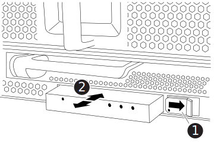

= LED USBモジュールFAS9500を交換してください
:allow-uri-read: 
:icons: font
:imagesdir: ../media/

[role="lead"]
LED USB モジュールは、コンソールポートおよびシステムステータスへの接続を提供します。このモジュールの交換にはツールは必要なく、サービスを中断することもありません。

== 手順 1 ： LED USB モジュールを交換します

.手順
. 古い LED USB モジュールを取り外します。
+
.アニメーション- LED - USBモジュールの取り外し/取り付け
video::bc46a3e8-6541-444e-973b-ae78004bf153[panopto]
+

+
[cols="20%,80%"]
|===

 a| 
image::../media/icon_round_1.png[番号1]
 a| 
ロックボタン

 a| 
image::../media/icon_round_2.png[番号2]
 a| 
USB LED モジュール

|===
+
.. ベゼルを取り外した状態で、シャーシ前面の左下にある LED USB モジュールの位置を確認します。
.. ラッチをスライドさせて、モジュールの一部をイジェクトします。
.. モジュールをベイから引き出し、ミッドプレーンから取り外します。スロットを空のままにしないでください。

. 新しい LED USB モジュールを取り付けます。
+
.. モジュールをベイに合わせ、シャーシのスライダラッチの近くにあるモジュールの隅にある切り込みに合わせます。ベイを使用すると、モジュールを上下逆に取り付けることができません。
.. モジュールをベイに押し込んで、完全にシャーシと同一面になるようにします。
+
モジュールが固定され、ミッドプレーンに接続されると、カチッという音がします。

== 手順 2 ：障害が発生したコンポーネントを返却する

. 障害が発生したパーツは、キットに付属のRMA指示書に従ってNetAppに返却してください。 https://mysupport.netapp.com/site/info/rma["パーツの返品と交換"^]詳細については、ページを参照してください。

