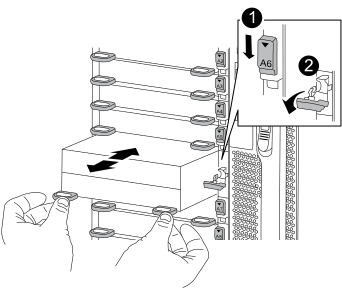
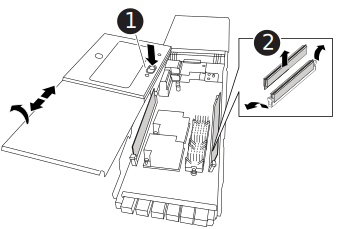

= NVRAMモジュール/ NVRAM DIMM-FAS9500を交換してください
:allow-uri-read: 
:icons: font
:imagesdir: ../media/

[role="lead"]
NVRAM モジュールは NVRAM11 と DIMM で構成されます。障害が発生した NVRAM モジュールまたは NVRAM モジュール内の DIMM を交換できます。障害が発生した NVRAM モジュールを交換するには、モジュールをシャーシから取り外し、 DIMM を交換用モジュールに移して、交換用 NVRAM モジュールをシャーシに取り付ける必要があります。

とNVRAM DIMMを交換するには、NVRAMモジュールをシャーシから取り外し、モジュール内の障害が発生したDIMMを交換してから、NVRAMモジュールを再度取り付ける必要があります。

.このタスクについて
システム ID は NVRAM モジュールから取得されるため、モジュールを交換する場合は、システムに属するディスクを新しいシステム ID に再割り当てします。

.作業を開始する前に
* すべてのディスクシェルフが適切に動作している必要があります。
* HA ペアのシステムの場合は、交換する NVRAM モジュールに関連付けられているコントローラをパートナーコントローラがテイクオーバーできる必要があります。
* この手順では次の用語を使用します。
+
** 障害のあるコントローラとは、メンテナンスを実行しているコントローラです。
** 正常なコントローラとは、障害のあるコントローラの HA パートナーです。

* この手順 には、新しいNVRAMモジュールに関連付けられているコントローラモジュールにディスクを自動的に再割り当てする手順が含まれています。手順でに指示された場合は、ディスクを再割り当てする必要があります。ギブバックで CAN 原因の問題が発生する前にディスクの再割り当てを完了する。
* 障害が発生したコンポーネントは、プロバイダから受け取った交換用 FRU コンポーネントと交換する必要があります。
* この手順の一部としてディスクやディスクシェルフを変更することはできません。

== 手順 1 ：障害のあるコントローラをシャットダウンします

障害のあるコントローラをシャットダウンするには、コントローラのステータスを確認し、必要に応じて正常なコントローラが障害のあるコントローラストレージからデータを引き続き提供できるようにコントローラをテイクオーバーする必要があります。

.このタスクについて
ノードが 3 つ以上あるクラスタは、クォーラムを構成している必要があります。クラスタがクォーラムを構成していない場合、または正常なコントローラで適格性と正常性についてfalseと表示される場合は、障害のあるコントローラをシャットダウンする前に問題 を修正する必要があります。を参照してください link:https://docs.netapp.com/us-en/ontap/system-admin/synchronize-node-cluster-task.html?q=Quorum["ノードをクラスタと同期します"^]。

.手順
. AutoSupport が有効になっている場合は、 AutoSupport メッセージを呼び出してケースの自動作成を抑制します。「 system node AutoSupport invoke -node * -type all -message MAINT=number_OF_hours_downh
+
次の AutoSupport メッセージは、ケースの自動作成を 2 時間停止します。 cluster1 ： * > system node AutoSupport invoke -node * -type all -message MAINT=2h`

. 正常なコントローラのコンソールから自動ギブバックを無効にします。 storage failover modify – node local-auto-giveback false
. 障害のあるコントローラに LOADER プロンプトを表示します。
+
[cols="1,2"]
|===
| 障害のあるコントローラの表示 | 作業 

 a| 
LOADER プロンプト
 a| 
次の手順に進みます。

 a| 
ギブバックを待機しています
 a| 
Ctrl キーを押しながら C キーを押し ' プロンプトが表示されたら y と入力します

 a| 
システムプロンプトまたはパスワードプロンプト（システムパスワードの入力）
 a| 
正常なコントローラから障害のあるコントローラをテイクオーバーまたは停止します。「 storage failover takeover -ofnode impaired_node_name _

障害のあるコントローラに「 Waiting for giveback... 」と表示されたら、 Ctrl+C キーを押し、「 y 」と入力します。

|===

== 手順 2 ： NVRAM モジュールを交換します

NVRAMモジュールを交換するには、シャーシのスロット6にあるNVRAMモジュールの場所を確認し、特定の手順を実行します。

. 接地対策がまだの場合は、自身で適切に実施します。
. ターゲットの NVRAM モジュールをシャーシから取り外します。
+
.. 文字と数字が記載されたカムラッチを押し下げます。
+
カムラッチがシャーシから離れます。

.. カムラッチを下に回転させて水平にします。
+
NVRAM モジュールがシャーシから外れ、数インチ外に出ます。

.. NVRAM モジュール前面の両側にあるプルタブを引いてモジュールをシャーシから取り外します。
+
.アニメーション- NVRAMモジュールを交換します
video::228cbd14-4cb2-49b5-88f1-ae78004b9d84[panopto]
+

+
[cols="20%,90%"]
|===

 a| 
image::../media/legend_icon_01.svg[凡例アイコン 01]
 a| 
文字と数字が記載された I/O カムラッチ

 a| 
image::../media/legend_icon_02.svg[凡例アイコン 02]
 a| 
ロックが完全に解除された I/O ラッチ

|===

. NVRAM モジュールを安定した場所に置き、カバーの青色のロックボタンを押し下げてカバーを NVRAM モジュールから取り外します。青いボタンを押しながら、カバーをスライドさせて NVRAM モジュールから外します。
+

+
[cols="20%,80%"]
|===

 a| 
image::../media/legend_icon_01.svg[凡例アイコン 01]
 a| 
カバーのロックボタン

 a| 
image::../media/legend_icon_02.svg[凡例アイコン 02]
 a| 
DIMM と DIMM のツメ

|===
. 古い NVRAM モジュールから DIMM を 1 つずつ取り外し、交換用 NVRAM モジュールに取り付けます。
. モジュールのカバーを閉じます。
. 交換用 NVRAM モジュールをシャーシに取り付けます。
+
.. モジュールをスロット 6 のシャーシ開口部の端に合わせます。
.. モジュールをスロットにそっと挿入し、文字と数字が記載された I/O カムラッチを上に押してモジュールを所定の位置にロックします。

== 手順 3 ： NVRAM DIMM を交換します

NVRAM モジュールの NVRAM DIMM を交換するには、 NVRAM モジュールを取り外し、モジュールを開き、ターゲット DIMM を交換する必要があります。

. 接地対策がまだの場合は、自身で適切に実施します。
. ターゲットの NVRAM モジュールをシャーシから取り外します。
+
.. 文字と数字が記載されたカムラッチを押し下げます。
+
カムラッチがシャーシから離れます。

.. カムラッチを下に回転させて水平にします。
+
NVRAM モジュールがシャーシから外れ、数インチ外に出ます。

.. NVRAM モジュール前面の両側にあるプルタブを引いてモジュールをシャーシから取り外します。
+
.アニメーション- NVRAMモジュールを交換します
video::228cbd14-4cb2-49b5-88f1-ae78004b9d84[panopto]
+

+
[cols="20%,80%"]
|===

 a| 
image::../media/legend_icon_01.svg[凡例アイコン 01]
 a| 
文字と数字が記載された I/O カムラッチ

 a| 
image::../media/legend_icon_02.svg[凡例アイコン 02]
 a| 
ロックが完全に解除された I/O ラッチ

|===

. NVRAM モジュールを安定した場所に置き、カバーの青色のロックボタンを押し下げてカバーを NVRAM モジュールから取り外します。青いボタンを押しながら、カバーをスライドさせて NVRAM モジュールから外します。
+

+
[cols="20%,80%"]
|===

 a| 
image::../media/legend_icon_01.svg[凡例アイコン 01]
 a| 
カバーのロックボタン

 a| 
image::../media/legend_icon_02.svg[凡例アイコン 02]
 a| 
DIMM と DIMM のツメ

|===
. NVRAM モジュール内で交換する DIMM の場所を確認し、 DIMM の固定ツメを押し下げ、ソケットから持ち上げて取り外します。
. DIMM をソケットに合わせ、固定ツメが所定の位置に収まるまで DIMM をそっとソケットに押し込み、交換用 DIMM を取り付けます。
. モジュールのカバーを閉じます。
. NVRAM モジュールをシャーシに取り付けます。
+
.. モジュールをスロット 6 のシャーシ開口部の端に合わせます。
.. モジュールをスロットにそっと挿入し、文字と数字が記載された I/O カムラッチを上に押してモジュールを所定の位置にロックします。

== 手順 4 ： FRU の交換後にコントローラをリブートします

FRU を交換したら、コントローラモジュールをリブートする必要があります。

. LOADER プロンプトから ONTAP を起動するには、「 bye 」と入力します。

== 手順5：ディスクの再割り当て

交換用コントローラのブート時にシステム ID の変更を確認し、変更が実装されたことを確認する必要があります。

CAUTION: ディスクの再割り当てはNVRAMモジュールを交換する場合にのみ必要で、NVRAM DIMMの交換には該当しません。

.手順
. 交換用コントローラがメンテナンスモードの場合（にと表示されます `*>` プロンプト）でメンテナンスモードを終了し、LOADERプロンプトを表示します。 `halt`
. システムIDが一致しないためにシステムIDを上書きするかどうかを尋ねられた場合は、交換用コントローラのLOADERプロンプトからコントローラをブートし、「y」と入力します。
. 待機しているギブバックを実行しています...交換用モジュールを取り付けたコントローラのコンソールにメッセージが表示されたら、正常なコントローラから、新しいパートナーシステムIDが自動的に割り当てられたことを確認します。 `storage failover show`
+
コマンド出力には、障害のあるコントローラでシステム ID が変更されたことを示すメッセージが表示され、正しい古い ID と新しい ID が示されます。次の例では、 node2 の交換が実施され、新しいシステム ID として 151759706 が設定されています。

+
[listing]
----
node1:> storage failover show
                                    Takeover
Node              Partner           Possible     State Description
------------      ------------      --------     -------------------------------------
node1             node2             false        System ID changed on partner (Old:
                                                  151759755, New: 151759706), In takeover
node2             node1             -            Waiting for giveback (HA mailboxes)
----
. コントローラをギブバックします。
+
.. 正常なコントローラから、交換したコントローラのストレージをギブバックします。 storage failover giveback -ofnode replacement_node_name
+
交換用コントローラはストレージをテイクバックしてブートを完了します。

+
システム ID が一致しないためにシステム ID を上書きするかどうかを確認するメッセージが表示された場合は 'y' と入力する必要があります

+

NOTE: ギブバックが拒否されている場合は、拒否を無効にすることを検討してください。

+
詳細については、を参照してください https://docs.netapp.com/us-en/ontap/high-availability/ha_manual_giveback.html#if-giveback-is-interrupted["手動ギブバックコマンド"^] 拒否を無視するトピック。

.. ギブバックが完了したら、 HA ペアが正常で、テイクオーバーが可能であることを確認します。「 storage failover show
+
「 storage failover show 」コマンドの出力に、パートナーメッセージで変更されたシステム ID は含まれません。

. ディスクが正しく割り当てられたことを確認します。「 storage disk show -ownership
+
交換用コントローラに属するディスクには、新しいシステム ID が表示されます。次の例では、node1で所有されているディスクに新しいシステムID 151759706が表示されます。

+
[listing]
----
node1:> storage disk show -ownership

Disk  Aggregate Home  Owner  DR Home  Home ID    Owner ID  DR Home ID Reserver  Pool
----- ------    ----- ------ -------- -------    -------    -------  ---------  ---
1.0.0  aggr0_1  node1 node1  -        151759706  151759706  -       151759706 Pool0
1.0.1  aggr0_1  node1 node1           151759706  151759706  -       151759706 Pool0
.
.
.
----
. システムが MetroCluster 構成になっている場合は ' コントローラのステータスを監視します MetroCluster node show
+
MetroCluster 構成では、交換後に通常の状態に戻るまで数分かかります。この時点で各コントローラの状態が設定済みになります。 DR ミラーリングは有効で、通常モードになります。MetroCluster node show -fields node-systemid' コマンドの出力には、 MetroCluster 設定が通常の状態に戻るまで古いシステム ID が表示されます。

. コントローラが MetroCluster 構成になっている場合は、 MetroCluster の状態に応じて、元の所有者がディザスタサイトのコントローラである場合に DR ホーム ID フィールドにディスクの元の所有者が表示されることを確認します。
+
これは、次の両方に該当する場合に必要です。

+
** MetroCluster 構成がスイッチオーバー状態である。
** 交換用コントローラがディザスタサイトのディスクの現在の所有者である。
+
を参照してください https://docs.netapp.com/us-en/ontap-metrocluster/manage/concept_understanding_mcc_data_protection_and_disaster_recovery.html#disk-ownership-changes-during-ha-takeover-and-metrocluster-switchover-in-a-four-node-metrocluster-configuration["4 ノード MetroCluster 構成での HA テイクオーバーおよび MetroCluster スイッチオーバー中のディスク所有権の変更"] を参照してください。

. システムが MetroCluster 構成になっている場合は、各コントローラが構成されていることを確認します。「 MetroCluster node show -fields configurion-state 」
+
[listing]
----
node1_siteA::> metrocluster node show -fields configuration-state

dr-group-id            cluster node           configuration-state
-----------            ---------------------- -------------- -------------------
1 node1_siteA          node1mcc-001           configured
1 node1_siteA          node1mcc-002           configured
1 node1_siteB          node1mcc-003           configured
1 node1_siteB          node1mcc-004           configured

4 entries were displayed.
----
. 各コントローラに、想定されるボリュームが存在することを確認します。 vol show -node node-name
. ストレージ暗号化が有効になっている場合は、機能をリストアする必要があります。
. リブート時の自動テイクオーバーを無効にした場合は、正常なコントローラで storage failover modify -node replacement-node-name -onreboot true を有効にします

== 手順 6 ：障害が発生したパーツをネットアップに返却する

障害のある部品は、キットに付属する RMA 指示書に従ってネットアップに返却してください。を参照してください https://mysupport.netapp.com/site/info/rma["パーツの返品と交換"] 詳細については、を参照してください。
