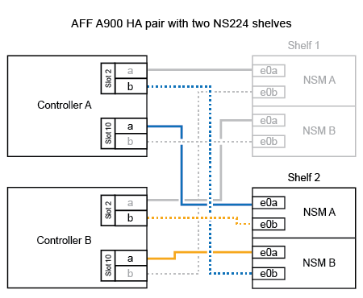

= シェルフをAFFシステムにケーブル接続- NS224シェルフ
:allow-uri-read: 
:icons: font
:imagesdir: ../media/

[role="lead"]
ホットアドする各NS224シェルフをケーブル接続して、HAペアの各コントローラに各シェルフが2つ接続されるようにします。

.シェルフをAFF A1Kにケーブル接続
[%collapsible]
====
AFF A1K HAペアには、最大3台のNS224シェルフ（合計4台のシェルフ）をホットアドできます。

.作業を開始する前に
* を確認しておく必要があります link:requirements-hot-add-shelf.html["ホットアドの要件とベストプラクティス"]。
* の該当する手順を完了しておく必要があります link:prepare-hot-add-shelf.html["シェルフのホットアドの準備"]。
* の説明に従って、シェルフを設置し、電源をオンにし、シェルフIDを設定しておく必要があります link:prepare-hot-add-shelf.html["ホットアド用のシェルフの設置"]。

.このタスクについて
* この手順は、HAペアに既存のNS224シェルフが少なくとも1台あることを前提としています。
* この手順では、次のホットアドシナリオについて説明します。
+
** 各コントローラにRoCE対応I/Oモジュールが2つ搭載されたHAペアに2台目のシェルフをホットアドします。（2つ目のI/Oモジュールを取り付けて最初のシェルフを両方のI/Oモジュールに再接続しているか、最初のシェルフを2つのI/Oモジュールにケーブル接続済みである。2台目のシェルフを両方のI/Oモジュールにケーブル接続します）。
** 各コントローラに3つのRoCE対応I/OモジュールがあるHAペアに3台目のシェルフをホットアドします。（3台目のI/Oモジュールを取り付けており、3台目のシェルフを3台目のI/Oモジュールにのみケーブル接続します）。
** 各コントローラにRoCE対応I/Oモジュールが4つ搭載されたHAペアに3台目のシェルフをホットアドします。（3番目と4番目のI/Oモジュールを取り付けておき、3番目のシェルフを3番目と4番目のI/Oモジュールにケーブル接続します）。
** 各コントローラにRoCE対応I/Oモジュールが4つ搭載されたHAペアに4台目のシェルフをホットアドします。（4台目のI/Oモジュールを取り付け、3台目のシェルフを3台目と4台目のI/Oモジュールに再接続済みであるか、3台目のシェルフを3台目と4台目のI/Oモジュールにケーブル接続済みである。4番目のシェルフを3番目と4番目のI/Oモジュールの両方にケーブル接続します）。

.手順
. ホットアドする NS224 シェルフが HA ペアの 2 台目の NS224 シェルフになる場合は、次の手順を実行します。
+
それ以外の場合は、次の手順に進みます。

+
.. シェルフ NSM A のポート e0a をコントローラ A のスロット 10 のポート A （ e10a ）にケーブル接続します。
.. シェルフ NSM A のポート e0b をコントローラ B のスロット 11 のポート b （ e11b ）にケーブル接続します。
.. シェルフ NSM B ポート e0a をコントローラ B のスロット 10 のポート A （ e10A ）にケーブル接続します。
.. シェルフ NSM B のポート e0b をコントローラ A のスロット 11 のポート b （ e11b ）にケーブル接続します。
+
次の図は、各コントローラにRoCE対応I/Oモジュールが2つ搭載されたHAペアの2台目のシェルフのケーブル接続を示しています。

+
image::../media/drw_ns224_vino_m_2shelves_2cards_ieops-1642.svg[2台のシェルフと2台のIOモジュールを搭載したAFF A1Kのケーブル接続]

. ホットアドするNS224シェルフをHAペアの3番目のNS224シェルフとし、各コントローラにRoCE対応I/Oモジュールを3つ搭載する場合は、次の手順を実行します。それ以外の場合は、次の手順に進みます。
+
.. シェルフNSM Aのポートe0aをコントローラAのスロット9のポートA（e9a）にケーブル接続します。
.. シェルフNSM Aのポートe0bをコントローラBのスロット9のポートb（e9b）にケーブル接続します。
.. シェルフのNSM Bのポートe0aをコントローラBのスロット9のポートA（e9a）にケーブル接続します。
.. シェルフのNSM Bのポートe0bをコントローラAのスロット9のポートb（e9b）にケーブル接続します。
+
次の図は、各コントローラに3つのRoCE対応I/Oモジュールを搭載したHAペアの3台目のシェルフのケーブル接続を示しています。

+
image::../media/drw_ns224_vino_m_3shelves_3cards_ieops-1643.svg[3台のシェルフと3台のIOモジュールを搭載したAFF A1Kのケーブル接続]

. ホットアドするNS224シェルフをHAペアの3番目のNS224シェルフとし、各コントローラにRoCE対応I/Oモジュールを4つ搭載する場合は、次の手順を実行します。それ以外の場合は、次の手順に進みます。
+
.. シェルフNSM Aのポートe0aをコントローラAのスロット9のポートA（e9a）にケーブル接続します。
.. シェルフNSM Aのポートe0bをコントローラBのスロット8のポートb（e8b）にケーブル接続します。
.. シェルフのNSM Bのポートe0aをコントローラBのスロット9のポートA（e9a）にケーブル接続します。
.. シェルフのNSM Bのポートe0bをコントローラAのスロット8のポートb（e8b）にケーブル接続します。
+
次の図は、各コントローラに4つのRoCE対応I/Oモジュールを搭載したHAペアの3番目のシェルフのケーブル接続を示しています。

+
image::../media/drw_ns224_vino_m_3shelves_4cards_ieops-1644.svg[3台のシェルフと4台のIOモジュールを搭載したAFF A1Kのケーブル接続]

. ホットアドするNS224シェルフをHAペアの4台目のNS224シェルフとし、各コントローラにRoCE対応I/Oモジュールを4台搭載する場合は、次の手順を実行します。
+
.. シェルフNSM Aのポートe0aをコントローラAのスロット8のポートA（e8a）にケーブル接続します。
.. シェルフNSM Aのポートe0bをコントローラBのスロット9のポートb（e9b）にケーブル接続します。
.. シェルフのNSM Bのポートe0aをコントローラBのスロット8のポートA（e8a）にケーブル接続します。
.. シェルフのNSM Bのポートe0bをコントローラAのスロット9のポートb（e9b）にケーブル接続します。
+
次の図は、HAペアの4台目のシェルフと4台のRoCE対応I/Oモジュールのケーブル接続を示しています。

+
image::../media/drw_ns224_vino_m_4shelves_4cards_ieops-1645.svg[4台のシェルフと4台のIOモジュールを搭載したAFF A1Kのケーブル接続]

. ホットアドしたシェルフがを使用して正しくケーブル接続されていることを確認します https://mysupport.netapp.com/site/tools/tool-eula/activeiq-configadvisor["Active IQ Config Advisor"^]。
+
ケーブル接続エラーが発生した場合は、表示される対処方法に従ってください。

.次の手順
この手順の準備作業として自動ドライブ割り当てを無効にした場合は、ドライブ所有権を手動で割り当ててから、必要に応じて自動ドライブ割り当てを再度有効にする必要があります。にアクセスします。

それ以外の場合は、シェルフのホットアド手順は終了です。

====
.シェルフをAFF A70またはAFF A90にケーブル接続
[%collapsible]
====
（内蔵シェルフに）ストレージを追加する必要がある場合は、AFF A70またはAFF A90 HAペアにNS224シェルフを2台までホットアドできます。

.作業を開始する前に
* を確認しておく必要があります link:requirements-hot-add-shelf.html["ホットアドの要件とベストプラクティス"]。
* の該当する手順を完了しておく必要があります link:prepare-hot-add-shelf.html["準備-シェルフのホットアド"]。
* の説明に従って、シェルフを設置し、電源をオンにし、シェルフIDを設定しておく必要があります link:prepare-hot-add-shelf.html["ホットアド用のシェルフの設置"]。

.このタスクについて
* この手順では、HAペアに内蔵ストレージしか搭載されておらず（外付けシェルフは搭載されていない）、各コントローラに最大2台のシェルフと2台のRoCE対応I/Oモジュールをホットアドすることを前提としています。
* この手順では、次のホットアドシナリオについて説明します。
+
** 各コントローラにRoCE対応I/Oモジュールが1つ搭載されたHAペアに最初のシェルフをホットアドします。
** 各コントローラにRoCE対応I/Oモジュールが2つ搭載されたHAペアに最初のシェルフをホットアドします。
** 各コントローラにRoCE対応I/Oモジュールが2つ搭載されたHAペアに2台目のシェルフをホットアドします。

.手順
. 各コントローラモジュールのRoCE対応ポートのセット（RoCE対応I/Oモジュール×1）を1つ使用して1台のシェルフをホットアドする場合で、このシェルフがHAペア内で唯一のNS224シェルフである場合は、次の手順を実行します。
+
それ以外の場合は、次の手順に進みます。

+

NOTE: この手順では、RoCE対応I/Oモジュールがスロット11に取り付けられていることを前提としています。

+
.. シェルフ NSM A のポート e0a をコントローラ A のスロット 11 のポート A （ e11a ）にケーブル接続します。
.. シェルフ NSM A のポート e0b をコントローラ B のスロット 11 のポート b （ e11b ）にケーブル接続します。
.. シェルフ NSM B ポート e0a をコントローラ B のスロット 11 のポート A （ e11a ）にケーブル接続します。
.. シェルフ NSM B のポート e0b をコントローラ A のスロット 11 のポート b （ e11b ）にケーブル接続します。
+
次の図は、各コントローラモジュールで RoCE 対応 I/O モジュールを 1 つ使用した、 1 台のホットアドシェルフのケーブル接続を示しています。

+
image::../media/drw_ns224_vino_i_1shelf_1card_ieops-1639.svg[1台のシェルフと1台のIOモジュールを使用したAFF A70またはA90のケーブル接続]

. 各コントローラモジュールで、 RoCE 対応ポートのセット（ RoCE 対応 I/O モジュールを 2 つ）を使用してシェルフを 1 台または 2 台ホットアドする場合は、該当する手順を実行します。
+

NOTE: この手順では、RoCE対応I/Oモジュールがスロット11と8に取り付けられていることを前提としています。

+
[cols="1,3"]
|===
| シェルフ | ケーブル配線 

 a| 
シェルフ 1
 a| 
.. NSM Aのポートe0aをコントローラAのスロット11のポートA（e11a）にケーブル接続します。
.. NSM Aのポートe0bをコントローラBのスロット8のポートb（e8b）にケーブル接続します。
.. NSM Bのポートe0aをコントローラBのスロット11のポートA（e11a）にケーブル接続します。
.. NSM Bのポートe0bをコントローラAのスロット8のポートb（e8b）にケーブル接続します。
.. 2 台目のシェルフをホットアドする場合は、「シェルフ 2 」の手順を実行します。そうでない場合は、手順 3 に進みます。

次の図は、各コントローラモジュールで2つのRoCE対応I/Oモジュールを使用した、1台のホットアドシェルフのケーブル接続を示しています。

image::../media/drw_ns224_vino_i_1shelf_2cards_ieops-1640.svg[1台のシェルフと2台のIOモジュールを使用したAFF A70またはA90のケーブル接続]

 a| 
シェルフ 2
 a| 
.. NSM Aのポートe0aをコントローラAのスロット8のポートA（e8a）にケーブル接続します。
.. NSM Aのポートe0bをコントローラBのスロット11のポートb（e11b）にケーブル接続します。
.. NSM Bのポートe0aをコントローラBのスロット8のポートA（e8a）にケーブル接続します。
.. NSM Bのポートe0bをコントローラAのスロット11のポートb（e11b）にケーブル接続します。
.. 手順 3 に進みます。

次の図は、各コントローラモジュールで2つのRoCE対応I/Oモジュールを使用した2台のホットアドシェルフのケーブル接続を示しています。

image::../media/drw_ns224_vino_i_2shelves_2cards_ieops-1641.svg[2台のシェルフと2台のIOモジュールを搭載したAFF A70またはA90のケーブル接続]

|===
. ホットアドしたシェルフがを使用して正しくケーブル接続されていることを確認します https://mysupport.netapp.com/site/tools/tool-eula/activeiq-configadvisor["Active IQ Config Advisor"^]。
+
ケーブル接続エラーが発生した場合は、表示される対処方法に従ってください。

.次の手順
この手順の準備作業として自動ドライブ割り当てを無効にした場合は、ドライブ所有権を手動で割り当ててから、必要に応じて自動ドライブ割り当てを再度有効にする必要があります。にアクセスします。

それ以外の場合は、シェルフのホットアド手順は終了です。

====
.シェルフをAFF A250またはAFF C250にケーブル接続
[%collapsible]
====
ストレージを追加する必要がある場合は、最大1台のNS224シェルフをAFF A250またはAFF C250 HAペアにホットアドできます。

.作業を開始する前に
* を確認しておく必要があります link:requirements-hot-add-shelf.html["ホットアドの要件とベストプラクティス"]。
* の該当する手順を完了しておく必要があります link:prepare-hot-add-shelf.html["準備-シェルフのホットアド"]。
* の説明に従って、シェルフを設置し、電源をオンにし、シェルフIDを設定しておく必要があります link:prepare-hot-add-shelf.html["ホットアド用のシェルフの設置"]。

.このタスクについて
プラットフォームシャーシの背面から見た場合、左側の RoCE 対応カードポートはポート「 a 」（ e1a ）で、右側のポートはポート「 b 」（ e1b ）です。

.手順
. シェルフをケーブル接続します。
+
.. シェルフ NSM A ポート e0a をコントローラ A のスロット 1 のポート A （ e1a ）にケーブル接続します。
.. シェルフ NSM A のポート e0b をコントローラ B のスロット 1 のポート b （ e1b ）にケーブル接続します。
.. シェルフ NSM B ポート e0a をコントローラ B のスロット 1 のポート A （ e1a ）にケーブル接続します。
.. シェルフ NSM B のポート e0b をコントローラ A のスロット 1 のポート b （ e1b ）にケーブル接続します。+ 次の図は、シェルフのケーブル接続が完了した状態を示しています。
+
image::../media/drw_ns224_a250_c250_f500f_1shelf_ieops-1824.svg[AFF A250のケーブル接続]

. ホットアドしたシェルフがを使用して正しくケーブル接続されていることを確認します https://mysupport.netapp.com/site/tools/tool-eula/activeiq-configadvisor["Active IQ Config Advisor"^]。
+
ケーブル接続エラーが発生した場合は、表示される対処方法に従ってください。

.次の手順
この手順の準備作業として自動ドライブ割り当てを無効にした場合は、ドライブ所有権を手動で割り当ててから、必要に応じて自動ドライブ割り当てを再度有効にする必要があります。にアクセスします。

それ以外の場合は、シェルフのホットアド手順は終了です。

====
.シェルフをAFF A400またはAFF C400にケーブル接続
[%collapsible]
====
NS224シェルフをホットアド用にケーブル接続する方法は、AFF A400とAFF C400のどちらのHAペアを使用しているかによって異なります。

.作業を開始する前に
* を確認しておく必要があります link:requirements-hot-add-shelf.html["ホットアドの要件とベストプラクティス"]。
* の該当する手順を完了しておく必要があります link:prepare-hot-add-shelf.html["準備-シェルフのホットアド"]。
* の説明に従って、シェルフを設置し、電源をオンにし、シェルフIDを設定しておく必要があります link:prepare-hot-add-shelf.html["ホットアド用のシェルフの設置"]。

*シェルフをAFF A400 HAペアにケーブル接続*

AFF A400 HAペアの場合は、最大2台のシェルフをホットアドし、必要に応じてオンボードポートe0c / e0dとスロット5のポートを使用できます。

.手順
. 各コントローラの1セットのRoCE対応ポート（オンボードRoCE対応ポート）を使用して1台のシェルフをホットアドする場合に、このシェルフがHAペア内の唯一のNS224シェルフである場合は、次の手順を実行します。
+
それ以外の場合は、次の手順に進みます。

+
.. シェルフ NSM A ポート e0a をコントローラ A のポート e0c にケーブル接続します。
.. シェルフ NSM A のポート e0b をコントローラ B のポート e0d にケーブル接続します。
.. シェルフ NSM B ポート e0a をコントローラ B のポート e0c にケーブル接続します。
.. シェルフ NSM B のポート e0b をコントローラ A のポート e0d にケーブル接続します。
+
次の図は、各コントローラの1セットのRoCE対応ポートを使用した、1台のホットアドシェルフのケーブル接続を示しています。

+
image::../media/drw_ns224_a400_1shelf.png[1台のNS224シェルフと1セットのオンボードポートを使用したAFF A400のケーブル接続]

. 各コントローラの2セットのRoCE対応ポート（オンボードおよびPCIeカードのRoCE対応ポート）を使用して1台または2台のシェルフをホットアドする場合は、次の手順を実行します。
+
[cols="1,3"]
|===
| シェルフ | ケーブル配線 

 a| 
シェルフ 1
 a| 
.. NSM A ポート e0a をコントローラ A のポート e0c にケーブル接続します。
.. NSM Aのポートe0bをコントローラBのスロット5のポート2（e5b）にケーブル接続します。
.. NSM B ポート e0a をコントローラ B のポート e0c にケーブル接続します。
.. NSM Bのポートe0bをコントローラAのスロット5のポート2（e5b）にケーブル接続します。
.. 2 台目のシェルフをホットアドする場合は、「シェルフ 2 」の手順を実行します。そうでない場合は、手順 3 に進みます。

 a| 
シェルフ 2
 a| 
.. NSM Aのポートe0aをコントローラAのスロット5のポート1（e5a）にケーブル接続します。
.. NSM A のポート e0b をコントローラ B のポート e0d にケーブル接続します。
.. NSM Bのポートe0aをコントローラBのスロット5のポート1（e5a）にケーブル接続します。
.. NSM B のポート e0b をコントローラ A のポート e0d にケーブル接続します。
.. 手順 3 に進みます。

|===
+
次の図は、 2 台のホットアドシェルフのケーブル接続を示しています。

+
image::../media/drw_ns224_a400_2shelves_IEOPS-983.svg[2台のNS224シェルフと1セットのオンボードポートと1セットのPCIeカード上の1セットのポートを使用したAFF A400のケーブル接続]

. ホットアドしたシェルフがを使用して正しくケーブル接続されていることを確認します https://mysupport.netapp.com/site/tools/tool-eula/activeiq-configadvisor["Active IQ Config Advisor"^]。
+
ケーブル接続エラーが発生した場合は、表示される対処方法に従ってください。

. この手順の準備作業として自動ドライブ割り当てを無効にした場合は、ドライブ所有権を手動で割り当ててから、必要に応じてドライブの自動割り当てを再度有効にする必要があります。を参照して link:complete-hot-add-shelf.html["ホットアドを完了します"]
+
それ以外の場合は、この手順を使用します。

*シェルフをAFF C400 HAペアにケーブル接続*

AFF C400 HAペアの場合は、最大2台のシェルフをホットアドし、必要に応じてスロット4と5のポートを使用できます。

.手順
. 各コントローラの1組のRoCE対応ポートを使用して1台のシェルフをホットアドする場合に、このシェルフがHAペア内の唯一のNS224シェルフである場合は、次の手順を実行します。
+
それ以外の場合は、次の手順に進みます。

+
.. シェルフNSM Aのポートe0aをコントローラAのスロット4のポート1（e4a）にケーブル接続します。
.. シェルフNSM Aのポートe0bをコントローラBのスロット4のポート2（e4b）にケーブル接続します。
.. シェルフのNSM Bのポートe0aをコントローラBのスロット4のポート1（e4a）にケーブル接続します。
.. シェルフのNSM Bのポートe0bをコントローラAのスロット4のポート2（e4b）にケーブル接続します。
+
次の図は、各コントローラの1セットのRoCE対応ポートを使用した、1台のホットアドシェルフのケーブル接続を示しています。

+
image::../media/drw_ns224_c400_1shelf_IEOPS-985.svg[1台のNS224シェルフと1セットのPCIeカードポートを使用したAFF C400のケーブル接続]

. 各コントローラの2セットのRoCE対応ポートを使用して1台または2台のシェルフをホットアドする場合は、次の手順を実行します。
+
[cols="1,3"]
|===
| シェルフ | ケーブル配線 

 a| 
シェルフ 1
 a| 
.. NSM Aのポートe0aをコントローラAのスロット4のポート1（e4a）にケーブル接続します。
.. NSM Aのポートe0bをコントローラBのスロット5のポート2（e5b）にケーブル接続します。
.. NSM Bのポートe0aをコントローラBのポートスロット4のポート1（e4a）にケーブル接続します。
.. NSM Bのポートe0bをコントローラAのスロット5のポート2（e5b）にケーブル接続します。
.. 2 台目のシェルフをホットアドする場合は、「シェルフ 2 」の手順を実行します。そうでない場合は、手順 3 に進みます。

 a| 
シェルフ 2
 a| 
.. NSM Aのポートe0aをコントローラAのスロット5のポート1（e5a）にケーブル接続します。
.. NSM Aのポートe0bをコントローラBのスロット4のポート2（e4b）にケーブル接続します。
.. NSM Bのポートe0aをコントローラBのスロット5のポート1（e5a）にケーブル接続します。
.. NSM Bのポートe0bをコントローラAのスロット4のポート2（e4b）にケーブル接続します。
.. 手順 3 に進みます。

|===
+
次の図は、 2 台のホットアドシェルフのケーブル接続を示しています。

+
image::../media/drw_ns224_c400_2shelves_IEOPS-984.svg[2台のNS224シェルフと2セットのPCIeカードポートを備えたAFF C400のケーブル接続]

. ホットアドしたシェルフがを使用して正しくケーブル接続されていることを確認します https://mysupport.netapp.com/site/tools/tool-eula/activeiq-configadvisor["Active IQ Config Advisor"^]。
+
ケーブル接続エラーが発生した場合は、表示される対処方法に従ってください。

.次の手順
この手順の準備作業として自動ドライブ割り当てを無効にした場合は、ドライブ所有権を手動で割り当ててから、必要に応じて自動ドライブ割り当てを再度有効にする必要があります。にアクセスします。

それ以外の場合は、シェルフのホットアド手順は終了です。

====
.シェルフをAFF A800またはAFF C800にケーブル接続
[%collapsible]
====
AFF A800またはAFF C800のHAペアでNS224シェルフをケーブル接続する方法は、ホットアドするシェルフの数と、コントローラで使用するRoCE対応ポートセットの数（1つまたは2つ）によって異なります。

.作業を開始する前に
* を確認しておく必要があります link:requirements-hot-add-shelf.html["ホットアドの要件とベストプラクティス"]。
* の該当する手順を完了しておく必要があります link:prepare-hot-add-shelf.html["準備-シェルフのホットアド"]。
* の説明に従って、シェルフを設置し、電源をオンにし、シェルフIDを設定しておく必要があります link:prepare-hot-add-shelf.html["ホットアド用のシェルフの設置"]。

.手順
. 各コントローラのRoCE対応ポートのセット（RoCE対応PCIeカード1枚）を1つ使用して1台のシェルフをホットアドする場合で、このシェルフがHAペア内で唯一のNS224シェルフである場合は、次の手順を実行します。
+
それ以外の場合は、次の手順に進みます。

+

NOTE: この手順では、 RoCE 対応の PCIe カードがスロット 5 に取り付けられていることを前提としています。

+
.. シェルフNSM Aのポートe0aをコントローラAのスロット5のポートA（e5a）にケーブル接続します。
.. シェルフNSM Aのポートe0bをコントローラBのスロット5のポートb（e5b）にケーブル接続します。
.. シェルフのNSM Bのポートe0aをコントローラBのスロット5のポートA（e5a）にケーブル接続します。
.. シェルフのNSM Bのポートe0bをコントローラAのスロット5のポートb（e5b）にケーブル接続します。
+
次の図は、各コントローラでRoCE対応PCIeカードを1枚使用した、ホットアドした1台のシェルフのケーブル接続を示しています。

+
image::../media/drw_ns224_a800_c800_1shelf_IEOPS-964.svg[AFF A800またはAFF C800と1台のNS224シェルフおよび1枚のPCIeカードのケーブル接続]

. 各コントローラの2セットのRoCE対応ポート（2枚のRoCE対応PCIeカード）を使用して1台または2台のシェルフをホットアドする場合は、該当する手順を実行します。
+

NOTE: この手順では、 RoCE 対応の PCIe カードをスロット 5 とスロット 3 に取り付けたことを前提としています。

+
[cols="1,3"]
|===
| シェルフ | ケーブル配線 

 a| 
シェルフ 1
 a| 

NOTE: これらの手順では、シェルフポート e0a をスロット 3 ではなくスロット 5 にある RoCE 対応 PCIe カードにケーブル接続することで、ケーブル接続を開始することを前提としています。

.. NSM Aのポートe0aをコントローラAのスロット5のポートA（e5a）にケーブル接続します。
.. NSM Aのポートe0bをコントローラBのスロット3のポートb（e3b）にケーブル接続します。
.. NSM Bのポートe0aをコントローラBのスロット5のポートA（e5a）にケーブル接続します。
.. NSM Bのポートe0bをコントローラAのスロット3のポートb（e3b）にケーブル接続します。
.. 2 台目のシェルフをホットアドする場合は、「シェルフ 2 」の手順を実行します。そうでない場合は、手順 3 に進みます。

 a| 
シェルフ 2
 a| 

NOTE: これらの手順は、シェルフポート e0a をスロット 5 （シェルフ 1 のケーブル接続手順に相当）ではなく、スロット 3 の RoCE 対応 PCIe カードにケーブル接続することで開始されることを前提としています。

.. NSM Aのポートe0aをコントローラAのスロット3のポートA（e3a）にケーブル接続します。
.. NSM Aのポートe0bをコントローラBのスロット5のポートb（e5b）にケーブル接続します。
.. NSM Bのポートe0aをコントローラBのスロット3のポートA（e3a）にケーブル接続します。
.. NSM Bのポートe0bをコントローラAのスロット5のポートb（e5b）にケーブル接続します。
.. 手順 3 に進みます。

|===
+
次の図は、 2 台のホットアドシェルフのケーブル接続を示しています。

+
image::../media/drw_ns224_a800_c800_2shelves_IEOPS-966.svg[DRW ns224 A800 c800 2シェルフIEOPS 966]

. ホットアドしたシェルフがを使用して正しくケーブル接続されていることを確認します https://mysupport.netapp.com/site/tools/tool-eula/activeiq-configadvisor["Active IQ Config Advisor"^]。
+
ケーブル接続エラーが発生した場合は、表示される対処方法に従ってください。

.次の手順
この手順の準備作業として自動ドライブ割り当てを無効にした場合は、ドライブ所有権を手動で割り当ててから、必要に応じて自動ドライブ割り当てを再度有効にする必要があります。にアクセスします。

それ以外の場合は、シェルフのホットアド手順は終了です。

====
.シェルフをAFF A900にケーブル接続
[%collapsible]
====
ストレージの追加が必要な場合は、 AFF A900 HA ペアに最大 3 台の NS224 ドライブシェルフを（合計 4 台のシェルフに）ホットアドできます。

.作業を開始する前に
* を確認しておく必要があります link:requirements-hot-add-shelf.html["ホットアドの要件とベストプラクティス"]。
* の該当する手順を完了しておく必要があります link:prepare-hot-add-shelf.html["準備-シェルフのホットアド"]。
* の説明に従って、シェルフを設置し、電源をオンにし、シェルフIDを設定しておく必要があります link:prepare-hot-add-shelf.html["ホットアド用のシェルフの設置"]。

.このタスクについて
* この手順では、 HA ペアに既存の NS224 シェルフが少なくとも 1 台あること、およびシェルフを最大 3 台までホットアドすることを前提としています。
* HA ペアに既存の NS224 シェルフが 1 台しかない場合、この手順では、シェルフが各コントローラ上の RoCE 対応 100GbE I/O モジュール 2 台にケーブル接続されていると想定しています。

.手順
. ホットアドする NS224 シェルフが HA ペアの 2 台目の NS224 シェルフになる場合は、次の手順を実行します。
+
それ以外の場合は、次の手順に進みます。

+
.. シェルフ NSM A のポート e0a をコントローラ A のスロット 10 のポート A （ e10a ）にケーブル接続します。
.. シェルフ NSM A ポート e0b をコントローラ B のスロット 2 のポート b （ e2b ）にケーブル接続します。
.. シェルフ NSM B ポート e0a をコントローラ B のスロット 10 のポート A （ e10A ）にケーブル接続します。
.. シェルフ NSM B のポート e0b をコントローラ A のスロット 2 のポート b （ e2b ）にケーブル接続します。

+
次の図は、 2 台目のシェルフ（および 1 台目のシェルフ）のケーブル接続を示しています。

+

. ホットアドする NS224 シェルフが HA ペアの 3 台目の NS224 シェルフになる場合は、次の手順を実行します。
+
それ以外の場合は、次の手順に進みます。

+
.. シェルフ NSM A ポート e0a をコントローラ A のスロット 1 のポート A （ e1a ）にケーブル接続します。
.. シェルフ NSM A のポート e0b をコントローラ B のスロット 11 のポート b （ e11b ）にケーブル接続します。
.. シェルフ NSM B ポート e0a をコントローラ B のスロット 1 のポート A （ e1a ）にケーブル接続します。
.. シェルフ NSM B のポート e0b をコントローラ A のスロット 11 のポート b （ e11b ）にケーブル接続します。
+
次の図は、 3 台目のシェルフのケーブル接続を示しています。

+
image::../media/drw_ns224_a900_3shelves.png[3台のNS224シェルフと4台のIOモジュールを搭載したAFF A900のケーブル接続]

. ホットアドする NS224 シェルフが HA ペアの 4 台目の NS224 シェルフになる場合は、次の手順を実行します。
+
それ以外の場合は、次の手順に進みます。

+
.. シェルフ NSM A のポート e0a をコントローラ A のスロット 11 のポート A （ e11a ）にケーブル接続します。
.. シェルフ NSM A のポート e0b をコントローラ B のスロット 1 のポート b （ e1b ）にケーブル接続します。
.. シェルフ NSM B ポート e0a をコントローラ B のスロット 11 のポート A （ e11a ）にケーブル接続します。
.. シェルフ NSM B のポート e0b をコントローラ A のスロット 1 のポート b （ e1b ）にケーブル接続します。
+
次の図は、 4 台目のシェルフのケーブル接続を示しています。

+
image::../media/drw_ns224_a900_4shelves.png[4台のNS224シェルフと4台のIOモジュールを搭載したAFF A900のケーブル接続]

. ホットアドしたシェルフがを使用して正しくケーブル接続されていることを確認します https://mysupport.netapp.com/site/tools/tool-eula/activeiq-configadvisor["Active IQ Config Advisor"^]。
+
ケーブル接続エラーが発生した場合は、表示される対処方法に従ってください。

.次の手順
この手順の準備作業として自動ドライブ割り当てを無効にした場合は、ドライブ所有権を手動で割り当ててから、必要に応じて自動ドライブ割り当てを再度有効にする必要があります。にアクセスします。

それ以外の場合は、シェルフのホットアド手順は終了です。

====