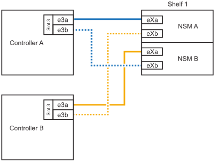
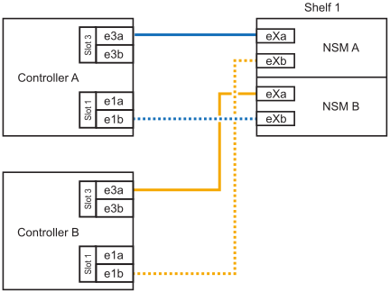

= NS224シェルフをAFF A30、AFF A50、AFF C30、またはAFF C60システムにケーブル接続する
:allow-uri-read: 
:icons: font
:imagesdir: ../media/

[role="lead"]
NS224 シェルフを AFF A30、AFF A50、AFF C30、または AFF C60 システムにケーブル接続し、各シェルフが HA ペアの各コントローラに 2 つの接続を持つようにします。

（内蔵シェルフへの）ストレージの追加が必要な場合は、AFF A30、AFF C30、AFF A50、またはAFF C60 HAペアにNS224シェルフを2台までホットアドできます。

.このタスクについて
* この手順では、HAペアに内蔵ストレージしか搭載されておらず（外付けシェルフは搭載されていない）、各コントローラに最大2台のシェルフと2台のRoCE対応I/Oモジュールをホットアドすることを前提としています。
* この手順では、次のホットアドシナリオについて説明します。
+
** 各コントローラにRoCE対応I/Oモジュールが1つ搭載されたHAペアに最初のシェルフをホットアドします。
** 各コントローラにRoCE対応I/Oモジュールが2つ搭載されたHAペアに最初のシェルフをホットアドします。
** 各コントローラにRoCE対応I/Oモジュールが2つ搭載されたHAペアに2台目のシェルフをホットアドします。

* これらのシステムは、NSM100モジュールを搭載したNS224シェルフとNSM100Bモジュールを搭載したNS224シェルフの両方に対応しています。コントローラを正しいポートにケーブル接続するために、各図の「X」をモジュールに対応する正しいポート番号に置き換えます。
+
[cols="1,4"]
|===
| モジュールタイプ | ポートノラベル付け 

 a| 
NSM100
 a| 
"0"

例：e0a

 a| 
NSM100B
 a| 
"1"

例：e1a

|===

.手順
. 各コントローラモジュールのRoCE対応ポートのセット（RoCE対応I/Oモジュール×1）を1つ使用して1台のシェルフをホットアドする場合で、このシェルフがHAペア内で唯一のNS224シェルフである場合は、次の手順を実行します。
+
それ以外の場合は、次の手順に進みます。

+

NOTE: この手順では、RoCE対応I/Oモジュールがスロット3に取り付けられていることを前提としています。

+
.. シェルフNSM AのポートExaをコントローラAのスロット3のポートA（e3a）にケーブル接続します。
.. シェルフNSM AのポートEXBをコントローラBのスロット3のポートb（e3b）にケーブル接続します。
.. シェルフのNSM BポートExaをコントローラBのスロット3のポートA（e3a）にケーブル接続します。
.. シェルフのNSM BのポートEXBをコントローラAのスロット3のポートb（e3b）にケーブル接続します。
+
次の図は、各コントローラモジュールで RoCE 対応 I/O モジュールを 1 つ使用した、 1 台のホットアドシェルフのケーブル接続を示しています。

+

. 各コントローラモジュールで、 RoCE 対応ポートのセット（ RoCE 対応 I/O モジュールを 2 つ）を使用してシェルフを 1 台または 2 台ホットアドする場合は、該当する手順を実行します。
+

NOTE: この手順では、RoCE対応I/Oモジュールがスロット3と1に取り付けられていることを前提としています。

+
[cols="1,3"]
|===
| シェルフ | ケーブル配線 

 a| 
シェルフ 1
 a| 
.. NSM AのポートExaをコントローラAのスロット3のポートA（e3a）にケーブル接続します。
.. NSM AのポートEXBをコントローラBのスロット1のポートb（e1b）にケーブル接続します。
.. NSM BポートExaをコントローラBのスロット3のポートA（e3a）にケーブル接続します。
.. NSM BのポートEXBをコントローラAのスロット1のポートb（e1b）にケーブル接続します。
.. 2 番目のシェルフをホット アドする場合は、「`シェルフ 2`」のサブステップを完了します。それ以外の場合は、次の手順に進みます。

次の図は、各コントローラモジュールで2つのRoCE対応I/Oモジュールを使用した、1台のホットアドシェルフのケーブル接続を示しています。

 a| 
シェルフ 2
 a| 
.. NSM AのポートExaをコントローラAのスロット1のポートA（e1a）にケーブル接続します。
.. NSM AのポートEXBをコントローラBのスロット3のポートb（e3b）にケーブル接続します。
.. NSM BポートExaをコントローラBのスロット1のポートA（e1a）にケーブル接続します。
.. NSM BのポートEXBをコントローラAのスロット3のポートb（e3b）にケーブル接続します。
.. 次の手順に進みます。

次の図は、各コントローラモジュールで2つのRoCE対応I/Oモジュールを使用した2台のホットアドシェルフのケーブル接続を示しています。

image::../media/drw_ns224_g_2shelf_2card_ieops-2003.svg[AFF A30 / ASAのケーブル接続,452px,AFF/ASA A50]

|===
. ホットアドしたシェルフがを使用して正しくケーブル接続されていることを確認します https://mysupport.netapp.com/site/tools/tool-eula/activeiq-configadvisor["Active IQ Config Advisor"^]。
+
ケーブル接続エラーが発生した場合は、表示される対処方法に従ってください。

.次の手順
この手順の準備の一環としてドライブの自動割り当てを無効にした場合は、ドライブの所有権を手動で割り当て、必要に応じてドライブの自動割り当てを再度有効にする必要があります。link:hot-add-aff-complete.html["ホットアドを完了します"]に移動します。

それ以外の場合は、シェルフのホットアド手順は終了です。
