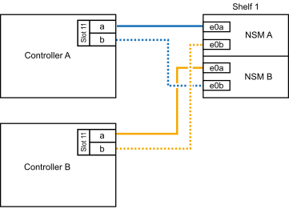
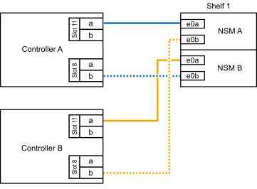
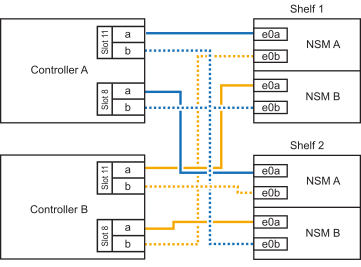

= NS224シェルフをAFF A70、AFF A90、またはAFF C80システムにケーブル接続する
:allow-uri-read: 
:icons: font
:imagesdir: ../media/

[role="lead"]
NS224 シェルフを AFF A70、AFF A90、または AFF C80 システムにケーブル接続し、各シェルフが HA ペアの各コントローラに 2 つの接続を持つようにします。

.このタスクについて
* この手順では、HAペアに内蔵ストレージしか搭載されておらず（外付けシェルフは搭載されていない）、各コントローラに最大2台のシェルフと2台のRoCE対応I/Oモジュールをホットアドすることを前提としています。
* この手順では、次のホットアドシナリオについて説明します。
+
** 各コントローラにRoCE対応I/Oモジュールが1つ搭載されたHAペアに最初のシェルフをホットアドします。
** 各コントローラにRoCE対応I/Oモジュールが2つ搭載されたHAペアに最初のシェルフをホットアドします。
** 各コントローラにRoCE対応I/Oモジュールが2つ搭載されたHAペアに2台目のシェルフをホットアドします。

.手順
. 各コントローラモジュールのRoCE対応ポートのセット（RoCE対応I/Oモジュール×1）を1つ使用して1台のシェルフをホットアドする場合で、このシェルフがHAペア内で唯一のNS224シェルフである場合は、次の手順を実行します。
+
それ以外の場合は、次の手順に進みます。

+

NOTE: この手順では、RoCE対応I/Oモジュールがスロット11に取り付けられていることを前提としています。

+
.. シェルフ NSM A のポート e0a をコントローラ A のスロット 11 のポート A （ e11a ）にケーブル接続します。
.. シェルフ NSM A のポート e0b をコントローラ B のスロット 11 のポート b （ e11b ）にケーブル接続します。
.. シェルフ NSM B ポート e0a をコントローラ B のスロット 11 のポート A （ e11a ）にケーブル接続します。
.. シェルフ NSM B のポート e0b をコントローラ A のスロット 11 のポート b （ e11b ）にケーブル接続します。
+
次の図は、各コントローラモジュールで RoCE 対応 I/O モジュールを 1 つ使用した、 1 台のホットアドシェルフのケーブル接続を示しています。

+

. 各コントローラモジュールで、 RoCE 対応ポートのセット（ RoCE 対応 I/O モジュールを 2 つ）を使用してシェルフを 1 台または 2 台ホットアドする場合は、該当する手順を実行します。
+

NOTE: この手順では、RoCE対応I/Oモジュールがスロット11と8に取り付けられていることを前提としています。

+
[cols="1,3"]
|===
| シェルフ | ケーブル配線 

 a| 
シェルフ 1
 a| 
.. NSM Aのポートe0aをコントローラAのスロット11のポートA（e11a）にケーブル接続します。
.. NSM Aのポートe0bをコントローラBのスロット8のポートb（e8b）にケーブル接続します。
.. NSM Bのポートe0aをコントローラBのスロット11のポートA（e11a）にケーブル接続します。
.. NSM Bのポートe0bをコントローラAのスロット8のポートb（e8b）にケーブル接続します。
.. 2 番目のシェルフをホット アドする場合は、「`シェルフ 2`」のサブステップを完了します。それ以外の場合は、次の手順に進みます。

次の図は、各コントローラモジュールで2つのRoCE対応I/Oモジュールを使用した、1台のホットアドシェルフのケーブル接続を示しています。

 a| 
シェルフ 2
 a| 
.. NSM Aのポートe0aをコントローラAのスロット8のポートA（e8a）にケーブル接続します。
.. NSM Aのポートe0bをコントローラBのスロット11のポートb（e11b）にケーブル接続します。
.. NSM Bのポートe0aをコントローラBのスロット8のポートA（e8a）にケーブル接続します。
.. NSM Bのポートe0bをコントローラAのスロット11のポートb（e11b）にケーブル接続します。
.. 次の手順に進みます。

次の図は、各コントローラモジュールで2つのRoCE対応I/Oモジュールを使用した2台のホットアドシェルフのケーブル接続を示しています。

|===
. ホットアドしたシェルフがを使用して正しくケーブル接続されていることを確認します https://mysupport.netapp.com/site/tools/tool-eula/activeiq-configadvisor["Active IQ Config Advisor"^]。
+
ケーブル接続エラーが発生した場合は、表示される対処方法に従ってください。

.次の手順
この手順の準備の一環としてドライブの自動割り当てを無効にした場合は、ドライブの所有権を手動で割り当て、必要に応じてドライブの自動割り当てを再度有効にする必要があります。link:hot-add-aff-complete.html["ホットアドを完了します"]に移動します。

それ以外の場合は、シェルフのホットアド手順は終了です。
