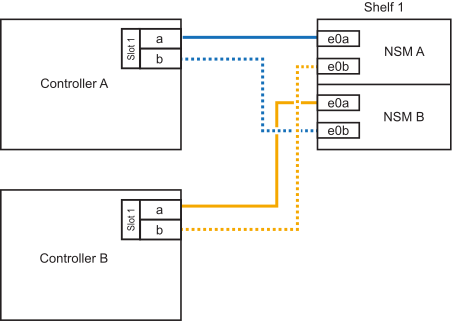

= NS224シェルフをFAS500fシステムにケーブル接続します
:allow-uri-read: 
:icons: font
:imagesdir: ../media/

[role="lead"]
NS224シェルフをFAS500fシステムにケーブル接続し、各シェルフがHAペア内の各コントローラに2つの接続を持つようにします。

ストレージを追加する必要がある場合は、1台のNS224シェルフをFAS500f HAペアにホットアドできます。

.このタスクについて
プラットフォームシャーシの背面から見た場合、左側の RoCE 対応カードポートはポート「 a 」（ e1a ）で、右側のポートはポート「 b 」（ e1b ）です。

.手順
. シェルフをケーブル接続します。
+
.. シェルフ NSM A ポート e0a をコントローラ A のスロット 1 のポート A （ e1a ）にケーブル接続します。
.. シェルフ NSM A のポート e0b をコントローラ B のスロット 1 のポート b （ e1b ）にケーブル接続します。
.. シェルフ NSM B ポート e0a をコントローラ B のスロット 1 のポート A （ e1a ）にケーブル接続します。
.. シェルフ NSM B のポート e0b をコントローラ A のスロット 1 のポート b （ e1b ）にケーブル接続します。+ 次の図は、シェルフのケーブル接続が完了した状態を示しています。
+

. ホットアドしたシェルフがを使用して正しくケーブル接続されていることを確認します https://mysupport.netapp.com/site/tools/tool-eula/activeiq-configadvisor["Active IQ Config Advisor"^]。
+
ケーブル接続エラーが発生した場合は、表示される対処方法に従ってください。

.次の手順
この手順の準備の一環としてドライブの自動割り当てを無効にした場合は、ドライブの所有権を手動で割り当て、必要に応じてドライブの自動割り当てを再度有効にする必要があります。link:hot-add-eoa-complete.html["ホットアドを完了します"]に移動します。

それ以外の場合は、シェルフのホットアド手順は終了です。
