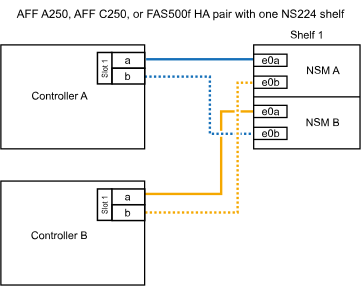
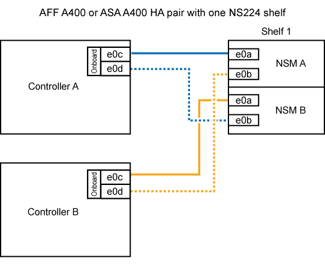

= シェルフ- NS224シェルフをホットアドします
:allow-uri-read: 
:icons: font
:imagesdir: ../media/

[role="lead"]
HA ペアが一定の要件を満たし、 HA ペアに適用可能な準備作業が完了したら、 NS224 ドライブシェルフをホットアドできます。

== ホットアドの要件

NS224 ドライブシェルフをホットアドするには、 HA ペアが特定の要件を満たしている必要があります。

* 各プラットフォームモデルと ONTAP バージョンが、ホットアドする NS224 シェルフおよびドライブに対応している必要があります。
+
https://["NetApp Hardware Universe の略"^]

* シェルフを接続するための正しい数とタイプのケーブルが必要です。
+
https://["NetApp Hardware Universe の略"^]

* ホットアドするシェルフの数に対応できる十分な数の RoCE 対応ポートが HA ペアに必要です。
+
ホットアドするシェルフごとに、各コントローラに少なくとも 2 つの RoCE 対応ポートが必要です。この 2 つのポートは、コントローラ、 RoCE 対応の PCIe カード、両方の組み合わせ、または RoCE 対応の I/O モジュール上のポートで、プラットフォームモデルに対応しています。

+
HA ペアに十分な数の使用可能な RoCE 対応ポートがなく、プラットフォームモデルで RoCE 対応 PCIe カードまたは I/O モジュールの使用がサポートされている場合は、追加のカードまたは I/O モジュールを、プラットフォームモデルでサポートされている適切なコントローラスロットに取り付けておく必要があります。

+
https://["NetApp Hardware Universe の略"^]

+
[NOTE]
====
専用でない RoCE 対応ポートは、ストレージ用に設定する必要があります（ネットワークでは使用できません）。

<<ホットアド用に、専用でない RoCE 対応ポートを準備します>>

====
* AFF A700 HA ペアを使用していて、初期の NS224 ドライブシェルフをホットアドする場合（ HA ペアに NS224 ドライブシェルフがない場合）は、コアダンプ（コアファイルの格納）をサポートするために、各コントローラにコアダンプモジュール（ X9170a 、 NVMe 1TB SSD ）を取り付ける必要があります。
+
link:../fas9000/caching-module-and-core-dump-module-replace.html["キャッシングモジュールを交換するか、コアダンプモジュール AFF A700 および FAS9000 を追加 / 交換してください"^]

* HA ペアのシェルフ数が、サポートされる最大シェルフ数よりも少なくともホットアドするシェルフの数だけ少ない必要があります。
+
シェルフをホットアドしたあとは、 HA ペアでサポートされる最大シェルフ数を超えることはできません。

+
https://["NetApp Hardware Universe の略"^]

* すでに NS224 シェルフがある HA ペアにシェルフをホットアドする場合、 HA ペアにストレージケーブル接続に関するエラーメッセージを表示することはできず、マルチパス HA 構成でケーブル接続する必要があります。
+
Active IQ Config Advisor を実行して、ストレージケーブル接続に関するエラーメッセージと推奨される対処方法を確認できます。

+
https://["ネットアップのダウンロード： Config Advisor"^]

* 片側をまっすぐに伸ばしたペーパークリップ、または細い先端のボールペンが必要です。
+
シェルフ ID を変更するには、ペーパークリップまたはボールペンを使用して、オペレータディスプレイパネル (ODP) の後ろにあるシェルフ ID ボタンにアクセスします。

== ホットアドに関する考慮事項

NS224 ドライブシェルフをホットアドする前に、この手順のベストプラクティスと考慮事項を把握しておく必要があります。

* NS224 シェルフをサポートする ASA HA ペアがある場合は、この手順を使用できます。
* * ベストプラクティス：シェルフをホットアドする前に、 Disk Qualification Package （ DQP ）の最新バージョンをインストールしておくことを推奨します。
+
DQP の最新バージョンをインストールしておくと、新しく認定されたドライブがシステムで認識されて使用できるようになります。これにより、ドライブの情報が最新でない場合に表示されるシステムイベントメッセージを回避できるほか、ドライブが認識されないために発生するドライブのパーティショニングを回避できます。さらに、ドライブのファームウェアが最新でない場合も、通知で知ることができます。

+
https://["ネットアップのダウンロード： Disk Qualification Package"^]

* * ベストプラクティス： * シェルフのホットアドの前後に Active IQ Config Advisor を実行することを推奨します。
+
シェルフをホットアドする前に Active IQ Config Advisor を実行すると、既存のシェルフイーサネット（ ENET ）接続の Snapshot が作成され、 NVMe シェルフモジュール（ NSM ）ファームウェアのバージョンが確認されます。また、 HA ペアですでに使用されているシェルフ ID を確認できます。シェルフをホットアドしたあとに Active IQ Config Advisor を実行すると、シェルフが正しくケーブル接続されており、 HA ペア内でシェルフ ID が一意であることを確認できます。

+
https://["ネットアップのダウンロード： Config Advisor"^]

* * ベストプラクティス：新しいシェルフを追加する前に、お使いのシステムの NVMe シェルフモジュール（ NSM ）ファームウェアとドライブファームウェアを最新バージョンにしておくことを推奨します。
+
https://["ネットアップのダウンロード：ディスクシェルフファームウェア"^]

+
https://["ネットアップのダウンロード：ディスクドライブファームウェア"^]

+

NOTE: ファームウェアをシェルフおよびそのコンポーネントに対応しないバージョンにリバートしないでください。

* ホットアドしたシェルフのケーブル接続が完了すると、 ONTAP でシェルフが認識されます。
+
** ドライブ所有権は、自動ドライブ割り当てが有効になっている場合に割り当てられます。
** 必要に応じて、 nsm シェルフのファームウェアとドライブのファームウェアが自動的に更新されます。
+

NOTE: ファームウェアの更新には最大 30 分かかる場合があります。

== ホットアドを準備する

NS224 ドライブシェルフをホットアドする前に、 HA ペアに該当する準備作業を完了しておく必要があります。

=== ホットアド用に、専用でない RoCE 対応ポートを準備します

NS224 ドライブシェルフのホットアドに使用する専用の RoCE 対応ポートが HA ペアに含まれていない場合は、ポートがストレージ用に設定されていることを確認する必要があります（ネットワークでは使用できません）。プラットフォームモデルに応じて、 RoCE 対応ポートは、コントローラ、 RoCE 対応 PCIe カード、またはその両方に対応した RoCE 対応 I/O モジュールを組み合わせたものです。

.作業を開始する前に
システム要件を満たしている必要があります。

<<ホットアドの要件>>

.このタスクについて
* 一部のプラットフォームモデルでは、 RoCE 対応の PCIe カードまたは I/O モジュールがコントローラのサポートされているスロットに搭載されている場合、ポートのデフォルトでストレージが使用されます（ネットワークではなく）。ただし、この手順を設定して、 RoCE 対応ポートがストレージで使用するように設定されていることを確認することを推奨します。
* HA ペア手順内の、専用でない RoCE 対応ポートがストレージ用に設定されていない場合は、無停止でそのポートを設定できます。
+

NOTE: HA ペアで ONTAP 9.6 のバージョンを実行している場合は、コントローラを 1 つずつリブートする必要があります。

+

NOTE: HA ペアで ONTAP 9.7 以降が実行されている場合は、一方または両方のコントローラがメンテナンスモードでないかぎり、コントローラをリブートする必要はありません。この手順では、どちらのコントローラもメンテナンスモードでないことを前提としています。

.手順
. HA ペアの専用でないポートがストレージ用に構成されているかどうかを確認します。 storage port show
+
このコマンドは、どちらのコントローラモジュールでも入力できます。

+
HA ペアで ONTAP 9.8 以降が実行されている場合は、非専用ポートの「モード」列に「ストレージ」と表示されます。

+
HA ペアが ONTAP 9.7 または 9.6 を実行している場合は ' 専用でないポートは 'Is dedicated ？に false と表示されます 列には、「有効」列も表示されます。

. 専用でないポートがストレージ用に設定されている場合、この手順を使用します。
+
それ以外の場合は、手順 3~6 を実行してポートを設定する必要があります。

+
[NOTE]
====
専用でないポートがストレージ用に設定されていない場合、コマンド出力には次のように表示されます。

HA ペアで ONTAP 9.8 以降が実行されている場合、非専用ポートの「モード」列に「ネットワーク」と表示されます。

HA ペアが ONTAP 9.7 または 9.6 を実行している場合は ' 専用でないポートは 'Is dedicatedicated?` に false と表示されます 列には、「日付」列に「無効」と表示されます。

====
. いずれかのコントローラモジュールで、ストレージ用の専用でないポートを設定します。
+
設定するポートごとに、該当するコマンドを繰り返す必要があります。

+
[cols="1,3"]
|===
| HA ペアの実行中 | 作業 

 a| 
ONTAP 9.8 以降
 a| 
「 storage port modify -node node name -port port name -mode storage 」を参照してください

 a| 
ONTAP 9.7 または 9.6
 a| 
「 storage port enable -node node name -port port name 」のように入力します

|===
. HA ペアで ONTAP 9.6 を実行している場合は、コントローラモジュールをリブートしてポートの変更を有効にします。「 system node reboot -node node name -reason for the reboot
+
それ以外の場合は、次の手順に進みます。

+

NOTE: リブートには最大 15 分かかる場合があります。

. 2 台目のコントローラモジュールに対して、次の手順を繰り返します。
+
[cols="1,3"]
|===
| HA ペアの実行中 | 作業 

 a| 
ONTAP 9.7 以降
 a| 
.. 手順 3 を繰り返します。
.. 手順 6. に進みます。

 a| 
ONTAP 9.6
 a| 
.. 手順 3 と 4 を繰り返します。
+

NOTE: 最初のコントローラのリブートが完了している必要があります。

.. 手順 6. に進みます。

|===
. 両方のコントローラモジュールの専用でないポートがストレージ用に設定されていることを確認します。「 storage port show 」
+
このコマンドは、どちらのコントローラモジュールでも入力できます。

+
HA ペアで ONTAP 9.8 以降が実行されている場合は、非専用ポートの「モード」列に「ストレージ」と表示されます。

+
HA ペアが ONTAP 9.7 または 9.6 を実行している場合は ' 専用でないポートは 'Is dedicated ？に false と表示されます 列には、「有効」列も表示されます。

=== AFF A700、AFF A800、AFF C800、AFF A400、またはAFF C400のHAペアを準備して、2台目のシェルフをホットアドします

1台のNS224ドライブシェルフを各コントローラの1組のRoCE対応ポートに接続し、AFF A700、AFF A800、AFF C800、AFF A400、またはAFF C400のHAペアを使用している場合は、シェルフにケーブルを再接続する必要があります （追加のRoCE対応PCIeカードまたはI/Oモジュールを取り付けたあと）2台目のシェルフをホットアドする前に、各コントローラの両方のポートセットにまたがります。

.作業を開始する前に
* システム要件を満たしている必要があります。
+
<<ホットアドの要件>>

* 取り付けた RoCE 対応 PCIe カードまたは I/O モジュールのポートを有効にしておく必要があります。
+
<<ホットアド用に、専用でない RoCE 対応ポートを準備します>>

.このタスクについて
* マルチパス HA 接続を使用しているシェルフでは、ポート接続の再接続によって無停止の手順が使用されます。
+
2 台目のシェルフをホットアドしたときに両方のシェルフの耐障害性に優れた接続が確立されるように、各コントローラの両方のポートセットに最初のシェルフのケーブルを再接続します。

* この手順では、シェルフとの接続を維持するために、一度に 1 本のケーブルを動かします。

.手順
. 使用しているプラットフォームモデルに応じて、各コントローラの両方のセットのポートで既存のシェルフのケーブルを再接続します。
+

NOTE: ケーブルを移動する場合、あるポートからケーブルを外して別のポートに接続するまでの待機時間は不要です。

+
[cols="1,3"]
|===
| 構成 | 作業 

 a| 
AFF A700 HA ペア
 a| 

NOTE: 手順は、既存のシェルフが各コントローラのスロット 3 にある RoCE 対応 I/O モジュールにケーブル接続されていることを前提としています。

[NOTE]
====
必要に応じて、 2 台のシェルフ構成の既存の 1 台のシェルフとケーブル接続されたシェルフを示すケーブル構成図を参照できます。

<<AFF A700 HA ペアのホットアドシェルフをケーブル接続します>>

====
.. コントローラ A で、スロット 3 のポート b （ e3b ）からスロット 7 のポート b （ e7b ）にケーブルを移動します。
.. コントローラ B についても、同じケーブルの移動を繰り返します

 a| 
AFF A800またはAFF C800のHAペア
 a| 

NOTE: 手順は、既存のシェルフが各コントローラのスロット 5 にある RoCE 対応 PCIe カードにケーブル接続されていることを前提としています。

[NOTE]
====
必要に応じて、 2 台のシェルフ構成の既存の 1 台のシェルフとケーブル接続されたシェルフを示すケーブル構成図を参照できます。

<<AFF A800またはAFF C800 HAペア用のホットアドシェルフをケーブル接続します>>

====
.. コントローラ A で、スロット 5 のポート b （ e5b ）からスロット 3 のポート b （ e3b ）にケーブルを移動します。
.. コントローラ B についても、同じケーブルの移動を繰り返します

 a| 
AFF A400 HA ペア
 a| 
[NOTE]
====
必要に応じて、 2 台のシェルフ構成の既存の 1 台のシェルフとケーブル接続されたシェルフを示すケーブル構成図を参照できます。

<<AFF A400 HA ペア用のシェルフをホットアドします>>

====
.. コントローラ A で、ポート e0d からスロット 5 のポート b （ e5b ）にケーブルを移動します。
.. コントローラ B についても、同じケーブルの移動を繰り返します

 a| 
AFF C400 HAペア
 a| 
[NOTE]
====
必要に応じて、 2 台のシェルフ構成の既存の 1 台のシェルフとケーブル接続されたシェルフを示すケーブル構成図を参照できます。

<<AFF C400 HAペア用のホットアドシェルフをケーブル接続します>>

====
.. コントローラAで、スロット4のポートa（e4a）からスロット5のポートb（e5b）にケーブルを移動します。
.. コントローラ B についても、同じケーブルの移動を繰り返します

|===
. ケーブル接続されているシェルフが正しくケーブル接続されていることを確認します。
+
ケーブル接続エラーが発生した場合は、表示される対処方法に従ってください。

+
https://["ネットアップのダウンロード： Config Advisor"^]

=== ホットアド用のドライブ所有権を手動で割り当てる準備をします

ホットアドする NS224 ドライブシェルフのドライブ所有権を手動で割り当てる場合は、自動ドライブ割り当てを無効にする必要があります。

.作業を開始する前に
システム要件を満たしている必要があります。

<<ホットアドの要件>>

.このタスクについて
シェルフ内のドライブが HA ペアの両方のコントローラモジュールで所有される場合は、ドライブ所有権を手動で割り当てる必要があります。

.手順
. 自動ドライブ割り当てが有効になっているかどうかを確認します。「 storage disk option show
+
このコマンドは、どちらのコントローラモジュールでも入力できます。

+
自動ドライブ割り当てが有効になっている場合は、各コントローラモジュールの Auto Assign 列に on と表示されます。

. 自動ドライブ割り当てが有効になっている場合は無効にします。「 storage disk option modify -node node_name -autoassign off
+
両方のコントローラモジュールで自動ドライブ割り当てを無効にする必要があります。

== ホットアド用のドライブシェルフを設置します

新しい NS224 ドライブシェルフを設置するには、シェルフをラックまたはキャビネットに設置し、電源コード（シェルフの電源が自動的にオンになる）を接続し、シェルフ ID を設定します。

.作業を開始する前に
* システム要件を満たしている必要があります。
+
<<ホットアドの要件>>

* 該当する準備手順を完了しておく必要があります。
+
<<ホットアドを準備する>>

.手順
. キットに付属のパンフレットに従って、シェルフに付属のレールマウントキットを取り付けます。
+

NOTE: シェルフをフランジで固定しないでください。

. パンフレットに従って、サポートブラケットとラックまたはキャビネットにシェルフを設置して固定します。
+

NOTE: フル装備の NS224 シェルフの重量は最大 30.29kg （ 66.78 ポンド）になるため、シェルフを持ち上げるときは 2 人で行うか油圧リフトを使用してください。シェルフの重量を軽くするために、シェルフコンポーネントを（シェルフの前面または背面から）取り外さないでください。シェルフの重量が不均衡になります。

. 電源コードをシェルフに接続し、AC電源装置の場合は電源コード固定クリップで固定し、DC電源装置の場合は2本の蝶ネジで固定してから、耐障害性を確保するために電源コードを別 々 の電源に接続します。
+
電源に接続するとシェルフの電源がオンになり、電源スイッチはありません。電源装置が正常に動作している場合は、 LED が緑色に点灯します。

. シェルフ ID を HA ペア内で一意の番号に設定します。
+
詳細な手順については、以下を参照してください。

+
link:change-shelf-id.html["シェルフ ID - NS224 シェルフを変更します"^]

+
.. 左側のエンドキャップを取り外し、 LED の右側にある小さな穴の位置を確認します。
.. クリップなどの工具の先端を小さな穴に差し込み、シェルフ ID ボタンに移動します。
.. デジタルディスプレイの 1 桁目の数字が点滅するまで（最大 15 秒間）ボタンを押し続け、ボタンを放します。
+

NOTE: ID の点滅に 15 秒以上かかる場合は、ボタンをもう一度押し続けてください。

.. 目的の番号になるまで、ボタンを押してから離します（ 0 ～ 9 ）。
.. 手順 4c と 4D を繰り返して、シェルフ ID の 2 番目の番号を設定します。
+
点滅するまでに最大 3 秒（ 15 秒ではなく）かかることがあります。

.. 2 桁目の数字が点滅しなくなるまで、ボタンを押し続けます。
+
約 5 秒後、両方の数字が点滅し始め、 ODP のオレンジ色の LED が点灯します。

.. シェルフの電源を再投入し、シェルフ ID を有効にします。
+
両方の電源コードをシェルフから取り外し、 10 秒待ってから再度接続する必要があります。

+
電源装置の電源が回復すると、 LED が緑色に点灯します。

== ホットアド用のドライブシェルフをケーブル接続します

ホットアドする各 NS224 ドライブシェルフをケーブル接続して、各シェルフを HA ペアの各コントローラモジュールに 2 つの接続で接続します。ホットアドするシェルフの数とプラットフォームモデルに応じて、コントローラに搭載された RoCE 対応ポート、 RoCE 対応の PCIe カード、両方の組み合わせ、または RoCE 対応の I/O モジュールで RoCE 対応ポートを使用します。

=== ホットアドのケーブル接続に関する考慮事項

ケーブルコネクタが正しい向きになっていること、および NS224 NSM ドライブシェルフモジュールのポートの場所とラベルは、ホットアドするシェルフのケーブル接続に役立ちます。

* ケーブルは、コネクタのプルタブを上に向けて挿入します。
+
ケーブルを正しく挿入すると、カチッという音がして所定の位置に収まります。

+
ケーブルの両端を接続すると、シェルフポートとコントローラポートの LNK （緑色） LED が点灯します。ポートの LNK LED が点灯しない場合は、ケーブルを再接続してください。

+
image::../media/oie_cable_pull_tab_up.png[OIE ケーブルのプルタブを上にします]

* 次の図は、シェルフ NSM ポート、 e0a 、 e0b を物理的に特定するのに役立ちます。
+
image::../media/drw_ns224_back_ports.png[DRW ns224 バックポート]

=== AFF A900 HA ペアのホットアドシェルフをケーブル接続します

ストレージの追加が必要な場合は、 AFF A900 HA ペアに最大 3 台の NS224 ドライブシェルフを（合計 4 台のシェルフに）ホットアドできます。

.作業を開始する前に
* システム要件を満たしている必要があります。
+
<<ホットアドの要件>>

* 該当する準備手順を完了しておく必要があります。
+
<<ホットアドを準備する>>

* シェルフを設置し、電源をオンにして、シェルフ ID を設定しておく必要があります。
+
<<ホットアド用のドライブシェルフを設置します>>

.このタスクについて
* この手順では、 HA ペアに既存の NS224 シェルフが少なくとも 1 台あること、およびシェルフを最大 3 台までホットアドすることを前提としています。
* HA ペアに既存の NS224 シェルフが 1 台しかない場合、この手順では、シェルフが各コントローラ上の RoCE 対応 100GbE I/O モジュール 2 台にケーブル接続されていると想定しています。

.手順
. ホットアドする NS224 シェルフが HA ペアの 2 台目の NS224 シェルフになる場合は、次の手順を実行します。
+
それ以外の場合は、次の手順に進みます。

+
.. シェルフ NSM A のポート e0a をコントローラ A のスロット 10 のポート A （ e10a ）にケーブル接続します。
.. シェルフ NSM A ポート e0b をコントローラ B のスロット 2 のポート b （ e2b ）にケーブル接続します。
.. シェルフ NSM B ポート e0a をコントローラ B のスロット 10 のポート A （ e10A ）にケーブル接続します。
.. シェルフ NSM B のポート e0b をコントローラ A のスロット 2 のポート b （ e2b ）にケーブル接続します。

+
次の図は、 2 台目のシェルフ（および 1 台目のシェルフ）のケーブル接続を示しています。

+
image::../media/drw_ns224_a900_2shelves.png[DRW ns224 a900 2 シェルフ]

. ホットアドする NS224 シェルフが HA ペアの 3 台目の NS224 シェルフになる場合は、次の手順を実行します。
+
それ以外の場合は、次の手順に進みます。

+
.. シェルフ NSM A ポート e0a をコントローラ A のスロット 1 のポート A （ e1a ）にケーブル接続します。
.. シェルフ NSM A のポート e0b をコントローラ B のスロット 11 のポート b （ e11b ）にケーブル接続します。
.. シェルフ NSM B ポート e0a をコントローラ B のスロット 1 のポート A （ e1a ）にケーブル接続します。
.. シェルフ NSM B のポート e0b をコントローラ A のスロット 11 のポート b （ e11b ）にケーブル接続します。
+
次の図は、 3 台目のシェルフのケーブル接続を示しています。

+
image::../media/drw_ns224_a900_3shelves.png[DRW ns224 a900 3 シェルフ]

. ホットアドする NS224 シェルフが HA ペアの 4 台目の NS224 シェルフになる場合は、次の手順を実行します。
+
それ以外の場合は、次の手順に進みます。

+
.. シェルフ NSM A のポート e0a をコントローラ A のスロット 11 のポート A （ e11a ）にケーブル接続します。
.. シェルフ NSM A のポート e0b をコントローラ B のスロット 1 のポート b （ e1b ）にケーブル接続します。
.. シェルフ NSM B ポート e0a をコントローラ B のスロット 11 のポート A （ e11a ）にケーブル接続します。
.. シェルフ NSM B のポート e0b をコントローラ A のスロット 1 のポート b （ e1b ）にケーブル接続します。
+
次の図は、 4 台目のシェルフのケーブル接続を示しています。

+
image::../media/drw_ns224_a900_4shelves.png[DRW ns224 a900 4 シェルフ]

. ホットアドしたシェルフのケーブルが正しく接続されていることを確認します。
+
ケーブル接続エラーが発生した場合は、表示される対処方法に従ってください。

+
https://["ネットアップのダウンロード： Config Advisor"]

. この手順の準備作業として自動ドライブ割り当てを無効にした場合は、ドライブ所有権を手動で割り当ててから、必要に応じて自動ドライブ割り当てを再度有効にする必要があります。
+
それ以外の場合は、この手順を使用します。

+
<<ホットアドを完了します>>

=== AFF A250、AFF C250、またはFAS500f HAペア用のホットアドシェルフをケーブル接続します

ストレージの追加が必要になったときは、 NS224 ドライブシェルフを FAS3500f または AFF A250 HA ペアにホットアドできます。

.作業を開始する前に
* システム要件を満たしている必要があります。
+
<<ホットアドの要件>>

* 該当する準備手順を完了しておく必要があります。
+
<<ホットアドを準備する>>

* シェルフを設置し、電源をオンにして、シェルフ ID を設定しておく必要があります。
+
<<ホットアド用のドライブシェルフを設置します>>

.このタスクについて
プラットフォームシャーシの背面から見た場合、左側の RoCE 対応カードポートはポート「 a 」（ e1a ）で、右側のポートはポート「 b 」（ e1b ）です。

.手順
. シェルフをケーブル接続します。
+
.. シェルフ NSM A ポート e0a をコントローラ A のスロット 1 のポート A （ e1a ）にケーブル接続します。
.. シェルフ NSM A のポート e0b をコントローラ B のスロット 1 のポート b （ e1b ）にケーブル接続します。
.. シェルフ NSM B ポート e0a をコントローラ B のスロット 1 のポート A （ e1a ）にケーブル接続します。
.. シェルフ NSM B のポート e0b をコントローラ A のスロット 1 のポート b （ e1b ）にケーブル接続します。+ 次の図は、シェルフのケーブル接続が完了した状態を示しています。
+

. ホットアドしたシェルフのケーブルが正しく接続されていることを確認します。
+
ケーブル接続エラーが発生した場合は、表示される対処方法に従ってください。

+
https://["ネットアップのダウンロード： Config Advisor"^]

. この手順の準備作業として自動ドライブ割り当てを無効にした場合は、ドライブ所有権を手動で割り当ててから、必要に応じて自動ドライブ割り当てを再度有効にする必要があります。
+
それ以外の場合は、この手順を使用します。

+
<<ホットアドを完了します>>

=== AFF A700 HA ペアのホットアドシェルフをケーブル接続します

AFF A700 HAペアでNS224ドライブシェルフをケーブル接続する方法は、ホットアドするシェルフの数と、コントローラモジュールで使用するRoCE対応ポートセットの数（1つまたは2つ）によって異なります。

.作業を開始する前に
* システム要件を満たしている必要があります。
+
<<ホットアドの要件>>

* 該当する準備手順を完了しておく必要があります。
+
<<ホットアドを準備する>>

* シェルフを設置し、電源をオンにして、シェルフ ID を設定しておく必要があります。
+
<<ホットアド用のドライブシェルフを設置します>>

.手順
. 各コントローラモジュールで RoCE 対応ポートのセット（ RoCE 対応 I/O モジュールが 1 つ）を使用してシェルフを 1 台ホットアドする場合、 HA ペア内の NS224 シェルフのみである場合は、次の手順を実行します。
+
それ以外の場合は、次の手順に進みます。

+

NOTE: この手順では、各コントローラモジュールのスロット 7 ではなく、スロット 3 に RoCE 対応の I/O モジュールを取り付けたことを前提としています。

+
.. シェルフ NSM A ポート e0a をコントローラ A のスロット 3 のポートにケーブル接続します
.. シェルフ NSM A のポート e0b をコントローラ B のスロット 3 のポート B にケーブル接続します
.. シェルフ NSM B ポート e0a をコントローラ B のスロット 3 のポート a にケーブル接続します
.. シェルフ NSM B のポート e0b をコントローラ A のスロット 3 のポート B にケーブル接続します
+
次の図は、各コントローラモジュールで RoCE 対応 I/O モジュールを 1 つ使用した、 1 台のホットアドシェルフのケーブル接続を示しています。

+
image::../media/drw_ns224_a700_1shelf.png[DRW ns224 A700 1 シェルフ]

. 各コントローラモジュールで、 RoCE 対応ポートのセット（ RoCE 対応 I/O モジュールを 2 つ）を使用してシェルフを 1 台または 2 台ホットアドする場合は、該当する手順を実行します。
+
[cols="1,3"]
|===
| シェルフ | ケーブル配線 

 a| 
シェルフ 1
 a| 

NOTE: 以下の手順は、シェルフポート e0a をスロット 7 ではなくスロット 3 にある RoCE 対応 I/O モジュールにケーブル接続することで、ケーブル接続を開始することを前提としています。

.. NSM A ポート e0a をコントローラ A のスロット 3 のポートにケーブル接続します
.. NSM A のポート e0b をコントローラ B のスロット 7 のポート B にケーブル接続します
.. NSM B ポート e0a をコントローラ B のスロット 3 のポート a にケーブル接続します
.. NSM B のポート e0b をコントローラ A のスロット 7 のポート B にケーブル接続します
.. 2 台目のシェルフをホットアドする場合は、「シェルフ 2 」の手順を実行します。そうでない場合は、手順 3 に進みます。

 a| 
シェルフ 2
 a| 

NOTE: これらの手順は、シェルフポート e0a をスロット 3 （シェルフ 1 のケーブル接続手順に対応）ではなく、スロット 7 の RoCE 対応 I/O モジュールにケーブル接続することで開始されることを前提としています。

.. NSM A ポート e0a をコントローラ A のスロット 7 のポートにケーブル接続します
.. NSM A のポート e0b をコントローラ B のスロット 3 のポート B にケーブル接続します
.. NSM B ポート e0a をコントローラ B のスロット 7 のポート a にケーブル接続します
.. NSM B のポート e0b をコントローラ A のスロット 3 のポート B にケーブル接続します
.. 手順 3 に進みます。

|===
+
次の図は、 1 台目と 2 台目のホットアドシェルフのケーブル接続を示しています。

+
image::../media/drw_ns224_a700_2shelves.png[DRW ns224 A700 2 シェルフ]

. ホットアドしたシェルフのケーブルが正しく接続されていることを確認します。
+
ケーブル接続エラーが発生した場合は、表示される対処方法に従ってください。

+
https://["ネットアップのダウンロード： Config Advisor"^]

. この手順の準備作業として自動ドライブ割り当てを無効にした場合は、ドライブ所有権を手動で割り当ててから、必要に応じて自動ドライブ割り当てを再度有効にする必要があります。
+
それ以外の場合は、この手順を使用します。

+
<<ホットアドを完了します>>

=== AFF A800またはAFF C800 HAペア用のホットアドシェルフをケーブル接続します

AFF A800またはAFF C800 HAペアでNS224ドライブシェルフをケーブル接続する方法は、ホットアドするシェルフの数と、コントローラモジュールで使用するRoCE対応ポートセットの数（1つまたは2つ）によって異なります。

.作業を開始する前に
* システム要件を満たしている必要があります。
+
<<ホットアドの要件>>

* 該当する準備手順を完了しておく必要があります。
+
<<ホットアドを準備する>>

* シェルフを設置し、電源をオンにして、シェルフ ID を設定しておく必要があります。
+
<<ホットアド用のドライブシェルフを設置します>>

.手順
. 各コントローラモジュールに RoCE 対応ポート（ RoCE 対応 PCIe カードが 1 つ）のセットを使用してシェルフを 1 台ホットアドする場合、 HA ペア内の NS224 シェルフがこの構成になっていれば、次の手順を実行します。
+
それ以外の場合は、次の手順に進みます。

+

NOTE: この手順では、 RoCE 対応の PCIe カードがスロット 5 に取り付けられていることを前提としています。

+
.. シェルフNSM Aのポートe0aをコントローラAのスロット5のポートA（e5a）にケーブル接続します。
.. シェルフNSM Aのポートe0bをコントローラBのスロット5のポートb（e5b）にケーブル接続します。
.. シェルフのNSM Bのポートe0aをコントローラBのスロット5のポートA（e5a）にケーブル接続します。
.. シェルフのNSM Bのポートe0bをコントローラAのスロット5のポートb（e5b）にケーブル接続します。
+
次の図は、各コントローラモジュールで 1 つの RoCE 対応 PCIe カードを使用した、 1 台のホットアドシェルフのケーブル接続を示しています。

+
image::../media/drw_ns224_a800_c800_1shelf_IEOPS-964.svg[DRW ns224 A800 c800 1シェルフIEOPS 964]

. 各コントローラモジュールで、 RoCE 対応ポート（ RoCE 対応 PCIe カードが 2 つ）のセットを使用してシェルフを 1 台または 2 台ホットアドする場合は、該当する手順を実行します。
+

NOTE: この手順では、 RoCE 対応の PCIe カードをスロット 5 とスロット 3 に取り付けたことを前提としています。

+
[cols="1,3"]
|===
| シェルフ | ケーブル配線 

 a| 
シェルフ 1
 a| 

NOTE: これらの手順では、シェルフポート e0a をスロット 3 ではなくスロット 5 にある RoCE 対応 PCIe カードにケーブル接続することで、ケーブル接続を開始することを前提としています。

.. NSM Aのポートe0aをコントローラAのスロット5のポートA（e5a）にケーブル接続します。
.. NSM Aのポートe0bをコントローラBのスロット3のポートb（e3b）にケーブル接続します。
.. NSM Bのポートe0aをコントローラBのスロット5のポートA（e5a）にケーブル接続します。
.. NSM Bのポートe0bをコントローラAのスロット3のポートb（e3b）にケーブル接続します。
.. 2 台目のシェルフをホットアドする場合は、「シェルフ 2 」の手順を実行します。そうでない場合は、手順 3 に進みます。

 a| 
シェルフ 2
 a| 

NOTE: これらの手順は、シェルフポート e0a をスロット 5 （シェルフ 1 のケーブル接続手順に相当）ではなく、スロット 3 の RoCE 対応 PCIe カードにケーブル接続することで開始されることを前提としています。

.. NSM Aのポートe0aをコントローラAのスロット3のポートA（e3a）にケーブル接続します。
.. NSM Aのポートe0bをコントローラBのスロット5のポートb（e5b）にケーブル接続します。
.. NSM Bのポートe0aをコントローラBのスロット3のポートA（e3a）にケーブル接続します。
.. NSM Bのポートe0bをコントローラAのスロット5のポートb（e5b）にケーブル接続します。
.. 手順 3 に進みます。

|===
+
次の図は、 2 台のホットアドシェルフのケーブル接続を示しています。

+
image::../media/drw_ns224_a800_c800_2shelves_IEOPS-966.svg[DRW ns224 A800 c800 2シェルフIEOPS 966]

. ホットアドしたシェルフのケーブルが正しく接続されていることを確認します。
+
ケーブル接続エラーが発生した場合は、表示される対処方法に従ってください。

+
https://["ネットアップのダウンロード： Config Advisor"^]

. この手順の準備作業として自動ドライブ割り当てを無効にした場合は、ドライブ所有権を手動で割り当ててから、必要に応じて自動ドライブ割り当てを再度有効にする必要があります。
+
それ以外の場合は、この手順を使用します。

+
<<ホットアドを完了します>>

=== AFF A400 HA ペア用のシェルフをホットアドします

AFF A400 HAペアでNS224ドライブシェルフをケーブル接続する方法は、ホットアドするシェルフの数と、コントローラモジュールで使用するRoCE対応ポートセットの数（1つまたは2つ）によって異なります。

.作業を開始する前に
* システム要件を満たしている必要があります。
+
<<ホットアドの要件>>

* 該当する準備手順を完了しておく必要があります。
+
<<ホットアドを準備する>>

* シェルフを設置し、電源をオンにして、シェルフ ID を設定しておく必要があります。
+
<<ホットアド用のドライブシェルフを設置します>>

.手順
. 各コントローラモジュールで RoCE 対応ポート（オンボード RoCE 対応ポート）のセットを使用してシェルフを 1 台ホットアドする場合、 HA ペア内の NS224 シェルフのみになるようにするには、次の手順を実行します。
+
それ以外の場合は、次の手順に進みます。

+
.. シェルフ NSM A ポート e0a をコントローラ A のポート e0c にケーブル接続します。
.. シェルフ NSM A のポート e0b をコントローラ B のポート e0d にケーブル接続します。
.. シェルフ NSM B ポート e0a をコントローラ B のポート e0c にケーブル接続します。
.. シェルフ NSM B のポート e0b をコントローラ A のポート e0d にケーブル接続します。
+
次の図は、各コントローラモジュールで 1 組の RoCE 対応ポートを使用して 1 台のホットアドしたシェルフのケーブル接続を示しています。

+

. 各コントローラモジュールで、 RoCE 対応ポート（オンボードおよび PCIe カード RoCE 対応ポート）のセットを 2 つ使用してシェルフを 1 つまたは 2 つホットアドする場合は、次の手順を実行します。
+
[cols="1,3"]
|===
| シェルフ | ケーブル配線 

 a| 
シェルフ 1
 a| 
.. NSM A ポート e0a をコントローラ A のポート e0c にケーブル接続します。
.. NSM Aのポートe0bをコントローラBのスロット5のポート2（e5b）にケーブル接続します。
.. NSM B ポート e0a をコントローラ B のポート e0c にケーブル接続します。
.. NSM Bのポートe0bをコントローラAのスロット5のポート2（e5b）にケーブル接続します。
.. 2 台目のシェルフをホットアドする場合は、「シェルフ 2 」の手順を実行します。そうでない場合は、手順 3 に進みます。

 a| 
シェルフ 2
 a| 
.. NSM Aのポートe0aをコントローラAのスロット5のポート1（e5a）にケーブル接続します。
.. NSM A のポート e0b をコントローラ B のポート e0d にケーブル接続します。
.. NSM Bのポートe0aをコントローラBのスロット5のポート1（e5a）にケーブル接続します。
.. NSM B のポート e0b をコントローラ A のポート e0d にケーブル接続します。
.. 手順 3 に進みます。

|===
+
次の図は、 2 台のホットアドシェルフのケーブル接続を示しています。

+
image::../media/drw_ns224_a400_2shelves_IEOPS-983.svg[DRW ns224 a400 2shelves IEOPS 983]

. ホットアドしたシェルフのケーブルが正しく接続されていることを確認します。
+
ケーブル接続エラーが発生した場合は、表示される対処方法に従ってください。

+
https://["ネットアップのダウンロード： Config Advisor"^]

. この手順の準備作業として自動ドライブ割り当てを無効にした場合は、ドライブ所有権を手動で割り当ててから、必要に応じてドライブの自動割り当てを再度有効にする必要があります。
+
それ以外の場合は、この手順を使用します。

+
<<ホットアドを完了します>>

=== AFF C400 HAペア用のホットアドシェルフをケーブル接続します

AFF C400 HAペアのNS224ドライブシェルフをケーブル接続する方法は、ホットアドするシェルフの数と、コントローラモジュールで使用するRoCE対応ポートセットの数（1つまたは2つ）によって異なります。

.作業を開始する前に
* システム要件を満たしている必要があります。
+
<<ホットアドの要件>>

* 該当する準備手順を完了しておく必要があります。
+
<<ホットアドを準備する>>

* シェルフを設置し、電源をオンにして、シェルフ ID を設定しておく必要があります。
+
<<ホットアド用のドライブシェルフを設置します>>

.手順
. 各コントローラモジュールのRoCE対応ポートのセットを1つ使用して1台のシェルフをホットアドする場合に、このシェルフがHAペア内の唯一のNS224シェルフである場合は、次の手順を実行します。
+
それ以外の場合は、次の手順に進みます。

+
.. シェルフNSM Aのポートe0aをコントローラAのスロット4のポート1（e4a）にケーブル接続します。
.. シェルフNSM Aのポートe0bをコントローラBのスロット4のポート2（e4b）にケーブル接続します。
.. シェルフのNSM Bのポートe0aをコントローラBのスロット4のポート1（e4a）にケーブル接続します。
.. シェルフのNSM Bのポートe0bをコントローラAのスロット4のポート2（e4b）にケーブル接続します。
+
次の図は、各コントローラモジュールで 1 組の RoCE 対応ポートを使用して 1 台のホットアドしたシェルフのケーブル接続を示しています。

+
image::../media/drw_ns224_c400_1shelf_IEOPS-985.svg[DRW ns224 C400 1シェルフIEOPS 985]

. 各コントローラモジュールの2セットのRoCE対応ポートを使用して1台または2台のシェルフをホットアドする場合は、次の手順を実行します。
+
[cols="1,3"]
|===
| シェルフ | ケーブル配線 

 a| 
シェルフ 1
 a| 
.. NSM Aのポートe0aをコントローラAのスロット4のポート1（e4a）にケーブル接続します。
.. NSM Aのポートe0bをコントローラBのスロット5のポート2（e5b）にケーブル接続します。
.. NSM Bのポートe0aをコントローラBのポートスロット4のポート1（e4a）にケーブル接続します。
.. NSM Bのポートe0bをコントローラAのスロット5のポート2（e5b）にケーブル接続します。
.. 2 台目のシェルフをホットアドする場合は、「シェルフ 2 」の手順を実行します。そうでない場合は、手順 3 に進みます。

 a| 
シェルフ 2
 a| 
.. NSM Aのポートe0aをコントローラAのスロット5のポート1（e5a）にケーブル接続します。
.. NSM Aのポートe0bをコントローラBのスロット4のポート2（e4b）にケーブル接続します。
.. NSM Bのポートe0aをコントローラBのスロット5のポート1（e5a）にケーブル接続します。
.. NSM Bのポートe0bをコントローラAのスロット4のポート2（e4b）にケーブル接続します。
.. 手順 3 に進みます。

|===
+
次の図は、 2 台のホットアドシェルフのケーブル接続を示しています。

+
image::../media/drw_ns224_c400_2shelves_IEOPS-984.svg[DRW ns224 C400 2シェルフIEOPS 984]

. ホットアドしたシェルフのケーブルが正しく接続されていることを確認します。
+
ケーブル接続エラーが発生した場合は、表示される対処方法に従ってください。

+
https://["ネットアップのダウンロード： Config Advisor"^]

. この手順の準備作業として自動ドライブ割り当てを無効にした場合は、ドライブ所有権を手動で割り当ててから、必要に応じてドライブの自動割り当てを再度有効にする必要があります。
+
それ以外の場合は、この手順を使用します。

+
<<ホットアドを完了します>>

=== AFF A320 HA ペアのホットアドシェルフをケーブル接続します

ストレージの追加が必要になった場合は、 2 台目の NS224 ドライブシェルフを既存の HA ペアにケーブル接続します。

.作業を開始する前に
* システム要件を満たしている必要があります。
+
<<ホットアドの要件>>

* 該当する準備手順を完了しておく必要があります。
+
<<ホットアドを準備する>>

* シェルフを設置し、電源をオンにして、シェルフ ID を設定しておく必要があります。
+
<<ホットアド用のドライブシェルフを設置します>>

.このタスクについて
この手順は、 AFF A320 HA ペアに既存の NS224 シェルフがあり、 2 台目のシェルフをホットアドすることを前提としています。

.手順
. シェルフをコントローラモジュールにケーブル接続します。
+
.. NSM A ポート e0a をコントローラ A のポート e0e にケーブル接続します。
.. NSM A のポート e0b をコントローラ B のポート e0b にケーブル接続します。
.. NSM B ポート e0a をコントローラ B ポート e0e にケーブル接続します。
.. NSM B のポート e0b をコントローラ A のポート e0b にケーブル接続します。+ 次の図は、ホットアドしたシェルフ（シェルフ 2 ）のケーブル接続を示しています。
+
image::../media/drw_ns224_a320_2shelves_direct_attached.png[DRW ns224 A320 2 台のシェルフが直接接続されています]

. ホットアドしたシェルフのケーブルが正しく接続されていることを確認します。
+
ケーブル接続エラーが発生した場合は、表示される対処方法に従ってください。

+
https://["ネットアップのダウンロード： Config Advisor"^]

. この手順の準備作業として自動ドライブ割り当てを無効にした場合は、ドライブ所有権を手動で割り当ててから、必要に応じてドライブの自動割り当てを再度有効にする必要があります。
+
それ以外の場合は、この手順を使用します。

+
<<ホットアドを完了します>>

== ホットアドを完了します

NS224 ドライブシェルフのホットアドの準備の一環として自動ドライブ割り当てを無効にした場合は、ドライブ所有権を手動で割り当ててから、必要に応じて自動ドライブ割り当てを再度有効にする必要があります。

.作業を開始する前に
HA ペアの手順に従って、シェルフのケーブル接続を完了しておく必要があります。

<<ホットアド用のドライブシェルフをケーブル接続します>>

.手順
. 所有権が未設定のドライブをすべて表示します。「 storage disk show -container-type unassigned 」
+
このコマンドは、どちらのコントローラモジュールでも入力できます。

. 各ドライブを割り当てます。「 storage disk assign -disk disk_name -owner owner_name 」
+
このコマンドは、どちらのコントローラモジュールでも入力できます。

+
ワイルドカード文字を使用して、一度に複数のドライブを割り当てることができます。

. 必要に応じて自動ドライブ割り当てを再度有効にします。「 storage disk option modify -node node_name -autoassign on 」
+
両方のコントローラモジュールで自動ドライブ割り当てを再度有効にする必要があります。

