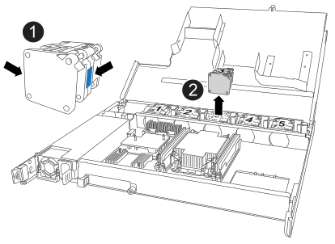

= NSM-NS224シェルフの交換
:allow-uri-read: 
:icons: font
:imagesdir: ../media/

[role="lead"]
電源がオンになっている NS224 ドライブシェルフおよび I/O の実行中は、障害のある NVMe シェルフモジュール（ NSM ）を無停止で交換できます。

.作業を開始する前に
* 障害が発生したNSMを取り外してもシェルフの接続が維持されるように、シェルフのパートナーNSMが稼働していて、正しくケーブル接続されている必要があります。
+
https://mysupport.netapp.com/site/tools/tool-eula/activeiq-configadvisor["ネットアップのダウンロード： Config Advisor"^]

* システムのその他のコンポーネントがすべて正常に動作している必要があります。

.このタスクについて
* NSMを交換するには、次の項目を移動します。
+
** * NSM100モジュール*：障害のあるNSMから交換用NSMへのDIMM、ファン、電源装置。
** * NSM100Bモジュール*：DIMM、ファン、ブートメディア、I/Oモジュール、および障害のあるNSMから交換用NSMへの電源装置。
+
リアルタイムクロック（RTC）バッテリは移動しないでください。これらは交換用NSMにあらかじめ取り付けられています。

* NVMe シェルフモジュール（ NSM ）を取り外したあと、少なくとも 70 秒待ってから取り付けるようにしてください。
+
これにより、 ONTAP が NSM の削除イベントを処理するのに十分な時間がかかります。

* * ベストプラクティス： FRU コンポーネントを交換する前に、お使いのシステムの NVMe シェルフモジュール（ NSM ）ファームウェアとドライブファームウェアを最新バージョンにしておくことを推奨します。
+
https://mysupport.netapp.com/site/downloads/firmware/disk-shelf-firmware["ネットアップのダウンロード：ディスクシェルフファームウェア"^]

+
https://mysupport.netapp.com/site/downloads/firmware/disk-drive-firmware["ネットアップのダウンロード：ディスクドライブファームウェア"^]

+
[NOTE]
====
ファームウェアをシェルフおよびそのコンポーネントに対応しないバージョンにリバートしないでください。

====
* 新しいNSMのファームウェアバージョンが最新でない場合は、シェルフ（NSM）ファームウェアが自動的に（無停止で）更新されます。
+
NSMファームウェアのチェックは10分ごとに実行されます。NSMファームウェアの更新には最大30分かかることがあります。

* 影響を受けるシェルフの物理的な位置を特定するために、必要に応じてシェルフのロケーション（青色の） LED を点灯できます。「 storage shelf location -led modify -shelf-name _shelf_name _led-status on
+
該当するシェルフの「 shelf_name 」がわからない場合は、「 storage shelf show 」コマンドを実行します。

+
シェルフにはロケーションLEDが3つあります（オペレータ用ディスプレイパネルに1つ、各NSMに1つ）。ロケーションLEDは30分間点灯したままになります。無効にするには、同じコマンドをオプションに指定して入力し `off`ます。

* 交換用 NSM を開封したら、障害が発生した NSM を返送するときのために、すべての梱包材を保管しておいてください。
+
RMA 番号を確認する場合や、交換用手順に関するその他のサポートが必要な場合は、テクニカルサポートにお問い合わせください https://mysupport.netapp.com/site/global/dashboard["ネットアップサポート"^]にアクセスするか、日本国内サポート用電話番号：国内フリーダイヤル 0066-33-123-265 または 0066-33-821-274 （国際フリーフォン 800-800-80-800 も使用可能）までご連絡ください。

[role="tabbed-block"]
====
.NSM100モジュール
--
次に示すアニメーションや手順説明に従って、NSMを交換します。

.NS224シェルフのNSMの交換
video::f57693b3-b164-4014-a827-aa86002f4b34[panopto]
.手順
. 自身の適切な接地対策を行います
. 障害のあるNSMを物理的に特定します。
+
どのモジュールに障害があるかを示す警告メッセージがシステムコンソールに記録されます。また、ドライブシェルフのオペレータ用ディスプレイパネルと障害のあるモジュールの警告（黄色） LED が点灯します。

. 障害のあるNSMからケーブルを取り外します。
+
.. AC電源装置の場合は電源コード固定クリップを開き、DC電源装置の場合は2本のつまみネジを外して、電源装置から電源コードを抜きます。
+
電源装置には電源スイッチはありません。

.. NSMポートからストレージケーブルを外します。
+
各ケーブルが接続されているNSMポートをメモします。この手順の後半で、交換用NSMの同じポートにケーブルを再接続します。

. シェルフからNSMを取り外します。
+
.. NSMの両側にあるラッチの穴に人差し指を通します。
+

NOTE: 下部のNSMを取り外す際に下部のレールが邪魔になってラッチに手が届きにくい場合は、（腕を交差させて）内側から穴に人差し指を入れてください。

.. ラッチ上部にあるオレンジ色のタブを親指で押し下げます。
+
ラッチが持ち上がり、シェルフのラッチピンが解除されます。

.. NSMを3分の1ほどシェルフからゆっくりと引き出し、NSMの側面を両手で持ち、安定した平らな場所に置きます。
+
NSMを引き出すと、ラッチのアームがNSMから引き出され、完全に引き出された位置でロックされます。

. 交換用NSMを開封し、障害のあるNSMの近くの平らな場所に置きます。
. 各カバーの取り付けネジを緩めて、障害のあるNSMと交換用NSMのカバーを開きます。
+

NOTE: NSMカバーのFRUラベルにはDIMMとファンの位置が記載されています。

. 障害のあるNSMから交換用NSMにDIMMを移動します。
+
.. 交換用NSMに同じ向きでDIMMを挿入できるように、スロット内のDIMMの向きをメモします。
.. DIMM スロットの両端にあるツメをゆっくり押し開いて DIMM をスロットから外し、そのまま持ち上げてスロットから取り出します。
+

NOTE: DIMM 回路基板のコンポーネントに力が加わらないように、 DIMM の両端を慎重に持ちます。イジェクタタブは開いたままです。

.. DIMMの両端を持ち、DIMMを交換用NSMのスロットに対して垂直に挿入します。
+
DIMM の下部のピンの間にある切り欠きを、スロットの突起と揃える必要があります。

+
DIMM をスロットに正しく挿入するにはある程度の力が必要です。DIMM が正しく挿入されていない場合は、再度取り付けます

.. DIMM の両端のノッチにツメがかかるまで、 DIMM の上部を慎重にしっかり押し込みます。
.. 残りの DIMM について手順 7a ~ 7d を繰り返します。

. 障害のあるNSMから交換用NSMにファンを移動します。
+
.. 青色のタッチポイントがある側面からファンをしっかりとつかみ、垂直に持ち上げてソケットから外します。
+
ファンをゆっくり前後に動かして取り外してから持ち上げなければならない場合があります。

.. ファンを交換用NSMのガイドに合わせ、ファンモジュールコネクタがソケットに完全に装着されるまで押し下げます。
.. 残りのファンに対して手順 8a と 8b を繰り返します。

. 各NSMのカバーを閉じ、各取り付けネジを締めます。
. 電源装置を障害のあるNSMから交換用NSMに移動します。
+
.. ハンドルを上に回転させて水平位置にし、持ちます。
.. 青色のタブを親指で押して、ロックを解除します。
.. もう一方の手で電源装置の重量を支えながら、NSMから電源装置を引き出します。
.. 両手で支えながら、電源装置の端を交換用NSMの開口部に合わせます。
.. カチッという音がしてロックが所定の位置に収まるまで、電源装置をNSMにそっと押し込みます。
+

NOTE: 力を入れすぎないように注意してください。内部コネクタが破損することがあります。

.. ハンドルを下に回転させて、通常の操作の妨げにならないようにします。

. 交換用NSMをシェルフに挿入します。
+
.. ラッチのアームがすべて引き出された位置で固定されていることを確認します。
.. NSMの重量がシェルフによって完全に支えられるまで、両手でゆっくりとNSMをシェルフに挿入します。
.. NSMをシェルフの奥まで押し込みます（シェルフの背面から約1.5cm）。
+
（ラッチのアームの）フィンガーループの前面にあるオレンジ色のタブに親指を置くと、NSMを押し込むことができます。

.. NSMの両側にあるラッチの穴に人差し指を通します。
+

NOTE: 下部のNSMを挿入する際に下部のレールが邪魔になってラッチに手が届きにくい場合は、（腕を交差させて）内側から穴に人差し指を入れてください。

.. ラッチ上部にあるオレンジ色のタブを親指で押し下げます。
.. ラッチが止まるまでゆっくりと押し込みます。
.. ラッチの上部から親指を離し、ラッチが完全に固定されるまで押し続けます。
+
NSMをシェルフに完全に挿入し、シェルフの端に揃える必要があります。

. NSMにケーブルを再接続します。
+
.. ストレージケーブルを同じ2つのNSMポートに再接続します。
+
ケーブルは、コネクタのプルタブを上に向けて挿入します。ケーブルを正しく挿入すると、カチッという音がして所定の位置に収まります。

.. 電源装置に電源コードを再接続し、AC電源装置の場合は電源コード固定クリップで電源コードを固定します。DC電源装置の場合は2本の蝶ネジを締めます。
+
電源装置が正常に動作している場合は、 LED が緑色に点灯します。

+
また、両方のNSMポートLNK（緑色）LEDが点灯します。LNK LEDが点灯しない場合は、ケーブルを抜き差しします。

. シェルフのオペレータ用ディスプレイパネルの警告（黄色） LED が点灯していないことを確認します。
+
NSMがリブートすると、オペレータ用ディスプレイパネルの警告LEDが消灯します。この処理には、 3~5 分かかることがあります。

. Active IQ Config Advisorを実行して、NSMが正しくケーブル接続されていることを確認します。
+
ケーブル接続エラーが発生した場合は、表示される対処方法に従ってください。

+
https://mysupport.netapp.com/site/tools/tool-eula/activeiq-configadvisor["ネットアップのダウンロード： Config Advisor"^]

. シェルフ内の両方のnsmが同じバージョンのファームウェア（バージョン0200以降）を実行していることを確認します。

--
.NSM100Bモジュール
--
.手順
. 自身の適切な接地対策を行います
. 障害のあるNSMを物理的に特定します。
+
どのモジュールに障害があるかを示す警告メッセージがシステムコンソールに記録されます。また、ドライブシェルフのオペレータ用ディスプレイパネルと障害のあるモジュールの警告（黄色） LED が点灯します。

. 障害のあるNSMからケーブルを取り外します。
+
.. AC電源装置の場合は電源コード固定クリップを開き、DC電源装置の場合は2本のつまみネジを外して、電源装置から電源コードを抜きます。
+
電源装置には電源スイッチはありません。

.. NSMポートからストレージケーブルを外します。
+
各ケーブルが接続されているNSMポートをメモします。この手順の後半で、交換用NSMの同じポートにケーブルを再接続します。

. NSMを取り外します。
+
image::../media/drw_g_and_t_handles_remove_ieops-1837.svg[NSMを取り外します。]

+
[cols="1,4"]
|===

 a| 
image::../media/icon_round_1.png[番号1]
 a| 
NSMの両端で、垂直方向の固定ツメを外側に押してハンドルを外します。

 a| 
image::../media/icon_round_2.png[番号2]
 a| 
** ハンドルを手前に引いて、NSMをミッドプレーンから外します。
+
ハンドルを引くと、シェルフから引き出します。抵抗を感じたら引っ張れ

** NSMをスライドしてシェルフから引き出し、平らで安定した場所に置きます。
+
このとき、NSMの底面を支えながらシェルフから引き出します。

 a| 
image::../media/icon_round_3.png[番号3]
 a| 
タブの横にあるハンドルを垂直に回転させて、邪魔にならないようにします。

|===
. 交換用NSMを開封し、障害のあるNSMの近くの平らな場所に置きます。
. 各nsmの取り付けネジを緩めて、両方のnsmのカバーを開きます。
. DIMMを障害のあるNSMから交換用NSMに移動します。
+
.. 障害のあるNSMからDIMMを取り外します。
+
image::../media/drw_t_dimm_ieops-1978.svg[DIMMを取り外します。]

+
[cols="1,4"]
|===

 a| 
image::../media/icon_round_1.png[番号1]
 a| 
DIMMスロットの番号と位置

NSMにはスロット1と3にDIMMが、スロット2と4にDIMMダミーが搭載されています。

 a| 
image::../media/icon_round_2.png[番号2]
 a| 
*** DIMMを交換用DIMMに同じ向きで挿入できるように、ソケット内のDIMMの向きをメモします。
*** DIMMスロットの両端にある2つのツメをゆっくり押し開いて、障害のあるDIMMを取り外します。

IMPORTANT: DIMM 回路基板のコンポーネントに力が加わらないように、 DIMM の両端を慎重に持ちます。

 a| 
image::../media/icon_round_3.png[番号3]
 a| 
DIMMを持ち上げてスロットから取り出します。

イジェクタタブは開いたままです。

|===
.. 交換用NSMにDIMMを取り付けます。
+
... DIMM の両端を持ち、スロットに DIMM を垂直に挿入します。
+
DIMM の下部のピンの間にある切り欠きを、スロットの突起と揃える必要があります。

+
DIMM をスロットに正しく挿入するにはある程度の力が必要です。DIMM が正しく挿入されていない場合は、再度取り付けます

... DIMM の両端のノッチにツメがかかるまで、 DIMM の上部を慎重にしっかり押し込みます。
... 他のDIMMについても同じ手順を繰り返します。

. 障害のあるNSMから交換用NSMにすべてのファンを移動します。
+

+
[cols="1,4"]
|===

 a| 
image::../media/icon_round_1.png[番号1]
 a| 
障害が発生したファンを取り外します。青いタッチポイントのある両側をしっかりつかみ、ソケットからまっすぐ引き上げます。

 a| 
image::../media/icon_round_1.png[番号2]
 a| 
交換用ファンをガイド内に合わせて挿入し、ファンコネクタがソケットに完全に装着されるまで押し下げます。

|===
. ブートメディアを交換用NSMに移動します。
+
.. 障害のあるNSMからブートメディアを取り外します。
+
image::../media/drw_t_boot_media_replace_ieops-1977.svg[ブートメディアを取り外します。]

+
[cols="1,4"]
|===

 a| 
image::../media/icon_round_1.png[番号1]
 a| 
ブートメディアの場所

 a| 
image::../media/icon_round_2.png[番号2]
 a| 
青いタブを押してブートメディアの右端を外します。

 a| 
image::../media/icon_round_3.png[番号3]
 a| 
ブートメディアの右端を少し傾けて持ち上げ、ブートメディアの側面をしっかりとつかみます。

 a| 
image::../media/icon_round_4.png[番号4]
 a| 
ブートメディアの左端をソケットからゆっくりと引き出します。

|===
.. 交換用NSMにブートメディアを取り付けます。
+
... ブートメディアの端を交換用NSMのソケットケースに合わせ、ソケットに垂直にそっと押し込みます。
... ブートメディアをロックボタンの方に回転させます。
... 固定ボタンを押し、ブートメディアを最後まで回転させて固定ボタンを放します。

. I/Oモジュールを障害のあるNSMから交換用NSMに移動します。
+
.. 障害のあるNSMからI/Oモジュールを取り外します。
+
image::../media/drw_t_io_module_replace_ieops-1980.svg[I/Oモジュールを交換してください。]

+
[cols="1,4"]
|===

 a| 
image::../media/icon_round_1.png[番号1]
 a| 
I/Oモジュールの取り付けネジを反時計回りに回して緩めます。

 a| 
image::../media/icon_round_2.png[番号2]
 a| 
左側のポートラベルタブと取り付けネジを使用して、I/OモジュールをNSMから引き出します。

|===
.. I/Oモジュールを交換用NSMに取り付けます。
+
... I/Oモジュールを交換用NSMのスロットの端に合わせます。
... I/Oモジュールをスロットにゆっくりと押し込み、モジュールがコネクタに正しく装着されていることを確認します。
+
左側のタブと取り付けネジを使用して、I/Oモジュールを押し込むことができます。

. 各NSMのカバーを閉じ、各取り付けネジを締めます。
. 電源装置を障害のあるNSMから交換用NSMに移動します。
+
.. ハンドルを上に回転させて水平位置にし、持ちます。
.. 青いタブ（AC PSU）またはテラコッタタブ（DC PSU）を親指で押して、ロックを解除します。
.. もう一方の手で電源装置の重量を支えながら、NSMから電源装置を引き出します。
.. 両手で支えながら、電源装置の端を交換用NSMの開口部に合わせます。
.. カチッという音がしてロックが所定の位置に収まるまで、電源装置をNSMにそっと押し込みます。
+

NOTE: 力を入れすぎないように注意してください。内部コネクタが破損することがあります。

.. ハンドルを下に回転させて、通常の操作の妨げにならないようにします。

. NSMをシェルフに挿入します。
+
image::../media/drw_g_and_t_handles_reinstall_ieops-1838.svg[NSMを交換してください。]

+
[cols="1,4"]
|===

 a| 
image::../media/icon_round_1.png[番号1]
 a| 
NSMの保守作業中にNSMのハンドルを（タブの横に）直立させて邪魔にならないように動かした場合は、ハンドルを水平位置まで下に回転させます。

 a| 
image::../media/icon_round_2.png[番号2]
 a| 
NSMの背面をシェルフの開口部に合わせ、NSMが完全に装着されるまでハンドルを使用してそっと押し込みます。

 a| 
image::../media/icon_round_3.png[番号3]
 a| 
ハンドルを直立位置まで回転させ、タブで所定の位置にロックします。

|===
. NSMにケーブルを再接続します。
+
.. ストレージケーブルを同じ2つのNSMポートに再接続します。
+
ケーブルは、コネクタのプルタブを上に向けて挿入します。ケーブルを正しく挿入すると、カチッという音がして所定の位置に収まります。

.. 電源装置に電源コードを再接続し、AC電源装置の場合は電源コード固定クリップで電源コードを固定します。DC電源装置の場合は2本の蝶ネジを締めます。
+
電源装置が正常に動作している場合は、 LED が緑色に点灯します。

+
また、両方のNSMポートLNK（緑色）LEDが点灯します。LNK LEDが点灯しない場合は、ケーブルを抜き差しします。

. シェルフのオペレータ用ディスプレイパネルの警告（黄色） LED が点灯していないことを確認します。
+
NSMがリブートすると、オペレータ用ディスプレイパネルの警告LEDが消灯します。この処理には、 3~5 分かかることがあります。

. Active IQ Config Advisorを実行して、NSMが正しくケーブル接続されていることを確認します。
+
ケーブル接続エラーが発生した場合は、表示される対処方法に従ってください。

+
https://mysupport.netapp.com/site/tools/tool-eula/activeiq-configadvisor["ネットアップのダウンロード： Config Advisor"^]

. シェルフ内の両方のnsmが同じバージョンのファームウェア（バージョン0300以降）を実行していることを確認します。

--
====