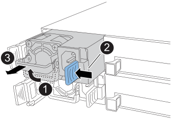

= 電源装置をホットスワップします - NS224 シェルフ
:allow-uri-read: 
:icons: font
:imagesdir: ../media/

[role="lead"]
電源がオンになっている NS224 ドライブシェルフおよび I/O の実行中には、障害が発生した電源装置を無停止で交換できます。

.このタスクについて
* この手順は、NSM100またはNSM100Bモジュールを搭載したNS224シェルフに該当します。
* 異なる効率定格または異なる入力タイプの電源装置を混在させないでください。
+
いつものように同じように置換します。

* 複数の電源装置を交換する場合は、シェルフの電源を維持するために、一度に 1 つずつ交換する必要があります。
* *ベストプラクティス：* NSMから電源装置を取り外してから2分以内に交換することを推奨します。
+
2 分を超えてもシェルフは機能しますが、電源装置が交換されるまでデグレード状態の電源装置に関するメッセージが ONTAP からコンソールに送信されます。

* ファームウェアをシェルフおよびそのコンポーネントに対応しないバージョンにリバートしないでください。
* 影響を受けるシェルフの物理的な位置を特定するために、必要に応じてシェルフのロケーション（青色の） LED を点灯できます。「 storage shelf location -led modify -shelf-name _shelf_name _led-status on
+
該当するシェルフの「 shelf_name 」がわからない場合は、「 storage shelf show 」コマンドを実行します。

+
シェルフにはロケーションLEDが3つあります（オペレータ用ディスプレイパネルに1つ、各NSMに1つ）。ロケーションLEDは30分間点灯したままになります。点灯を中止するには、同じコマンドを off オプションに変更して入力します。

* 交換用電源装置を開封したら、障害が発生した電源装置を返送するときのために、梱包材はすべて保管しておいてください。
+
RMA 番号を確認する場合や、交換用手順に関するその他のサポートが必要な場合は、テクニカルサポートにお問い合わせください https://mysupport.netapp.com/site/global/dashboard["ネットアップサポート"^]にアクセスするか、日本国内サポート用電話番号：国内フリーダイヤル 0066-33-123-265 または 0066-33-821-274 （国際フリーフォン 800-800-80-800 も使用可能）までご連絡ください。

* NS224シェルフのAC電源装置を交換する場合は、次のアニメーションを参照して、作業を開始する前に手順を確認してください。このアニメーションでは、NSM100モジュールを搭載したNS224を示していますが、手順はNSM100Bモジュールを搭載したシェルフでも同じです。
+
.NS224のAC電源装置の交換
[%collapsible]
====
.NS224シェルフのAC電源装置のホットスワップ
video::5794da63-99aa-425a-825f-aa86002f154d[panopto]
====

PSUのタイプ（ACまたはDC）に応じた手順 を使用します。

[role="tabbed-block"]
====
.オプション1：AC電源装置を交換します
--
AC電源装置を交換するには、次の手順を実行します。

.手順
. 自身の適切な接地対策を行います
. 障害が発生した電源装置を物理的に特定します。
+
障害が発生した電源装置を示す警告メッセージがシステムコンソールに記録されます。また、シェルフのオペレータ用ディスプレイパネルの警告（黄色） LED が点灯し、障害が発生した電源装置の 2 色 LED が赤色に点灯します。

. 電源コード固定クリップを開き、電源装置から電源コードを抜きます。
+
電源装置には電源スイッチはありません。

. 電源装置を取り外します。
+

+
[cols="1,3"]
|===

 a| 
image:../media/icon_round_1.png["番号1"]
 a| 
ハンドルを上に回転させて水平位置にし、持ちます。

 a| 
image:../media/icon_round_2.png["番号2"]
 a| 
青色のタブを親指で押して、ロックを解除します。

 a| 
image:../media/icon_round_3.png["番号3"]
 a| 
もう一方の手で電源装置の重量を支えながら、NSMから電源装置を引き出します。

|===
. 交換用電源装置を挿入します。
+
.. 両手で支えながら、電源装置の端をNSMの開口部に合わせます。
.. カチッという音がしてロックが所定の位置に収まるまで、電源装置をNSMにそっと押し込みます。
+

NOTE: 力を入れすぎないように注意してください。内部コネクタが破損することがあります。

.. ハンドルを下に回転させて、通常の操作の妨げにならないようにします。

. 電源コードを電源装置に接続し、電源コード固定クリップを使用して電源コードを固定します。
+
電源装置が正常に動作している場合は、 LED が緑色に点灯します。

--
.オプション2：DC電源装置を交換します
--
DC電源装置を交換するには、次の手順を実行します。

. 自身の適切な接地対策を行います
. 障害が発生した電源装置を物理的に特定します。
+
障害が発生した電源装置を示す警告メッセージがシステムコンソールに記録されます。また、シェルフのオペレータ用ディスプレイパネルの警告（黄色） LED が点灯し、障害が発生した電源装置の 2 色 LED が赤色に点灯します。

. 電源装置の接続を解除します。
+
.. D-SUB DC電源ケーブルコネクタの2本の蝶ネジを外します。
+
手順4の図と表は、2本の蝶ネジ（項目1）とD-SUB DC電源ケーブルコネクタ（項目2）を示しています。

.. D-sub DC電源ケーブルコネクタを電源装置から取り外し、脇に置きます。

. 電源装置を取り外します。
+
.. ハンドルを上に回転させて水平位置にし、持ちます。
.. 親指でテラコッタタブを押してロック機構を解除します。
.. もう一方の手で電源装置の重量を支えながら、NSMから電源装置を引き出します。
+

NOTE: 電源装置は奥行きがないので、NSMから取り外すときは、NSMが振動して怪我をしないように、必ず両手で支えてください。

+
image::../media/drw_dcpsu_remove-replace-generic_IEOPS-788.svg[DC PSUの取り外し]

+
[cols="1,3"]
|===

 a| 
image:../media/icon_round_1.png["番号1"]
 a| 
サムスクリュー

 a| 
image:../media/icon_round_2.png["番号2"]
 a| 
D-SUB DC電源ケーブルコネクタ

 a| 
image:../media/icon_round_3.png["番号3"]
 a| 
電源装置ハンドル

 a| 
image:../media/icon_round_4.png["番号4"]
 a| 
青/ Terra cotta電源ロックタブ

|===

. 交換用電源装置を挿入します。
+
.. 両手で支えながら、電源装置の端をNSMの開口部に合わせます。
.. カチッという音がしてロックが所定の位置に収まるまで、電源装置をNSMにそっと押し込みます。
+
電源装置は、内部コネクタとロック機構に正しくはめ込まれている必要があります。電源装置が正しく装着されていない場合は、この手順を繰り返します。

+

NOTE: 力を入れすぎないように注意してください。内部コネクタが破損することがあります。

.. ハンドルを下に回転させて、通常の操作の妨げにならないようにします。

. D-sub DC電源ケーブルを再接続します。
+
電源装置への電力供給が復旧すると、ステータス LED が緑色に点灯します。

+
.. D-SUB DC電源ケーブルコネクタを電源装置に接続します。
.. 2本の蝶ネジを締めて、D-sub DC電源ケーブルコネクタを電源装置に固定します。

--
====