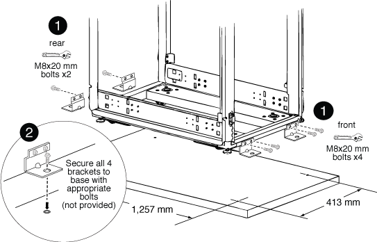

= ボルトダウンキットを取り付ける
:allow-uri-read: 
:icons: font
:imagesdir: ../media/

[role="lead"]
オプションのボルトダウンキットを取り付けると、システムキャビネットを床に固定できます。キットを取り付けると、システムキャビネットが所定の位置から移動しないようになります。

ボルトダウンブラケットごとに、床に適したアンカーボルトを用意する必要があります。

. システムキャビネットを設置する床の場所をマークし、キャビネットをその位置に移動します。
+

+
|===

 a| 
image:../media/legend_icon_01.png["番号1"]

 a| 
前面および背面のボルトダウンブラケット

 a| 
image:../media/legend_icon_02.png["番号2"]

 a| 
ブラケット上の床のアンカーポイントの位置

|===
. 背面のボルトダウンブラケットを床に固定するアンカーポイントをマークし、ブラケット用の穴を開けます。
+
床に適したサイズとタイプのボルトを使用してください。

. ボルトダウンブラケットが低すぎてシステムキャビネットフレームのマウントポイントの位置と合わない場合は、床の穴の上にスペーサーブラケットを取り付けます。
. 背面ブラケットを床にボルトで緩く固定し、キットのボルトを使用してブラケットをキャビネットフレームに固定します。
. 前面のボルトダウンブラケットを床に固定するアンカーポイントをマークし、ブラケット用の穴を開けます。
. ボルトダウンブラケットが低すぎてシステムキャビネットフレームのマウントポイントの位置と合わない場合は、床の穴の上にスペーサーブラケットを取り付けます。
. 前面ブラケットを床にボルトで固定し、キットのボルトを使用してブラケットをキャビネットフレームに固定します。
. 必要に応じて水平調節脚を下げ、背面のボルトダウンブラケットを床に固定します。

