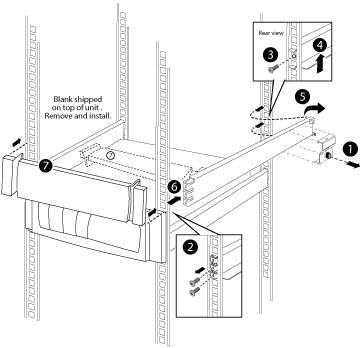

= システムキャビネットに機器を設置
:allow-uri-read: 
:icons: font
:imagesdir: ../media/

[role="lead"]
サポートレールを追加でシステムキャビネットに取り付けたら、他のシステムコンポーネントがすでに取り付けられているシステムキャビネットにコンポーネントを追加したり、既存のシステムコンポーネントを空のシステムキャビネットに追加したりできます。

. システムキャビネットの背面ドアと前面ドアが開いていない場合は、ロックを解除して開きます。
. 機器の設置手順に従って、機器をシステムキャビネットに設置します。
+
ストレージコントローラは、システムキャビネットの中央に配置する必要があります。ディスクシェルフは、ストレージコントローラの上および下に配置する必要があります。すべてのスイッチは、システムキャビネットの最上部に配置する必要があります。

+

NOTE: 機器のマウントフランジがサポートレールのネジ穴よりも上に来る場合は、必要に応じて、サポートレールの上にケージナットを取り付け、キャビネットに機器を固定します。

. システムキャビネットの空のベイにブランクパネルを取り付けます。
+
機器が取り付けられた状態でシステムキャビネットを受け取った場合は、次の図に示すように、空のキャビネットベイのすぐ下にある機器の上にある固定レールを取り外す必要があります。

+

. 前面と背面のシステムキャビネットドアを再度取り付けます。

