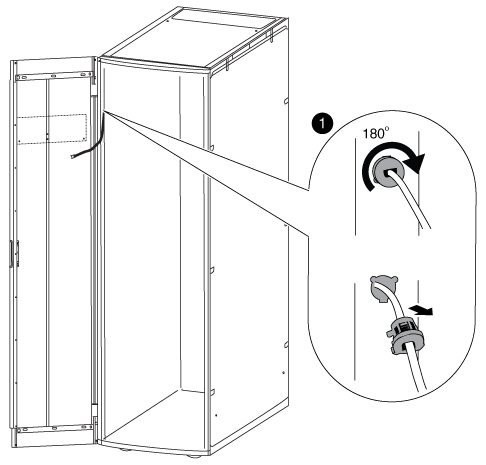

= バッジの電源装置とケーブルを移動します
:allow-uri-read: 
:icons: font
:imagesdir: ../media/

[role="lead"]
ドアを反転して照光バッジを再度取り付ける前に、電源装置と照光バッジのケーブルをシステムキャビネットフレームの反対側に移動する必要があります。

システムキャビネットのドアとサイドパネルを取り外しておく必要があります。

システムキャビネットのドアを反転させる際には、照光バッジの電源装置、電源ケーブル、およびケーブルコンジットをシステムキャビネットの反対側に移動する必要があります。このアセンブリは、バッジへのケーブルがキャビネットのドアのヒンジ側に来るように設計されています。

. 電源ケーブルの固定クリップを開き、電源装置から電源ケーブルを外します。
. 図を参照しながら、電源装置のケースと電源装置を取り外します。
+
image::../media/drw_sys_cab_bezel_psu_remove_ozeki.gif[DRW sys cab bezel PSU remove ozek]

+
.. 電源装置ケースの固定ピンを持ち上げ、ケースカバーを下に回転させて背面の電源装置ケースから外します。
+

NOTE: 電源装置は、フックとループパッチを使用して電源装置ケースに取り付けられています。

.. 照光バッジのケーブルから電源装置を外し、電源装置と電源装置カバーを横に置きます。
.. システムキャビネットフレームに取り付けられている電源装置ケースの上部と下部からネジを外し、電源装置ケースを取り外します。

. 電源装置と電源装置ケースをシステムキャビネットの反対側に取り付けます。
+
.. キャビネットフレームにある 2 つの隣り合ったネジ穴の位置を確認し、電源装置ケースの上部を下のネジ穴に取り付けます。
+

NOTE: 下部のケーブル固定ストラップがある場合は、取り外しが必要になることがあります。

.. 電源装置ケースの底部をシステムキャビネットフレームに固定します。
.. カバーフックを電源装置の背面に合わせ、プランジャをカバーの上に引き上げて回転させて閉じ、プランジャをリリースして電源装置カバーと電源装置を取り付けます。

. 固定クリップからコンジット固定クリップを外して、ベゼルの電源装置のコンジットを取り外します。次に、コンジットを電源ケーブルからスライドさせて外します。
+
固定クリップとネジはコンジットをキャビネットの反対側に取り付けるために保管しておいてください。

+
image::../media/drw_sys_cab_bezel_power_conduit_ozeki.gif[DRW sys cab beel power conduit ozek]

. バッジの電源ケーブルをキャビネットの反対側に移動します。
+

+
.. キャビネットのゴム製ケーブル固定クリップを右に 180 度回転させてシステムキャビネットフレームから外し、ケーブルをシステムキャビネットから慎重に引き出します。
.. ケーブルをキャビネットの反対側に移動し、キャビネット上部近くにある穴に最後まで通します。
.. ゴム製ケーブル固定クリップをフレームの穴に合わせ、できるだけ奥まで押し込み、左に 180 度回転させて固定します。
.. キャビネットフレームに沿ってキャビネットの背面までケーブルを配線します。

. ケーブルコンジットを取り付け直します。
+
.. PDU 電源ケーブルの上にコンジットをスライドさせ、システムキャビネットフレームに沿って PDU までコンジットを配線します。
.. キャビネットの反対側からコンジット固定クリップをコンジットの上に取り付けて、キャビネットフレームに固定します。

. バッジケーブルを電源装置に再接続します。ただし電源装置は電源に再接続しないでください。

