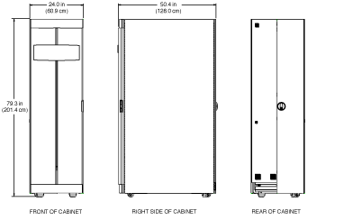
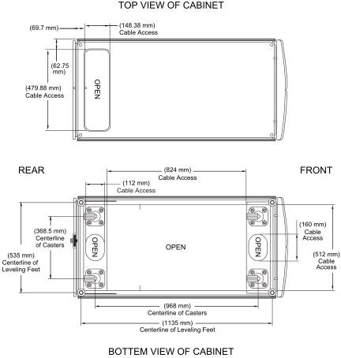

= スペース要件とシステムキャビネットの寸法
:allow-uri-read: 
:icons: font
:imagesdir: ../media/

[role="lead"]
システムキャビネットを開梱するときは、システムキャビネットを梱包材から取り出すための十分なスペースがあることを確認する必要があります。また、システムキャビネットの設置場所にキャビネットを移動して接地するのに十分な広さがあることを確認してください。

== システムキャビネットの開梱に必要なスペース

次の表に、システムキャビネットの開梱と設置に必要なスペースを示します。

[cols="2,1,1"]
|===
| 寸法（ Dimensions ） | 米国 | メートル法 

 a| 
ローディングランプ
 a| 
80 インチ
 a| 
203.2 cm

 a| 
キャビネットを移動するためのランプの先のクリアランス
 a| 
72 インチ
 a| 
182.9 cm

 a| 
輸送パレットの奥行
 a| 
59 インチ
 a| 
149.9 cm

 a| 
輸送パレットの幅
 a| 
42 インチ
 a| 
106.6 cm

 a| 
輸送パレットと梱包材の高さ
 a| 
86 インチ
 a| 
218.4 cm

 a| 
総ラックスペース、 42U
 a| 
73.5 インチ
 a| 
186.7 cm

 a| 
レールの積載量
 a| 
現在のすべてのシステムをサポートします
 a| 
現在のすべてのシステムをサポートします

 a| 
空の重量
 a| 
最大 181 kg （ 400 ポンド
 a| 
最大 181 kg

 a| 
フル装備の出荷重量
 a| 
最大 1 、 800 ポンド
 a| 
最大 816.5 kg

 a| 
フル装備の静荷重
 a| 
最大 2 、 700 ポンド
 a| 
最大 1 、 224.7kg

 a| 
前面のクリアランス
 a| 
47.2 インチ
 a| 
120 cm

 a| 
リアサービスクリアランス * 注： * リアドアは分割されています。実際の背面の最小クリアランスは、推奨値の約 1/2 です。
 a| 
30 インチ
 a| 
76.3 cm

 a| 
パネルを取り外す際の側面の最小クリアランス
 a| 
24 インチ
 a| 
61 cm

 a| 
上部の最小クリアランス
 a| 
12 インチ
 a| 
30 cm

|===

== システムキャビネットの外寸

次の図は、システムキャビネットの前面、背面、および側面を示しています。

次の図は、システムキャビネットを上と下から見たところです。ケーブルの束をデータセンターの床からシステムキャビネットに通すための開口部も示しています。また、システムキャビネットのキャスターと水平調節脚の位置も示しています。

注意

システムキャビネットによってデータセンターの床が抜けないように、システムキャビネットの底にあるケーブル用開口部よりも広いフロア開口部の上にシステムキャビネットを移動しないでください。

