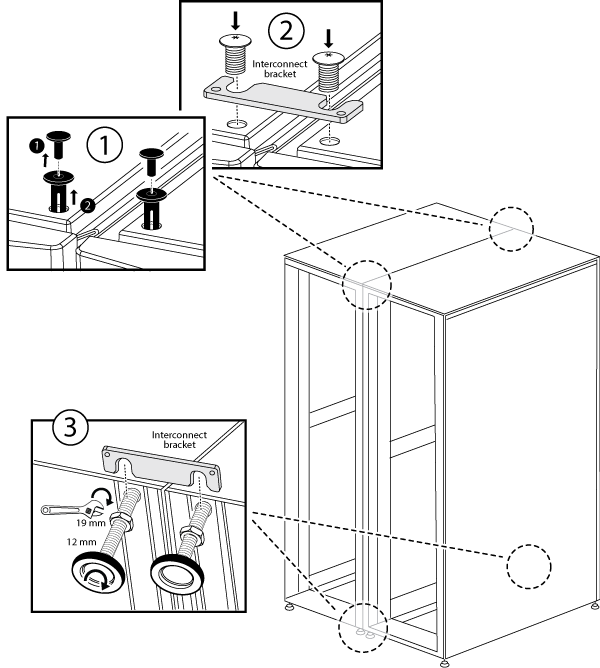

= キャビネットインターコネクトキットを取り付けます
:icons: font
:imagesdir: ../media/

[role="lead"]
オプションのキャビネットインターコネクトキットを使用して、システムキャビネットどうしを接続できます。キャビネットどうしが離れてケーブルが破損しないように、キットを取り付けることを推奨します。

. システムキャビネットを近付けて配置します。
+
次の図のように、コントローラモジュールを搭載したキャビネットを真ん中に、ディスクシェルフを追加したキャビネットをその両側に配置する必要があります。キャビネットの側面どうしが触れ合わない程度の近さに配置します。

+
image::../media/drw_fcc_cabinet_ordering.png[この図には説明が付随しています。]

. 推奨事項に従ってサイドパネルをオンにしたインターコネクトキットを取り付ける場合は、開梱時に取り外したサイドパネルを再度取り付けます。
+
.. システムキャビネットの底部から約 15 度離してサイドパネルを持ち上げ、システムキャビネットフレーム上部の縁に掛けます。
.. サイドパネルをキャビネットフレームに慎重に押し込み、キーを使用して所定の位置にロックします。
.. 残りのサイドパネルについても、上記の手順を繰り返します。

. サイドパネルを取り外した状態でインターコネクトキットを取り付ける場合は、前面ドアを取り外します。ドアのヒンジは、キャビネットどうしが接する部分にあります。
+
.. 前面ドアのロックを解除して開きます。
.. 次の図を参照して、照光ベゼルの電源を取り外します。
+
image::../media/drw_sys_cab_remove_brimstone_back_banel.png[DRW sys cab remove brimstone back baneel （ DRW sys キャブがブリムストーンバックバネル]

+
|===

 a| 
image:../media/legend_icon_01.png[""]

 a| 
照光ベゼルの回路基板とケーブル

 a| 
image:../media/legend_icon_02.png[""]

 a| 
背面パネルと取り付けネジ

|===
.. 次の図を参考にして、フロントドアを取り外します。
+
image::../media/drw_sys_cab_front_door_daiginjo.png[DRW sys cab front door daiginjo]

+
|===

 a| 
image:../media/legend_icon_01.png[""]

 a| 
ドアの接地ケーブル

 a| 
image:../media/legend_icon_02.png[""]

 a| 
ドア上部のヒンジ

 a| 
image:../media/legend_icon_03.png[""]

 a| 
ヒンジピン

|===
+
取り外したドアが誤って破損しないように、安全な場所に保管してください。

. 背面ドアを取り外します。ドアのヒンジは、キャビネットどうしが接する部分にあります。
+
.. 背面ドアのロックを解除して開きます。
.. 上部のヒンジピンを持ち上げて、ヒンジの底部から外します。
.. ドアの上部をシステムキャビネットフレームから慎重に傾けて離し、ヒンジピンを外します。
.. ドアを持ち上げて下部のヒンジから外し、脇に置きます。

. システムキャビネットをすべて一緒に移動し、システムキャビネットの底部にある 4 つの水平調節脚を調整して同じ高さに合わせます。
. インターコネクトブラケットを取り付けます。
+
** 推奨事項に従って、システムキャビネットのサイドパネルにインターコネクトブラケットを取り付ける場合は、次の図を参照してください。

+
|===

 a| 
image:../media/legend_icon_01.png[""]

 a| 
システムキャビネット上部のプラスチック製プッシュリベット

 a| 
image:../media/legend_icon_02.png[""]

 a| 
上部インターコネクトブラケット

 a| 
image:../media/legend_icon_03.png[""]

 a| 
下部インターコネクトブラケット

|===
+
** システムキャビネットのサイドパネルを外した状態でインターコネクトブラケットを取り付ける場合は、次の図を参考にしてください。image:../media/drw_syscab_interconnect_bracket_side_panels_off.gif[""]

. 残りのシステムキャビネットについても同じ手順を繰り返します。
. インターコネクトブラケットのネジをすべて締めます。

