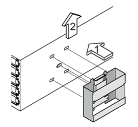

= IOM12 / IOM12Bモジュールを搭載したシェルフをホットリムーブします
:allow-uri-read: 
:icons: font
:imagesdir: ../media/

[role="lead"]
IOM12 / IOM12Bモジュールを搭載したディスクシェルフを移動または交換する必要がある場合は、電源がオンでI/Oが実行中のシステムからディスクシェルフを無停止でホットリムーブできます。ホットリムーブでは、ディスクシェルフのスタックから任意のディスクシェルフを取り外したり、ディスクシェルフのスタック全体を取り外したりできます。

.作業を開始する前に
* マルチパスHA、トライパスHA、マルチパス、クアッドパスHA、またはクアッドパス構成のシステムである必要があります。
+
内蔵ストレージを搭載したプラットフォームでは、外付けストレージがマルチパスHA、トライパスHA、またはマルチパス構成で接続されている必要があります。

+

NOTE: 外付けストレージがマルチパス接続でケーブル接続されている FAS2600 シリーズシングルコントローラシステムの場合、内蔵ストレージはシングルパス接続を使用するため、システムは混在パス構成になります。

* システムに SAS ケーブル接続のエラーメッセージが表示されていない必要があります。
+
Active IQ Config Advisor をダウンロードして実行することで、 SAS ケーブル接続に関するエラーメッセージと対処方法を確認できます。

+
https://mysupport.netapp.com/site/tools["ネットアップのダウンロード： Config Advisor"^]

* HA ペア構成がテイクオーバー状態のときには実行できません。
* 取り外すディスクシェルフのディスクドライブからすべてのアグリゲートを削除しておく必要があります（ディスクドライブはスペアである必要があります）。
+

NOTE: この手順を取り外すディスクシェルフにアグリゲートが含まれた状態で実行しようとすると、システムでエラーが発生し、複数のディスクがパニック状態になることがあります。

+
「 storage aggregate offline -aggregate _aggregate-name _ 」コマンドを実行し、「 storage aggregate delete -aggregate _aggregate-name _ 」コマンドを実行します。

* スタックからディスクシェルフを取り外す場合は、取り外すディスクシェルフをバイパスする距離を考慮する必要があります。そのため、現在のケーブルでは長さが足りない場合は、もっと長いケーブルを用意する必要があります。

.このタスクについて
* * ベストプラクティス： * 取り外すディスクシェルフのディスクドライブからアグリゲートを削除したあとで、ディスクドライブの所有権を削除することを推奨します。
+
所有権情報を削除したスペアディスクドライブは、必要に応じて別のノードに適切に統合できます。

[NOTE]
====
ディスクドライブの所有権を削除する手順では、ディスク所有権の自動割り当てを無効にする必要があります。ディスク所有権の自動割り当ては、この手順の最後で再度有効にします。

https://docs.netapp.com/us-en/ontap/disks-aggregates/index.html["ディスクとアグリゲートの概要"^]

====
* ノードが 3 つ以上の clustered ONTAP システムでは、定期的なメンテナンスを実行していない HA ペアにイプシロンを再割り当てすることを推奨します。
+
イプシロンを再割り当てすることで、 clustered ONTAP システムのすべてのノードに影響を及ぼす予測不可能なエラーの発生リスクを最小限に抑えることができます。次の手順に従って、イプシロンが設定されているノードを特定し、必要に応じてイプシロンを再割り当てできます。

+
.. 特権レベルを advanced に設定します :'set -privilege advanced
.. イプシロンが設定されているノードを特定します cluster show
+
イプシロンを保持しているノードの Epsilon カラムには true と表示されます（イプシロンが設定されていないノードには、「 false 」と表示されます）。

.. メンテナンス中の HA ペアのノードに「 true 」（イプシロンが設定されている）と表示されている場合は、ノードからイプシロンを削除します。「 cluster modify -node _node_name __ -epsilon false
.. 別の HA ペアのノードにイプシロンを割り当てます。 cluster modify -node node_name に -epsilon true
.. admin 権限レベルに戻ります。「 set -privilege admin 」

* スタックからディスクシェルフをホットリムーブする（スタックは残す）場合は、コントローラとスタックが常にシングルパスで接続されるよう、一度に 1 つずつパス（パス A 、次にパス B ）をケーブルで再接続して確認し、取り外すディスクシェルフをバイパスします。
+

NOTE: スタックをケーブルで再接続して取り外すディスクシェルフをバイパスするときに、コントローラとスタック間のシングルパス接続を維持しないと、システムで複数のディスクがパニック状態になる可能性があります。

* *シェルフの破損の可能性：* DS460Cシェルフをデータセンターの別の場所に移動する場合、または別の場所に移動する場合は、この手順の最後にある「DS460Cシェルフの移動または転送」セクションを参照してください。

.手順
. システム構成がであることを確認します `Multi-Path HA`、 `tri-path HA`、 `Multi-Path`、 `Quad-path HA`または `Quad-path` を実行します `sysconfig` いずれかのコントローラのノードシェルからコマンドを実行します。
+
システムで検出が完了するまで、 1 分程度かかる場合があります。

+
構成は「システムストレージ構成」フィールドに表示されます。

+

NOTE: 外付けストレージがマルチパス接続でケーブル接続されている FAS2600 シリーズシングルコントローラシステムの場合、内蔵ストレージはシングルパス接続を使用しているため、出力は「 mimmired-path 」と表示されます。

. 取り外すディスクシェルフのディスクドライブにアグリゲートがないこと（スペアであること）、および所有権が削除されていることを確認します。
+
.. いずれかのコントローラのクラスタシェルで次のコマンドを入力します。「 storage disk show -shelf_shelf_number _ 」
.. 出力をチェックし、取り外すディスクシェルフのディスクドライブにアグリゲートがないことを確認します。
+
ディスク・ドライブにアグリゲートがない場合 ' Container Name 列にダッシュが表示されます

.. 出力をチェックし、取り外すディスクシェルフのディスクドライブから所有権が削除されていることを確認します。
+
所有権のないディスク・ドライブの場合は ' Owner 列にダッシュが表示されます

+

NOTE: 取り外すシェルフに障害が発生したディスク・ドライブがある場合は ' Container Type 列に破損しています障害が発生したディスクドライブには所有権がありません。

+
次の出力は、取り外すディスクシェルフ（ディスクシェルフ 3 ）のディスクドライブが、ディスクシェルフを取り外すための正しい状態にあることを示しています。アグリゲートはすべてのディスクドライブから削除されているため、各ディスクドライブの「 Container Name 」列にダッシュが表示されます。所有権もすべてのディスク・ドライブから削除されますしたがって ' 各ディスク・ドライブの [Owner] 列にダッシュが表示されます

+
[listing]
----
cluster::> storage disk show -shelf 3

           Usable           Disk   Container   Container
Disk         Size Shelf Bay Type   Type        Name       Owner
-------- -------- ----- --- ------ ----------- ---------- ---------
...
1.3.4           -     3   4 SAS    spare                -         -
1.3.5           -     3   5 SAS    spare                -         -
1.3.6           -     3   6 SAS    broken               -         -
1.3.7           -     3   7 SAS    spare                -         -
...
----
. 取り外すディスクシェルフの物理的な位置を確認します。
+
影響を受けるディスクシェルフの物理的な位置を特定するために、必要に応じてディスクシェルフのロケーション（青色の） LED を点灯できます。「 storage shelf location -led modify -shelf-name _shelf_name _led-status on

+

NOTE: ディスクシェルフにはロケーション LED が 3 つあります。オペレータ用ディスプレイパネルに 1 つと、各 IOM12 モジュールに 1 つです。ロケーション LED は 30 分間点灯します。点灯を中止するには、同じコマンドを off オプションに変更して入力します。

. ディスクシェルフのスタック全体を取り外す場合は、以下の手順を実行します。それ以外の場合は、次の手順に進みます。
+
.. パス A （ IOM A ）とパス B （ IOM B ）のすべての SAS ケーブルを取り外します。
+
これには、取り外すスタックのすべてのディスクシェルフとコントローラ、およびシェルフ同士を接続するケーブルが含まれます。

.. 手順 9. に進みます。

. スタックから 1 台以上のディスクシェルフを取り外す（スタックは残す）場合は、該当する一連の手順を実行して、取り外すディスクシェルフを迂回してパス A （ IOM A ）スタックのケーブルをつなぎ直します。
+
スタックのディスクシェルフを複数取り外す場合は、該当する一連の手順を各ディスクシェルフに対して実行します。

+

NOTE: ポートを接続する前に、 10 秒以上待機します。SAS ケーブルのコネクタは、誤挿入を防ぐキーイングが施されているため、正しい向きで SAS ポートに取り付けるとカチッとはまり、ディスクシェルフの SAS ポートの LNK LED が緑色に点灯します。ディスクシェルフの場合は、 SAS ケーブルのコネクタをプルタブ（コネクタの下側）を下にして挿入します。

+
[cols="2*"]
|===
| 取り外す機器 | 作業 

 a| 
スタックのいずれかの終端にあるディスクシェルフ（論理上最初または最後のディスクシェルフ）
 a| 
.. 取り外すディスクシェルフの IOM A ポートからシェルフ / シェルフ間のケーブルをすべて取り外し、脇に置きます。
.. 取り外すディスクシェルフの IOM A ポートに接続されているコントローラ / スタック間のケーブルをすべて取り外し、スタック内の次のディスクシェルフの同じ IOM A ポートに接続します。
+
「次の」ディスク・シェルフは、ディスク・シェルフを取り外すスタックのどの終端から取り外すかに応じて、取り外すディスク・シェルフの上または下に配置できます。

 a| 
スタック A の中間のディスクシェルフのディスクシェルフは、他のディスクシェルフにのみ接続されます。コントローラには接続されません。
 a| 
.. 取り外すディスクシェルフの IOM A のポート 1 と 2 、またはポート 3 と 4 、および次のディスクシェルフの IOM A からシェルフ / シェルフ間のケーブルをすべて取り外し、脇に置きます。
.. 取り外すディスクシェルフの IOM A ポートに接続されている残りのシェルフ / シェルフ間ケーブルを取り外し、スタック内の次のディスクシェルフの同じ IOM A ポートに接続します。「次の」ディスク・シェルフは ' どの IOM A ポート（ 1 と 2 または 3 と 4 ）からケーブルを取り外したかに応じて ' 取り外すディスク・シェルフの上または下に配置できます

|===
+
スタックの終端または中間からディスクシェルフを取り外す場合、次のケーブル接続例を参照できます。ケーブル接続例については、次の点に注意してください。

+
** IOM12 / IOM12Bモジュールは、DS224CまたはDS212Cディスクシェルフの場合と同様に横に並べて配置されます。DS460Cを使用している場合は、IOM12 / IOM12Bモジュールは縦に並べて配置されます。
** 各例のスタックは、標準のシェルフ/シェルフ間ケーブル接続でケーブル接続されています。このケーブルは、マルチパスHA、トライパスHA、またはマルチパス接続でケーブル接続されたスタックで使用されます。
+
スタックがクアッドパス HA またはクアッドパス接続でケーブル接続されていて、 2 倍幅シェルフ / シェルフ間ケーブル接続の場合は、ケーブルの再接続方法を推測してください。

** ケーブル接続の例では、パスの 1 つであるパス A （ IOM A ）を再接続する方法を示しています。
+
パス B （ IOM B ）についても同じ手順を繰り返してください。

** スタックの終端からディスクシェルフを取り外すケーブル接続例では、マルチパスHAまたはトライパスHA接続でケーブル接続されたスタック内の論理的に最後のディスクシェルフを取り外す方法を示しています。
+
スタック内の論理上最初のディスクシェルフを取り外す場合やスタックにマルチパス接続がある場合は、例をもとにケーブルの再接続方法を推測してください。

+
image::../media/drw_hotremove_end.gif[DRW ホットリ除去終了]

+
image::../media/drw_hotremove_middle.gif[DRW ホットリ除去ミドル]

. 取り外すディスクシェルフをバイパスし、パス A （ IOM A ）スタック接続を正しく再確立したことを確認します。「 storage disk show -port 」
+
HA ペア構成の場合は、どちらかのコントローラのクラスタシェルからこのコマンドを実行します。システムで検出が完了するまで、 1 分程度かかる場合があります。

+
出力の最初の 2 行は、パス A とパス B の両方を介して接続されているディスクドライブを示しています出力の最後の 2 行は、単一パスのパス B を介して接続されているディスクドライブを示しています

+
[listing]
----
cluster::> storage show disk -port

PRIMARY  PORT SECONDARY      PORT TYPE SHELF BAY
-------- ---- ---------      ---- ---- ----- ---
1.20.0   A    node1:6a.20.0  B    SAS  20    0
1.20.1   A    node1:6a.20.1  B    SAS  20    1
1.21.0   B    -              -    SAS  21    0
1.21.1   B    -              -    SAS  21    1
...
----
. 次の手順は、「 storage disk show -port 」コマンドの出力によって異なります。
+
[cols="2*"]
|===
| 出力の内容 | 作業 

 a| 
スタック内のすべてのディスクドライブがパス A とパス B を介して接続されています。ただし、切断したディスクシェルフ内のディスクドライブはパス B を介してのみ接続されています
 a| 
次の手順に進みます。

取り外すディスクシェルフがバイパスされ、スタック内の残りのディスクドライブにパス A が再確立されています。

 a| 
上記以外
 a| 
手順 5 と 6 を繰り返します。

ケーブル接続を修正する必要があります。

|===
. （スタック内の）取り外すディスクシェルフに対して、次の手順を実行します。
+
.. パス B について、手順 5~7 を実行します
+

NOTE: スタックを正しくケーブル接続した場合、手順 7 では、パス A とパス B を介して接続されている残りのディスクドライブのみが表示されます

.. 手順 1 を繰り返して、スタックからディスクシェルフを取り外す前と同じシステム構成であることを確認します。
.. 次の手順に進みます。

. この手順の準備作業としてディスクドライブから所有権を削除するときにディスク所有権の自動割り当てを無効にした場合は、次のコマンドを入力して再度有効にします。それ以外の場合は、次の手順に進みます。「 storage disk option modify -autoassign on 」
+
HA ペア構成の場合は、両方のコントローラのクラスタシェルからこのコマンドを実行します。

. 切断したディスクシェルフの電源をオフにし、ディスクシェルフから電源コードを抜きます。
. ラックまたはキャビネットからディスクシェルフを取り外します。
+
ディスクシェルフを軽くして扱いやすくするために、電源装置と I/O モジュール（ IOM ）を取り外します。

+
DS460Cディスクシェルフの場合、フル装備のシェルフの重量は112kg（247ポンド）近くになることがあるため、ラックまたはキャビネットからシェルフを取り外すときは、次の点に注意してください。

+

CAUTION: DS460Cシェルフを安全に移動するためには、リフトハンドルを使用してリフトを使用するか4人で運搬することを推奨します。

+
DS460Cの出荷時は、4個の着脱式リフトハンドル（両側に2個）が同梱されています。取っ手を使用するには、シェルフ側面のスロットにハンドルのタブを挿入し、カチッと音がして所定の位置に収まるまで押し上げます。次に、ディスクシェルフをレールにスライドさせたら、サムラッチを使用して一度に1組のハンドルを外します。次の図は、リフトハンドルを取り付ける方法を示しています。

+

+
DS460Cシェルフをデータセンターの別の場所に移動する場合、または別の場所に転送する場合は、「DS460Cシェルフの移動または転送」のセクションを参照してください。

.DS460Cシェルフを移動または移動する
DS460Cシェルフをデータセンターの別の部分に移動したり、シェルフを別の場所に移動したりする場合は、ドライブドロワーやドライブの破損を防ぐために、ドライブドロワーからドライブを取り外す必要があります。

* 新しいシステムの設置時またはシェルフのホットアドの一環としてDS460Cシェルフを設置した場合は、ドライブのパッケージ化材を保存したあとに、それらを移動する前にドライブを再パッケージ化してください。
+
梱包材を保管していない場合は、ドライブをやわらかい場所に置くか、別のクッション付きのパッケージを使用してください。ドライブ同士を積み重ねないでください。

* ドライブを扱う前に、ESDリストストラップを着用し、ストレージエンクロージャのシャーシの塗装されていない表面部分にリストストラップを接触させます。
+
リストストラップがない場合は、ドライブに触る前に、ストレージエンクロージャのシャーシの塗装されていない部分を手で触ります。

* ドライブは、次の手順に従って慎重に扱う必要があります。
+
** 取り外し、取り付け、持ち運びなど、ドライブの重量を支えるときは常に両手で作業してください。
+

CAUTION: ドライブキャリアの下側のむき出しになっている基板に手を置かないでください。

** ドライブをぶつけないように注意してください。
** ドライブを磁気デバイスの近くに置かないでください。
+

CAUTION: 磁場によってドライブに保存されているすべてのデータが破損したり、ドライブの回路が故障し、原因 が修理不可能となる場合があります。

