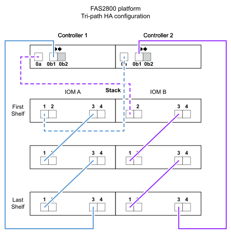
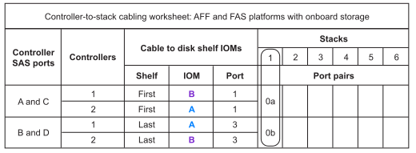

= IOM12 / IOM12Bモジュールを搭載した内蔵ストレージシェルフを使用するプラットフォームのコントローラ/スタック間のケーブル接続ワークシートとケーブル接続例
:allow-uri-read: 
:icons: font
:imagesdir: ../media/

[role="lead"]
記入済みのコントローラ/スタック間のケーブル接続ワークシートとケーブル接続例を使用して、内蔵ストレージを搭載したプラットフォームをケーブル接続できます。

NOTE: この情報は、システム外部のシステムには適用されません。

* 必要に応じて、を参照してください link:install-cabling-rules.html["SASケーブル接続のルールと概念"] サポートされる構成、シェルフ / シェルフ間の接続、およびコントローラ / シェルフ間の接続については、を参照してください。
* ケーブル接続例では、コントローラ/スタック間のケーブル接続のうち、コントローラ0b / 0b1のポート接続を実線で、コントローラ0aのポート接続を点線で区別して示しています。
+
image::../media/drw_fas2600_controller_to_stack_cable_type_key_IEOPS-947.svg[オンボードストレージを搭載したプラットフォーム用のケーブルタイプキー]

* ケーブル接続例では、コントローラ / スタック間の接続とシェルフ / シェルフ間の接続に別の色を使用して、 IOM A （ドメイン A ）経由の接続と IOM B （ドメイン B ）経由の接続を区別しています。
+
image::../media/drw_fas2600_cable_color_key.png[オンボードストレージ搭載プラットフォーム用ケーブルカラーキー]

== 外付けシェルフを使用しないマルチパスHA構成のFAS2820プラットフォーム

次の例は、マルチパスHA接続を実現するためにケーブル配線が不要であることを示しています。

image::../media/drw_fas2800_noshelf_mpha_IEOPS-954.svg[FAS2820マルチパスHA（外付けシェルフなし）]

== FAS2820プラットフォーム（外付けシェルフを使用しないトライパスHA構成

次のケーブル接続例は、トライパス接続を実現するために2台のコントローラ間で必要なケーブル接続を示しています。

image::../media/drw_fas2800_noshelf_tpha_IEOPS-955.svg[外付けシェルフを使用しないFas2800トライパスHAのケーブル接続例]

== 1台のマルチシェルフスタックを使用するトライパスHA構成のFAS2820プラットフォーム

次のワークシートとケーブル接続例では、ポートペア0a / 0b1を使用しています。

image::../media/drw_fas2800_worksheet_IEOPS-948.svg[スタック1のポートペアを示すFAS2820トライパスHAケーブル接続ワークシート]

== マルチパスHA構成で、1つのマルチシェルフスタックに内蔵ストレージが搭載されたプラットフォーム

次のワークシートとケーブル接続の例では、ポートペア 0a / 0b を使用しています。

NOTE: このセクションは、FAS2820またはFAS25XXシステムには適用されません。

image::../media/drw_fas2600_mpha_IEOPS-1256.svg[内蔵ストレージを搭載したプラットフォームのマルチパスHAケーブル接続の例]

== FAS2600 シリーズマルチパス構成、マルチシェルフスタック × 1

次のワークシートとケーブル接続例では、ポートペア 0a / 0b を使用しています。

この例では、コントローラはシャーシのスロット A に取り付けられています。コントローラがシャーシのスロット A にある場合、内蔵ストレージポート（ 0b ）はドメイン A （ IOM A ）にあります。したがって、ポート 0b はスタック内のドメイン A （ IOM A ）に接続する必要があります。

image::../media/drw_fas2600_mp_slot_a_worksheet.png[マルチパス構成のポートペアを示すFAS2600ケーブル接続ワークシート]

image::../media/drw_fas2600_mp_slot_a.png[シャーシスロット1にコントローラを搭載したFAS2600マルチパスのケーブル接続例]

この例では、コントローラはシャーシのスロット B に取り付けられています。コントローラがシャーシのスロット B にある場合、内蔵ストレージポート（ 0b ）はドメイン B （ IOM B ）にあります。したがって、ポート 0b はスタック内のドメイン B （ IOM B ）に接続する必要があります。

image::../media/drw_fas2600_mp_slot_b_worksheet.png[マルチパス構成のポートペアを示すFAS2600ケーブル接続ワークシート]

image::../media/drw_fas2600_mp_slot_b.png[シャーシスロット2にコントローラを搭載したFAS2600マルチパスのケーブル接続例]
