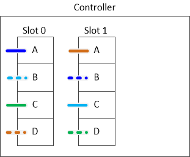
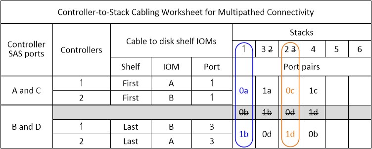

= マルチパス HA 構成の配線ワークシート - DS212C、DS224C、または DS460C
:allow-uri-read: 
:icons: font
:imagesdir: ../media/

[role="lead"]
コントローラとスタック間の配線ワークシートと配線例を使用して、HAペアをマルチパスHA構成として配線できます。これは、IOM12/IOM12Bモジュールを搭載したシェルフに適用されます。

NOTE: ストレージを内蔵していないこの情報環境プラットフォーム。

* 必要に応じて、を参照してください link:install-cabling-rules.html["SASケーブル接続のルールと概念"] サポートされる構成については、コントローラのスロット番号の規則、シェルフ / シェルフ間の接続、およびコントローラ / シェルフ間の接続（ポートペアの使用など）を参照してください。
* 必要に応じて、を参照してください link:install-cabling-worksheets-how-to-read-multipath.html["マルチパス接続でコントローラ / スタック間をケーブル接続するためのワークシートの読み取り方法"]。
* ケーブル接続例では、コントローラ / スタック間のケーブル接続のうち、コントローラ A と C のポート接続を実線で、コントローラ B と D のポート接続を点線で区別して表しています。
+
image::../media/drw_controller_to_stack_cable_type_key.gif[マルチパスHA構成ケーブルタイプキー]

* HA ペアの各スタックへの接続を区別するために、ケーブル接続例のケーブルとワークシートの対応するポートペアに同じ色を使用しています。
+
image::../media/drw_controller_to_stack_cable_color_key_non2600_4stackcolors.gif[マルチパスHA構成ケーブルのカラーキー]

* ワークシートとケーブル接続例では、ケーブル接続のポートペアをワークシートに記載されている順序で示しています。

== クアッドポート SAS HBA を使用したマルチパス HA 構成のコントローラ / スタック間のケーブル接続ワークシートとケーブル接続例

記入済みのコントローラ / スタック間のケーブル接続ワークシートとケーブル接続例を使用して、クアッドポート SAS HBA を備えた一般的なマルチパス HA 構成をケーブル接続できます。これらのコントローラにはオンボード SAS ポートはありません。

=== マルチパス HA ：クアッドポート SAS HBA × 1 、シングルシェルフスタック × 1

次のワークシートとケーブル接続例では、ポートペア 1a / 1d を使用しています。

image::../media/drw_worksheet_mpha_slot_1_one_4porthba_one_singleshelf_stack.gif[1つのクアッドポートSAS HBAおよび1つのシェルフスタックのマルチパスHAケーブル接続ワークシート]

image::../media/drw_mpha_slot_1_one_4porthba_one_singleshelf_stack.gif[マルチパスHAのケーブル接続例（クアッドポートSAS HBA×1、シングルシェルフスタック×1）]

=== マルチパス HA ：クアッドポート SAS HBA × 1 、シングルシェルフスタック × 2

次のワークシートとケーブル接続例では、ポートペア 1a / 1d と 1c / 1b を使用しています。

image::../media/drw_worksheet_mpha_slot_1_one_4porthba_two_singleshelf_stacks.gif[1つのクアッドポートSAS HBAおよび2つのシングルシェルフスタックのマルチパスHAケーブル接続ワークシート]

image::../media/drw_mpha_slot_1_one_4porthba_two_singleshelf_stacks.gif[1つのクアッドポートSAS HBAと2つのシングルシェルフスタックのマルチパスHAのケーブル接続例]

=== マルチパス HA ：クアッドポート SAS HBA × 2 、マルチシェルフスタック × 2

この構成では、 1a / 2b 、 2a / 1d 、 1c / 2d 、 2c / 1b の 4 組のポートペアを使用できます。ポートペアは、特定の順序（ワークシートに記載の順）でケーブル接続するか、 1 つおきに（ポートペアをスキップして）ケーブル接続できます。

NOTE: スタックのケーブル接続に必要となる以上のポートペアがシステムにある場合は、ポートペアをスキップしてシステムの SAS ポートを最適化することを推奨します。SAS ポートを最適化することで、システムのパフォーマンスが最適化されます。

次のワークシートとケーブル接続例は、ポートペアをワークシートに記載された順序で使用していることを示しています。 1a / 2b 、 2a / 1d 、 1c / 2d 、 2c / 1b 。

image::../media/drw_worksheet_mpha_slots_1_and_2_two_4porthbas_two_stacks.gif[2ツノクアツトホオトSASHBAオヨヒ2マルチシエルフスタツクノマルチハスHAケエフルセツソクワアクシイト]

image::../media/drw_mpha_slots_1_and_2_4porthbas_4_stacks.gif[2つのクアッドポートSAS HBAおよび2つのマルチシェルフスタックのマルチパスHAのケーブル接続例]

次のワークシートとケーブル接続例は、ポートペアをスキップしてリスト内の他のポートペア 1a / 2b と 1c / 2d を使用しています。

NOTE: あとで 3 つ目のスタックを追加する場合は、スキップしたポートペアを使用します。

image::../media/drw_worksheet_mpha_slots_1_and_2_two_4porthbas_two_stacks_skipped.gif[スキップしたポートペアを使用する2つのクアッドポートSAS HBAおよび2つのマルチシェルフスタックのマルチパスHAケーブル接続ワークシート]

image::../media/drw_mpha_slots_1_and_2_two_4porthbas_two_stacks_skipped.gif[マルチパスHAのケーブル接続例：2つのクアッドポートSAS HBAおよび2つのマルチシェルフスタック（スキップポートペアを使用）]

== 4 つのオンボード SAS ポートを使用したマルチパス HA 構成のコントローラ / スタック間のケーブル接続ワークシートとケーブル接続例

記入済みのコントローラ / スタック間のケーブル接続ワークシートとケーブル接続例を使用して、オンボード SAS ポートを 4 つ備えた一般的なマルチパス HA 構成をケーブル接続できます。

=== マルチパス HA ：オンボード SAS ポート × 4 、シングルシェルフスタック × 1

次のワークシートとケーブル接続例では、ポートペア 0a~0d を使用します。

image::../media/drw_worksheet_mpha_slot_0_4ports_one_singleshelf_stack.gif[4つのオンボードポートと1つのシェルフスタックのマルチパスHAケーブル接続ワークシート]

image::../media/drw_mpha_slot_0_4ports_one_singleshelf_stack.gif[オンボードポート×4とシングルシェルフスタック×1のマルチパスHAのケーブル接続例]

=== マルチパス HA ：オンボード SAS ポート × 4 、シングルシェルフスタック × 2

次のワークシートとケーブル接続例では、ポートペア 0a~0d と 0c/0b を使用しています。

image::../media/drw_worksheet_mpha_slot_0_4ports_two_singleshelf_stacks.gif[4つのオンボードポートと2つのシングルシェルフスタックのマルチパスHAケーブル接続ワークシート]

image::../media/drw_mpha_slot_0_4ports_two_singleshelf_stacks.gif[4つのオンボードポートと2つのシングルシェルフスタックのマルチパスHAのケーブル接続の例]

=== マルチパス HA ：オンボード SAS ポート × 4 、クアッドポート SAS HBA × 1 、マルチシェルフスタック × 2

この構成では、 0a / 1b 、 1a / 0d 、 0c / 1d 、 1c / 0b の 4 組のポートペアを使用できます。ポートペアは、特定の順序（ワークシートに記載の順）でケーブル接続するか、 1 つおきに（ポートペアをスキップして）ケーブル接続できます。

NOTE: スタックのケーブル接続に必要となる以上のポートペアがシステムにある場合は、ポートペアをスキップしてシステムの SAS ポートを最適化することを推奨します。SAS ポートを最適化することで、システムのパフォーマンスが最適化されます。

次のワークシートとケーブル接続例では、ポートペアをワークシートに記載された順序で使用しています。 0a~1b 、 1a / 0d 、 0c / 1d 、 1c / 0b

image::../media/drw_worksheet_mpha_slots_0_and_1_8ports_4stacks.gif[4つのオンボードSASポート1つクアッドポートSAS HBAおよび2つのマルチシェルフスタックのマルチパスHAケーブル接続ワークシート]

次のワークシートとケーブル接続例では、ポートペアをスキップしてリスト内の別のポート 0a / 1b および 0c / 1d を使用しています。

NOTE: あとで 3 つ目のスタックを追加する場合は、スキップしたポートペアを使用します。

image::../media/drw_mpha_slots_0_and_1_8ports_two_stacks_skipped.gif[マルチパスHAのケーブル接続例：4ポートSAS HBA×4、およびスキップしたポートペアを使用するマルチシェルフスタック×2]
