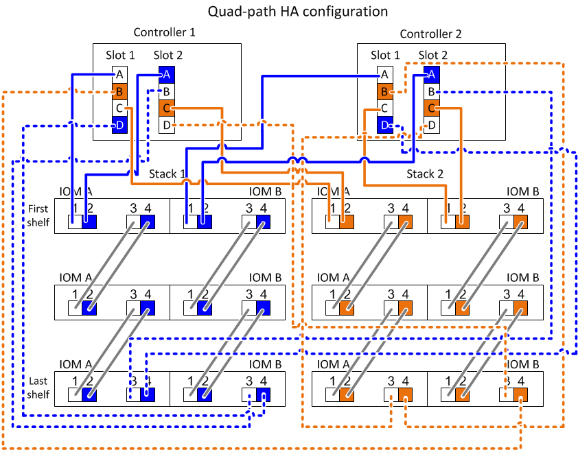

= DS212C、DS224C、または DS460C のクアッドパス接続におけるコントローラとスタック間の接続配線に関するワークシートの読み方
:allow-uri-read: 
:icons: font
:imagesdir: ../media/

[role="lead"]
以下の例は、クアッドパス接続用のIOM12 / IOM12Bモジュールを使用するディスクシェルフで、記入済みのワークシートの内容を適用して複数のディスクシェルフをケーブル接続する方法を示しています。

.このタスクについて
* この手順では、次のワークシートとケーブル接続例を使用して、ワークシートに基づいてコントローラ / スタック間をケーブル接続する方法を示します。
+
この例では、各コントローラにクアッドポート SAS HBA を 2 つを備え、 IOM12 モジュールを搭載したディスクシェルフスタックを 2 台を使用するクアッドパス HA 構成を使用します。

* シングルコントローラ構成の場合は、 2 台目のコントローラにケーブル接続する手順 b と d を省略します。
* 必要に応じて、を参照してください link:install-cabling-rules.html["SASケーブル接続のルールと概念"] コントローラのスロット番号の規則、シェルフ / シェルフ間の接続、およびコントローラ / シェルフ間の接続（ポートペアの使用など）については、を参照してください。

image::../media/drw_worksheet_qpha_slots_1_and_2_two_4porthbas_two_stacks_nau.gif[クアツトハスセツソクノケエフルセツソクワアクシイト]

.手順
. 各コントローラのポートペア 1a / 2b をスタック 1 にケーブル接続します。
+
これはスタック 1 のマルチパスケーブル接続です。

+
.. コントローラ 1 のポート 1a をスタック 1 の最初のシェルフの IOM A ポート 1 にケーブル接続します。
.. コントローラ 2 のポート 1a をスタック 1 の最初のシェルフの IOM B ポート 1 にケーブル接続します。
.. コントローラ 1 のポート 2b をスタック 1 の最後のシェルフの IOM B ポート 3 にケーブル接続します。
.. コントローラ 2 のポート 2b をスタック 1 の最後のシェルフの IOM A ポート 3 にケーブル接続します。

. 各コントローラのポートペア 2a / 1d をスタック 1 にケーブル接続します。
+
これはスタック 1 のクアッドパスケーブル接続です。完了すると、スタック 1 は各コントローラにクアッドパス接続されます。

+
.. コントローラ 1 のポート 2a をスタック 1 の最初のシェルフの IOM A ポート 2 にケーブル接続します。
.. コントローラ 2 のポート 2a をスタック 1 の最初のシェルフの IOM B ポート 2 にケーブル接続します。
.. コントローラ 1 のポート 1d をスタック 1 の最後のシェルフの IOM B ポート 4 にケーブル接続します。
.. コントローラ 2 のポート 1d をスタック 1 の最後のシェルフの IOM A ポート 4 にケーブル接続します。

. 各コントローラのポートペア 1c / 2d をスタック 2 にケーブル接続します。
+
これはスタック 2 のマルチパスケーブル接続です。

+
.. コントローラ 1 のポート 1c をスタック 2 の最初のシェルフの IOM A ポート 1 にケーブル接続します。
.. コントローラ 2 のポート 1c をスタック 2 の最初のシェルフの IOM B ポート 1 にケーブル接続します。
.. コントローラ 1 のポート 2d をスタック 2 の最後のシェルフの IOM B ポート 3 にケーブル接続します。
.. コントローラ 2 のポート 2d をスタック 2 の最後のシェルフの IOM A ポート 3 にケーブル接続します。

. 各コントローラのポートペア 2c / 1b をスタック 2 にケーブル接続します。
+
これはスタック 2 のクアッドパスケーブル接続です。完了すると、スタック 2 は各コントローラにクアッドパス接続されます。

+
.. コントローラ 1 のポート 2c をスタック 2 の最初のシェルフの IOM A ポート 2 にケーブル接続します。
.. コントローラ 2 のポート 2c をスタック 2 の最初のシェルフの IOM B ポート 2 にケーブル接続します。
.. コントローラ 1 のポート 1b をスタック 2 の最後のシェルフの IOM B ポート 4 にケーブル接続します。
.. コントローラ 2 のポート 1b をスタック 2 の最後のシェルフの IOM A ポート 4 にケーブル接続します。

