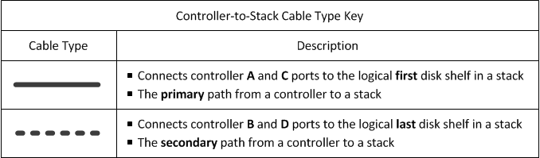
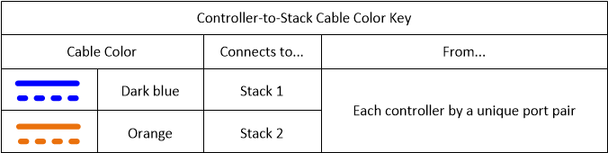
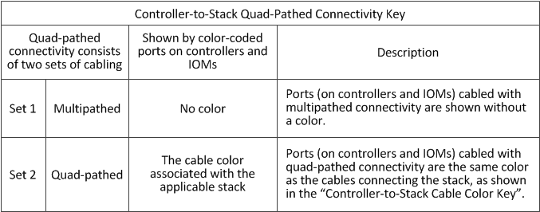
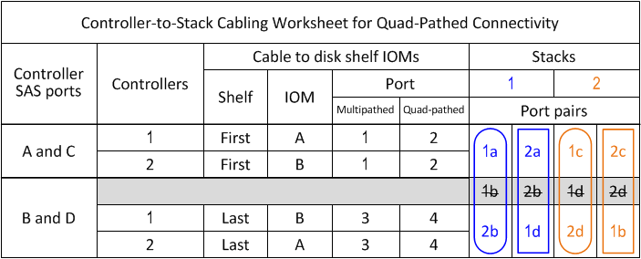
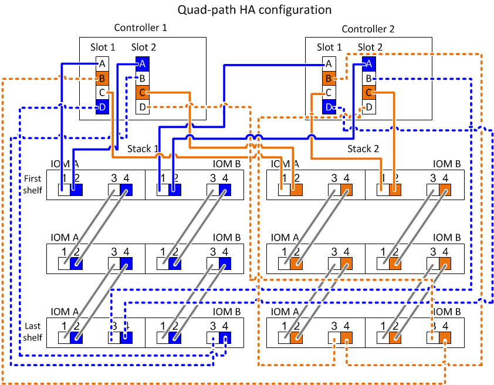

= DS212C、DS224C、またはDS460Cの4ポートSAS HBAを2台使用したクワッドパスHA構成のケーブル配線ワークシート
:allow-uri-read: 
:icons: font
:imagesdir: ../media/

[role="lead"]
完成したコントローラーとスタック間のケーブル配線ワークシートとケーブル配線例を使用して、2つの4ポートSAS HBAを搭載したクワッドパスHA構成のケーブル配線を行うことができます。これは、IOM12、IOM12B、またはIOM12Cモジュールを搭載したシェルフに適用されます。

* 必要に応じて、を参照してください link:install-cabling-rules.html["SAS ケーブル接続ルール"] サポートされる構成については、コントローラのスロット番号の規則、シェルフ / シェルフ間の接続、およびコントローラ / シェルフ間の接続（ポートペアの使用など）を参照してください。
* 必要に応じて、を参照してください link:install-cabling-worksheets-how-to-read-quadpath.html["クアッドパス接続でコントローラ / スタック間をケーブル接続するためのワークシートの読み取り方法"]。
* ケーブル接続例では、コントローラ / スタック間のケーブル接続のうち、コントローラ A と C のポート接続を実線で、コントローラ B と D のポート接続を点線で区別して表しています。
+

* HA ペアの各スタックへの接続を区別するために、ケーブル接続例のケーブルとワークシートの対応するポートペアに同じ色を使用しています。
+

* ケーブル接続例では、 HA ペアまたはシングルコントローラ構成で各コントローラから各スタックへのクアッドパス接続に必要な 2 セットのマルチパスケーブル接続を、視覚的に区別しています。
+
マルチパスケーブルの最初のセットを「マルチパス」と呼びます。マルチパス・ケーブルの 2 番目のセットは ' クアッドパスと呼ばれます2 番目のケーブル接続セットは「クアッドパス」と呼ばれます。これは、このケーブル接続セットを完了すると、クアッドパス接続が可能になるためです。

+

* ワークシート例では、各ポートペアは、マルチパスケーブル接続またはクアッドパスケーブル接続で該当するスタックに接続されます。
+
マルチパスケーブル接続用の各ポートペアは、接続先のスタックと同じ色の楕円で囲まれています。クアッドパスケーブル接続用の各ポートペアは、接続先のスタックと同じ色の四角形で囲まれています。

[[quad-path-ha-with-two-quad-port-sas-hbas-and-two-multi-shelf-stacks]]
== クアッドパス HA ：クアッドポート SAS HBA × 2 、マルチシェルフスタック × 2

次のワークシートとケーブル接続例では、スタック 1 にポートペア 1a / 2b （マルチパス）と 2a / 1d （クアッドパス）を使用し、スタック 2 にポートペア 1c / 2d （マルチパス）と 2c / 1b （クアッドパス）を使用しています。

