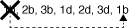

= SASケーブル接続ルール- IOM12 / IOM12Bモジュールを使用するシェルフです
:allow-uri-read: 
:icons: font
:imagesdir: ../media/

[role="lead"]
IOM12 / IOM12Bモジュールを搭載したディスクシェルフは、SASケーブル接続ルール（設定ルール、コントローラのスロット番号のルール、シェルフ/シェルフ間の接続ルール、コントローラ/スタック間の接続ルール、および該当する場合はMini-SAS HD SAS光ケーブルルール）を適用することで、HAペアおよびシングルコントローラ構成（サポート対象プラットフォームの場合）でケーブル接続できます。

NOTE: このガイドで説明するSASケーブル接続ルールのうち、コントローラスロットの番号のルール、シェルフ/シェルフ間の接続ルール、およびコントローラ/スタック間の接続ルールは、IOM12 / IOM12B、IOM6、IOM3のどのモジュールを使用している場合も、すべてのSASディスクシェルフに適用されるルールと同じです。ただし、このガイド内の情報は、 IOM12 モジュールを搭載したディスクシェルフをサポート対象の構成で使用した場合に固有のものです。

このガイドで説明するSASケーブル接続ルールのうち、構成ルールとMini-SAS HD SAS光ケーブルルールは、IOM12 / 12Bモジュールを搭載したディスクシェルフに固有のものです。

このガイドで説明する SAS ケーブル接続ルールは、オンボード SAS ポートとホストバスアダプタ SAS ポート間の SAS ケーブル接続のバランスを取ることで、可用性の高いストレージコントローラ構成を実現し、次の目標を達成します。

* すべての SAS 製品と構成に、わかりやすい単一のユニバーサルアルゴリズムを提供します
* Bill of Materials （ BOM ；構成品一覧表）を生成する際、工場と現場と同じ物理的なケーブル接続を行います
* 構成チェックソフトウェアとツールで検証できます
* 最大限の耐障害性を提供することで、可用性を維持し、コントローラテイクオーバーへの依存を最小限に抑えます

ルールから逸脱しないようにしてください。逸脱すると、信頼性、汎用性、共通性が低下する可能性があります。

== 設定ルール

IOM12モジュールを搭載したディスクシェルフは、特定のタイプのHAペアおよびシングルコントローラ構成でサポートされます。

NOTE: このコンテンツでは、外部のシステム向けのシステムは対応していません。

* HA ペア構成は、マルチパス HA またはクアッドパス HA 構成としてケーブル接続する必要がありますが、次の例外があります。
+
** FAS2600シリーズ、AFF A200、FAS2700シリーズ、AFF A220など、内蔵ストレージを搭載したプラットフォーム また、シングルパスHA構成としてケーブル接続して外付けSASテープバックアップデバイスへの接続をサポートすることもできます。
** FAS2600シリーズ、AFF A200、FAS2700シリーズ、AFF A220など、内蔵ストレージを搭載したプラットフォーム また、クアッドパスHA接続はサポートしないでください。

* シングルコントローラ構成は、マルチパス構成またはクアッドパス構成としてケーブル接続する必要がありますが、次の例外があります。
+
** FAS2600 シリーズのシングルコントローラ構成（外付けディスクシェルフを使用）は、シングルパス構成としてケーブル接続できます。
+
内蔵ストレージではシングルパス接続が使用されるため、 ONTAP では、混合パスが検出されたという警告が表示されることがあります。この警告を回避するには、外付けディスクシェルフへのシングルパス接続を使用します。また、外付け SAS テープバックアップデバイスを使用する場合も、シングルパス接続を使用できます。

** FAS2600 シリーズのシングルコントローラ構成では、クアッドパス接続はサポートされません。

== コントローラのスロット番号のルール

サポートされているすべての HA ペアおよびシングルコントローラ構成にケーブル接続ルールを適用するために、コントローラのスロット番号規則を使用します。

* すべての HA ペアおよびシングルコントローラ構成に、次の条件が適用されます。
+
** 物理 PCI スロットの SAS HBA は、コントローラのスロットラベルに関係なく、 PCI スロット 1 、 2 、 3 の順で使用するものとします。
+
たとえば、 SAS HBA が物理 PCI スロット 3 、 5 、 7 を使用している場合、 SAS ケーブル接続ルールを適用するためにスロット 1 、 2 、 3 と指定します。

** オンボード SAS HBA は、コントローラのラベルと同じく PCI スロット 0 を使用しているものとします。
** 各スロットの各ポートは、コントローラのラベルと同じです。たとえば、ポートが 2 つあるスロット 0 は、 0a と 0b と表記します。ポートが 4 つあるスロット 1 は、 1a 、 1d 、 1c 、 1d と表記します。
+
このマニュアルでは、スロットとスロットポートを次のように表記します。

+
image::../media/slot0_rules.png[slot0 ルール]

== シェルフ / シェルフ間の接続ルール

ディスクシェルフスタックに複数のディスクシェルフがある場合は、該当する「標準」または「幅」のシェルフ / シェルフ間ケーブルを使用して、各 SAS ドメイン（ IOM A と IOM B ）を介してシェルフどうしを接続します。「標準」または「幅の広い」シェルフ間ケーブルの使用方法は、使用している構成によって異なります。

=== 標準のシェルフ / シェルフ間接続

* 標準シェルフ / シェルフ間接続は、マルチパス HA 、マルチパス、シングルパス HA 、およびシングルパスの各構成で使用します。
* これは、 IOM3 および IOM6 モジュールを搭載した既存の SAS ストレージ構成で使用されている接続で、ドメイン A （ IOM A ）とドメイン B （ IOM B ）の各ドメイン内のディスクシェルフどうしを 1 本のケーブルで接続します。
* ベストプラクティスは、標準シェルフ / シェルフ間接続に IOM ポート 3 と 1 を使用することです。
+
スタック内の論理上最初のシェルフから最後のシェルフまでを、ドメイン A の IOM ポート 3 を次のシェルフの IOM ポート 1 に接続し、次にドメイン B を同様に接続します

image::../media/drw_shelf_to_shelf_standard.gif[DRW シェルフからシェルフ標準]

=== 2 倍幅シェルフ / シェルフ間接続

* 2 倍幅シェルフ / シェルフ間接続は、クアッドパス（クアッドパス HA およびクアッドパス）構成で使用します。
* 2 倍幅シェルフ / シェルフ間接続には、ドメイン A （ IOM A ）とドメイン B （ IOM B ）それぞれのディスクシェルフ間に 2 本のケーブル接続が必要です。
+
最初のケーブル接続は標準シェルフ / シェルフ間接続で IOM ポート 3 と 1 を接続し、 2 番目のケーブル接続は 2 倍幅シェルフ / シェルフ間接続で IOM ポート 4 と 2 を接続します。

+
スタック内の論理上最初のシェルフから最後のシェルフまでを、ドメイン A の IOM ポート 3 を次のシェルフの IOM ポート 1 に接続し、次にドメイン B を同様に接続しますスタック内の論理上最初のシェルフから最後のシェルフまでを、ドメイン A の IOM ポート 4 を次のシェルフの IOM ポート 2 に接続し、次にドメイン B を同様に接続します（ 2 倍幅接続としてケーブル接続された IOM ポートは青で表示されています。）

image::../media/drw_shelf_to_shelf_double_wide.gif[DRW シェルフからシェルフへの幅が 2 倍になっています]

== コントローラ / スタック間の接続ルール

SASディスクシェルフがソフトウェアベースのディスク所有権を使用していること、コントローラポートA / CおよびB / Dがスタックに接続されている方法を理解することで、HAペアまたはシングルコントローラ構成の各コントローラから各スタックへのSAS接続を正しくケーブル接続できます。 コントローラポートA / CおよびB / Dがポートペアに編成され、内蔵ストレージを搭載したプラットフォームのコントローラポートがスタックにどのように接続されるか。

=== SAS ディスクシェルフのソフトウェアベースのディスク所有権ルール

SAS ディスクシェルフは、（ハードウェアベースではなく）ソフトウェアベースのディスク所有権を使用します。つまり、ディスクドライブの所有権は、（ハードウェアベースのディスク所有権の場合のように）ストレージシステムの物理接続のトポロジによって決まるのではなく、ディスクドライブに保存されます。具体的には、ディスクドライブの所有権は、コントローラ / スタック間の接続方法ではなく、 ONTAP によって（自動または CLI コマンドで）割り当てられます。

SAS ディスクシェルフは、ハードウェアベースのディスク所有権の手法を使用してケーブル接続しないでください。

=== コントローラAとCポートの接続ルール（内蔵ストレージを使用しないプラットフォームの場合）

* A ポートと C ポートは常にスタックへのプライマリパスです。
* A ポートと C ポートは常にスタック内の論理的に最初のディスクシェルフに接続します。
* A ポートと C ポートは常にディスクシェルフの IOM ポート 1 と 2 に接続します。
+
IOM ポート 2 は、クアッドパス HA およびクアッドパス構成でのみ使用されます。

* コントローラ 1 の A ポートと C ポートは常に IOM A （ドメイン A ）に接続します。
* コントローラ 2 の A ポートと C ポートは常に IOM B （ドメイン B ）に接続します。

次の図は、 1 つのクアッドポート HBA と 2 つのディスクシェルフスタックを使用したマルチパス HA 構成で、コントローラポート A とポート C がどのように接続されるかを示しています。スタック 1 への接続は青で示されています。スタック 2 への接続はオレンジで示されています。

image::../media/drw_controller_to_stack_rules_ports_a_and_c_example.gif[ルールポート A と C をスタックする DRW コントローラの例]

=== コントローラBおよびDポートの接続ルール（内蔵ストレージを使用しないプラットフォームの場合）

* B ポートと D ポートは常にスタックへのセカンダリパスです。
* B ポートと D ポートは常にスタック内の論理的に最後のディスクシェルフに接続します。
* B ポートと D ポートは常にディスクシェルフの IOM ポート 3 と 4 に接続します。
+
IOM ポート 4 は、クアッドパス HA およびクアッドパス構成でのみ使用されます。

* コントローラ 1 の B ポートと D ポートは常に IOM B （ドメイン B ）に接続します。
* コントローラ 2 の B ポートと D ポートは常に IOM A （ドメイン A ）に接続します。
* B ポートと D ポートは、最初のスロットの最初のポートが最後にケーブル接続されるよう、 PCI スロットの順序を 1 つずつオフセットしてスタックに接続されます。

次の図は、 1 つのクアッドポート HBA と 2 つのディスクシェルフスタックを使用したマルチパス HA 構成で、コントローラポート B とポート D がどのように接続されるかを示しています。スタック 1 への接続は青で示されています。スタック 2 への接続はオレンジで示されています。

image::../media/drw_controller_to_stack_rules_ports_b_and_d_example.gif[DRW コントローラからスタックルールポート b および d の例]

=== ポートペアの接続ルール（内蔵ストレージを使用しないプラットフォームの場合）

HA ペアおよびシングルコントローラ構成でコントローラ / スタック間の接続をケーブル接続する場合、システムの耐障害性と整合性を確保するために、すべての SAS ポートを活用する方法でコントローラ SAS の A 、 B 、 C 、 D の各ポートがポートペアに編成されます。

* ポートペアは、コントローラ A または C の SAS ポートとコントローラ B または D の SAS ポートで構成されます。
+
SAS の A ポートと C ポートはスタック内の論理的に最初のシェルフに接続します。SAS の B ポートと D ポートはスタック内の論理的に最後のシェルフに接続します。

* ポートペアは、システム内の各コントローラのすべての SAS ポートを使用します。
+
すべての SAS ポート（物理 PCI スロット [slot 1-N] の HBA ポートおよびコントローラ [slot 0] のオンボードポート）をポートペアに組み込むことで、システムの耐障害性が向上します。SAS ポートは除外しないでください。

* ポートペアは次のように識別および編成されます。
+
.. 最初に A ポート、次に C ポートをスロット（ 0 、 1 、 2 、 3 など）順に列挙します。
+
例： 1a 、 2a 、 3a 、 1c 、 2c 、 3C

.. 最初に B ポート、次に D ポートをスロット（ 0 、 1 、 2 、 3 など）順に列挙します。
+
例： 1b 、 2b 、 3b 、 1d 、 2d 、 3D

.. リストの最初のポートが末尾に移動するように、 D および B のポートリストを書き換えます。
+
例： 

+
複数の SAS ポートスロットが使用可能な場合は、スロットの順序を 1 つずつオフセットして、複数のスロット（物理 PCI スロットとオンボードスロット）にポートペアを分散することで、あるスタックが 1 つの SAS HBA にケーブル接続されないようにします。

.. A ポートと C ポート（手順 1 に記載）を、 D ポートと B ポート（手順 2 に記載）と記載順にペアにします。
+
例： 1a / 2b 、 2a / 3b 、 3a / 1d 、 1c / 2d 、 2c / 3d 、 3c / 1b 。

+

NOTE: HA ペアの場合、最初のコントローラ用に識別したポートペアを 2 台目のコントローラにも適用できます。

* システムをケーブル接続する際には、ポートペアを識別した順序で使用することも、ポートペアをスキップすることもできます。
+
** システム内のスタックをケーブル接続するためにすべてのポートペアが必要な場合は、ポートペアを識別した（リストした）順序で使用します。
+
たとえば、システムに対して 6 つのポートペアを識別し、マルチパスでケーブル接続するスタックが 6 つある場合は、ポートペアをリストした順序でケーブル接続します。

+
1A/2b 、 2a / 3b 、 3a / 1d 、 1c / 2d 、 2c / 3d 、 3c / 1b

** システム内のスタックのケーブル接続にすべてのポートペアが必要でない場合は、ポートペアをスキップ（ 1 つおきに使用）します。
+
たとえば、システムに対して 6 つのポートペアを識別し、マルチパスでケーブル接続するスタックが 3 つある場合は、リストに含まれる他のすべてのポートペアをケーブル接続します。

+
image::../media/drw_portpair_connection_rules_list_skip.gif[DRW ポートペア接続ルールリストはスキップされます]

+

NOTE: スタックのケーブル接続に必要となる以上のポートペアがシステムにある場合は、ポートペアをスキップしてシステムの SAS ポートを最適化することを推奨します。SAS ポートを最適化することで、システムのパフォーマンスが最適化されます。

コントローラ / スタック間のケーブル接続ワークシートは、ポートペアを特定して整理するための便利なツールです。これにより、 HA ペアまたはシングルコントローラ構成のコントローラ / スタック間の接続をケーブル接続できます。

link:install-cabling-worksheet-template-multipath.html["マルチパス接続用のコントローラ / スタック間のケーブル接続ワークシートテンプレート"]

link:install-cabling-worksheet-template-quadpath.html["クアッドパス接続用のコントローラ / スタック間のケーブル接続ワークシートテンプレート"]

=== 内蔵ストレージを搭載したプラットフォームのコントローラ0bおよび0aポートの接続ルール

FAS2600シリーズ、AFF A200、FAS2700シリーズ、AFF A220など、内蔵ストレージを搭載したプラットフォーム 以降では、各コントローラが内蔵ストレージ（ポート0b）とスタック間で同じドメイン接続を維持する必要があるため、固有の接続ルールが適用されます。つまり、コントローラがシャーシ（コントローラ 1 ）のスロット A にある場合、そのコントローラはドメイン A （ IOM A ）にあるため、ポート 0b はスタック内の IOM A に接続する必要があります。コントローラがシャーシ（コントローラ 2 ）のスロット B にある場合、そのコントローラはドメイン B （ IOM B ）にあるため、ポート 0b はスタック内の IOM B に接続する必要があります。

NOTE: このコンテンツでは、外部向けのシステムは対応していません。

NOTE: 0b ポートを正しいドメインに接続しないと（ドメインのクロスコネクト）、システムに耐障害性の問題が発生する可能性があり、無停止の手順を安全に実行できなくなります。

* コントローラ 0b ポート（内蔵ストレージポート）：
+
** コントローラ 1 の 0b ポートは常に IOM A （ドメイン A ）に接続します。
** コントローラ 2 の 0b ポートは常に IOM B （ドメイン B ）に接続します。
** ポート 0b は常にプライマリパスです。
** ポート 0b は常にスタック内の論理的に最後のディスクシェルフに接続します。
** ポート 0b は常にディスクシェルフの IOM ポート 3 に接続します。

* コントローラ 0a ポート（内蔵 HBA ポート）：
+
** コントローラ 1 の 0a ポートは常に IOM B （ドメイン B ）に接続します。
** コントローラ 2 の 0a ポートは常に IOM A （ドメイン A ）に接続します。
** ポート 0a は常にセカンダリパスです。
** ポート 0a は常にスタック内の論理的に最初のディスクシェルフに接続します。
** ポート 0a は常にディスクシェルフの IOM ポート 1 に接続します。

次の図は、FAS2600シリーズ、AFF A200、FAS2700シリーズ、AFF A220、およびそれ以降のマルチパスHA構成の内蔵ストレージポート（0b）のドメイン接続を示しています。

image::../media/drw_fas2600_mpha_domain_example.png[DRW fas2600 mpha ドメインの例]

== Mini-SAS HD SAS 光ケーブルのルール

Mini-SAS HD SAS 光ケーブル - マルチモードアクティブ光ケーブル（ AOC ）と Mini-SAS HD / Mini-SAS HD 間コネクタ、および Mini-SAS HD / LC 間コネクタを備えたマルチモード（ OM4 ）ブレークアウトケーブル - を使用すると、 IOM12 モジュールを搭載したディスクシェルフを使用する特定の構成で、長距離 SAS 接続を実現できます。

* ご使用のプラットフォームと ONTAP バージョンが、 Mini-SAS HD SAS 光ケーブル - マルチモードアクティブ光ケーブル（ AOC ）と Mini-SAS HD / Mini-SAS HD 間コネクタ、および Mini-SAS HD / LC 間コネクタを備えたマルチモード（ OM4 ）ブレークアウトケーブル - をサポートしている必要があります。
+
https://["NetApp Hardware Universe の略"]

* Mini-SAS HD / Mini-SAS HD 間コネクタを備えた SAS 光マルチモード AOC ケーブルは、コントローラ / スタック間接続やシェルフ / シェルフ間の接続に使用でき、最大 50m までの規格があります。
* Mini-SAS HD / LC 間コネクタ（パッチパネル用）を備えた SAS 光マルチモード（ OM4 ）ブレークアウトケーブルを使用する場合は、次のルールが適用されます。
+
** これらのケーブルを、コントローラ / スタック間、およびシェルフ / シェルフ間の接続に使用できます。
+
シェルフ / シェルフ間の接続にこのケーブルを使用する場合、ディスクシェルフのスタック内で 1 回だけ使用できます。残りのシェルフ / シェルフ間接続は、マルチモード AOC ケーブルを使用して接続する必要があります。

+
クアッドパス HA およびクアッドパス構成で 2 つのディスクシェルフ間のシェルフ間 2 倍幅接続にマルチモードブレークアウトケーブルを使用する場合は、まったく同じブレークアウトケーブルを 2 本使用することを推奨します。

** LC の 8 つ（ 4 組）のブレークアウトコネクタをすべてパッチパネルに接続する必要があります。
** パッチパネルとパネル間ケーブルを用意する必要があります。
+
パネル間のケーブルのモードは、ブレークアウトケーブルと同じ OM4 マルチモードでなければなりません。

** パスで使用できるパッチパネルのペアは 1 組までです。
** マルチモードケーブルのポイントツーポイント（ Mini-SAS HD / Mini-SAS HD 間）パスが 100m を超えることはできません。
+
パスには、ブレークアウトケーブル、パッチパネル、およびパネル間ケーブルのセットが含まれます。

** エンドツーエンドのケーブル接続の長さ（コントローラから最後のシェルフまでの各ポイントツーポイントの合計）は、 300m 以下にする必要があります。
+
合計パスには、ブレークアウトケーブル、パッチパネル、およびパネル間ケーブルのセットが含まれます。

* SAS ケーブルには、 SAS 銅線ケーブルと SAS 光ケーブルを使用できます。その 2 つを併用することもできます。
+
SAS 銅線ケーブルと SAS 光ケーブルを併用する場合は、次のルールが適用されます。

+
** シェルフ / シェルフ間の接続に使用するケーブルは、スタック単位で SAS 銅線ケーブルか SAS 光ケーブルのどちらかにすべて統一する必要があります。
** シェルフ / シェルフ間の接続に SAS 光ケーブルを使用する場合は、そのスタックのコントローラ / スタック間の接続にも SAS 光ケーブルを使用する必要があります。
** シェルフ / シェルフ間の接続に SAS 銅線ケーブルを使用する場合は、そのスタックのコントローラ / スタック間の接続に SAS 光ケーブルまたは SAS 銅線ケーブルを使用できます。

