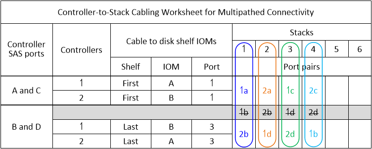
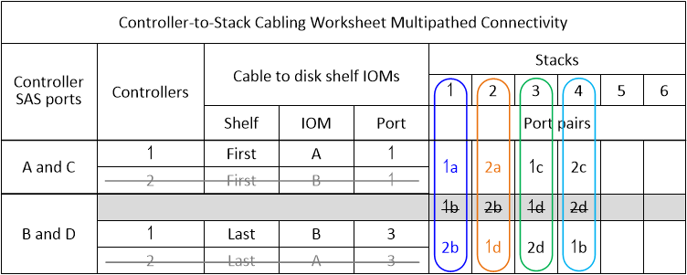

= マルチパス接続用のコントローラ/スタック間のケーブル接続ワークシートテンプレート- IOM12 / IOM12Bモジュールを使用するシェルフです
:allow-uri-read: 
:icons: font
:imagesdir: ../media/

[role="lead"]
ワークシートテンプレートを記入することで、コントローラのSASポートペアを定義できます。これらのポートを使用して、コントローラをIOM12 / 12B IOMBモジュールを使用するディスクシェルフスタックにケーブル接続し、HAペアまたはシングルコントローラ構成でマルチパス接続を実現できます。記入済みのワークシートを使用して、構成に合ったマルチパス接続を実施することもできます。

HA ペアまたはシングルコントローラ構成を、 AFF A200 、 AFF A220 、 FAS2600 シリーズ、または FAS2700 システムにすることはできません。これらの構成のいずれかがある場合は、次のコマンドを使用します。

link:install-cabling-worksheets-examples-fas2600.html["一般的な AFF A200 、 AFF A220 、 FAS2600 シリーズ、および FAS2700 構成のコントローラ / スタック間のケーブル接続ワークシートとケーブル接続例"]

.このタスクについて
* この手順およびワークシートテンプレートは、 1 つ以上のスタックを使用したマルチパス HA またはマルチパス構成のケーブル接続に適用されます。
+
記入済みワークシートの例は、マルチパス HA 構成とマルチパス構成を対象としたものです。

+
ワークシート例では、2つのクアッドポートSAS HBAと、IOM12 / IOM12Bモジュールを使用するディスクシェルフスタックを2台使用する構成を使用します。

* ワークシートテンプレートは最大 6 つのスタックに対応しています。必要に応じて列を追加する必要があります。
* 必要に応じて、を参照してください link:install-cabling-rules.html["SAS ケーブル接続ルール"] サポートされる構成については、コントローラのスロット番号の規則、シェルフ / シェルフ間の接続、およびコントローラ / シェルフ間の接続（ポートペアの使用など）を参照してください。
* ワークシートに記入したら、必要に応じてを参照してください link:install-cabling-worksheets-how-to-read-multipath.html["マルチパス接続でコントローラ / スタック間をケーブル接続するためのワークシートの読み取り方法"]

image::../media/drw_worksheet_mpha_template.gif[DRW ワークシート mpha テンプレート]

.手順
. グレーのボックスの上のボックスに、システム上のすべてのSAS Aポートと、続けてシステム上のすべてのSAS Cポートをスロットの順序（0、1、2、3など）で列挙します。
+
例： 1a 、 2a 、 1c 、 2c

. グレーのボックスに、システムのすべてのSAS Bポートと、システムのすべてのSAS Dポートをスロットの順序（0、1、2、3など）でリストアップします。
+
例： 1b 、 2b 、 1d 、 2d

. グレーの行の下の行に、リストの最初のポートが末尾に移動するように、 D および B のポートリストを書き換えます。
+
例： 2b 、 1d 、 2d 、 1b

. 各スタックのポートペアを円で囲みます。
+
すべてのポートペアを使用してシステム内のスタックをケーブル接続する場合は、ワークシートに記載されている順序でポートペアを円で囲みます。

+
たとえば、 8 つの SAS ポートと 4 つのスタックを使用するマルチパス HA 構成では、ポートペア 1a / 2b をスタック 1 に、ポートペア 2a / 1d をスタック 2 に、ポートペア 1c / 2d をスタック 3 に、ポートペア 2c / 1b をスタック 4 にそれぞれケーブル接続します。

+

+
システム内のスタックのケーブル接続にすべてのポートペアが必要でない場合は、ポートペアをスキップ（ 1 つおきに使用）します。

+
たとえば、 8 つの SAS ポートと 2 つのスタックを使用するマルチパス HA 構成では、ポートペア 1a / 2b をスタック 1 に、ポートペア 1c / 2d をスタック 2 にケーブル接続します。あとでスタックを 2 つホットアドした場合、ポートペア 2a / 1d をスタック 3 に、ポートペア 2c / 1b をスタック 4 にケーブル接続します。

+

NOTE: スタックのケーブル接続に必要となる以上のポートペアがシステムにある場合は、ポートペアをスキップしてシステムの SAS ポートを最適化することを推奨します。SAS ポートを最適化することで、システムのパフォーマンスが最適化されます。

+
image::../media/drw_worksheet_mpha_skipped_template.gif[DRW ワークシート mpha がテンプレートをスキップしました]

+
記入済みのワークシートを使用して、システムをケーブル接続できます。

. シングルコントローラ（マルチパス）構成の場合は、コントローラ 2 の情報を取り消し線で削除します。
+

+
記入済みのワークシートを使用して、システムをケーブル接続できます。

