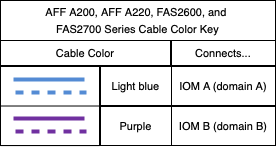
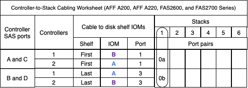
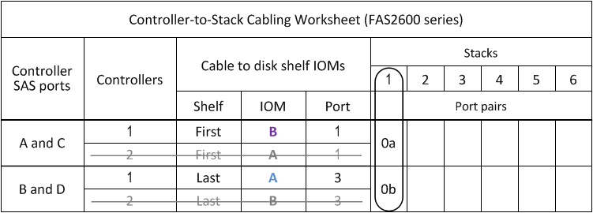

= 一般的な AFF A200 、 AFF A220 、 FAS2600 シリーズ、および FAS2700 構成 - IOM12 モジュールを搭載したシェルフのコントローラ / スタック間のケーブル接続ワークシートとケーブル接続例
:allow-uri-read: 
:icons: font
:imagesdir: ../media/

[role="lead"]
記入済みのコントローラ / スタック間のケーブル接続ワークシートとケーブル接続例を使用して、一般的な AFF A200 、 AFF A220 、 FAS2600 シリーズ、 FAS2700 構成をケーブル接続できます。

* 必要に応じて、を参照してください link:install-cabling-rules.html["SAS ケーブル接続ルール"] サポートされる構成、シェルフ / シェルフ間の接続、およびコントローラ / シェルフ間の接続（ AFF A200 、 AFF A220 、 FAS2600 シリーズ、 FAS2700 ポート 0b の同じドメイン接続を含む）については、を参照してください。
* ケーブル接続例では、コントローラ / スタック間のケーブル接続のうち、コントローラ 0b のポート接続を実線で、コントローラ 0a のポート接続を点線で区別して表しています。
+
image::../media/drw_fas2600_controller_to_stack_cable_type_key.png[DRW fas2600 コントローラからスタックケーブルタイプキー]

* ケーブル接続例では、コントローラ / スタック間の接続とシェルフ / シェルフ間の接続に別の色を使用して、 IOM A （ドメイン A ）経由の接続と IOM B （ドメイン B ）経由の接続を区別しています。
+

== AFF A200 、 AFF A220 、 FAS2600 シリーズ、および FAS2700 マルチパス HA 構成、マルチシェルフスタック × 1

次のワークシートとケーブル接続の例では、ポートペア 0a / 0b を使用しています。

image::../media/drw_fas2600_mpha.png[DRW fas2600 mpha]

== FAS2600 シリーズマルチパス構成、マルチシェルフスタック × 1

次のワークシートとケーブル接続例では、ポートペア 0a / 0b を使用しています。

この例では、コントローラはシャーシのスロット A に取り付けられています。コントローラがシャーシのスロット A にある場合、内蔵ストレージポート（ 0b ）はドメイン A （ IOM A ）にあります。したがって、ポート 0b はスタック内のドメイン A （ IOM A ）に接続する必要があります。

image::../media/drw_fas2600_mp_slot_a.png[DRW fas2600 mp スロット A]

この例では、コントローラはシャーシのスロット B に取り付けられています。コントローラがシャーシのスロット B にある場合、内蔵ストレージポート（ 0b ）はドメイン B （ IOM B ）にあります。したがって、ポート 0b はスタック内のドメイン B （ IOM B ）に接続する必要があります。

image::../media/drw_fas2600_mp_slot_b_worksheet.png[DRW fas2600 mp slot b ワークシート]

image::../media/drw_fas2600_mp_slot_b.png[DRW fas2600 mp slot b]
