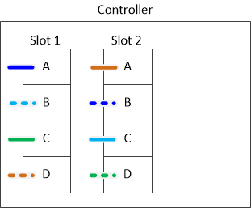

= 一般的なマルチパス HA 構成 - IOM12 モジュールを搭載したシェルフのコントローラ / スタック間のケーブル接続ワークシートとケーブル接続例
:icons: font
:imagesdir: ../media/

[role="lead"]
コントローラ / スタック間のケーブル接続ワークシートとケーブル接続例を使用して、 HA ペアをマルチパス HA 構成としてケーブル接続できます。

* 必要に応じて、を参照してください link:install-cabling-rules.html["SAS ケーブル接続ルール"] サポートされる構成については、コントローラのスロット番号の規則、シェルフ / シェルフ間の接続、およびコントローラ / シェルフ間の接続（ポートペアの使用など）を参照してください。
* 必要に応じて、を参照してください link:install-cabling-worksheets-how-to-read-multipath.html["マルチパス接続でコントローラ / スタック間をケーブル接続するためのワークシートの読み取り方法"]。
* ケーブル接続例では、コントローラ / スタック間のケーブル接続のうち、コントローラ A と C のポート接続を実線で、コントローラ B と D のポート接続を点線で区別して表しています。
+
image::../media/drw_controller_to_stack_cable_type_key.gif[ケーブルタイプキーをスタックする DRW コントローラ]

* HA ペアの各スタックへの接続を区別するために、ケーブル接続例のケーブルとワークシートの対応するポートペアに同じ色を使用しています。
+
image::../media/drw_controller_to_stack_cable_color_key_non2600_4stackcolors.gif[DRW コントローラからスタックへのケーブルカラーキー非 2600 4stackcolors]

* ワークシートとケーブル接続例では、ケーブル接続のポートペアをワークシートに記載されている順序で示しています。

== クアッドポート SAS HBA を使用したマルチパス HA 構成のコントローラ / スタック間のケーブル接続ワークシートとケーブル接続例

[role="lead"]
記入済みのコントローラ / スタック間のケーブル接続ワークシートとケーブル接続例を使用して、クアッドポート SAS HBA を備えた一般的なマルチパス HA 構成をケーブル接続できます。これらのコントローラにはオンボード SAS ポートはありません。

=== マルチパス HA ：クアッドポート SAS HBA × 1 、シングルシェルフスタック × 1

次のワークシートとケーブル接続例では、ポートペア 1a / 1d を使用しています。

image::../media/drw_worksheet_mpha_slot_1_one_4porthba_one_singleshelf_stack.gif[DRW ワークシート mpha スロット 1 1 4 ポートバ 1 台のシングルシェルフスタック]

image::../media/drw_mpha_slot_1_one_4porthba_one_singleshelf_stack.gif[DRW mpha スロット 1 1 4 ポートバ 1 台のシングルシェルフスタック]

=== マルチパス HA ：クアッドポート SAS HBA × 1 、シングルシェルフスタック × 2

次のワークシートとケーブル接続例では、ポートペア 1a / 1d と 1c / 1b を使用しています。

image::../media/drw_worksheet_mpha_slot_1_one_4porthba_two_singleshelf_stacks.gif[DRW ワークシート mpha スロット 1 1 4 ポートバ 2 台のシングルシェルフスタック]

image::../media/drw_mpha_slot_1_one_4porthba_two_singleshelf_stacks.gif[DRW mpha スロット 1 1 4 ポートバ 2 台のシングルシェルフスタック]

=== マルチパス HA ：クアッドポート SAS HBA × 2 、マルチシェルフスタック × 2

この構成では、 1a / 2b 、 2a / 1d 、 1c / 2d 、 2c / 1b の 4 組のポートペアを使用できます。ポートペアは、特定の順序（ワークシートに記載の順）でケーブル接続するか、 1 つおきに（ポートペアをスキップして）ケーブル接続できます。

NOTE: スタックのケーブル接続に必要となる以上のポートペアがシステムにある場合は、ポートペアをスキップしてシステムの SAS ポートを最適化することを推奨します。SAS ポートを最適化することで、システムのパフォーマンスが最適化されます。

次のワークシートとケーブル接続例は、ポートペアをワークシートに記載された順序で使用していることを示しています。 1a / 2b 、 2a / 1d 、 1c / 2d 、 2c / 1b 。

image::../media/drw_worksheet_mpha_slots_1_and_2_two_4porthbas_two_stacks.gif[DRW ワークシート mpha スロット 1 と 2 つの 4 ポートバス 2 つのスタック]

次のワークシートとケーブル接続例は、ポートペアをスキップしてリスト内の他のポートペア 1a / 2b と 1c / 2d を使用しています。

NOTE: あとで 3 つ目のスタックを追加する場合は、スキップしたポートペアを使用します。

image::../media/drw_worksheet_mpha_slots_1_and_2_two_4porthbas_two_stacks_skipped.gif[DRW ワークシート mpha スロット 1 と 2 つの 4 ポートバス 2 つのスタックがスキップされました]

image::../media/drw_mpha_slots_1_and_2_two_4porthbas_two_stacks_skipped.gif[DRW mpha スロット 1 と 2 つの 4 ポートバス 2 つのスタックがスキップされました]

== 4 つのオンボード SAS ポートを使用したマルチパス HA 構成のコントローラ / スタック間のケーブル接続ワークシートとケーブル接続例

[role="lead"]
記入済みのコントローラ / スタック間のケーブル接続ワークシートとケーブル接続例を使用して、オンボード SAS ポートを 4 つ備えた一般的なマルチパス HA 構成をケーブル接続できます。

=== マルチパス HA ：オンボード SAS ポート × 4 、シングルシェルフスタック × 1

次のワークシートとケーブル接続例では、ポートペア 0a~0d を使用します。

image::../media/drw_worksheet_mpha_slot_0_4ports_one_singleshelf_stack.gif[DRW ワークシート mpha スロット 0 4 ポート 1 つのシングルシェルフスタック]

image::../media/drw_mpha_slot_0_4ports_one_singleshelf_stack.gif[DRW mpha スロット 0 4 ポート 1 台のシングルシェルフスタック]

=== マルチパス HA ：オンボード SAS ポート × 4 、シングルシェルフスタック × 2

次のワークシートとケーブル接続例では、ポートペア 0a~0d と 0c/0b を使用しています。

image::../media/drw_worksheet_mpha_slot_0_4ports_two_singleshelf_stacks.gif[DRW ワークシート mpha スロット 0 4 ポート 2 つのシングルシェルフスタック]

image::../media/drw_mpha_slot_0_4ports_two_singleshelf_stacks.gif[DRW mpha スロット 0 4 ポート 2 つのシングルシェルフスタック]

=== マルチパス HA ：オンボード SAS ポート × 4 、クアッドポート SAS HBA × 1 、マルチシェルフスタック × 2

この構成では、 0a / 1b 、 1a / 0d 、 0c / 1d 、 1c / 0b の 4 組のポートペアを使用できます。ポートペアは、特定の順序（ワークシートに記載の順）でケーブル接続するか、 1 つおきに（ポートペアをスキップして）ケーブル接続できます。

NOTE: スタックのケーブル接続に必要となる以上のポートペアがシステムにある場合は、ポートペアをスキップしてシステムの SAS ポートを最適化することを推奨します。SAS ポートを最適化することで、システムのパフォーマンスが最適化されます。

次のワークシートとケーブル接続例では、ポートペアをワークシートに記載された順序で使用しています。 0a~1b 、 1a / 0d 、 0c / 1d 、 1c / 0b

image::../media/drw_worksheet_mpha_slots_0_and_1_8ports_4stacks.gif[DRW ワークシート mpha スロット 0 および 8 ポート 4 スタック 1]

image::../media/drw_mpha_slots_0_and_1_8ports_4_stacks.gif[DRW mpha スロット 0 および 8 ポート 4 スタック]

次のワークシートとケーブル接続例では、ポートペアをスキップしてリスト内の別のポート 0a / 1b および 0c / 1d を使用しています。

NOTE: あとで 3 つ目のスタックを追加する場合は、スキップしたポートペアを使用します。

image::../media/drw_worksheet_mpha_slots_0_and_1_8ports_two_stacks_skipped.gif[DRW ワークシート mpha スロット 0 および 8 ポート x 2 スタックスキップ]

image::../media/drw_mpha_slots_0_and_1_8ports_two_stacks_skipped.gif[DRW mpha スロット 0 と 8 ポート 1 個のスタックがスキップされました]
