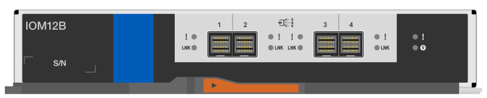
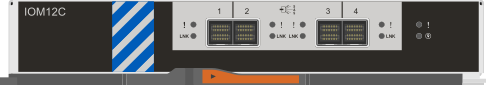
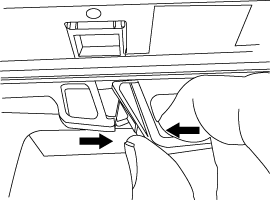

= DS212C、DS224C、またはDS460C IOMモジュールをホットスワップまたは交換する
:allow-uri-read: 
:icons: font
:imagesdir: ../media/

[role="lead"]
IOM12、IOM12B、またはIOM12CシェルフIOMに障害が発生した場合に、システム構成によって、シェルフIOMのノンディスラプティブなホットスワップまたはディスラプティブなシェルフIOMの交換のどちらを実行できるかが決まります。

.このタスクについて
* この手順は、IOM12、IOM12B、またはIOM12Cモジュールを搭載したシェルフに適用されます。
+

NOTE: この手順は、同一機種のシェルフ IOM のホットスワップまたは交換用です。つまり、IOM12 モジュールは別の IOM12 モジュールと、IOM12B モジュールは別の IOM12B モジュールと、または IOM12C モジュールは別の IOM12C モジュールとしか交換できません。

* IOM12、IOM12B、またはIOM12Cモジュールは、外観によって区別できます。
+
IOM12モジュールは「IOM12」ラベルで識別されます。

+
image::../media/drw_iom12.gif[IOM12の前面]

+
IOM12Bモジュールは、青色のストライプと「IOM12B」ラベルで区別されます。

+

+
IOM12Cモジュールは、青と灰色のストライプと「IOM12C」ラベルで識別できます：

+

* マルチパス（マルチパスHAまたはマルチパス）、トライパスHA、およびクアッドパス（クアッドパスHAまたはクアッドパス）構成の場合は、シェルフIOMをホットスワップできます（電源がオンでデータを提供しているシステムでシェルフIOMを無停止で交換します（I/Oが実行中です）。
* FAS2700シリーズのシングルパスHA構成の場合、電源が入っていてデータを提供しているシステム（I/O処理が進行中）でシェルフIOMを交換するには、テイクオーバーとギブバックの操作を実行する必要があります。
+

CAUTION: シングルパス接続されたディスクシェルフのシェルフIOMをホットスワップしようとすると、そのディスクシェルフおよびその下のすべてのディスクシェルフ内のディスクドライブへのアクセスがすべて失われます。システム全体を停止することもできます。

* 新しいシェルフのIOMのディスクシェルフ（IOM）ファームウェアが最新のファームウェアバージョンでない場合、自動的に（無停止で）更新されます。
+
シェルフのIOMファームウェアは10分おきにチェックされます。IOM ファームウェアの更新には最大 30 分かかることがあります。

* 影響を受けるディスクシェルフの物理的な位置を特定するために、必要に応じてディスクシェルフのロケーション（青色の） LED を点灯できます。「 storage shelf location -led modify -shelf-name _shelf_name _led-status on
+
ディスクシェルフにはロケーションLEDが3つあります。オペレータ用ディスプレイパネルに1つと、各シェルフIOMに1つです。ロケーション LED は 30 分間点灯します。点灯を中止するには、同じコマンドを off オプションに変更して入力します。

* 必要に応じて、link:service-monitor-leds.html#operator-display-panel-leds["ディスクシェルフのLEDの監視"]ガイドを参照して、オペレーター表示パネルおよびFRUコンポーネント上のディスク シェルフLEDの意味と場所に関する情報を確認できます。

.作業を開始する前に
* システム内の他のすべてのコンポーネント（他のIOM12、IOM12B、またはIOM12Cモジュールを含む）は、正常に機能している必要があります。
* *ベストプラクティス*: 新しいディスクシェルフ、シェルフFRUコンポーネント、またはSASケーブルを追加する前に、システムに最新のディスクシェルフ（IOM）ファームウェアとディスクドライブファームウェアがインストールされていることを確認してください。NetAppNetAppサイトにアクセスして、  https://mysupport.netapp.com/site/downloads/firmware/disk-shelf-firmware["ディスクシェルフファームウェアをダウンロードする"]そして https://mysupport.netapp.com/site/downloads/firmware/disk-drive-firmware["ディスクドライブのファームウェアをダウンロードする"] 。

.手順
. 自身の適切な接地対策を行います
. 新しいシェルフIOMを開封し、ディスクシェルフの近くの平らな場所に置きます。
+
梱包材は、障害が発生したシェルフのIOMを返送するときのためにすべて保管しておいてください。

. システムコンソールの警告メッセージと、障害が発生したシェルフのIOMの警告（黄色）LEDから、障害が発生したシェルフのIOMを物理的に特定します。
. 使用している構成に応じて、次のいずれかの操作を実行します。
+
[cols="2*"]
|===
| 使用する方法 | 作業 

 a| 
マルチパスHA、トライパスHA、マルチパス、クアッドパスHA、またはクアッドパス構成
 a| 
次の手順に進みます。

 a| 
FAS2700シリーズのシングルパスHA構成
 a| 
.. ターゲットノード（障害が発生したシェルフIOMが所属するノード）を特定します。
+
IOM A はコントローラ 1 に属しています。IOM B はコントローラ 2 に属しています。

.. ターゲットノードをテイクオーバーします。「 storage failover takeover -bynode _ partner ha node_ 」

|===
. 取り外すシェルフIOMからケーブルを外します。
+
各ケーブルが接続されているシェルフのIOMポートをメモしておきます。

. シェルフのIOMのカムハンドルのオレンジラッチを外れるまで押し、カムハンドルを最大まで開いてシェルフのIOMをミッドプレーンから外します。
+

+
image::../media/drw_iom_open.png[カムハンドルが開位置]

. カムハンドルをつかみ、シェルフIOMをスライドしてディスクシェルフから引き出します。
+
シェルフIOMを扱うときは、重量があるので必ず両手で支えながら作業してください。

. シェルフIOMを取り外したあと、70秒以上待ってから新しいシェルフIOMを取り付けます。
+
この間にドライバによってシェルフ ID が正しく登録されます。

. カムハンドルが開いた状態で両手で新しいシェルフのIOMを持って両端をディスクシェルフの開口部に合わせ、ミッドプレーンにまでしっかりと押し込みます。
+

NOTE: シェルフIOMをディスクシェルフに挿入する際に力を入れすぎないように注意してください。コネクタが破損することがあります。

. カムハンドルを閉じます。ラッチがカチッという音を立ててロックされ、シェルフのIOMが完全に収まります。
. ケーブルを再接続します。
+
SAS ケーブルのコネクタは、誤挿入を防ぐキーイングが施されているため、正しい向きで IOM ポートに取り付けるとカチッとはまり、 IOM ポートの LNK LED が緑色に点灯します。SAS ケーブルのコネクタをプルタブ（コネクタの下側）を下にして IOM ポートに挿入します。

. 使用している構成に応じて、次のいずれかの操作を実行します。
+
[cols="2*"]
|===
| 使用する方法 | 作業 

 a| 
マルチパスHA、トライパスHA、マルチパス、クアッドパスHA、またはクアッドパス構成
 a| 
次の手順に進みます。

 a| 
FAS2700シリーズのシングルパスHA構成
 a| 
ターゲットノードをギブバックします。「 storage failover giveback -fromnode partner_ha_node

|===
. シェルフのIOMポートのリンクが確立されたことを確認します。
+
ケーブル接続した各モジュールポートで、 4 つの SAS レーンの 1 つ以上で（アダプタまたは別のディスクシェルフとの）リンクが確立された場合、 LNK （緑色） LED が点灯します。

. 障害のある部品は、キットに付属する RMA 指示書に従ってネットアップに返却してください。
+
テクニカルサポートにお問い合わせください https://mysupport.netapp.com/site/global/dashboard["ネットアップサポート"]RMA 番号を確認する場合や、交換用手順にサポートが必要な場合は、日本国内サポート用電話番号：国内フリーダイヤル 0066-33-123-265 または 0066-33-821-274 （国際フリーフォン 800-800-80-800 も使用可能）までご連絡ください。

