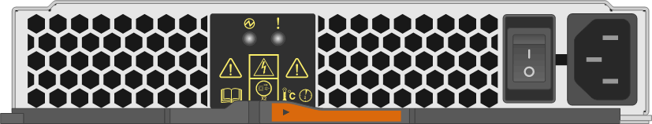

= ディスクシェルフのLEDを監視します。IOM12 / IOM12Bモジュールを使用するシェルフです
:allow-uri-read: 
:icons: font
:imagesdir: ../media/

[role="lead"]
ディスクシェルフコンポーネントの LED の場所とステータスの状態を把握することで、ディスクシェルフのヘルスを監視できます。

== オペレータディスプレイパネルの LED

ディスクシェルフ前面のオペレータ用ディスプレイパネルの LED は、ディスクシェルフが正常に機能しているか、ハードウェアに問題があるかを示します。

次の表に、 DS460C 、 DS224C 、および DS212C の各ディスクシェルフで使用されるオペレータディスプレイパネルの 3 つの LED を示します。

[cols="4*"]
|===
| LED アイコン | LED 名 | 状態 | 説明 

 a| 
image:../media/drw_sas_power_icon.png[""]
 a| 
電源
 a| 
緑色に点灯します
 a| 
1 つ以上の電源装置がディスクシェルフに電力を供給しています。

.2+| image:../media/drw_sas_fault_icon.png[""] .2+| 注意  a| 
黄色で点灯
 a| 
1つ以上のFRU（ディスクシェルフ、ディスクドライブ、IOM12 / IOM12Bモジュール、または電源装置）の機能でエラーが発生しました。

イベントメッセージをチェックして実行する対処方法を決定してください。

 a| 
黄色で点滅
 a| 
シェルフ ID が保留状態です。

シェルフ ID を有効にするには、ディスクシェルフの電源を再投入してください。

 a| 
image:../media/drw_sas3_location_icon.gif[""]
 a| 
場所
 a| 
青で点灯
 a| 
システム管理者が、対応が必要なディスクシェルフを物理的に特定できるようにこの LED 機能をアクティブにしました。

このLED機能を有効にすると、オペレータ用ディスプレイパネルと両方のIOM12 / IOM12Bモジュールの位置LEDが点灯します。ロケーション LED は 30 分後に自動的に消灯します。

|===
ディスクシェルフのモデルに応じてオペレータ用ディスプレイパネルの外観は異なりますが、 3 つの LED は同じように配置されています。

次の図は、エンドキャップを付けた状態の DS224C ディスクシェルフのオペレータディスプレイパネルを示しています。

image::../media/drw_opd.gif[DRW OPD]

== IOM12 / IOM12BモジュールのLED

IOM12 / IOM12BモジュールのLEDは、モジュールが正常に機能しているかどうか、I/Oトラフィックに対応する準備ができているかどうか、ハードウェアに問題がないかどうかを示します。

次の表に、モジュールの機能およびモジュールの各SASポートの機能に関連するIOM12 / IOM12BモジュールのLEDを示します。

IOM12 / IOM12Bモジュールは、DS460C、DS224C、およびDS212Cディスクシェルフで使用されます。

[cols="4*"]
|===
| LED アイコン | LED 名 | 状態 | 説明 

 a| 
image:../media/drw_sas_fault_icon.png[""]
 a| 
注意
 a| 
黄色で点灯
 a| 
IOM12 / IOM12Bモジュールの機能：IOM12 / IOM12Bモジュールの機能でエラーが発生しました。

SAS ポートの機能： 4 つの SAS レーンの中に、（アダプタまたは別のディスクシェルフとの）リンクを確立していないレーンがあります。

イベントメッセージをチェックして実行する対処方法を決定してください。

 a| 
LNK
 a| 
ポートリンク
 a| 
緑色に点灯します
 a| 
4 つの SAS レーンのいくつかが（アダプタまたは別のディスクシェルフとの）リンクを確立しています。

 a| 
image:../media/drw_sas3_location_icon.gif[""]
 a| 
場所
 a| 
青で点灯
 a| 
システム管理者が、障害が発生したIOM12 / IOM12Bモジュールのディスクシェルフを物理的に特定できるように、このLED機能をアクティブにしました。

このLED機能を有効にすると、オペレータ用ディスプレイパネルと両方のIOM12 / IOM12Bモジュールの位置LEDが点灯します。ロケーション LED は 30 分後に自動的に消灯します。

|===
次の図は、IOM12モジュールを示しています。

image::../media/drw_iom12.gif[DRW iom12]

IOM12Bモジュールは、青色のストライプと「IOM12B」ラベルで区別されます。

image::../media/iom12b.png[iom12b]

== 電源装置の LED

電源装置の LED は、電源装置が正常に機能しているか、ハードウェアに問題があるかを示します。

次の表に、 DS460C 、 DS224C 、および DS212C ディスクシェルフで使用される電源装置の 2 つの LED を示します。

[cols="4*"]
|===
| LED アイコン | LED 名 | 状態 | 説明 

.2+| image:../media/drw_sas_power_icon.png[""] .2+| 電源  a| 
緑色に点灯します
 a| 
電源装置は正常に機能しています。

 a| 
オフ
 a| 
電源装置に障害が発生したか、 AC スイッチがオフになっているか、 AC 電源コードが正しく取り付けられていないか、または電源装置に電力が適切に供給されていません。

イベントメッセージをチェックして実行する対処方法を決定してください。

 a| 
image:../media/drw_sas_fault_icon.png[""]
 a| 
注意
 a| 
黄色で点灯
 a| 
電源装置の機能にエラーが発生しました。

イベントメッセージをチェックして実行する対処方法を決定してください。

|===
ディスクシェルフのモデルに応じて電源装置は異なり、 2 つの LED の場所も異なります。

次の図は、 DS460C ディスクシェルフで使用される電源装置を示しています。

2 つの LED アイコンは、ラベルと LED として機能します。つまり、アイコン自体が点灯します。隣接する LED はありません。

image::../media/28_dwg_e2860_de460c_psu.gif[28 DWG e2860 de460c PSU]

次の図は、 DS224C または DS212C ディスクシェルフで使用される電源装置を示しています。

== DS460C ディスクシェルフのファン LED

DS460C ファンの LED は、ファンが正常に機能しているか、ハードウェアに問題があるかを示します。

次の表に、 DS460C ディスクシェルフで使用されるファンの LED を示します。

[cols="4*"]
|===
| 項目 | LED 名 | 状態 | 説明 

 a| 
image:../media/legend_icon_01.png["番号1"]
 a| 
注意
 a| 
黄色で点灯
 a| 
ファンの機能にエラーが発生しました。

イベントメッセージをチェックして実行する対処方法を決定してください。

|===
image:../media/28_dwg_e2860_de460c_single_fan_canister_with_led_callout.gif[""]

== ディスクドライブの LED

ディスクドライブの LED は、ドライブが正常に機能しているか、ハードウェアに問題があるかを示します。

=== DS224C および DS212C ディスクシェルフのディスクドライブ LED

次の表に、 DS224C および DS212C ディスクシェルフで使用されるディスクドライブの 2 つの LED を示します。

[cols="4*"]
|===
| コールアウト | LED 名 | 状態 | 説明 

.2+| image:../media/legend_icon_01.png["番号1"] .2+| アクティビティ  a| 
緑色に点灯します
 a| 
ディスクドライブの電源が入っています。

 a| 
緑色に点滅
 a| 
ディスクドライブに電源が入っており、 I/O 処理が進行中です。

 a| 
image:../media/legend_icon_02.png["番号2"]
 a| 
注意
 a| 
黄色で点灯
 a| 
ディスクドライブの機能にエラーが発生しました。

イベントメッセージをチェックして実行する対処方法を決定してください。

|===
ディスクシェルフのモデルに応じてディスクドライブはディスクシェルフに縦または横に配置され、 2 つの LED の位置も異なります。

次の図は、 DS224C ディスクシェルフで使用されるディスクドライブを示しています。

DS224C ディスクシェルフでは、 2.5 インチディスクドライブがディスクシェルフ内に縦に配置されます。

image::../media/drw_diskdrive_ds224c.gif[DRW ディスクドライブ ds224c]

次の図は、 DS212C ディスクシェルフで使用されるディスクドライブを示しています。

DS212C ディスクシェルフでは、 3.5 インチまたは 2.5 インチのディスクドライブがディスクシェルフ内に横に配置されます。

image::../media/drw_diskdrive_ds212c.gif[DRW DiskDrive ds212c]

=== DS460C ディスクシェルフのディスクドライブ LED

次の図と表に、ドライブドロワーのドライブアクティビティ LED とその動作状態を示します。

image::../media/2860_dwg_drive_drawer_leds.gif[2860 DWG ドライブドロワーの LED]

[cols="4*"]
|===
| 場所 | LED | ステータスインジケータ | 説明 

.3+| 1. .3+| 警告：各ドロワーに対する警告  a| 
黄色で点灯
 a| 
ドライブドロワー内に注意委が必要なコンポーネントがあります。

 a| 
オフ
 a| 
ドロワー内に注意が必要なドライブやその他のコンポーネントはなく、ドロワー内のドライブに対してアクティブな場所確認処理は発生していません。

 a| 
黄色で点滅
 a| 
ドロワー内のいずれかのドライブに対して、ドライブの場所確認処理がアクティブです。

.3+| 2-13 .3+| アクティビティ：ドライブドロワー内のドライブ 0~11 のドライブアクティビティ  a| 
緑
 a| 
電源がオンになり、ドライブは正常に動作しています。

 a| 
緑色に点滅
 a| 
ドライブに電源が入っており、 I/O 処理が進行中です。

 a| 
オフ
 a| 
電源がオフになっています。

|===
ドライブドロワーを開くと、各ドライブの前面に警告 LED を確認できます。

image::../media/2860_dwg_amber_on_drive.gif[ドライブ上の 2860 DWG オレンジ]

[cols="10,90"]
|===

 a| 
image:../media/legend_icon_01.png["番号1"]
| 警告 LED ライトが点灯します 
|===