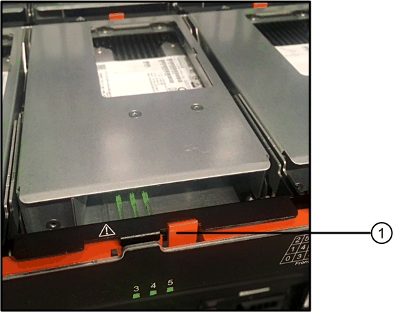

= IOM12 / IOM12Bモジュールを使用するDS460Cディスクシェルフのディスクドライブのホットスワップ
:allow-uri-read: 
:icons: font
:imagesdir: ../media/

[role="lead"]
DS460C ディスクシェルフ内の障害が発生したディスクドライブをホットスワップすることができます。

.作業を開始する前に
* 交換用ディスクドライブが DS460C ディスクシェルフでサポートされている必要があります。
+
https://hwu.netapp.com["NetApp Hardware Universe の略"]

* システムのその他のコンポーネントがすべて正常に動作している必要があります。問題がある場合は、テクニカルサポートにお問い合わせください。
* 取り外すディスクドライブは、障害状態でなければなりません。
+
「 storage disk show -broken 」コマンドを実行して、ディスクドライブが障害状態であることを確認できます。障害ディスクドライブは、障害ディスクドライブのリストに表示されます。表示されない場合は、少し待ってからもう一度コマンドを実行してください。

+

NOTE: ディスクドライブのタイプや容量によっては、障害ディスクドライブのリストに表示されるまでに数時間かかることがあります。

* Self-Encrypting Disk （ SED ；自己暗号化ディスク）を交換する場合は、使用している ONTAP のバージョンに対応する ONTAP のマニュアルに記載されている交換手順に従う必要があります。
+
ONTAP のドキュメントには、 SED の交換前と交換後に実行する必要がある手順も記載されています。

+
https://docs.netapp.com/us-en/ontap/encryption-at-rest/index.html["CLI での NetApp Encryption の概要"]

.このタスクについて
* 静電放電（ ESD ）を発生させないように、次の手順を実行してください。
+
** 取り付け準備ができるまで、ディスクドライブを ESD バッグに入れたままにしておきます。
** ESD バッグを手で開けるか、バッグの上部をハサミで切り落とします。
+

NOTE: ESD バッグに金属製の工具やナイフを入れないでください。

** 作業中は常に ESD リストストラップを着用し、ストレージエンクロージャのシャーシの塗装されていない表面部分にリストストラップを接地させます。
+
リストストラップがない場合は、ディスクドライブに触る前に、ストレージエンクロージャのシャーシの塗装されていない部分を手で触ります。

* ディスクドライブは、次の手順に従って慎重に扱う必要があります。
+
** ディスクドライブの取り外し、取り付け、持ち運びは、必ず両手で行ってください。
+

NOTE: ディスクドライブキャリアの下側のむき出しになっている基板に手を置かないでください。

** ディスクドライブは表面が柔らかい場所に置き、ディスクドライブ同士を重ねないようにしてください。
** ディスクドライブをほかの物にぶつけないように注意してください。

* ディスクドライブを磁気デバイスの近くに置かないでください。
+

NOTE: 磁場によってディスクドライブに保存されているすべてのデータが破損したり、ディスクドライブの回路が故障し、原因が修理不可能となる場合があります。

* ディスクをホットスワップする前に、 Disk Qualification Package （ DQP ）の最新バージョンをインストールしておくことを推奨します。
+
DQP の最新バージョンをインストールしておくと、システムが新しく認定されたディスクドライブを認識して使用できるため、ディスクドライブの情報が最新でない場合に表示されるシステムイベントメッセージを回避できます。また、ディスクドライブが認識されないために発生するディスクのパーティショニングも回避できます。さらに、ディスクドライブのファームウェアが最新でない場合も、通知で知ることができます。

+
https://mysupport.netapp.com/site/downloads/firmware/disk-drive-firmware/download/DISKQUAL/ALL/qual_devices.zip["ネットアップのダウンロード： Disk Qualification Package"^]

* 新しいディスクシェルフ、シェルフ FRU コンポーネント、または SAS ケーブルを追加する前に、お使いのシステムのディスクシェルフ（ IOM ）ファームウェアとディスクドライブファームウェアを最新バージョンにしておくことを推奨します。
+
ファームウェアの最新バージョンは、ネットアップサポートサイトで入手できます。

+
https://mysupport.netapp.com/site/downloads/firmware/disk-shelf-firmware["ネットアップのダウンロード：ディスクシェルフファームウェア"]

+
https://mysupport.netapp.com/site/downloads/firmware/disk-drive-firmware["ネットアップのダウンロード：ディスクドライブファームウェア"]

* 新しいディスクドライブのファームウェアが最新バージョンでない場合は、自動的に（無停止で）更新されます。
+

NOTE: ディスクドライブのファームウェアのチェックは 2 分ごとに実行されます。

* 影響を受けるディスクシェルフの物理的な位置を特定するために、必要に応じてディスクシェルフのロケーション（青色の） LED を点灯できます。「 storage shelf location -led modify -shelf-name _shelf_name _led-status on
+
ディスクシェルフにはロケーション LED が 3 つあります。オペレータ用ディスプレイパネルに 1 つと、各 IOM12 モジュールに 1 つです。ロケーション LED は 30 分間点灯します。点灯を中止するには、同じコマンドを off オプションに変更して入力します。

* オペレータ用ディスプレイパネルと FRU コンポーネントにあるディスクシェルフ LED の場所と、それらの LED が示す意味については、ディスクシェルフ LED の監視に関する項を参照してください。
* DS460C ドライブシェルフにはドライブドロワーが 5 つあり（上から順にドロワー 1~5 ）、各ドロワーにドライブスロット 12 個あります。
+
image::../media/28_dwg_e2860_de460c_front_no_callouts.gif[28 DWG e2860 de460c フロントノーコールアウト]

* 次の図は、シェルフ内の各ドライブドロワーにおける 0~11 のドライブ番号の配置を示しています。
+
image::../media/dwg_trafford_drawer_with_hdds_callouts.gif[DWG トラフォードドロワー（ HDD の寸法テキスト付き]

.手順
. 交換用ディスクドライブのディスク所有権を手動で割り当てる場合は、自動ドライブ割り当てを無効にする必要があります。無効になっている場合は次の手順に進みます。
+

NOTE: スタック内のディスクドライブが HA ペアの両方のコントローラで所有されている場合は、ディスク所有権を手動で割り当てる必要があります。

+

NOTE: ディスク所有権を手動で割り当てたあと、この手順の以降の手順でドライブの自動割り当てを再度有効にします。

+
.. 自動ドライブ割り当てが有効になっているかどうかを確認します。「 storage disk option show 」
+
HA ペアを使用している場合、このコマンドはどちらのコントローラのコンソールでも入力できます。

+
自動ドライブ割り当てが有効になっている場合 ' 出力の Auto Assign 列には on （各コントローラ）と表示されます

.. 自動ドライブ割り当てが有効になっている場合は、無効にする必要があります。「 storage disk option modify -node _node_name -autoassign off 」
+
HA ペアの場合、両方のコントローラで自動ドライブ割り当てを無効にする必要があります。

. 自身の適切な接地対策を行います
. 新しいディスクドライブを開封し、ディスクシェルフの近くの平らな場所に置きます。
+
梱包材は、障害が発生したディスクドライブを返却するときのためにすべて保管しておいてください。

+

NOTE: ネットアップでは、返却されたすべてのディスクドライブを ESD 対応バッグに入れておく必要があります。

. システムコンソールの警告メッセージと、ドライブドロワーで点灯している黄色の警告 LED から、障害が発生したディスクドライブを特定します。
+
2.5 インチおよび 3.5 インチ SAS ドライブキャリアには LED がありません。代わりに、ドライブドロワーの警告 LED を見て、どのドライブに障害が発生したかを確認する必要があります。

+
ドライブドロワーの警告 LED （黄色）が点滅し、正しいドライブドロワーを開いて交換が必要なドライブを特定できます。

+
ドライブドロワーの警告 LED は各ドライブの前面左側にあり、 LED のすぐ後ろのドライブハンドルに警告シンボルが付いています。

. 障害ドライブを収容しているドロワーを開きます。
+
.. 両方のレバーを引いてドライブドロワーを外します。
.. 伸ばしたレバーを使用して、ドライブドロワーを停止するところまで慎重に引き出します。
.. ドライブドロワーの上部を見て、各ドライブの前面のドロワーにある警告 LED を確認します。

. 開いたドロワーから障害ドライブを取り外します。
+
.. 取り外すドライブの前面にあるオレンジのリリースラッチをそっと引いて戻します。
+

+
[cols="1,3"]
|===

 a| 
image:../media/legend_icon_01.png[""]
| オレンジのリリースラッチ 
|===
.. カムハンドルを開き、ドライブを少し持ち上げます。
.. 30 秒待ちます。
.. カムハンドルをつかんでシェルフからドライブを持ち上げます。
+
image::../media/92_dwg_de6600_install_or_remove_drive.gif[92 dwg de6600 はドライブを取り付けまたは取り外します]

.. 近くに磁場がない、静電気防止処置を施したやわらかい場所にドライブを置きます。

. 交換用ドライブをドロワーに挿入します。
+
.. 新しいドライブのカムハンドルを垂直な位置まで持ち上げます。
.. ドライブキャリアの両側にある 2 つの突起ボタンをドライブドロワーのドライブチャネルにある対応するくぼみに合わせます。
+
image::../media/28_dwg_e2860_de460c_drive_cru.gif[28 DWG e2860 de460c ドライブ CRU]

+
[cols="1,3"]
|===

 a| 
image:../media/legend_icon_01.png[""]
| ドライブキャリアの右側の突起ボタン 
|===
.. ドライブを真上から下ろし、ドライブがオレンジのリリースラッチの下に完全に固定されるまでカムハンドルを下に回転させます。
.. ドライブドロワーをエンクロージャに慎重に戻します。
+
image:../media/2860_dwg_e2860_de460c_gentle_close.gif[""]

+

CAUTION: * データアクセスが失われる可能性： * ドロワーを乱暴に扱わないように注意してください。ドロワーに衝撃を与えたり、ストレージアレイにぶつけて破損したりしないように、ゆっくりと押し込んでください。

.. 両方のレバーを内側に押してドライブドロワーを閉じます。
+
交換したドライブが正しく挿入されていれば、ドライブドロワーの前面にある緑のアクティビティ LED が点灯します。

. 別のディスクドライブを交換する場合は、手順 4~7 を繰り返します。
. 交換したドライブのアクティビティ LED と警告 LED を確認します。
+
[cols="1,2"]
|===
| LED ステータス | 説明 

 a| 
アクティビティ LED が点灯または点滅し、警告 LED が消灯している
 a| 
新しいドライブは正常に動作しています。

 a| 
アクティビティ LED は消灯
 a| 
ドライブが正しく取り付けられていない可能性があります。ドライブを取り外し、 30 秒待ってから再度取り付けてください。

 a| 
警告 LED が点灯しています
 a| 
新しいドライブが故障している可能性があります。別の新しいドライブと交換してください。

NOTE: 最初にドライブを挿入したときに警告 LED が点灯することがありますが、問題がなければ 1 分以内に消灯します。

|===
. 手順 1 でディスク所有権の自動割り当てを無効にした場合は、ディスク所有権を手動で割り当ててから、必要に応じてディスク所有権の自動割り当てを再度有効にします。
+
.. 所有権が未設定のディスクをすべて表示します：「 storage disk show -container-type unassigned 」
.. 各ディスクを割り当てます：「 storage disk assign -disk disk_name -owner_owner_name_` 」
+
ワイルドカード文字を使用すると、一度に複数のディスクを割り当てることができます。

.. 必要に応じてディスク所有権の自動割り当てを再度有効にします「 storage disk option modify -node _node_name _-autoassign on 」
+
HA ペアの場合、両方のコントローラでディスク所有権の自動割り当てを再度有効にする必要があります。

. 障害のある部品は、キットに付属する RMA 指示書に従ってネットアップに返却してください。
+
テクニカルサポートにお問い合わせください https://mysupport.netapp.com/site/global/dashboard["ネットアップサポート"]RMA 番号を確認する場合や、交換用手順にサポートが必要な場合は、日本国内サポート用電話番号：国内フリーダイヤル 0066-33-123-265 または 0066-33-821-274 （国際フリーフォン 800-800-80-800 も使用可能）までご連絡ください。

