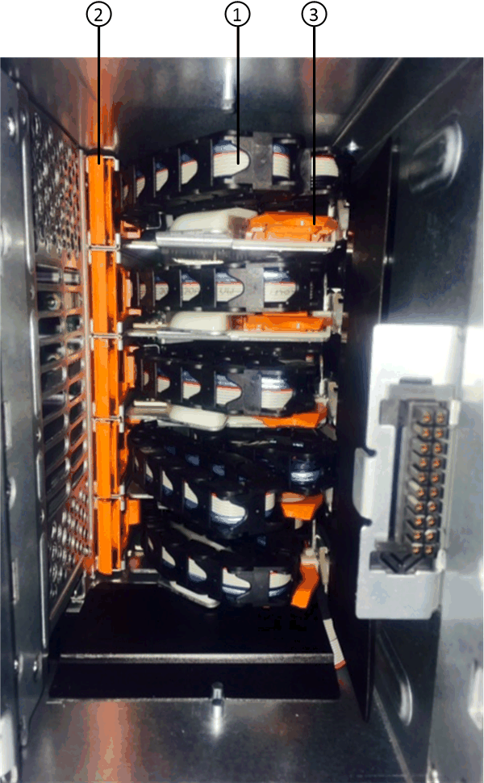
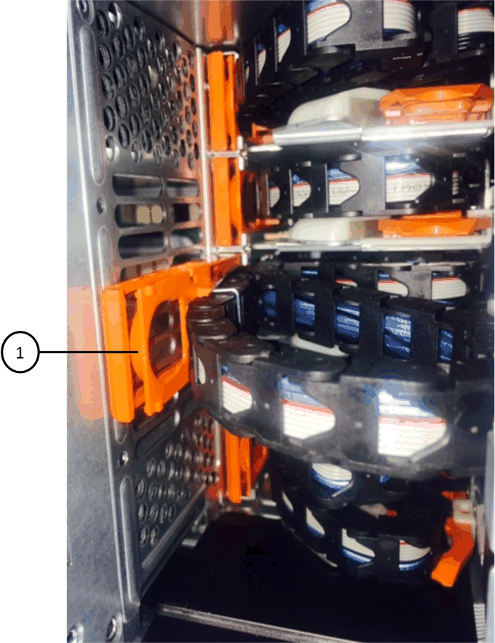

= DS460Cディスクシェルフ内のドライブドロワーをIOM12 / IOM12Bモジュールと交換します
:allow-uri-read: 
:icons: font
:imagesdir: ../media/

[role="lead"]
シェルフのドライブドロワーを交換するには、ストレージシステム全体（HAペア）を停止する必要があります。これにより、シェルフ上にデータアグリゲートを保持したり、HAペアを常時稼働させたりすることができます。 そのためには、ディスクドライブにあるデータアグリゲートからすべてのデータを移動し、データアグリゲートをオフラインにして削除する必要があります。ただし、シェルフにルートアグリゲートが含まれる場合は、HAペアを停止する必要があります。

.作業を開始する前に
この手順に必要な項目は次のとおりです。

* 静電気防止手段
+

NOTE: * ハードウェアの破損の可能性： * 静電気によるドライブシェルフの破損を防ぐために、ドライブシェルフ部品を扱うときは、必ず静電気防止処置を適切に行ってください。

* 交換用ドライブドロワー
* 交換用の左右 2 つのケーブルチェーン
* 懐中電灯

.このタスクについて
* DCMドライブドロワーやDCM2ドライブドロワーを搭載したこの 手順 環境 シェルフ（シェルフには、IOM12モジュールを2台またはIOM12Bモジュールを2台配置することもできます）。
+
DCMまたはDCM2ドライブドロワーに障害が発生した場合'DCMまたはDCM2ドライブドロワーを受け取って交換します

[NOTE]
====
故障したドライブドロワーを交換すると、シェルフにIOM12モジュールと任意の数のDCM2ドライブドロワーが混在することになります。 IOM12モジュールには、DCM2ドライブドロワーをサポートするバージョンのFWが必要なため、IOM12 FWをバージョン0300以降にアップグレードする必要があります。

IOM12 FWのアップグレードは、ドライブドロワーの交換前または交換後に実行できます。この手順 では、ドロワーの交換用手順 の準備の一環としてファームウェアをアップグレードします。

====
* DCMドライブドロワーとDCM2ドライブドロワーは'次のように見えます
+
DCMドライブドロワーは次のようになります。

+
image::../media/28_dwg_e2860_de460c_front_no_callouts.gif[28 DWG e2860 de460c フロントノーコールアウト]

+
DCM2ドライブ・ドロワーは青色のストライプとDCM2ラベルで識別されています

+
image::../media/dcm2.png[dcm2.]

== ドライブドロワーを交換する準備をします

ドライブドロワーを交換する前に、必要に応じてIOM12ファームウェアを更新し、HAペアを停止してデータアグリゲートをシェルフに保持するか、HAペアを常時稼働させておくかを選択する必要があります。 そのためには、ディスクドライブにあるデータアグリゲートからすべてのデータを移動し、データアグリゲートをオフラインにして削除する必要があります。ただし、シェルフにルートアグリゲートが含まれる場合は、HAペアを停止する必要があります。最後に、シェルフの電源をオフにする必要があります。

.手順
. 障害が発生したドライブドロワーを交換すると'IOM12モジュールと任意の数のDCM2ドライブドロワーがシェルフに搭載されるかどうかを確認します
. シェルフにIOM12モジュールと任意の数のDCM2ドライブ・ドロワーが混在する場合は'IOM12 FWをバージョン0300以降にアップグレードする必要がありますそれ以外の場合は'次の手順に進みます
+
ファームウェアの最新バージョンは、ネットアップサポートサイトで入手できます。

+
https://["ネットアップのダウンロード：ディスクシェルフファームウェア"]

. HAペアのどちらかのコントローラのルートアグリゲートがシェルフに含まれている場合、またはHAペアを停止する（HAペアを起動して実行しない）場合は、次の手順を実行します。それ以外の場合は、次の手順に進みます。
+

NOTE: HAペアを停止するときは、データアグリゲートをシェルフに配置したままにすることができます。

+
.. HAペアの両方のコントローラを停止します。
.. ストレージシステムコンソールを確認して、HAペアが停止したことを確認します。
.. シェルフの電源をオフにします。
.. セクションに移動します。 <<ケーブルチェーンを取り外します>>。

. HAペアを常に稼働状態にしておく場合は、次の手順を実行します。
+

NOTE: ディスクシェルフのアグリゲートにドロワーを交換しようとすると、原因 でシステムが停止し、複数のディスクがパニック状態になることがあります。

+
.. ディスクドライブにあるデータアグリゲートからすべてのデータを移動します。
+
データには、ボリュームやLUNが含まれますが、これらに限定されません。

.. アグリゲートをオフラインにして削除し、ディスクドライブをスペアとして使用できるようにします。
+
コマンドはどちらのコントローラのクラスタシェルからも入力できます。

+
storage aggregate offline-aggregate_aggregate_name_`を指定します

+
storage aggregate delete -aggregate _aggregate_name_`

.. ディスクドライブにアグリゲートがない（スペアである）ことを確認します。
+
... いずれかのコントローラのクラスタシェルで次のコマンドを入力します。「 storage disk show -shelf_shelf_number _ 」
... 出力をチェックして、ディスクドライブがスペアであることを確認します。
+
スペアのディスク・ドライブは' Container Type列にspareと表示されます

+

NOTE: シェルフ内のディスク・ドライブに障害が発生した場合は' Container Type列にbrokenと表示されます

.. シェルフの電源をオフにします。

== ケーブルチェーンを取り外します

DS460C ドライブシェルフの各ドライブドロワーの左右のケーブルチェーンは、ドロワーの出し入れに使用ます。ドライブドロワーを取り外す前に、両方のケーブルチェーンを取り外す必要があります。

.作業を開始する前に
* これでが完了です <<ドライブドロワーを交換する準備をします>> HAペアが停止されているか、ディスクドライブにあるデータアグリゲートのすべてのデータを移動し、ディスクドライブをスペアにするためにデータアグリゲートをオフラインにして削除した状態にする手順です。
* シェルフの電源をオフにしておきます。
* 次のものを用意します。
+
** 静電気防止手段
+

NOTE: * ハードウェアの破損の可能性： * 静電気によるシェルフの破損を防ぐために、シェルフ部品を扱うときは、必ず静電気防止処置を適切に行ってください。

** 懐中電灯

.このタスクについて
各ドライブドロワーに左右 2 つのケーブルチェーンがあります。ケーブルチェーンの金属製の両端をエンクロージャ内部の対応する水平ガイドレールと垂直ブラケットに沿って次のようにスライドします。

* 左右の垂直ブラケットを使用して、ケーブルチェーンをエンクロージャのミッドプレーンに接続します。
* 左右の水平ブラケットを使用して、ケーブルチェーンを個々のドロワーに接続します。

.手順
. 静電気防止処置を施します。
. 次のように、ドライブシェルフの背面から、右側のファンモジュールを取り外します。
+
.. オレンジのタブを押してファンモジュールのハンドルを外します。
+
次の図は、ファンモジュールのハンドルを伸ばして左側のオレンジのタブから外した状態を示しています。

+
image::../media/28_dwg_e2860_de460c_fan_canister_handle_with_callout.gif[28 dwg e2860 de460c ファンキャニスターハンドル（引き出し線付き）]

+
[cols="10,90"]
|===

 a| 
image:../media/legend_icon_01.png[""]
| ファンモジュールハンドル 
|===
.. ハンドルを使用してファンモジュールをドライブシェルフから引き出し、脇に置きます。

. 5 つのケーブルチェーンのうち、どのケーブルチェーンを取り外すかを決定します。
+
次の図は、ファンモジュールを取り外したドライブシェルフの右側を示しています。ファンモジュールを取り外してあるので、 5 つのケーブルチェーンと各ドロワーの垂直コネクタおよび水平コネクタを確認できます。ドライブドロワー 1 を例に説明します。

+

+
[cols="10,90"]
|===

 a| 
image:../media/legend_icon_01.png[""]
| ケーブルチェーン 

 a| 
image:../media/legend_icon_02.png[""]
 a| 
垂直コネクタ（ミッドプレーンに接続）

 a| 
image:../media/legend_icon_03.png[""]
 a| 
水平コネクタ（ドライブドロワーに接続）

|===
+
一番上のケーブルチェーンがドライブドロワー 1 に接続され、一番下のケーブルチェーンがドライブドロワー 5 に接続されています。

. 右側のケーブルチェーンを指で左に動かします。
. 次の手順に従って、対応する垂直ブラケットから右側のケーブルチェーンを取り外します。
+
.. 懐中電灯で内部を照らし、エンクロージャの垂直ブラケットに接続されているケーブルチェーン先端のオレンジのリングの位置を確認します。
+

+
[cols="10,90"]
|===

 a| 
image:../media/legend_icon_01.png[""]
| 垂直ブラケットのオレンジのリング 
|===
.. オレンジのリングの中央を軽く押し、ケーブルの左側をエンクロージャから引き出して、ミッドプレーンに接続されている垂直コネクタを外します。
.. ケーブルチェーンを取り外すには、指を約 2.5cm （ 1 インチ）手前に慎重に引きます。ただし、ケーブルチェーンコネクタは垂直ブラケット内に残しておきます。

. ケーブルチェーンのもう一方の端を取り外す手順は、次のとおりです。
+
.. 懐中電灯で内部を照らし、エンクロージャの水平ブラケットに取り付けられているケーブルチェーン先端のオレンジのリングの位置を確認します。
+
次の図は、右側の水平コネクタとケーブルチェーンを外し、左側を途中まで引き出した状態を示しています。

+
image::../media/2860_dwg_horiz_ring_for_chain.gif[2860 DWG 水平リング（チェーン用]

+
[cols="10,90"]
|===

 a| 
image:../media/legend_icon_01.png[""]
| 水平ブラケットのオレンジのリング 

 a| 
image:../media/legend_icon_02.png[""]
 a| 
ケーブルチェーン

|===
.. オレンジのリングに指をそっと差し込みます。
+
この図では、水平ブラケットのオレンジのリングを押し下げて、ケーブルチェーンの残りの部分をエンクロージャから引き出せる状態になっています。

.. 指を手前に引いてケーブルチェーンを抜きます。

. ケーブルチェーン全体をドライブシェルフから慎重に引き出します。
. ドライブシェルフの背面から、左側のファンモジュールを取り外します。
. 左のケーブルチェーンを垂直ブラケットから取り外す手順は、次のとおりです。
+
.. 懐中電灯で内部を照らし、垂直ブラケットに取り付けられているケーブルチェーン先端のオレンジのリングの位置を確認します。
.. オレンジのリングに指を差し込みます。
.. ケーブルチェーンを取り外すには、指を約 2.5cm （ 1 インチ）手前に引きます。ただし、ケーブルチェーンコネクタは垂直ブラケット内に残しておきます。

. 左のケーブルチェーンを水平ブラケットから外し、ケーブルチェーン全体をドライブシェルフから引き出します。

== ドライブドロワーを取り外します

左右のケーブルチェーンを取り外したら、ドライブシェルフからドライブドロワーを取り外すことができます。ドライブドロワーを取り外すときは、ドロワーを途中まで引き出し、ドライブを取り外し、ドライブドロワーを取り外します。

.作業を開始する前に
* ドライブドロワーの左右のケーブルチェーンを取り外しておきます。
* 左右のファンモジュールを元に戻しておきます。

.手順
. ドライブシェルフの前面からベゼルを取り外します。
. 両方のレバーを引いてドライブドロワーを外します。
. 伸ばしたレバーを使用して、ドライブドロワーを停止するところまで慎重に引き出します。ドライブドロワーをドライブシェルフから完全には取り外さないでください。
. ドライブをドライブドロワーから取り外します。
+
.. 各ドライブの前面中央にあるオレンジのリリースラッチをそっと引いて戻します。次の図は、各ドライブのオレンジのリリースラッチを示しています。
+
image::../media/28_dwg_e2860_drive_latches_top_view.gif[28 DWG e2860 ドライブラッチの上面図]

.. ドライブのハンドルを垂直な位置まで持ち上げます。
.. ハンドルをつかんでドライブドロワーからドライブを持ち上げます。
+
image::../media/92_dwg_de6600_install_or_remove_drive.gif[92 dwg de6600 はドライブを取り付けまたは取り外します]

.. ドライブを磁気デバイスとは別の、静電気防止処置を施した平らな場所に置きます。
+

NOTE: * データアクセスが失われる可能原因性： * 磁場によってドライブに保存されているすべてのデータが破損したり、ドライブの回路が故障し、修理不可能となる場合があります。データアクセスの喪失やドライブの破損を防ぐために、ドライブは磁気デバイスに近づけないでください。

. ドライブドロワーを取り外すには、次の手順を実行します。
+
.. ドライブドロワーの両側にあるプラスチック製のリリースレバーの位置を確認します。
+
image::../media/92_pht_de6600_drive_drawer_release_lever.gif[92 PHT DE6600 ドライブドロワーのリリースレバー]

+
[cols="10,90"]
|===

 a| 
image:../media/legend_icon_01.png[""]
| ドライブドロワーのリリースレバー 
|===
.. ラッチを手前に引いて両方のリリースレバーを開きます。
.. 両方のリリースレバーを押さえながら、ドライブドロワーを手前に引き出します。
.. ドライブドロワーをドライブシェルフから取り外します。

== ドライブドロワーを取り付けます

ドライブドロワーをドライブシェルフに取り付けるときは、ドロワーを空いているスロットに挿入し、ドライブを取り付け、前面ベゼルを再度取り付けます。

.作業を開始する前に
* 次のものを用意します。
+
** 交換用ドライブドロワー
** 懐中電灯

.手順
. ドライブシェルフの前面から、空いているドロワースロットを懐中電灯で照らし、そのスロットのロックつまみの位置を確認します。
+
ロックつまみは、一度に複数のドライブドロワーを開くことを防ぐための安全装置です。

+
image::../media/92_pht_de6600_lock_out_tumbler_detail.gif[92 PHT DE6600 ロックつまみの詳細]

+
[cols="10,90"]
|===

 a| 
image:../media/legend_icon_01.png[""]
| ロックつまみ 

 a| 
image:../media/legend_icon_02.png[""]
 a| 
ドロワーガイド

|===
. 交換用ドライブドロワーを空きスロットの前面のやや右寄りの位置に合わせます。
+
ドロワーをやや右寄りの位置に合わせると、ロックつまみとドロワーガイドの位置が正しく揃います。

. ドライブドロワーをスロットにスライドし、ドロワーガイドがロックつまみの下に滑り込むように押します。
+

NOTE: * 機器の破損のリスク： * ドロワーガイドをロックつまみの下に滑り込ませないと破損することがあります。

. ラッチが固定されるまで、ドライブドロワーを慎重に押し込みます。
+

NOTE: * 機器の破損のリスク： * ドライブドロワーを押してもうまく入っていかないときは、いったん押すのを中止し、ドロワーの前面にあるリリースレバーを使ってドロワーを引き出します。次に、ドロワーをスロットに挿入し直し、ドロワーがスムーズにスライドすることを確認します。

. ドライブドロワーにドライブを再取り付けするには、次の手順を実行します。
+
.. ドライブドロワーの前面にある両方のレバーを引いてドロワーを外します。
.. 伸ばしたレバーを使用して、ドライブドロワーを停止するところまで慎重に引き出します。ドライブドロワーをドライブシェルフから完全には取り外さないでください。
.. 取り付けるドライブで、ハンドルを垂直な位置まで持ち上げます。
.. ドライブの両側にある 2 つの突起ボタンをドロワーのくぼみに合わせます。
+
次の図は、ドライブの右側の突起ボタンの位置を示したものです。

+
image::../media/28_dwg_e2860_de460c_drive_cru.gif[28 DWG e2860 de460c ドライブ CRU]

+
[cols="10,90"]
|===

 a| 
image:../media/legend_icon_01.png[""]
| ドライブの右側の突起ボタン。 
|===
.. ドライブを真上から下ろし、ドライブが完全に固定されるまでドライブのハンドルを下に回転させます。
+
シェルフに空きがある場合、つまりドライブを再取り付けするドロワーのドライブ数がサポートされる12本よりも少ない場合は、最初の4本のドライブを前面スロット（0、3、6、および9）に取り付けます。

+

NOTE: *機器の故障のリスク：*通気が適切に行われ、過熱を防ぐために、必ず最初の4つのドライブをフロントスロット（0、3、6、9）に取り付けてください。

+
image::../media/92_dwg_de6600_install_or_remove_drive.gif[92 dwg de6600 はドライブを取り付けまたは取り外します]

.. 同じ手順を繰り返して、すべてのドライブを取り付けます。

. ドロワーを外側に押して両方のレバーを閉じ、スライドしてドライブシェルフに戻します。
+

NOTE: * 機器の故障のリスク： * 両方のレバーを押してドライブドロワーを完全に閉じてください。適切な通気を確保して過熱を防ぐために、ドライブドロワーを完全に閉じる必要があります。

. ドライブシェルフの前面にベゼルを取り付けます。

== ケーブルチェーンを取り付けます

ドライブドロワーを取り付ける最後の手順では、交換用の左右のケーブルチェーンをドライブシェルフに取り付けます。ケーブルチェーンを取り付けるときは、ケーブルチェーンを取り外したときと逆の順序で作業します。チェーンの水平コネクタをエンクロージャの水平ブラケットに挿入してから、チェーンの垂直コネクタをエンクロージャの垂直ブラケットに挿入する必要があります。

.作業を開始する前に
* ドライブドロワーとすべてのドライブを交換しておきます。
* 「 LEFT 」および「 RIGHT 」というマークが付いた 2 つの交換用ケーブルチェーンを用意しておきます（ドライブドロワーの横の水平コネクタにあります）。

image::../media/28_dwg_e2860_de460c_cable_chain_left.gif[28 DWG e2860 de460c ケーブルチェーン左]

[cols="4*"]
|===
| コールアウト | ケーブルチェーン | コネクタ | に接続します 

 a| 
image:../media/legend_icon_01.png[""]
| 左  a| 
垂直（ Vertical ）
 a| 
ミッドプレーン

 a| 
image:../media/legend_icon_02.png[""]
 a| 
左
 a| 
水平（ Horizontal ）
 a| 
ドライブドロワー

|===
image:../media/28_dwg_e2860_de460c_cable_chain_right.gif[""]

[cols="4*"]
|===
| コールアウト | ケーブルチェーン | コネクタ | に接続します 

 a| 
image:../media/legend_icon_01.png[""]
| 権利  a| 
水平（ Horizontal ）
 a| 
ドライブドロワー

 a| 
image:../media/legend_icon_02.png[""]
 a| 
権利
 a| 
垂直（ Vertical ）
 a| 
ミッドプレーン

|===
.手順
. 左のケーブルチェーンを取り付ける手順は、次のとおりです。
+
.. 左側のケーブルチェーンの水平コネクタと垂直コネクタ、およびエンクロージャ内部の対応する水平ガイドレールと垂直ブラケットの位置を確認します。
.. ケーブルチェーンの両方のコネクタを対応するブラケットに合わせます。
.. ケーブルチェーンの水平コネクタを水平ブラケットのガイドレールの下にスライドさせ、できるだけ奥まで押し込みます。
+
この図は、エンクロージャ内の 2 番目のドライブドロワーの左側にあるガイドレールを示しています。

+
image::../media/2860_dwg_guide_rail.gif[2860 DWG ガイドレール]

+
[cols="10,90"]
|===

 a| 
image:../media/legend_icon_01.png[""]
| ガイドレール 
|===
+
[NOTE]
====
* 機器の故障のリスク： * コネクタはブラケットのガイドレールの下に差し込んでスライドしてください。コネクタがガイドレールの上に載った状態になっていると、システムの運用時に問題が発生する可能性があります。

====
.. 左のケーブルチェーンの垂直コネクタを垂直ブラケットに沿ってスライドします。
.. ケーブルチェーンの両端を再接続したあと、ケーブルチェーンを軽く引っ張って、両方のコネクタが固定されていることを確認します。
+
[NOTE]
====
* 機器の故障のリスク： * コネクタが固定されていないと、ドロワーの動作中にケーブルチェーンが緩む可能性があります。

====

. 左側のファンモジュールを再度取り付けます。
. 次の手順に従って、適切なケーブルチェーンを再度取り付けます。
+
.. ケーブルチェーンの水平コネクタと垂直コネクタ、およびエンクロージャ内部の対応する水平ガイドレールと垂直ブラケットの位置を確認します。
.. ケーブルチェーンの両方のコネクタを対応するブラケットに合わせます。
.. ケーブルチェーンの水平コネクタを水平ブラケットのガイドレールの下にスライドさせ、できるだけ奥まで押し込みます。
+
[NOTE]
====
* 機器の故障のリスク： * コネクタはブラケットのガイドレールの下に差し込んでスライドしてください。コネクタがガイドレールの上に載った状態になっていると、システムの運用時に問題が発生する可能性があります。

====
.. 右のケーブルチェーンの垂直コネクタを垂直ブラケットに沿ってスライドします。
.. ケーブルチェーンの両端を再接続したら、ケーブルチェーンを軽く引っ張って、両方のコネクタが固定されていることを確認します。
+
[NOTE]
====
* 機器の故障のリスク： * コネクタが固定されていないと、ドロワーの動作中にケーブルチェーンが緩む可能性があります。

====

. 右側のファンモジュールを再度取り付けます。
. 電源を再投入します。
+
.. ドライブシェルフの両方の電源スイッチをオンにします。
.. 両方のファンが稼働し、ファンの背面にある黄色の LED が消灯していることを確認します。

. HAペアを停止した場合は、両方のコントローラでONTAP をブートします。停止していない場合は、次の手順に進みます。
. シェルフからデータを移動してデータアグリゲートを削除した場合、シェルフ内のスペアディスクをアグリゲートの作成または拡張に使用できるようになりました。
+
https://["アグリゲートの作成ワークフロー"]

+
https://["アグリゲートの拡張ワークフロー"]

